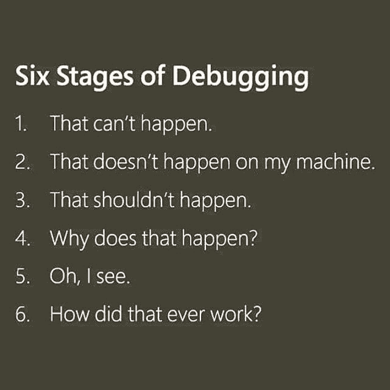
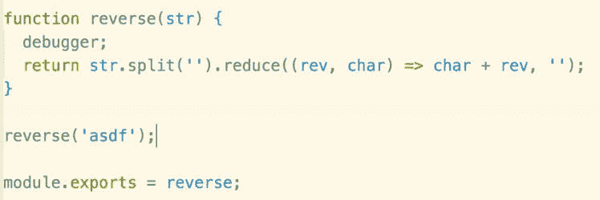
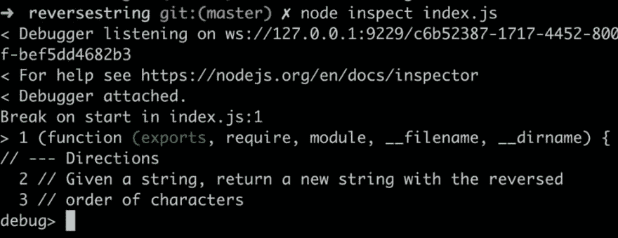
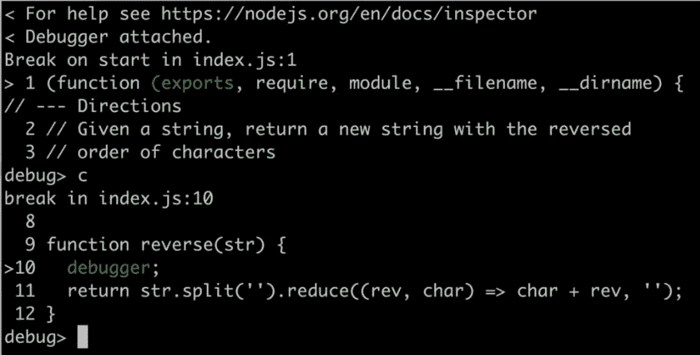
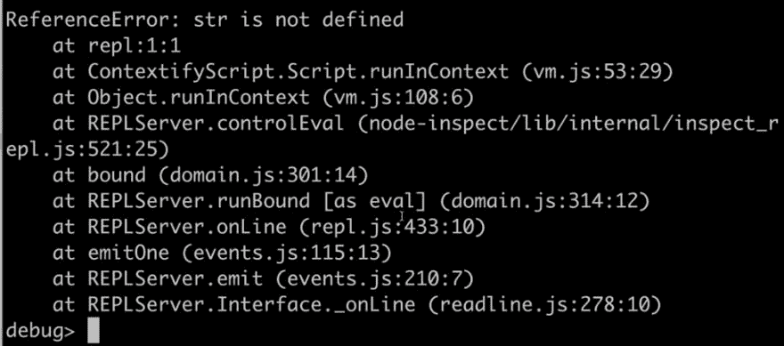

# JavaScript 调试器实用介绍；

> 原文：<https://dev.to/sheddy_nathan/practical-introduction-to-javascript-debugger-25fa>

<figure>[](https://res.cloudinary.com/practicaldev/image/fetch/s--_FTr0h3A--/c_limit%2Cf_auto%2Cfl_progressive%2Cq_auto%2Cw_880/https://cdn-images-1.medium.com/max/640/1%2AtVfk4Wueo1g3dik7jpGvGQ.jpeg) 

<figcaption>我们在调试的时候经常问自己的问题</figcaption>

</figure>

哟！快到一季度末了。为了帮助我们更好地结束它，我将给出一些关于如何使用 JavaScript { Debugger}语句来有效地调试我们的 JavaScript 代码。

### **什么是 JavaScript 调试器；？？？**

JavaScript Debugger 语句用于调试我们的 JavaScript 代码。它可以放在函数内部，以便在我们需要的时候帮助调试函数。

### **它是怎么工作的？？？**

<figure>[](https://res.cloudinary.com/practicaldev/image/fetch/s--YsM6Mobj--/c_limit%2Cf_auto%2Cfl_progressive%2Cq_auto%2Cw_880/https://cdn-images-1.medium.com/max/225/1%2AuUd-wqwPagw5mxEolBaN6w.jpeg) 

<figcaption>？？？？</figcaption>

</figure>

例如，让我们尝试用 javascript 反转一个字符串，并使用 debugger 语句来调试它。

<figure>[](https://res.cloudinary.com/practicaldev/image/fetch/s--dKnh4nUh--/c_limit%2Cf_auto%2Cfl_progressive%2Cq_auto%2Cw_880/https://cdn-images-1.medium.com/max/729/1%2AOfYFmnK5NOnBvUxgZC9tbg.png) 

<figcaption>这个代码片段使用 ES5 语法作为 Rev(反转)和 char(字符)</figcaption>

</figure>

现在我们已经建立了我们的代码，哦，如果你注意到我在使用 ES5 语法，不要害怕，如果你没有移植到 ES5，你仍然可以使用这个语句。

现在让我们加入调试器语句。调试器语句将放在函数的主逻辑之前。这样做是因为众所周知，计算机是从上到下、从左到右阅读的。所以当计算机开始读取代码，遇到调试器语句时，它会因为在执行中，给我们一个机会来检查程序中的一些不同的变量。

<figure>[](https://res.cloudinary.com/practicaldev/image/fetch/s--C__YBPE4--/c_limit%2Cf_auto%2Cfl_progressive%2Cq_auto%2Cw_880/https://cdn-images-1.medium.com/max/735/1%2At-aCS6h4C1xzVSrONmCn5A.png) 

<figcaption>yaay！我们放入我们的调试器语句</figcaption>

</figure>

这对于调试我们的代码或者开发算法解决方案非常有用。

> 为了能够在函数中使用调试器语句，我们必须在像这样定义函数之后调用它；

<figure>[](https://res.cloudinary.com/practicaldev/image/fetch/s--L33YvXHR--/c_limit%2Cf_auto%2Cfl_progressive%2Cq_auto%2Cw_880/https://cdn-images-1.medium.com/max/748/1%2A-63G4_r_g0K77SrKEu3pUQ.png) 

<figcaption>所以我们用‘asdf’</figcaption>

</figure>

初始化函数

如果我们在调试器模式下运行，当计算机到达调试器语句时，它将暂停执行，并允许我们检查代码中的不同变量。(我知道我在重复自己该死的话，这是为了让你们理解关键概念)。

### **终端中的调试器模式。**

现在，为了测试我们的调试器语句，我们将使用一个终端，对于 Linux 和 Mac-OS 的用户来说是安全的，对于 Windows 的用户来说，我不建议您使用命令提示符，我建议您使用 [Git Bash(如果您还没有这样做，请使用](https://git-scm.com/downloads))。

现在，已经安装了所需的东西，前往您的终端并确保您已经安装了[节点](https://nodejs.org)。

要进入调试器模式，导航到您的工作目录并键入

```
cd cd \<your project folder\> 
```

在您的项目文件夹中运行

```
node inspect \<file you want to debug inside the folder\> e.g node inspect index.js 
```

当您运行它时，这应该是输出

<figure>[](https://res.cloudinary.com/practicaldev/image/fetch/s--BNXnt1Pq--/c_limit%2Cf_auto%2Cfl_progressive%2Cq_auto%2Cw_880/https://cdn-images-1.medium.com/max/989/1%2AzUFWbqs0T5JA3lnT-w7RUA.png) 

<figcaption>这一款 mac-OS 终端，Git bash 可能与 linux 终端</figcaption>

</figure>

不同

你可以看到 debug 语句在哪里，那是我们写命令的地方

所以我们只是在调试器模式下启动了那个文件。

### 接下来呢？？

要告诉调试器继续调试我们的代码，您可以运行命令

```
Continue //or Cont //or C 
```

如果您运行该命令，这应该是我们的输出

[T2】](https://res.cloudinary.com/practicaldev/image/fetch/s--xrlaIbHJ--/c_limit%2Cf_auto%2Cfl_progressive%2Cq_auto%2Cw_880/https://cdn-images-1.medium.com/max/1006/1%2AG3ty7DpLL5GtJlHWreUH6Q.png)

在终端中，您将看到我们显示的整个函数，调试器语句以绿色突出显示。调试器语句就是这么甜。

要检查一个变量，比如说(str ),你不能只写 str 就指望它工作，如果在这里输入' str '就会显示出来

<figure>[](https://res.cloudinary.com/practicaldev/image/fetch/s--UCPa6IFG--/c_limit%2Cf_auto%2Cfl_progressive%2Cq_auto%2Cw_880/https://cdn-images-1.medium.com/max/1005/1%2AgP8UeKBlk17CuWhcCml3zg.png) 

<figcaption>错误信息！</figcaption>

</figure>

为了能够做到这一点，我们将不得不进入 REPL 模式，这意味着阅读编辑一些东西(无论什么)！

要进入 REPL 模式，我们运行命令

```
repl 
```

这应该是输出

[T2】](https://res.cloudinary.com/practicaldev/image/fetch/s--oMGMcrm1--/c_limit%2Cf_auto%2Cfl_progressive%2Cq_auto%2Cw_880/https://cdn-images-1.medium.com/max/949/1%2AZwfEdNcesfW7XS1907hMiQ.png)

### 在 REPL 模式下检查我们的变量

当你处于 REPL 模式时，它会打开一个 JavaScript 控制台，你可以用它来检查变量。现在让我们来检查我们的字符串

键入 str 应该会引出‘asdf ’,因为我们在代码中将 asdf 指定为 str。

<figure>[](https://res.cloudinary.com/practicaldev/image/fetch/s--J3CWECTE--/c_limit%2Cf_auto%2Cfl_progressive%2Cq_auto%2Cw_880/https://cdn-images-1.medium.com/max/987/1%2A1M9A_5aClHfDlJAYoikNfg.png) 

<figcaption>它返回 str 即我们的变量赋值函数</figcaption>

</figure>

现在，如果我们放入函数的主逻辑，也就是说，我们反转字符串“asdf”，如果我们的函数工作，它将返回“fdsa ”,那么让我们试试。如果我复制

```
str.split('').reduce((rev, char)=\> char + rev, ''); 
```

并将其粘贴到 repl 控制台中，它应该会像这样返回反转的字符串

<figure>[](https://res.cloudinary.com/practicaldev/image/fetch/s--xck4P2eF--/c_limit%2Cf_auto%2Cfl_progressive%2Cq_auto%2Cw_880/https://cdn-images-1.medium.com/max/844/1%2APp_aZ0KXXdUplAw8oD6Juw.png) 

<figcaption>是的！我们的功能正常。</figcaption>

</figure>

记得在终端中复制粘贴的是

```
ctrl + Alt + C //Copy ctrl + Alt + V //Paste 
```

要离开 REPL 模式并回到调试模式，点击***Ctrl+C*T3】**

在调试模式下，我们将再次运行代码，以显示另一个问题。

> 在单个会话中，调试器可以运行与调试器语句出现的次数一样多的次数

因为我只在一个函数中赋值，所以这是输入 ***C*** 时的输出

<figure>[](https://res.cloudinary.com/practicaldev/image/fetch/s--nb9iC0j7--/c_limit%2Cf_auto%2Cfl_progressive%2Cq_auto%2Cw_880/https://cdn-images-1.medium.com/max/997/1%2Ayn4j6x8gL8YTaCMk2D8Ijw.png) 

<figcaption>它什么也没显示</figcaption>

</figure>

它只显示该消息，因为在我们的代码中没有调试器语句。

要退出调试器，请键入 **_ exit_**

仅此而已，**Javascript 调试器实用介绍；**

<figure>[](https://res.cloudinary.com/practicaldev/image/fetch/s--D0dDUFvF--/c_limit%2Cf_auto%2Cfl_progressive%2Cq_auto%2Cw_880/https://cdn-images-1.medium.com/max/260/1%2AeOCkAJeeX_UZXj2YvTtSJw.jpeg) 

<figcaption>我们现在就面临着！</figcaption>

</figure>

嗨，我在推特上向你问好！或者问个问题。

***谢谢朋友！***

[T2】](http://bit.ly/codeburst)