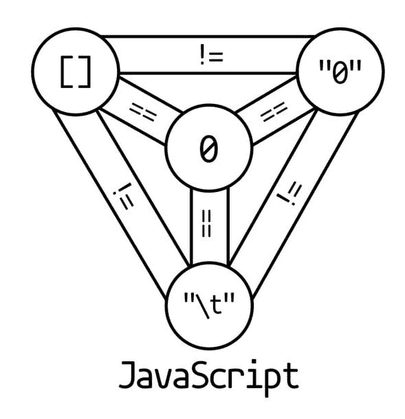

# 实用类型:JavaScript 是一种非类型化语言吗？

> 原文：<https://dev.to/stereobooster/pragmatic-types-is-javascript-an-untyped-language-1k03>

> 我发现有些人把 JavaScript 称为“动态的、弱类型化”的语言，但有些人甚至说“非类型化”？到底是哪个？
> 
> -[https://stack overflow . com/questions/964910/is-JavaScript-an-untyped-language](https://stackoverflow.com/questions/964910/is-javascript-an-untyped-language)

要回答这个问题，我们需要定义什么是“非类型化的”，什么是“动态的”和“弱类型化的”语言——阅读主题为[“动态的、静态的、渐进的、弱类型化的、强类型化的和非类型化的语言”](https://dev.to/stereobooster/pragmatic-types-dynamically--statically--gradually--weakly--strongly--and-un-typed-languages-5gf4)的完整文章。如果你决定跳过它:

*   非类型化语言只有一种类型，就像汇编语言只有一种类型——位串。
*   动态类型或者更好地说是动态检查类型——在运行时检查类型的语言。
*   弱类型化——这个术语没有确切的含义，所以我建议避免使用它，但人们最有可能指的是 JavaScript 的隐式强制，这使得类型看起来“弱”。

## JS 和类型

`typeof`返回七个可能的值:“数字”、“字符串”、“布尔”、“对象”、“函数”、“未定义”和“未知”。此外，我们可以检查值是否是某种类型的实例，如下所示:

```
date instanceof Date 
```

或者像这样

```
Object.prototype.toString.call(date) === '[object Date]' 
```

不， **JS 不是无类型的**。它有不止一种类型。

## JavaScript 是动态类型语言吗？

运行时“由系统执行”的类型检查:

```
undefined()
VM308:1 Uncaught TypeError: undefined is not a function
    at <anonymous>:1:1 
```

运行时“由程序员执行”的类型检查:

```
if (typeof x === "string") 
```

是的， **JS 是动态类型化的**。

## 为什么人们对这个话题如此困惑？

JS 更进一步假装它没有类型或类型错误。

### JS 存在哪些类型错误？

当你试图用非函数值作为函数时

```
undefined()
VM308:1 Uncaught TypeError: undefined is not a function
    at <anonymous>:1:1 
```

当你试图访问一个`undefined`或`null`值的属性时。
其他值被认为是一个对象，如果你访问一个不存在的对象值，你将得到`undefined`而不是类型错误。这是隐藏类型错误。

```
null.test
VM84:1 Uncaught TypeError: Cannot read property 'test' of null
    at <anonymous>:1:1
undefined.test
VM134:1 Uncaught TypeError: Cannot read property 'test' of undefined
    at <anonymous>:1:1 
```

对非数字值的算术运算产生`NaN`，这是表达算术运算类型错误的 JS 方式

```
1 * {}
NaN 
```

### 强迫

当您不需要在算术运算中显式地将整数转换为浮点数时，强制会很方便，但在 JS 强制中，强制用于隐藏类型错误。

```
1*"1" // result 1, should be type error
1+"1" // result "11", should be type error
1*[] // result 0, should be type error
1+[] // result "1", should be type error
"1"+[] // result "1", should be type error 
```

JS 极力隐藏类型错误，以至于导致了模糊的强制规则。

[T2】](https://res.cloudinary.com/practicaldev/image/fetch/s---EOdNsXU--/c_limit%2Cf_auto%2Cfl_progressive%2Cq_auto%2Cw_880/https://thepracticaldev.s3.amazonaws.com/i/g7m7199mujgvirxryub4.jpg)

[来源](https://twitter.com/angealbertini/status/979254093846859777)

关于这个问题有很多研究:

*   来自 CodeMash 2012 的 Gary Bernhardt 的闪电演讲。关于 JS 中的强制
*   2012 年 WTFJS； [github 回购](https://github.com/denysdovhan/wtfjs)
*   什么东西...JavaScript？，2015 年； [github 回购](https://github.com/getify/You-Dont-Know-JS)

### 不一致的类型

JS 在类型操作符上有缺陷，出于兼容性的原因，这些缺陷一直保留到现在。例如:

```
typeof null
"object"
typeof document.all
"undefined" 
```

类型操作符中的错误和模糊的强制规则给人的印象是这种语言不可能有类型。

## 定论

JS 有类型，JS 有类型错误，所以它试图隐藏大部分错误，JS 可以在运行时检查类型。JS 是动态类型语言。

[这篇文章是](https://dev.to/t/pragmatictypes)系列文章的一部分。在[推特](https://twitter.com/stereobooster)和 [github](https://github.com/stereobooster) 上关注我。