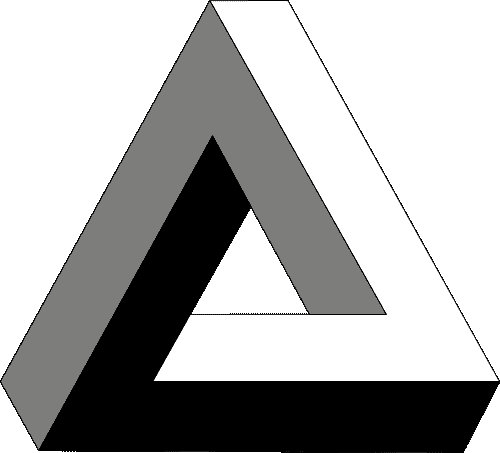

# 实用主义类型:让不可能的状态变得不可能

> 原文：<https://dev.to/stereobooster/pragmatic-types-making-impossible-states-impossible-inh>

> 让不可能的状态变得不可能
> ——作者[理查德·费尔德曼](https://www.youtube.com/watch?v=IcgmSRJHu_8)，榆树
> 
> 让不合理的状态变得不可能

[T2】](https://res.cloudinary.com/practicaldev/image/fetch/s--NHR3u9oX--/c_limit%2Cf_auto%2Cfl_progressive%2Cq_auto%2Cw_880/https://thepracticaldev.s3.amazonaws.com/i/3xr5k4ocd023yuo1x6m4.png)

[来源](https://en.wikipedia.org/wiki/Penrose_triangle#/media/File:Penrose-dreieck.svg)

## 不可能的状态

不可能的状态，或者无意义的状态——系统的状态，没有任何意义，很可能是你如何存储状态的副产品。例如，你正在做 AJAx 请求:

*   您可以存储装载状态`{ loading: true }`
*   您可以存储响应是否成功或出错`{ ok: true }`

两个布尔变量给你四个组合:

|  | `loading: false` | `loading: true` |
| --- | --- | --- |
| `ok: false` | one | Two |
| `ok: true` | three | four |

1 和 3 说得通，但 2 和 4 就不一定了。当使用布尔变量代替`enum`(或`union`)时，这是一个典型的问题

```
type RequestState = 'loading' | 'ok' | 'error' 
```

**例二**:两个选择，第一个一个国家，第二个一个城市。该状态可以描述为:

```
type Location = {
  country: string | null,
  city:    string | null
}; 
```

一旦用户选择了一个国家，系统就会更新城市列表。如果用户选择一个国家，选择一个城市，选择空值作为国家，此时我们也需要将城市设置为空值，但是我们的类型允许任何状态组合。让我们改变这一点:

```
type Location = $ReadOnly<
  | {| country: null,   city: null   |} // on country de-select
  | {| country: string, city: null   |} // on country select or on city de-select
  | {| country: string, city: string |} // on city select
>; 
```

其他例子见[理查德·费尔德曼的演讲](https://www.youtube.com/watch?v=IcgmSRJHu_8)。

## 什么类型与不可能状态有关？

类型系统可以帮助你在 bug 进入生产环境之前阻止它们，但是除非你帮助它，否则它不能捕获所有的 bug。如果你要确保你的类型不允许无效状态，你的类型系统会注意确保你的程序不会进入错误的状态。

### 不是万灵药

如果没有办法通过类型系统来表达不可能，那么“使不可能的状态变得不可能”的方法是没有用的。例如，我们有一个饼图的状态，状态中的每个条目代表图表中的一部分，并且有名称和值(%)，为了使状态有效，我们需要所有值的总和等于 100%。在像 Flow 或 TypeScript(或 Reason 或 PureScript)这样的类型系统中，从类型系统的角度来看，没有办法限制不可能的状态。为了处理这种情况，你需要一个更高级的依赖类型的类型系统，比如 Agda。这个问题类似于被零除的问题——从类型系统的观点来看，0 可以用作除数，因为它是数字，限制它我们需要类型系统，它可以说这个函数接受“除 0 以外的所有数字”。

旁注:可以通过使用绝对值而不是百分比来解决饼图的问题，并即时计算百分比，但这只是一个例子。

“使不可能的状态变得不可能”只是一种所谓的业务逻辑错误，借助于类型系统可以防止这种错误。但是还有其他的，比如不可能的过渡。当业务规则要求从一种状态到另一种状态的特定转换时。借助于所描述的技术，这种需求是(不容易)表达的。这个任务通常用有限状态机来解决。我试图为一个不允许不可能状态的系统想出一个很好的例子，但仍然可能有不可能转换的错误，并且不能马上完成，所以**对这一段有所保留**，也许这不是全部的事实。

“让不可能的状态变得不可能”并不能防止无限循环，也不能证明所有的状态都是可以达到的。请记住，这种技术将大大减少你的应用程序中的错误数量，但这并不意味着你正式证明了它的正确性。

[这篇文章是](https://dev.to/t/pragmatictypes)系列文章的一部分。在[推特](https://twitter.com/stereobooster)和 [github](https://github.com/stereobooster) 上关注我。