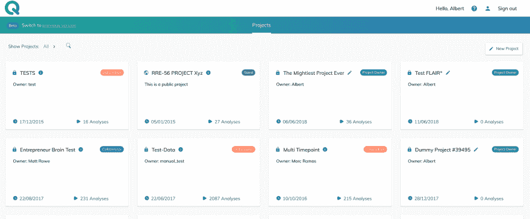
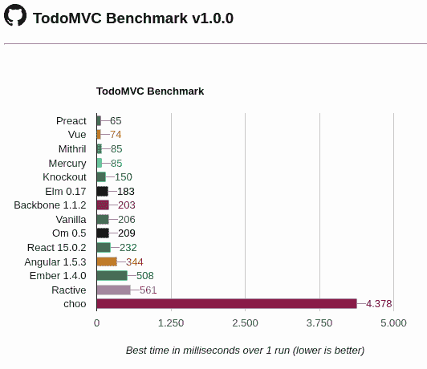
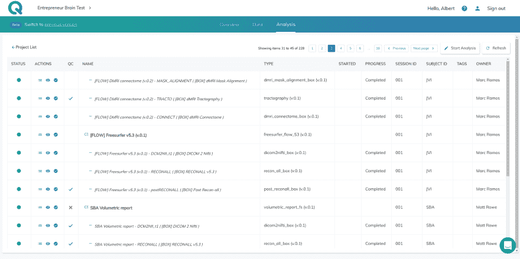
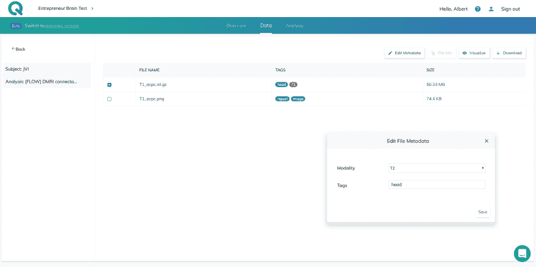

# preact+Typescript+Parcel+Redux Zero:重建注重性能和极简主义的 QMENTA 前端。

> 原文：<https://dev.to/aalises/preact--typescript--parcel--redux-zero-rebuilding-the-qmenta-front-end-focusing-on-performance-and-minimalism-1lnp>

*At*[**QMENTA**](https://www.qmenta.com/)*我们一直在从头开始重建前端，不仅在设计上，而且在用于它的技术堆栈上寻求简单性和性能。本文全面概述了构成新平台的不同部分，比如装饰者是如何被广泛使用的，或者技术栈的选择。*

* * *

*本帖最初发布在[媒体](https://medium.com/@albert.alises/preact-typescript-parcel-redux-zero-rebuilding-the-qmenta-front-end-focusing-on-performance-a7c879c5b288)T3 上*

QMENTA 平台已经持续了一段时间了。旧的平台前端是使用成熟的技术构建的，如 *JQuery、Dojo 或 D3* 。虽然功能丰富，但问题之一是如此大的代码库的可伸缩性和可维护性，并且在 UX/UI 方面相当复杂。在医学成像存储平台中，数据和操作对于用户来说已经足够复杂，因此在用户体验或视觉设计方面增加难度是一个禁区。🙅🏻

今年面临的主要挑战之一是从头开始重建前端，以适应不断增长的神经成像处理中心的新需求，使其干净，易于维护，可扩展，并与前端开发的最新技术保持同步。

[](https://res.cloudinary.com/practicaldev/image/fetch/s--z77osAeA--/c_limit%2Cf_auto%2Cfl_progressive%2Cq_auto%2Cw_880/https://thepracticaldev.s3.amazonaws.com/i/uxvbwc6nglbswqlm0tcc.png) 

<figure>

<figcaption>图 1:新前端</figcaption>

</figure>

[](https://res.cloudinary.com/practicaldev/image/fetch/s--uW1LfPeF--/c_limit%2Cf_auto%2Cfl_progressive%2Cq_auto%2Cw_880/https://thepracticaldev.s3.amazonaws.com/i/eea9ae1ys3uuheewy3u8.png)

<figure>

<figcaption>图 2:新前端</figcaption>

</figure>

上所有项目的项目列表视图

以速度、性能和极简主义为旗舰，目标是使用`FrameworkOfChoice`构建一个单页面 web 应用，它可以是 **VueJS、AngularJS、React** 或其他框架，如[*【Hyperapp*](https://github.com/jorgebucaran/hyperapp)。

##  [约尔格布卡兰](https://github.com/jorgebucaran) / [ hyperapp](https://github.com/jorgebucaran/hyperapp)

### 构建超文本应用程序的微小框架。

<article class="markdown-body entry-content container-lg" itemprop="text">

# 超 app

> 构建超文本应用程序的微小框架。

*   **用更少的资源做更多的事情**—我们已经尽量减少了你需要学习来完成工作的概念。视图、动作、效果和订阅都非常容易掌握，并且可以无缝地协同工作。
*   **写什么，而不是如何写**—Hyperapp 是一个易于阅读且编写有趣的声明式 API，是使用惯用 JavaScript 构建纯功能、功能丰富、基于浏览器的应用的最佳方式。
*   **小于一个 favicon**——大约 1 kB。Hyperapp 是一个超轻量级的虚拟 DOM，[高度优化的 diff 算法](https://javascript.plainenglish.io/javascript-frameworks-performance-comparison-2020-cd881ac21fce)，以及痴迷于极简主义的状态管理库。

这里是第一个让你开始的例子。[在此尝试](https://codepen.io/jorgebucaran/pen/zNxZLP?editors=1000)—无需构建步骤！

```
<script type="module">
  import { h, text, app } from "https://unpkg.com/hyperapp"
  const AddTodo = (state) => ({
    ...state,
    value: "",
    todos: 
```

…Enter fullscreen mode Exit fullscreen mode</article>

[View on GitHub](https://github.com/jorgebucaran/hyperapp)
Up until there, pretty standard and mainstream definition for a web application project. After pondering the different frameworks and technologies, we chose [*Preact*](https://preactjs.com/) coupled with [*Typescript*](https://www.typescriptlang.org/) as the core libraries of choice for the project.

[](https://res.cloudinary.com/practicaldev/image/fetch/s--EG9pUbQL--/c_limit%2Cf_auto%2Cfl_progressive%2Cq_auto%2Cw_880/https://thepracticaldev.s3.amazonaws.com/i/3qs6lbnj1c4rvafb885c.jpg) 

<figure>

<figcaption>图 3:预写并打印徽标。</figcaption>

</figure>

* * *

### 但是……为什么 Preact + Typescript？🤔

Preact，根据[它的官方文档](https://preactjs.com/)，是一个*“快速 3kB 的替代反应与同样的现代 API”*。它提供了我们喜欢和喜爱的关于 React 的一切，例如[虚拟 DOM](https://reactjs.org/docs/faq-internals.html) 、[基于组件的](https://reactjs.org/docs/react-component.html)开发、生命周期挂钩和用于生成动态数据驱动界面的 [jsx 语法](https://reactjs.org/docs/introducing-jsx.html)。

Preact 做到这一切的同时保持 API 更精简( [react 16.2.0 + React DOM 是 31.8Kb，而 Preact 只有 4Kb，两者都是 gzipped](https://gist.github.com/Restuta/cda69e50a853aa64912d) )，使其更快、更轻量级，并减少了 React 添加的大量噪声。与 React 的主要区别可以在[这里](https://preactjs.com/guide/differences-to-react)看到。其中一些是:

*   `this.props`和`this.state`传给`render()`给你。

*   你可以只对 CSS 类使用 class。

*   去掉了许多 React / React DOM 特有的函数，如`React.CreateElement`或`ReactDOM.render`，成为独立的导出，从而避免了混淆，使你的代码更整洁，可读性更好。

关于性能，在一个简单的 [TODO 应用程序](http://todomvc.com/)上测试，结果令人震惊，Preact 是 Vue.js 接近的最快的应用程序之一，比 react 快大约 170 毫秒。很神奇，不是吗？🌠

[](https://res.cloudinary.com/practicaldev/image/fetch/s--gUc_8iAh--/c_limit%2Cf_auto%2Cfl_progressive%2Cq_auto%2Cw_880/https://thepracticaldev.s3.amazonaws.com/i/5qa8ppv6r9ptxu4yb773.png) 

<figure>

<figcaption>图 4:不同框架间的 TodoMVC 性能对比。看过:
</figcaption>

</figure>

> 您可以通过进入[此处](https://developit.github.io/preact-perf/)在您的设备上执行性能测试。

当然，并不是所有的东西都很棒，你会发现这个社区没有 React 那么大，响应也没有 React 那么快(毕竟它并没有被广泛使用)。一些可爱的功能仍然没有出现，比如对[片段](https://reactjs.org/docs/fragments.html)的支持(所以你仍然必须创建一些好的旧的 div 包装器)。此外，一些库仍然不被支持，但不用担心， [preact-compat](https://github.com/developit/preact-compat) 在 preact 之上创建了一个层，使其与 react 完全兼容。神奇！⚡️

## [【preactjs】](https://github.com/preactjs)/[【preact-compat】](https://github.com/preactjs/preact-compat)

### 🙌为 Preact 反应兼容层。

<article class="markdown-body entry-content container-lg" itemprop="text">

# preact-compat

[](https://www.npmjs.org/package/preact-compat)[](https://travis-ci.org/developit/preact-compat)[](https://cdnjs.com/libraries/preact-compat)

> <g-emoji class="g-emoji" alias="rotating_light" fallback-src="https://github.githubassets.cimg/icons/emoji/unicode/1f6a8.png">🚨</g-emoji> **注意:**此模块适用于 Preact 8.x，Preact X 之前默认包含 compat For Preact X，请卸载`preact-compat`并用`preact/compat`替换您的别名。

这个模块是一个兼容层，使得基于 React 的模块可以与 [Preact](https://github.com/developit/preact) 一起工作，而无需任何代码更改。

它提供了与`react`和`react-dom`相同的导出，这意味着您可以使用您选择的构建工具将它放到依赖 React 的地方。

> 感兴趣吗？下面是一个示例项目，它使用`preact-compat`来处理一个未修改的现有 React 库，实现了 95%以上的大小缩减:
> 
> **[preact-compat-example](https://github.com/developit/preact-compat-example)**

* * *

## 为什么？

> *...或者真的，“为什么[要宣扬](https://github.com/developit/preact)”？*

React 是一个伟大的库和伟大的概念，拥有一个创建高质量组件的大型模块作者社区，然而，这些组件通过使用通用包导入 *( [示例](https://github.com/developit/preact-toolbox/blob/master/components/app/index.jsx#L1) )* 紧密耦合到 React。

[预动作](https://github.com/developit/preact)是…

</article>

[View on GitHub](https://github.com/preactjs/preact-compat)

[](https://res.cloudinary.com/practicaldev/image/fetch/s--GeARwBi3--/c_limit%2Cf_auto%2Cfl_progressive%2Cq_auto%2Cw_880/https://thepracticaldev.s3.amazonaws.com/i/i90qhd5lbcu5mfpjkonp.png) 

<figure>

<figcaption>图 5:分析列表视图</figcaption>

</figure>

我们❤️ **打字稿**。很多。对于一个拥有丰富数据并管理大量来自 API 的不同元数据和结果的应用程序，Typescript 为我们提供了静态类型检查，这在定义我们的应用程序处理的不同数据结构以及不同组件的属性和状态时非常方便，因此我们知道会发生什么，将其记录下来，并使所有数据在所有不同阶段保持一致。

> 你可以用 Typescript 创建接口来描述你的应用程序管理的输入/输出数据。在我们的案例中，它有助于对描述一个主题或一项分析所必需的数据进行建模，因此一切都是一致的，我们知道在处理这些结构时会发生什么。

```
export interface AnalysisInput {
  container_id: number,
  date: { $date: number },
  in_out: string,
  filters?: any[][],
  passed: boolean,
  ssid: string,
  subject_name: string
}

export interface AnalysisSettings {
  acpc_alignment: string,
  age_months: number,
  alignment_tool: string,
  input: AnalysisInput
} 
```

Enter fullscreen mode Exit fullscreen mode

使用 Typescript，您还可以创建如下所示的*定制组件*。这使得扩展 ComponentForm 的类实现了处理表单更改和设置表单模型的方法(即具有表单所需的所有字段的对象，如用户、密码等…)，然后这个模型作为组件的状态是必需的，还必须实现一个方法`submitForm()`。这样，我们就有了一个框架或结构，所有的表单都遵循这个框架或结构，有一个通用的表单组件，它可以有任意给定数量的字段。

```
import { h, Component } from "preact";

interface FormManagement<M> {
  form: M,
  message: string
}

export abstract class ComponentForm<props, model> extends Component<props, FormManagement<model>> {

  protected setFormModel (model: any) {
    this.setState({ form: new model })
  }

  protected handleFormChange(change) {
    this.setState(({ form, ...state }) => ({
      form: { ...form, ...change },
      ...state
    }));
  }

  abstract submitForm(...args): void;
} 
```

Enter fullscreen mode Exit fullscreen mode

我们的应用程序使用的一个简化的通用 Preact 组件的示例强制执行 Typescript。我们可以看到不同的生命周期挂钩，以及组件的属性和状态如何被设置为 Typescript 接口。

```
mport { h, Component } from "preact";

export interface CommonSelectorAttrs {
  options: any[];
  class?: string;
  value?: any;
  printBy?: string;
  onChange?: (any) => void;
}

export interface CommonSelectorState {
  visible: boolean;
  innerValue: string;
}

export default class CommonSelector extends Component<CommonSelectorAttrs, CommonSelectorState> {

  state = { 
    visible: false, 
    innerValue: ""
  };

  getValue = (entry) => String(this.props.printBy ? entry[this.props.printBy] : entry);

  componentDidMount(): void {
    this.props.value && this.setState(() => ({ innerValue: this.getValue(this.props.value) }));
  }

  selectOption(opt: any): void {
    this.props.onChange.call(null, { target: { value: opt }});
  }

  closeTooltip(): void {
    this.setState(() => ({ visible: false }));
    this.checkMatch();
  }

  getMatcher(opt: any): boolean {
    return this.getValue(opt) === this.state.innerValue;
  }

  checkMatch(): void {
    const match = this.props.options.find((opt) => this.getMatcher(opt));
    !!match ? this.selectOption(match) : this.setState(() => ({ innerValue: "" }));
  }

  explicitSelection(opt: any): void {
    const val = this.getValue(opt);
    this.setState(() => ({ innerValue: val }));
    this.closeTooltip();
  }

  setValue(){
    if(this.state.innerValue === 'undefined'){
      return "";
    }else{
      return this.state.innerValue;
    }
  }

  render() {
    return (
      <div>
        <div>
          <p>
            <input placeholder="Select one option" />
          </p>
        </div>
        <div>
          {this.props.options
            .map((opt) => (
              <div onClick={() => this.explicitSelection(opt)}>
                <span>{this.getValue(opt)}</span>
              </div>
          ))}
        </div>
      </div>
    )
  }
} 
```

Enter fullscreen mode Exit fullscreen mode

* * *

### 装修工，装修工…💎

啊， [Javascript decorators](https://www.sitepoint.com/javascript-decorators-what-they-are/) 。作为一个概念，它们只是作为另一个函数的包装器，扩展其功能，就像 [**高阶函数**](https://reactjs.org/docs/higher-order-components.html) 。我们广泛使用 decorators 来保持我们的代码更整洁，并分离后端、状态或应用程序管理关注点，并提供一种更结构化的方法来定义跨组件的公共功能，如连接到 Redux 存储、连接到 API 或定义一些在响应发送之前或之后发生的异步行为(有点像方法代理)，因此我们不必重复代码，并提供一种优雅、最小的方法来定义这些行为。我们将它们用于:

##### -异步方法拦截器

为了管理异步行为，我们使用 [`kaop-TS`](https://github.com/k1r0s/kaop-ts) ，这是一个装饰库，提供了一些用类型脚本编写的方法拦截器。有了它们，我们可以在异步方法的连接点插入行为，比如在方法开始之前或方法结束之后执行一些操作，或者插入一个方法来拦截错误并执行一些逻辑。我们可以看到在下面定义 http 装饰器的代码片段中使用了`beforeMethod`装饰器。

## [k1r0s](https://github.com/k1r0s)/[kaop-ts](https://github.com/k1r0s/kaop-ts)

### 简单而强大的 ES2016 Decorators 库，具有强类型方法拦截器，如 BeforeMethod、AfterMethod、OnException 等

<article class="markdown-body entry-content container-lg" itemprop="text">

[T2】](https://camo.githubusercontent.com/e675ba0ba9ad1a16a4250538a3509ee7e059611b1e76325d572fc7d8c04a9996/687474703a2f2f692e696d6775722e636f6d2f366269457073712e706e67)

[](https://github.com/semantic-release/semantic-release)[](https://greenkeeper.io/)[](https://travis-ci.org/k1r0s/)[](https://www.npmjs.com/package/kaop-ts/)[](https://coveralls.io/github/k1r0s/kaop-ts?branch=master)[](https://david-dm.org/k1r0s/kaop-ts/status.svg)[](https://www.npmjs.com/package/kaop-ts)[](https://www.npmjs.com/package/kaop-ts)[T25】](https://snyk.io/test/npm/kaop-ts)

轻量级的、可靠的、与框架无关的并且**易于使用的**用 TypeScript 编写的库来处理*横切关注点*并提高代码的模块化。

### 简短描述(或什么是建议)

这个库提供了一种在你的应用中实现**建议**的简单方式。建议是可以插入 OOP 范例中几个地方的代码片段，比如“beforeMethod”、“afterInstance”..等等。通知用于非侵入性地改变、扩展、修改方法和构造函数的行为。

关于这项技术的更多信息，请查看[资源](https://raw.githubusercontent.com/k1r0s/kaop-ts/master/#resources)。

### 演示

[https://jsbin.com/bogecojuvi/edit?js,console](https://jsbin.com/bogecojuvi/edit?js,console)

### 开始

```
npm install kaop-ts --save
```

Enter fullscreen mode Exit fullscreen mode

使用一个[连接点](https://raw.githubusercontent.com/k1r0s/kaop-ts/master//docs/api.md#available-join-points)将其插入任何方法/类:

```
import { afterMethod } from 'kaop-ts'
const double = afterMethod(meta => meta.result *= 2)
class DummyExample {
  @double
  static calculateSomething (num, num2) {
    return num * num2
  }
}
DummyExample.calculateSomething(3, 3
```

…Enter fullscreen mode Exit fullscreen mode</article>

[View on GitHub](https://github.com/k1r0s/kaop-ts)

##### -连接和管理 API 调用

为了管理对 QMENTA API 的调用，我们实现了一个`@platformRequest(url,method)` decorator，您可以用签名`function(params,error?,result?)`将它包装在任何函数中，并将其转换为对 API 的异步调用，使用某些参数发送请求，并从调用或请求抛出的错误中接收结果 JSON 对象。装饰器的实现可以在下面看到，还有一个调用它的示例方法。

```
const http = options => meta => {
  if(!options.method) options.method = "get";
  const [ params, ...aditional ] = meta.args;
  options[options.method === 'get' ? 'params' : 'data'] = params;
  (request as any)({ ...options })
  .then(res => {
    const data = res.data;
    meta.args = [params, ...aditional, null, res.data];
    meta.commit();
  })
  .catch(err => {
    meta.args = [params, ...aditional, err, null];
    meta.commit();
  })
};

const checkError = meta => {
  const [err, result] = meta.args.slice(-2);
  checkInvalidCredentials(err);
  if(err) return;
  if(typeof result !== "object") {
    meta.args.splice(-2);
    meta.args = [ ...meta.args, new Error("Wrong response format! (not a json obj)"), null ];
  }
}

const stringifyParams = meta => {
  const [ params, ...args ] = meta.args;
  meta.args = [ stringify(params), ...args ];
}

export const platformRequest = (url, method = "get", noop = _ => _) => beforeMethod(
  method === "get" ? noop : stringifyParams,
  http({ method, url }),
  checkError)

/* USAGE EXAMPLE */
interface ChangePasswordRequest {
  old_password: string,
  new_password: string,
  new_password_confirm: string
}

@platformRequest("/change_password", "post")
  RecoverPassword(params : ChangePasswordRequest, err?, result?) {
    if(err) {
      throw err;
      //Cannot change the password
    } else {
      //Password changed succesfully!
    }
 } 
```

Enter fullscreen mode Exit fullscreen mode

> *装饰者使用罩下的[轴](https://github.com/axios/axios)来执行请求* 🕵.

它的一个实现(作为一个最小的库)包装了[获取 API](https://developer.mozilla.org/en-US/docs/Web/API/Fetch_API) 可以在 [`http-fetch-decorator`](https://github.com/aalises/http-fetch-decorator) 回购上看到:

##  [爱丽丝](https://github.com/aalises)/[http-fetch-decorator](https://github.com/aalises/http-fetch-decorator)

### 为您的函数提供简单的获取接口 http 装饰包装。

<article class="markdown-body entry-content container-lg" itemprop="text">

# HTTP 获取装饰器

为您的函数提供简单的获取接口装饰包装。

`$ npm install http-fetch-decorator`

### 签名

然后，您可以放置与 fetch 函数具有相同输入结构的装饰器。作为主体发送的请求或数据的参数通过参数传递给包装的函数，结果和错误对象也可作为函数的参数:

```
@Fetch(Url: String, initObj?: Object)
static wrappedFunction(params: Object, result? : Response, err? : any){
}
```

Enter fullscreen mode Exit fullscreen mode

### 如何使用它

```
import Fetch from "http-fetch-decorator"
class AnyES6Class {
  @Fetch("apiexample/getsomething", {method: 'GET',mode:'cors'})
  static parseResponse({id: '1'},result,err) {
    if(err) throw err
    //Result contains the Response object from fetch, then you can parse
```

…Enter fullscreen mode Exit fullscreen mode</article>

[View on GitHub](https://github.com/aalises/http-fetch-decorator)

此外，我们的应用程序的状态管理和路由使用 decorators 来扩展组件的功能，例如，将组件连接到商店或侦听特定路由上呈现的内容。在下一节中，我们将对此进行更多的讨论。

[](https://res.cloudinary.com/practicaldev/image/fetch/s--YiZkIHBc--/c_limit%2Cf_auto%2Cfl_progressive%2Cq_auto%2Cw_880/https://thepracticaldev.s3.amazonaws.com/i/fnzcy8oszdysa8lznuki.png) 

<figure>

<figcaption>图 6:用编辑文件元数据模式查看特定主题文件。
</figcaption>

</figure>

* * *

### 状态管理和路由🚀

状态管理是任何成长中的 React 应用程序的主要关注点之一。当实体和组件的数量不断增长时，对全局状态管理的需求就出现了。 [Redux](https://redux.js.org/) 就是旨在解决这一问题的主流解决方案之一。这篇文章假设读者对 Redux 的操作有一定的了解；如果没有，[在这里你可以找到如何工作的指南](https://medium.freecodecamp.org/understanding-redux-the-worlds-easiest-guide-to-beginning-redux-c695f45546f6)。

在我们的应用程序中，我们不希望有一个大的存储，我们试图让它尽可能小，减少共享状态的使用，加强关注点的封装和分离。鉴于此，我们决定使用一个名为 [`Redux-Zero`](https://github.com/redux-zero/redux-zero) 的轻量级(小于 1Kb)版本。虽然有一些不同，但它也减少了 Redux 的许多不必要的开销(对于我们的应用程序来说)。它仍然有一个**商店**(尽管只有一个)，它提供了我们想要管理的所有全局状态；在我们的例子中，会话和项目信息、当前页面、当前项目 id 的通知等等。它也没有**缩减器**，讽刺的是，这确实大大降低了库的复杂性。

## /[redux-zero](https://github.com/redux-zero/redux-zero)

### 基于 Redux 的轻量级状态容器

<article class="markdown-body entry-content container-lg" itemprop="text">

# [](https://camo.githubusercontent.com/c88d3fb7980b72edd3f139c81923b987a16473fc2de5bc8db136c47f592962ae/68747470733a2f2f692e696d6775722e636f6d2f53386a6e72384f2e706e67)T3】

基于 Redux 的轻量级状态容器

> 阅读[介绍博客文章](https://medium.com/@matheusml/introducing-redux-zero-bea42214c7ee)

* * *

[](https://www.codacy.com/app/matheusml/redux-zero?utm_source=github.com&utm_medium=referral&utm_content=redux-zero/redux-zero&utm_campaign=Badge_Grade)[](https://travis-ci.org/redux-zero/redux-zero)[](https://www.npmjs.com/package/redux-zero)[](https://www.npmjs.com/package/redux-zero)[](https://raw.githubusercontent.com/redux-zero/redux-zero/master/)[](https://raw.githubusercontent.com/redux-zero/redux-zero/master/)

## 目录

*   [安装](https://raw.githubusercontent.com/redux-zero/redux-zero/master/#installation)
*   [如何](https://raw.githubusercontent.com/redux-zero/redux-zero/master/#how)
*   [例子](https://raw.githubusercontent.com/redux-zero/redux-zero/master/#example)
*   [动作](https://raw.githubusercontent.com/redux-zero/redux-zero/master/#actions)
*   [异步](https://raw.githubusercontent.com/redux-zero/redux-zero/master/#async)
*   [中间件](https://raw.githubusercontent.com/redux-zero/redux-zero/master/#middleware)
*   [开发工具](https://raw.githubusercontent.com/redux-zero/redux-zero/master/#devtools)
*   [打字稿](https://raw.githubusercontent.com/redux-zero/redux-zero/master/#typescript)
*   [灵感](https://raw.githubusercontent.com/redux-zero/redux-zero/master/#inspiration)
*   [路线图](https://raw.githubusercontent.com/redux-zero/redux-zero/master/#roadmap)
*   [文档](https://raw.githubusercontent.com/redux-zero/redux-zero/master/#docs)

## 装置

要安装稳定版本:

```
npm i redux-zero 
```

这假设你使用的是像 [webpack](https://webpack.js.org/) 这样的模块捆绑器 [npm](https://www.npmjs.com/)

## 怎么

**ES2015+:**

```
import createStore from "redux-zero";
import { Provider, connect } from "redux-zero/react";
```

Enter fullscreen mode Exit fullscreen mode

**打字稿:**

```
import * as createStore from "redux-zero";
import { Provider, connect } from "redux-zero/react";
```

Enter fullscreen mode Exit fullscreen mode

**CommonJS:**

```
const createStore = require("redux-zero");
const { Provider, connect } = require("redux-zero/react");
```

Enter fullscreen mode Exit fullscreen mode

**UMD:**

```
<!-- the store -->
<script src="https://unpkg.com/redux-zero/dist/redux-zero.min.js"></script>
<!-- for react -->
<script src="https://unpkg.com/redux-zero/react/index.min.js"></script>
<!-- for preact -->
<script src="https://unpkg.com/redux-zero/preact/index.min.js"></script>
<!-- for vue -->
<script
```

…Enter fullscreen mode Exit fullscreen mode</article>

[View on GitHub](https://github.com/redux-zero/redux-zero)

[](https://res.cloudinary.com/practicaldev/image/fetch/s--NECF2918--/c_limit%2Cf_auto%2Cfl_progressive%2Cq_auto%2Cw_880/https://thepracticaldev.s3.amazonaws.com/i/bpxtpl673dhwlbaocglj.png) 

<figure>

<figcaption>图 7:使用 WebGL
</figcaption>

</figure>

在前端进行脑纤维束成像

要让它运行起来，只需用`<Provider store={store}/>`组件包装根组件，并在其上设置存储，这是一个由`createStore(state)`方法创建的对象，其中状态是包含我们共享状态的对象。为了改变这种状态，你创建了一些动作，这些动作仅仅是更新全局状态的纯函数，例如`setSession = (state,val) => ({sessions: val});`

为了从一个组件调用这些动作，我们必须**将那个组件**连接到商店。将给定的组件连接到存储允许组件通过 props 访问一些动作和全局状态。我们创建了一个装饰器来简化将组件连接到商店的过程。

```
import { h, Component } from "preact";
import { Connect } from "redux-zero/preact";

export default function(actions = {}): any {
  return Child => props => (
    <Connect mapToProps={state => ({ ...state })} actions={actions}>
      {mappedProps => <Child {...mappedProps} {...props} />}
    </Connect>
  )
} 
```

Enter fullscreen mode Exit fullscreen mode

有了这个装饰器，我们可以把它插在任何组件之上，指定组件将获得的动作作为道具。例如，通过将`@connectStore({removeSession, setCurrentPages});`放在组件声明的顶部，您可以访问组件内部更新存储全局状态的这些操作，同时还可以通过 props ( `this.props.removeSession();`)访问全局状态本身。通过这种方法，我们提供了一种更简洁、更优雅和更紧凑的方式来将组件连接到商店。

任何现代应用程序的另一个不可或缺的部分是根据 URL 或其他参数在项目的不同视图之间选择路由，能够将参数传递给路由，等等。一个常见的解决方案是使用 React 自带的神奇路由器[。尽管我们很喜欢它，但它附带了很多我们不会真正使用的功能，所以我们制作了自己的](https://github.com/ReactTraining/react-router) [preact-routlet](https://github.com/k1r0s/preact-routlet) ，这是一个基于 decorators 的 Preact/React 的简单路由器。

## [k1r0s](https://github.com/k1r0s)/[preact-roulet](https://github.com/k1r0s/preact-routlet)

### 使用 ES7 装饰器为 Preact/React 提供简单的“组件驱动”路由

<article class="markdown-body entry-content container-lg" itemprop="text">

# 预动作例行程序

这个包包含了 [Preact](https://github.com/developit/preact) 的路由功能，现在从 1.0.0 `React`开始也包含了。它不使用 HTML5 历史 API，而是使用 oldie `/#/what-ever`散列路由(这在将来会改变)。

这个项目是通过探索定义路线的上下文方法而不是将所有路线放在一个文件中创建的。

### 用法:

可用导入:

```
// if you're using React
import { renderOnRoute, navigate, RouterOutlet, PathLookup, routePool, Link } from "preact-routlet/react"
// if you're using Preact
import { renderOnRoute, navigate, RouterOutlet, PathLookup, routePool, Link } from "preact-routlet/preact"
```

Enter fullscreen mode Exit fullscreen mode

`from "preact-routlet/preact"`或`from "preact-routlet/react"`

将您的`RouterOutlet`元素放在 JSX 的某个地方:

```
<div>
  <RouterOutlet /&gt
</div>
```

Enter fullscreen mode Exit fullscreen mode

将`renderOnRoute`装饰器插在某个组件上

```
@renderOnRoute("/login")
export default class Login extends Component<any, any> {

```

…Enter fullscreen mode Exit fullscreen mode</article>

[View on GitHub](https://github.com/k1r0s/preact-routlet)

它的复杂性很简单，只要用路由器组件`<RouterOutlet />`包装你的应用程序，你就可以开始了。您还可以用指定条件的`<PathLookup shouldRender={condition}/>`来包装一些组件，以呈现一些路径，或者使用`<RouterOutlet redirect="/route" shouldRedirect={condition} />`来指定一个条件，在满足该条件的情况下，路由器自动重定向到指定的路由(例如，如果会话无效或已经过期，我们使用它来重定向到登录)。

要导航到一个路线，你只需要调用`navigate("/route")`并指定一个组件在一个特定的路线上被渲染，你只需要在组件的顶部插入装饰器，例如`@renderOnRoute("forgot-password")`，使得组件在哪个路线上被渲染变得清晰可见。

这样，我们就有了一种简洁的方式来表示路由和状态管理，并在组件的顶部签名，这使得它非常可读。下面可以看到一个连接到商店并呈现在给定路线上的虚拟组件。

```
import { h, Component } from "preact";
import { renderOnRoute, navigate } from "preact-routlet";
import { setLoginMessage } from "../actions";
import connectStore from "../../../connect";
import { platformRequest } from "../../../services/api-decorators";

//With these decorators, we know the route this component is rendered at and which actions does it have access to, in a compact way
@renderOnRoute("/forgot-password") @connectStore({ setLoginMessage })
export default class ForgotPassword extends Component<any, any> {

  //Call the forgot_password API with a POST
  @platformRequest("/forgot_password", "post")
  performLogin(params, err?, result?) { //Params are the parameters of the request e.g {email: "test@gmail.com , user_id: 1234}
    if(err || result.error) {
      this.setState({ message: "There was an error with the request" })
    } else {
      this.props.setLoginMessage(result.message); //Calling the store to set a login warning message
      navigate("/login"); //Navigate back to the login using the router
    }
  }

   render() {
     return (
        <div>
          Just an example component with some decorators...
        </div>
   }
} 
```

Enter fullscreen mode Exit fullscreen mode

* * *

### 用包裹捆绑📦

[Parcel](https://parceljs.org/) ，不要与澳大利亚乐队 [Parcels](https://www.youtube.com/watch?v=PTFK96KNfIE) 相混淆，它将自己定义为*“速度极快，零配置 web 应用捆绑器”*。在项目开始时，我们使用相当标准的 Webpack 来捆绑我们的应用程序。它需要相当多的插件和配置。(`webpack.config.ts`)。切换到 package，我们不再需要配置 typescript 或 html 文件，只需添加`npm install --save-dev parcel-bundler parcel-plugin-typescript`即可。

唯一剩下的事情就是指定一个入口点和输出目录，瞧，这就行了。在我们的例子中，与 webpack 相比，速度和性能上的差异并不明显(在速度上基本相同)，但它的零配置和最小化使它成为我们项目的首选捆绑器。

## /[包裹](https://github.com/parcel-bundler/parcel)

### 📦🚀极快的零配置 web 应用捆绑器

<article class="markdown-body entry-content container-lg" itemprop="text">

[T2】](https://parceljs.org/)

[](https://raw.githubusercontent.com/parcel-bundler/parcel/v2/#backers)[](https://raw.githubusercontent.com/parcel-bundler/parcel/v2/#sponsors)[](https://dev.azure.com/devongovett/devongovett/_build/latest?definitionId=1)[](https://www.npmjs.com/package/parcel)[](https://www.npmjs.com/package/parcel)[](https://twitter.com/parceljs)

## 特征

*   <g-emoji class="g-emoji" alias="rocket" fallback-src="https://github.githubassets.cimg/icons/emoji/unicode/1f680.png">🚀</g-emoji> **超快的速度**捆绑时间——多核编译，文件系统缓存，即使重启后也能快速重建。
*   <g-emoji class="g-emoji" alias="package" fallback-src="https://github.githubassets.cimg/icons/emoji/unicode/1f4e6.png">📦</g-emoji>开箱即用支持 JS、CSS、HTML、文件资产等- **无需安装插件**。
*   <g-emoji class="g-emoji" alias="tropical_fish" fallback-src="https://github.githubassets.cimg/icons/emoji/unicode/1f420.png">🐠</g-emoji> **在需要时使用 Babel、PostCSS 和 PostHTML 自动转换模块**——甚至`node_modules`。
*   <g-emoji class="g-emoji" alias="scissors" fallback-src="https://github.githubassets.cimg/icons/emoji/unicode/2702.png">✂️</g-emoji> 零配置**代码拆分**使用动态`import()`语句。
*   <g-emoji class="g-emoji" alias="fire" fallback-src="https://github.githubassets.cimg/icons/emoji/unicode/1f525.png">🔥</g-emoji>内置支持**热模块更换**
*   <g-emoji class="g-emoji" alias="rotating_light" fallback-src="https://github.githubassets.cimg/icons/emoji/unicode/1f6a8.png">🚨</g-emoji>友好的错误记录体验——语法高亮显示的代码框架有助于查明问题。

* * *

下面是在 2 号地块实施工作开始之前创建的设计文件，其中一些章节已经过时。2 号地块的实际(有些完整)文件可在此处获得:[https://v2.parceljs.org/](https://v2.parceljs.org/)。

* * *

## 入门指南

在我们开始之前，您需要安装 Node and Yarn(或 npm)并为您的项目创建一个`package.json`(如果您还没有这样做的话)。

```
yarn init
```

Enter fullscreen mode Exit fullscreen mode

然后…

</article>

[View on GitHub](https://github.com/parcel-bundler/parcel)

[](https://res.cloudinary.com/practicaldev/image/fetch/s--U3eEd5vM--/c_limit%2Cf_auto%2Cfl_progressive%2Cq_auto%2Cw_880/https://thepracticaldev.s3.amazonaws.com/i/8ujt08n3fk4kzwnlffbw.png) 

<figure>

<figcaption>图 8:整个应用的构建截图。包裹的魔力💥</figcaption>

</figure>

唯一的缺点是，为了让 Preact + Typescript 中的[热重装](https://parceljs.org/hmr.html)为 dev 服务器工作，您必须将`module.hot.accept()`标志添加到您的根组件中，并在 render 函数中指定一些类型(第三个参数为`foo.lastChild as Element`，以便 Typescript 不会抱怨。可以在下面的代码片段中看到该修复。

```
import { h, render } from "preact";
import Main from "./components/main"

declare const module: any

const mountNode = document.getElementById('root');

render(<Main />, mountNode, mountNode.lastChild as Element);

// Hot Module Replacement
if (module.hot) {
    module.hot.accept();
} 
```

Enter fullscreen mode Exit fullscreen mode

* * *

### 用 Jest +木偶师进行单元和 e2e 验收测试

测试是任何项目不可或缺的一部分。在我们的项目中，我们使用相当标准的 [Jest](https://jestjs.io/) 来[测试我们的组件](https://jestjs.io/docs/en/tutorial-react)和[木偶师](https://github.com/GoogleChrome/puppeteer)，后者是一个网页抓取器，或者让你自己训练有素的猴子执行你在浏览器上告诉他/她的操作，比如单击某个按钮或在某个元素上拖动鼠标。使用这些，我们可以通过一个无头的 Chrome API 在前端执行一些操作，然后用 Jest 检查预期的结果，比如检查确认元素是否出现或者显示的警告消息是否正确👌。如果你想了解更多关于如何在 React 中使用 Jest+puppet er 进行测试的信息，[有一篇关于它的文章](https://blog.bitsrc.io/testing-your-react-app-with-puppeteer-and-jest-c72b3dfcde59)。

##  [木偶师](https://github.com/puppeteer) / [木偶师](https://github.com/puppeteer/puppeteer)

### 无头 Chrome Node.js API

<article class="markdown-body entry-content container-lg" itemprop="text">

# 操纵木偶的人

[ ](https://github.com/puppeteer/puppeteer/actions?query=workflow%3Arun-checks) [ ](https://npmjs.org/package/puppeteer)

[T2】](https://user-images.githubusercontent.com/10379601/29446482-04f7036a-841f-11e7-9872-91d1fc2ea683.png)

###### [API](https://github.com/puppeteer/puppeteer/blob/v8.0.0/docs/api.md) | [FAQ](https://raw.githubusercontent.com/puppeteer/puppeteer/main/#faq) | [投稿](https://github.com/puppeteer/puppeteer/blob/main/CONTRIBUTING.md) | [故障排除](https://github.com/puppeteer/puppeteer/blob/main/docs/troubleshooting.md)

> Puppeteer 是一个节点库，它提供了一个高级 API 来控制 Chrome 或通过 [DevTools 协议](https://chromedevtools.github.io/devtools-protocol/)的 Chrome。默认情况下，木偶师运行[无头](https://developers.google.com/web/updates/2017/04/headless-chrome)，但可以配置为运行全(非无头)铬或铬。

###### 我能怎么做呢？

大多数你可以在浏览器中手动完成的事情都可以使用木偶师来完成！这里有几个例子可以帮助你开始:

*   生成页面的截图和 pdf。
*   抓取 SPA(单页应用程序)并生成预呈现内容(即“SSR”(服务器端呈现))。
*   自动化表单提交、UI 测试、键盘输入等。
*   创建一个最新的自动化测试环境。使用最新的 JavaScript 和浏览器功能，在最新版本的 Chrome 中直接运行测试。
*   捕获站点的[时间轴跟踪](https://developers.google.com/web/tools/chrome-devtools/evaluate-performance/reference)来帮助诊断性能问题。
*   测试 Chrome 扩展。

旋转一下:[https://try-puppeteer.appspot.com/](https://try-puppeteer.appspot.com/)

## 入门指南

### 装置

使用木偶师在你的…

</article>

[View on GitHub](https://github.com/puppeteer/puppeteer)

> 这只是一个使用 Jest 测试分页组件的例子。

```
import { h, render } from 'preact';
import Pagination, {generateMidPageTabValues} from '../../src/components/pagination-component';

const spy = jest.fn()

describe("<Pagination /> e2e tests", () => {

  let scratch = null;
  let component = null;

  beforeEach(done => {
    scratch = document.createElement('div');
    render(<Pagination initialPage={1} ref={ref => component = ref} pageChange={(from, to) => spy(from, to)} totalItems={45}/>, scratch);
    done()
  });

  it("should display proper information about pages", () => {
    expect(scratch.innerHTML).toContain("Showing items 1 to 15 of 45");
  });
  it("shouldn't allow to decrease current page if we're on the first page", () => {
    expect(component.state.prevAllowed).toBe(false);
  });
  it("should properly increase current page", (done) => {
    component.pageForward();
    setTimeout(_ => {
      expect(scratch.innerHTML).toContain("Showing items 16 to 30 of 45");
      expect(spy).toHaveBeenLastCalledWith(15, 30);
      done();
    }, 1000);
  });
  it("Should correctly compute first page indices", () => {
    expect(generateMidPageTabValues(1,5,10)).toEqual([2,3,4,5,6]);
    expect(generateMidPageTabValues(4,5,10)).toEqual([2,3,4,5,6]);
  });
  it("Should correctly compute last page indices", () => {
    expect(generateMidPageTabValues(13,5,15)).toEqual([10,11,12,13,14]);
    expect(generateMidPageTabValues(11,5,15)).toEqual([10,11,12,13,14]);
  });
  it("Should correctly compute middle pages indices", () => {
    expect(generateMidPageTabValues(10,5,15)).toEqual([8,9,10,11,12]);
    expect(generateMidPageTabValues(7,5,15)).toEqual([5,6,7,8,9]);
  });
  it("Should correctly compute indices when few pages", () => {
    expect(generateMidPageTabValues(1,5,5)).toEqual([2,3,4]);
    expect(generateMidPageTabValues(2,5,3)).toEqual([2]);
    expect(generateMidPageTabValues(2,5,2)).toEqual([]);
    expect(generateMidPageTabValues(1,5,1)).toEqual([]);
  });
}); 
```

Enter fullscreen mode Exit fullscreen mode

使用 [Jenkins](https://jenkins.io/) 自动化构建、测试和部署过程，测试在 docker 容器中运行，以便在具有 puppeteer 所需的所有图形库的环境中执行测试。在图 9 中可以看到**相当简单的**管道:

[](https://res.cloudinary.com/practicaldev/image/fetch/s--d8T6raC6--/c_limit%2Cf_auto%2Cfl_progressive%2Cq_auto%2Cw_880/https://thepracticaldev.s3.amazonaws.com/i/jx50xsbtibzd11vgw9b1.png) 

<figure>

<figcaption>图 9:用于部署前端的詹金斯流水线
</figcaption>

</figure>

> 我们构建二进制文件，执行单元测试，然后部署到一个测试领域，这个领域根据我们所在的 git 分支而变化。然后我们在那个领地上进行 e2e 测试。

用于 Jenkins 运行管道的容器的 docker 映像是[木偶师 Docker 映像](https://github.com/alekzonder/docker-puppeteer)的定制版本，基于带有节点 8 的 ubuntu 16.04 映像。dockerfile 文件如下所示: