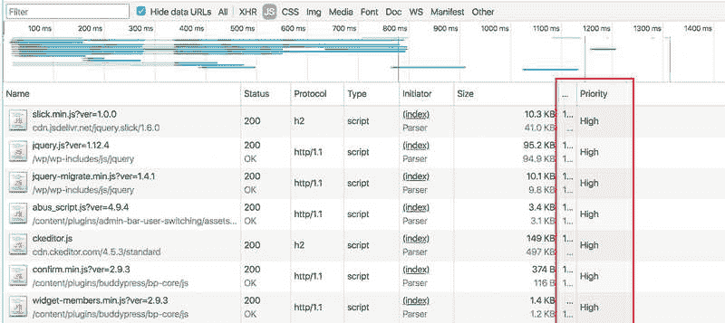

# 在 WordPress 中预加载 JavaScript 资产

> 原文：<https://dev.to/alexmacarthur/preloading-javascript-assets-in-wordpress-1led>

在任何平台上从你的网站中榨出最后一滴性能是一场不断变化、永无止境、常常令人上瘾的战斗。

在这场战斗中你可以采用的几种策略中，优化你网站的[资源提示](https://www.w3.org/TR/resource-hints)是一种现代的方法，可以产生一些显著的投资回报。具体来说，资产预加载是一个特别有影响力的起点。[这是一个值得你自己深入了解的话题](https://www.smashingmagazine.com/2016/02/preload-what-is-it-good-for/)，但简而言之，预加载涉及到一个网页开始在后台尽快加载一个特定的资产，所以当页面调用它时，它就准备好了。因为这一切都是异步完成的，所以在加载期间，它不会阻止任何其他东西进入视图。这不同于在你的`script`标签上使用类似于`async`的属性，因为预加载的 JavaScript 不会在加载后自动执行——它实际上是惰性的，直到你的页面需要它。因此，虽然页面加载的数据量不会改变，但整个过程会变得更快。这一切都转化为更好的用户体验，并为您提供更多的服务。

您可以预加载任何东西，但是通常，看到快速成功的最简单的方法是从您的 JavaScript 文件开始，这些文件通常被加载到页面的底部(以防止呈现阻塞)，但是对于您的页面或应用程序的运行是必不可少的。大概是这样的:

```
<html>
    <head>
        <link rel="preload" href="https://my-script.js" as="script" />
    </head>
    <body>
        <!-- a bunch o' content -->
        <script src="https://my-script.js"></script>
    </body>
</html> 
```

Enter fullscreen mode Exit fullscreen mode

当这个页面被加载时，浏览器首先点击`<link rel="preload" ... />`，这表示“这个资源真的很重要——我现在要开始在后台加载它，以便在我需要它的时候它能更快地准备好。”当`<script src="" ... />`被发现时，浏览器*将不会*从头开始下载。因此，交互时间和总页面加载时间等指标得到了改善。

## 在 WordPress 中自动预加载 JavaScript

在 WordPress 中，为你想要预加载的每个文件手工创建一个`link ref="preload"`标签是很容易的，但是如果你管理一个有很多不同脚本的站点，这些脚本由几个不同的插件排队，其中一些在`head`中，其他的在页面底部，那么设置起来就有点麻烦了。您希望这是自动化的，并且您希望这种自动化能够智能地选择预加载哪些脚本。

所以，一个解决方案！循环遍历我们的页脚入队脚本，并将它们预加载到页眉中。这可以通过在您的应用程序中运行以下几行代码来实现。你*可以*把它们放到你主题的 functions.php 文件中，但是不要这么做。相反，只要[做一个真正简单的插件](https://macarthur.me/posts/creating-the-simplest-wordpress-plugin)。几乎总是更好的选择。

如果你想要一个简单的方法来实现资产预加载和利用其他性能增强的资源提示，试试我的新的**免费**插件[更好的资源提示。](https://wordpress.org/plugins/better-resource-hints)安装它，测量你的性能增益！

```
add_action('wp_head', function () {

    global $wp_scripts;

    foreach($wp_scripts->queue as $handle) {
        $script = $wp_scripts->registered[$handle];

        //-- Weird way to check if script is being enqueued in the footer.
        if($script->extra['group'] === 1) {

            //-- If version is set, append to end of source.
            $source = $script->src . ($script->ver ? "?ver={$script->ver}" : "");

            //-- Spit out the tag.
            echo "<link rel='preload' href='{$source}' as='script'/>\n";
        }
    }
}, 1); 
```

Enter fullscreen mode Exit fullscreen mode

事情是这样的:在`wp_head`钩子上(它在我们的脚本入队后触发)，我们循环通过我们注册的脚本，并在我们的`head`中为每个在页面页脚入队的资源打印出一个`link`标签。最后，当页面为用户加载时，每个加载到页面底部的 JavaScript 文件都会有一个`<head>`开始(LOL)。

关于这个设置有三个注意事项:

**1。我们以早期优先级连接到`wp_head`，以释放我们的`link`标签。我们选择这个钩子是因为它在我们的脚本入队后触发，它允许我们尽可能接近页面的顶部，这意味着我们的东西可以尽快开始加载。`1`的优先级意味着它会在早期启动——在大部分其他东西被打印到大脑之前。`wp_print_scripts`或`wp_print_styles`挂钩也可以工作得很好——这只是意味着我们在页面上稍微向下预加载一些东西。**

**2。我们没有预加载头中排队的脚本。**这有两个原因。

*   首先，预加载头文件中已经加载的文件没有什么好处。请记住，预加载对于那些重要但在页面后期加载的资源非常有用。我们可以在页面的其余部分呈现时开始下载这些文件，并在它们被一个`script`标签显式加载时有一个良好的开端。如果您预加载一个文件，只是让该文件在下面两行加载，那么您并没有领先多少。
*   第二，预加载所有东西可能不是好的做法。根据网络条件、页面加载的资产数量和其他变量，预加载任何东西都可能会阻塞用户的带宽，并抵消我们只预加载页面上重要的、最近发现的资产所带来的好处。这不是一个硬性规定，但这是像 Addy Osmani 这样的人建议的，所以我同意。

**3。我们正在确保这些资产的 URL 与*完全匹配*，包括版本。**你会注意到，如果我们循环的资产上没有设置版本，甚至`?`也不会附加到我们的源 URL，因为如果你的`link`标签中的`href`与你的`script`标签中的`src`属性不匹配，浏览器会认为这是两个不同的资源，你将一无所获。

## 验证其工作正常

在您的页面上打开源代码。您应该在您的头中看到每个页脚排队的 JavaScript 文件的标签，如下所示:

```
<link rel='preload' href='https://whatever-source.js?v=123' as='script'/> 
```

Enter fullscreen mode Exit fullscreen mode

现在，在页脚中查找加载每个文件的`script`标记，并验证源文件是否完全匹配。

```
<script src='https://whatever-source.js?v=123'></script> 
```

Enter fullscreen mode Exit fullscreen mode

接下来，如果你正在使用 Chrome，进入你的开发者工具，选择“网络”标签并刷新你的页面。仅按 JS 文件过滤，您应该会看到类似这样的内容:

[T2】](https://res.cloudinary.com/practicaldev/image/fetch/s--WJXIMfxg--/c_limit%2Cf_auto%2Cfl_progressive%2Cq_auto%2Cw_880/https://macarthur.me/static/cefe025484c3a7ad9f501e1c7b575532/a296c/preloading.jpg)

按照预加载的顺序，顶部的每个文件都应该具有“高”优先级。

## 衡量你的表现结果！

显然，所有这些都是毫无意义的，除非从中获得可衡量的性能收益。当我用大量的插件队列脚本测试一个特定的 WordPress 应用程序时，我看到了一些非常令人鼓舞的数字。由于当地发展环境的性质，这些结果各不相同，但都是积极的。

灯塔绩效结果:

* * *

**总体得分:**提高 2-5 分

**第一幅有意义的画:**高达约 20%的改进

**首次互动:**高达约 15%的改进

**感知速度指数:**提升高达~20%

* * *

这是一个非常具体的大量使用 JavaScript 的用例，使用 Chrome 内置的 Lighthouse 审计工具在我的本地机器上运行。我对一个不太重脚本的营销网站做了一些快速测试，那些改进下降到了 3-5%的范围。不管实际数字如何，很难否认这些都是重大的进步。对于这样一个快速，低影响的胜利，你是一个傻瓜拒绝这些节省。

你看到类似的改进了吗？测量时分享您的结果！

## 这个*应该*安全，但是要彻底测试

这个代码片段所做的只是预加载已经加载到页面上的脚本。它不会重新安排加载或执行顺序，不会弄乱`async`或`defer`或其他任何东西。因此，像负责任地利用任何其他资源提示一样，它**应该**相对安全。即便如此，在部署到生产环境之前，做一个好的开发人员并进行测试。

希望这篇技巧能让您获得一些显著的性能提升！像往常一样，用我的方式记录任何反馈、纠正或改进！