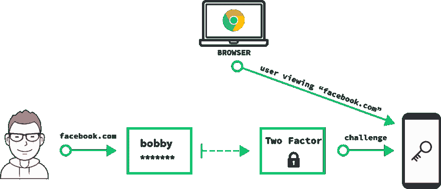

# 使用加密防止网络钓鱼

> 原文：<https://dev.to/agrinman/prevent-phishing-on-the-web-with-crypto-1a6h>

*[原载于 krypt.co 博客](https://krypt.co/blog/posts/prevent-phishing-on-the-web-with-crypto.html)*

不，我不是指加密货币。我真正在说的是**通用第二因子(U2F)** 。U2F 是一种进行双因素身份验证的协议，可以有效防止网络钓鱼。

[T2】](https://res.cloudinary.com/practicaldev/image/fetch/s--BdQStrD6--/c_limit%2Cf_auto%2Cfl_progressive%2Cq_auto%2Cw_880/https://thepracticaldev.s3.amazonaws.com/i/mmp979e57d0346w6f0jo.png)

## 网络钓鱼是如何运作的？

很简单——攻击者让你点击类似`http://facebo0k.com`或`http://dropobox.com`的虚假链接，页面看起来就像真的一样。

[T2】](https://res.cloudinary.com/practicaldev/image/fetch/s--HDcjeF3Y--/c_limit%2Cf_auto%2Cfl_progressive%2Cq_auto%2Cw_880/https://thepracticaldev.s3.amazonaws.com/i/b922hm0nmkodfbn7mj8w.png)

接下来，攻击者的站点会询问您的用户名+密码。你走进去。因为它看起来是合法的，你只是想像每天一样浏览网页。你可能认为你永远不会点击一个可疑的链接，但是如果它来自一个可靠的来源呢？比如你某个朋友的 facebook 或电子邮件账号被攻破了？

当你点击回车，你将发送你的用户名+密码给你的攻击者，游戏就结束了！

## 我已经用双因素——我无敌了！

我和很多人谈过这个问题，直觉反应通常是“我使用双因素，所以我不会被钓鱼！”这实际上是非常错误的，双因素就像用户名和密码一样容易被网络钓鱼-特别是因为人们现在更习惯于一直输入 2FA 代码。

[T2】](https://res.cloudinary.com/practicaldev/image/fetch/s--cDC4RAD9--/c_limit%2Cf_auto%2Cfl_progressive%2Cq_auto%2Cw_880/https://thepracticaldev.s3.amazonaws.com/i/refbuyljgn1iqk09xzx9.png)

在要求您的用户名+密码后，攻击者会简单地向您显示另一个对话框，以获取您的双因素代码。诚然，攻击者使用第二因子代码的时间很短，因为它很快就会过期，但这一切都可以自动化。

### 即使像 Duo 或 Google Prompt 这样的一键审批 2FA 也可能被钓鱼

攻击者不需要您输入代码就可以对您实施网络钓鱼。他们只需要说服你点击阿朵或谷歌提示式推送通知上的批准，你会点击批准，因为**你认为你正在登录到一个真实的网站，你已经被训练这样做**。点击“批准”后，您将在攻击者的会话中为其登录您的帐户。

## U2F 用加密阻止网络钓鱼

通用第二因子(U2F)使用公钥加密来自动防止网络钓鱼。你今天使用的许多网站已经支持它，比如:**脸书、谷歌、Dropbox、Salesforce、Stripe、GitHub、GitLab 等等。**

网络钓鱼有许多不同的形式，有些很难防范。然而，使用加密技术，我们完全可以防止凭据网络钓鱼。诀窍在于，这个“凭证”会被加密绑定到你实际登录的网站上。

[T2】](https://res.cloudinary.com/practicaldev/image/fetch/s--xHOVjLou--/c_limit%2Cf_auto%2Cfl_progressive%2Cq_auto%2Cw_880/https://thepracticaldev.s3.amazonaws.com/i/6kjgyo8tjn9lc7oqfd6y.png)

U2F 有两个步骤:

1.  **注册**在*认证器*上生成新的密钥对。facebook.com 说，在一个网站上注册公钥。
2.  **认证**
    *   网站的服务器发送一个随机的`challenge`令牌。
    *   **浏览器**告诉认证者用户正在查看的域
    *   使用私钥，认证者创建一个数字签名，包括`challenge`和最重要的，你实际上在上的网站**的域名——这直接、安全地来自浏览器本身。**

钓鱼保护是内置的——认证者抛出的凭证只对网站所有者有用。不能在`"google.com"`上使用`"facebook.com"`的签名。同样，`"facebo0k.com"`的签名也不能用在`"facebook.com"`上。

[T2】](https://res.cloudinary.com/practicaldev/image/fetch/s--O5LkGpRB--/c_limit%2Cf_auto%2Cfl_progressive%2Cq_auto%2Cw_880/https://thepracticaldev.s3.amazonaws.com/i/pzd1h6gcwlfh2nczcnzt.png)

即使攻击者骗你为他们的假网站`http://facebo0k.com`制作了一个签名——这个签名对他们来说也没用！真正的 facebook.com 永远不会接受包含无效域名的签名。

> 这就是 U2F 的要点——它使你访问过的域成为你需要登录的加密凭证的一部分。

## 我如何入门？

第一步是获得一个认证器。有几种选择。我们建立氪星是为了让任何人在网络上变得不容易被感染。氪星在你已经有的设备上工作-你的电话。

**[安装氪认证器](https://get.krypt.co)**

[T2】](https://res.cloudinary.com/practicaldev/image/fetch/s--OfTRoTqn--/c_limit%2Cf_auto%2Cfl_progressive%2Cq_auto%2Cw_880/https://thepracticaldev.s3.amazonaws.com/i/4b0rqthoouzgl9oep3x9.png)

### 其他选项

如果不想用手机，可以买个独立的 USB 设备。我推荐[这个比较不同独立 U2F 键的精彩指南](https://github.com/hillbrad/U2FReviews)。