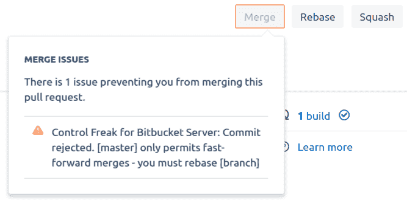
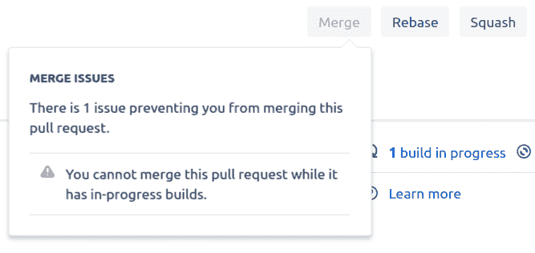
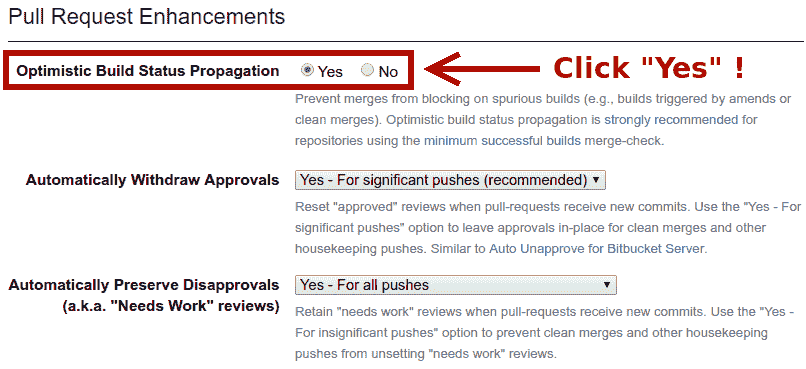
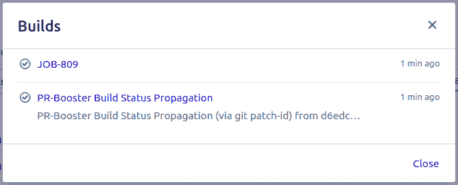
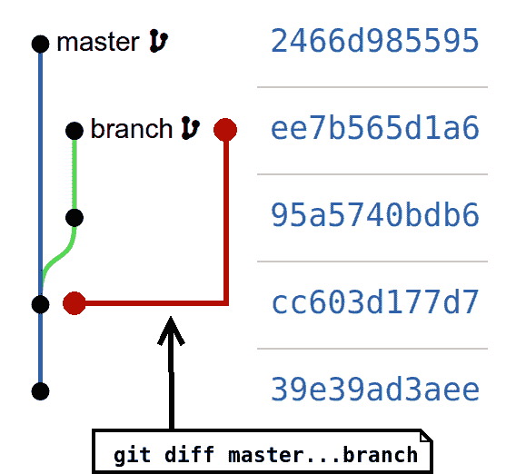

# 防止 Git Rebase 冲突

> 原文：<https://dev.to/atlassian/preventing-git-rebase-fights-4hd4>

[T2】](https://res.cloudinary.com/practicaldev/image/fetch/s--mPNeajhW--/c_limit%2Cf_auto%2Cfl_progressive%2Cq_auto%2Cw_880/https://cdn-images-1.medium.com/max/1024/1%2ACWQi11d0x2x15gGyowtA4Q.jpeg)

### 什么是 Git Rebase 战斗？

你经历过这种情况吗？

1.  你去合并你的 PR(拉式请求)，但是 PR 说在你能合并之前它必须被重新设定基数。

[T2】](https://res.cloudinary.com/practicaldev/image/fetch/s--ZEUb2TFO--/c_limit%2Cf_auto%2Cfl_progressive%2Cq_auto%2Cw_880/https://cdn-images-1.medium.com/max/667/0%2A81bGI8nqBr3mF3Gn.png)

1.  你改变它的基础，开始一个新的构建。但是构建必须在允许合并之前完成。

[T2】](https://res.cloudinary.com/practicaldev/image/fetch/s--g2fS6RhJ--/c_limit%2Cf_auto%2Cfl_progressive%2Cq_auto%2Cw_880/https://cdn-images-1.medium.com/max/667/0%2AASYWGCcux35sILLW.png)

1.  构建完成！耶！但是当你在等待的时候，其他人设法合并了他们的公关，用他们的工作更新了 T2 的起源/主人。啊哦！

[T2】](https://res.cloudinary.com/practicaldev/image/fetch/s--LhNNxQ5H--/c_limit%2Cf_auto%2Cfl_progressive%2Cq_auto%2Cw_880/https://cdn-images-1.medium.com/max/667/0%2Ai-nHPN2YrkcLSLzE.png)

1.  你回到第一步，希望这次运气会好一些…

一个月碰到一两次这样的循环没什么大不了的(尤其是如果第二步不到 10 秒)。但有时情况会变得病态。

### 解决方案:乐观构建状态传播

您可以使用$(git diff 目标...SOURCE | git patch-id)来防止这些 rebase 争斗。当您知道构建很有可能成功时，这是很方便的(例如，挤压、修改、清理 rebases、清理 sync-merges)。

这种技术被称为“乐观构建状态传播”,因为它使用“git patch-id”的输出作为启发，将构建状态传播到较新的 commit-id，而不需要完成实际的完整构建。它是这样工作的:

1.  您将新的分支推送到您的中央 git 服务器。
2.  推送会触发 CI(持续集成)服务器上的构建。
3.  构建最终成功了。分支的 tip 提交用成功标志来标记。
4.  你决定改变分行的基础。
5.  在重置基的过程中，您的 git 服务器会注意到两件事:1 .rebase 之前的提交有一个针对它的成功构建文件，以及 **2。rebase 是干净的(没有冲突)。**
6.  重设基础会触发 CI 服务器上的构建。CI 服务器向您的 git 服务器发送一个正在进行的通知。
7.  您的 git 服务器接收到正在进行的通知。因为 git 服务器也知道 rebase 是干净的，也知道 rebase 前提交有一个成功标志，所以 git 服务器乐观地将新的 tip 提交标记为成功，而不是进行中。

换句话说，来自重设基础之前的“成功”标志被*传播到在*重设基础之后*创建的提交。这就是为什么它被称为“乐观构建状态传播”。它允许您在重定基础后立即合并，因为不需要等待构建完成。*

这个乐观的窗口是暂时的。只有进行中标志被截取并用成功标志替换。最终，CI 服务器将完成基于基础的构建，并发送最终的成功或失败通知。当然，这些标记会被忠实地记录下来，取代之前提交的任何标记。

对于运行快速合并策略和构建所有分支策略的商店来说，这种技术是非常宝贵的。如果你的构建稍微慢了一点(例如，3 分钟或者更慢)，你的员工很可能会发起一场无休止的互相攻击。或者他们在别的地方找到了更好的工作。或者他们已经禁用了那些合并策略。

如果你在 Bitbucket 服务器上，至少有一个这样的插件:[bit bucket 服务器的 PR-Booster](https://marketplace.atlassian.com/apps/1214545/pr-booster-for-bitbucket-server?hosting=server&tab=overview)。

[T2】](https://res.cloudinary.com/practicaldev/image/fetch/s--Sm7NUA8U--/c_limit%2Cf_auto%2Cfl_progressive%2Cq_auto%2Cw_880/https://cdn-images-1.medium.com/max/806/0%2Aff0HI2d7KO69tpAe.png)

我不知道 Gitlab 或 Github 上有任何针对此问题的预烤解决方案。

[T2】](https://res.cloudinary.com/practicaldev/image/fetch/s--9vP7BJTY--/c_limit%2Cf_auto%2Cfl_progressive%2Cq_auto%2Cw_880/https://cdn-images-1.medium.com/max/668/0%2ApBVV7hEgCxQaEo88.png)

### 什么原因导致 Git 返基大战？

快进合并政策导致 rebase 战斗。

快速合并策略仅允许 PRs 在*原点/主点*之前合并。换句话说，减贫战略在合并之前必须重定基数。该策略通过消除合并提交来保持 git 历史的整洁和线性。但是这项政策也可能会引起重新定价的争论。我能想到发生这种情况的两种特殊情况:

1.  对合并通行权和回购的高度争夺如此之大，以至于 rebases 很慢。我怀疑这种情况很少见，而且仅限于非常大的团队。只有在回购量非常大的情况下，Rebases 才会很慢，在竞争变得足够激烈之前，你需要至少 50 个以上的工程师针对同一个*源/主*。Monorepos 尤其容易受到这种影响。
2.  **二次提交验证过程缓慢(例如，构建必须在合并之前成功，但构建需要 3 分钟以上)。**我怀疑这种情况更常见。

如果你的重定基础之争是因为场景 1(非常大的回购+非常大的团队)而发生的，那么你可能应该忘记运行快进政策。抱歉，但是您需要那些合并提交。换来的是更混乱的提交图，你得到了更高的生产率。这是一个很好的权衡！

如果您的 rebase 之争是因为场景 2(缓慢的次级过程)而发生的，那么“乐观的构建状态传播”是一个可靠的缓解方法。在场景 2 中，您可以拥有一个清晰的提交图和高效的团队！

**这篇博文的其余部分是关于** **$(git diff TARGET...SOURCE | git patch-id)在幕后工作。**

### 三点差分和“git 补丁标识”

我把“git diff A…B”称为三点 diff。当人们抱怨 Git 的可用性时，三点运算符无疑是 Git 的污点之一。操作员的行为在不同的命令中是不一致的(例如，“git log A…B”做了一些完全不同的事情)。

“git diff”手册是这样解释三点 diff 的:

> “git diff A…B”等价于“git diff $(git-merge-base A B) B”

从视觉上看，它是这样的:

[T2】](https://res.cloudinary.com/practicaldev/image/fetch/s--JXY2i3RJ--/c_limit%2Cf_auto%2Cfl_progressive%2Cq_auto%2Cw_880/https://cdn-images-1.medium.com/max/568/0%2AxjCjjp-EAUJet2-1.png)

这是因为*主*和*分支*的合并基础是提交 cc603d1，这是它们发生分歧之前的最后一次共同提交。因此“git diff*master*…*branch*”等同于“git diff cc603d1 ee7b565”。

原来 ***干净的***rebase、squash、merge-squash 和 sync-merge(当然还有修正)并没有扰乱这种基本的差异。命令“git *merge* … *branch* ”(带三个点)是稳定的，即使*主*前进或者*分支*复位。行号可能会改变，大块可能会重新排列，但基本差异本身不会改变，除非有冲突解决方案(或[邪恶合并](https://stackoverflow.com/questions/1461909/evil-merges-in-git))。Atlassian 的[自动取消审批](https://marketplace.atlassian.com/apps/1211449/auto-unapprove-for-bitbucket-server?hosting=server&tab=overview)插件在其[第 15 期](https://bitbucket.org/atlassian/stash-auto-unapprove-plugin/issues/15/base-unapprove-on-git-diff-targetsource)中对此进行了详细探讨。

如果我们从头开始编写“乐观的构建状态传播”,那么生成规范化的差异将是一个大问题。幸运的是，“git patch-id”命令已经解决了这个问题，它的“— stable”选项提供了一些额外的帮助:

> —稳定
> 
> 使用一个“稳定的”散列总和作为补丁 ID。使用此选项
> 
> 对组成补丁的文件差异进行重新排序不会影响 ID

这里有一些使用图中*主*和*分支*的例子(如果你必须的话，从[这里](https://bitbucket.org/gsylviedavies/triple-dot-diff/commits/all)克隆！):

```
git diff master...branch | git patch-id --stable
**790e0c0693c61e28fa1b3eea204bafe3946f5cba** 
```

如果我同步合并(我在*分支*):

```
git merge master -m 'merge'
git diff master...branch | git patch-id --stable
**790e0c0693c61e28fa1b3eea204bafe3946f5cba** 
```

如果我撤退并改变基础:

```
git reset --hard origin/branch
git rebase master
git diff master...branch | git patch-id --stable
**790e0c0693c61e28fa1b3eea204bafe3946f5cba** 
```

补丁标识不会改变！这使得命令(triple-dot-diff 通过管道传输到 patch-id)非常适合于确定 rebases 和其他常见分支操作何时没有改变源分支上的底层工作。由于底层补丁没有改变，人们可以乐观地假设构建可能会有相同的结果。

### 结论

快速合并很棒，因为它避免了无意义的合并，保持了历史的整洁。在合并之前要求成功的构建是非常好的，因为它可以防止构建失败。但是把这些加在一起，你可能会发现自己陷入了一场无休止的换基大战！

幸运的是，您可以使用$(git diff 目标...SOURCE | git patch-id)停止战斗。

如果你在 Bitbucket Server 上，安装 [PR-Booster](https://marketplace.atlassian.com/apps/1214545/pr-booster-for-bitbucket-server?hosting=server&tab=overview) 插件来立即部署补丁。

否则你自己卷，做好了告诉我！给我发邮件到 mergebase.com 的朱利叶斯。

快乐重置！

(对那些在 Bitbucket Server 上的人，我使用[控制怪胎](https://marketplace.atlassian.com/apps/1217635/control-freak-for-bitbucket-server?hosting=server&tab=overview)在我控制的 git 存储库上强制执行快速合并策略。)

这是朱利叶斯·穆索在 mergebase.com*的为 Bitbucket 写的客座博文。要为 Bitbucket 博客投稿， [*在这里申请*](https://bitbucket.org/product/write) 。*