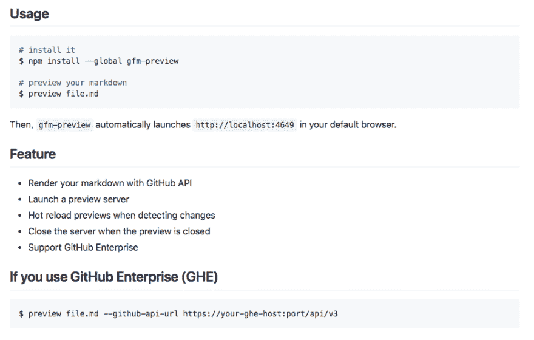

# 使用 GitHub API 实时预览您的降价

> 原文：<https://dev.to/saltyshiomix/preview-your-markdown-with-github-api-in-real-time-41od>

你好，我是日本的打字爱好者，但在这篇文章中，我将向你展示如何在我的工作区预览 markdown(GitHub 风味的 markdown(GFM))。

## TL；速度三角形定位法(dead reckoning)

```
# install gfm-preview
$ npm install --global gfm-preview

# preview your markdown
$ preview file.md 
```

Enter fullscreen mode Exit fullscreen mode

然后，您将在默认浏览器中看到如下预览:

[T2】](https://res.cloudinary.com/practicaldev/image/fetch/s--xxc3uhwM--/c_limit%2Cf_auto%2Cfl_progressive%2Cq_auto%2Cw_880/https://i.imgur.com/ddvaQuS.png)

## 背景

在编写 markdown 时，我总是关心 GitHub markdown 渲染的结果。所以我经常复制 markdown 并粘贴到 GitHub Gist，然后我看到一些错别字，重写并复制粘贴它...该死的。

所以今天写了 [gfm-preview 【T1:)](https://github.com/saltyshiomix/gfm-preview)

## 我的写作记录生活变化

一个`preview`命令自动做到这一点:

*   启动本地预览服务器
*   在默认浏览器中打开预览
*   GitHub API 渲染降价
*   观察更改并重新加载预览
*   当预览关闭时，关闭本地预览服务器

然后我的写作减价场景变成:

```
$ touch file.md
$ preview file.md 
```

Enter fullscreen mode Exit fullscreen mode

太好玩了！没有东西！

## 支持 GitHub 企业

我的工作空间用的是 GitHub Enterprise，所以我`preview`这样:

```
$ preview file.md --github-api-url https://ghe-host:port/api/v3 
```

Enter fullscreen mode Exit fullscreen mode

将别名添加到`~./bashrc` :

```
alias preview='preview --github-api-url https://ghe-host:port/api/v3' 
```

Enter fullscreen mode Exit fullscreen mode

然后，

```
$ preview file.md # uses GHE API by alias 
```

Enter fullscreen mode Exit fullscreen mode

够简单吗？

## 欢迎公关

我是 OSS 新手，想和贡献者交流！

[https://github.com/saltyshiomix/gfm-preview](https://github.com/saltyshiomix/gfm-preview)

感谢您阅读我的文章！