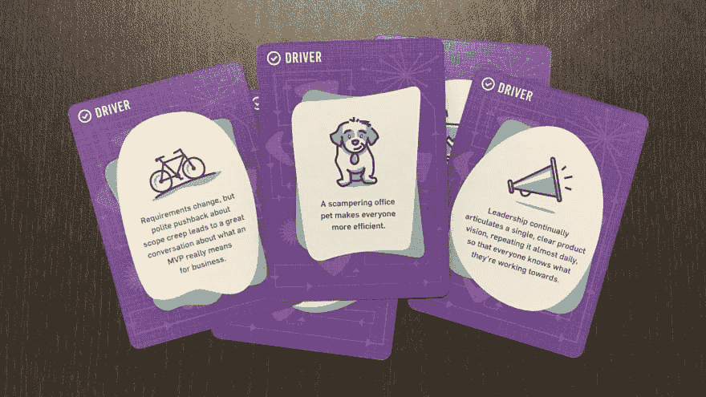
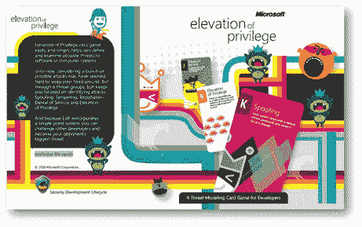

# 面向开发者的可打印卡片游戏和海报

> 原文：<https://dev.to/stereobooster/printable-card-games-and-posters-for-developers-566p>

最近找了两个面向开发者的卡牌游戏，也是免费下载的，还有一些海报。我想知道我还错过了什么？在评论中分享你的发现。

## 发货吧！产品管理的游戏

[T2】](https://res.cloudinary.com/practicaldev/image/fetch/s--1agyWpxt--/c_limit%2Cf_auto%2Cfl_progressive%2Cq_auto%2Cw_880/https://thepracticaldev.s3.amazonaws.com/i/bjcrr3ji4ommrw8gljd8.jpeg)

Postlight 的第一个游戏是关于运输软件的考验和磨难。由于大众的需求，他们创造了一个游戏的[打印和播放版本](https://postlight.com/about/news/ship-it-the-game-of-product-management)，你可以在完成这个简短的调查后下载。

## 特权提升(EoP)威胁建模卡片游戏

[T2】](https://res.cloudinary.com/practicaldev/image/fetch/s--Ak_ZJoFO--/c_limit%2Cf_auto%2Cfl_progressive%2Cq_auto%2Cw_880/https://thepracticaldev.s3.amazonaws.com/i/q9jg5og0djpn9aqxo588.jpg)

特权提升(EoP)是开始威胁建模的简单方法。这是一个开发人员、架构师或安全专家都可以玩的纸牌游戏。在这里下载。

## 英国内政部海报

家庭办公室海报库，涵盖不同主题-研究、访问需求、可访问性和设计。
这里下载。