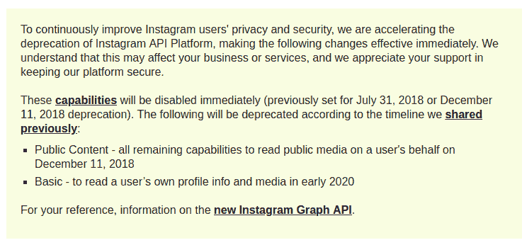

# 网络隐私

> 原文：<https://dev.to/joshualjohnson/privacy-on-the-net-34j2>

[T2】](https://res.cloudinary.com/practicaldev/image/fetch/s--EBQjknfD--/c_limit%2Cf_auto%2Cfl_progressive%2Cq_auto%2Cw_880/https://thepracticaldev.s3.amazonaws.com/i/c8kl4m7g1nt2gqb4g7uw.png)

我去注册了一个 Instagram 开发者账户，看到了脸书数据丑闻的影响。这让我想到，当商业模式围绕着比你更了解你来运转时，你如何解决隐私问题。