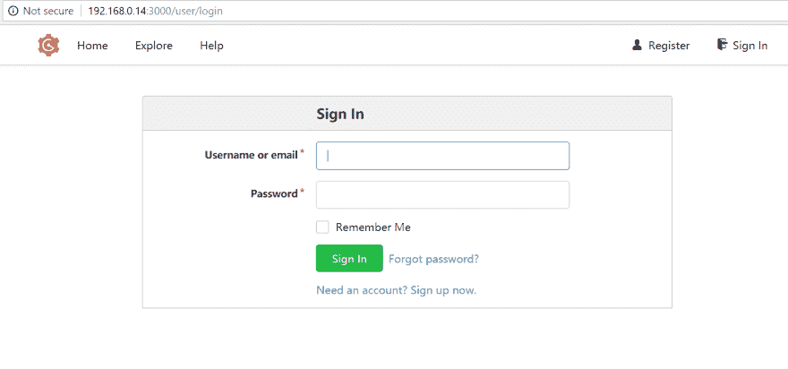

# 带有 gogs 和 raspberry pi 的私有 Github

> 原文：<https://dev.to/bojana_dev/private-github-with-gogs-and-raspberry-pi-46m3>

如果您以任何方式参与了软件开发过程的任何部分，那么您很可能听说过或使用过(或两者都听过)git，当然还有 github。

Github 是伟大的，你可以立即创建免费帐户，并准备推动你的 repos 的变化。只有一个条件——你在 github 上创建的这些库是公开的。

对于大多数用例来说，这很好，尤其是管理和维护开源项目。

许多大公司都在 github 上公开他们的回购协议。像谷歌、亚马逊和微软这样的公司，他们最近收购了整个服务，现在被认为是整个 github 平台上最大的贡献者。

Github 当然可以选择私有库，但这是一项付费服务，根据团队的规模和包含的功能，[价格会有所不同](https://github.com/pricing)。

7 美元/月并不昂贵，尤其是如果你使用 git 作为一个不可替代的日常工具，无论你是一个单独的开发人员还是在团队中工作。你不想在配置和维护服务上浪费时间，你想要一些“开箱即用”的东西。

也就是说，如果您自己安装和配置自托管的 git 服务，那会有趣得多(至少对我来说)。

为什么？很简单，因为你可以。:)

你所需要的只是一个树莓派，以及花上十几分钟来阅读这份指南。；)所以让我们开始吧。

## 在 RaspberryPi 上安装 Raspbian Lite

如果你拥有任何型号的树莓派，而它正坐在抽屉里无所事事(就像我的情况一样)，你可以把它很好地实际使用。

我买了我的一块树莓皮差不多两年前，这是一个 RaspberyPi 2 模型 B+但是任何其他变体都可以，因为我们将要安装和配置的东西可以在任何。

我给我的电脑配备了 32GB 的 SD 卡，但 16GB 的也足够了。

对于要闪存到 SD 卡的图像，我选择了 Raspbian Lite，它的尺寸更小，节省了我们 sd 卡上的空间，我们不需要 GUI 来实现我们的目的，因为大多数配置我们将通过 CLI 远程执行。

Raspbian 是由 Raspberry Pi 基金会官方支持的操作系统，所以你可以很容易地下载图片或。按照项目[文档页面](https://www.raspberrypi.org/documentation/installation/installing-images/README.md)上的建议，用[蚀刻机](https://etcher.io/)之类的工具压缩并闪存到 SD 卡。

## 安装和配置 Gogs

Gogs 是用 Go 编写的跨平台自托管 git 服务。

在我们下载它之前，我们需要设置一些 Gogs 必备的东西，如他们的[文档](https://gogs.io/docs/installation)中所列，它们是:

1.  MySQL 数据库(也支持 MSSQL 和 PostgreSQL，但我选择了 MySQL)

2.  服务器端和客户端的 Git (bash)版本> = 1.7.1

3.  运行中的 SSH 服务器

在执行任何安装之前，请确保您的系统是最新的:

```
sudo apt-get update && sudo apt-get upgrade 
```

Enter fullscreen mode Exit fullscreen mode

1)在此之后，我们可以安装和配置 MySQL 服务器:

```
sudo apt-get install mysql-server 
```

Enter fullscreen mode Exit fullscreen mode

如果没有提示您输入 root 用户类型的密码:

```
sudo mysql_secure_installation 
```

Enter fullscreen mode Exit fullscreen mode

只要您拥有 MySQL 服务器的 root 访问权限，您就可以根据自己的需要回答这个问题。
如果您想让其他用户(非 root 用户)访问 gogs 数据库，您必须授予所创建数据库的权限或全部权限。
使用以下命令访问 MySQL 命令后:

```
sudo mysql -u root -p 
```

Enter fullscreen mode Exit fullscreen mode

并输入 root 的密码，执行:

```
GRANT ALL PRIVILEGES ON *.* TO 'raspberryuser'@'localhost' IDENTIFIED BY 'password'; 
```

Enter fullscreen mode Exit fullscreen mode

现在，当我们在 MySQL 提示符下时，我们可以使用适当的排序规则创建一个 gogs 数据库:

```
CREATE DATABASE IF NOT EXISTS gogs COLLATE utf8_general_ci ; 
```

Enter fullscreen mode Exit fullscreen mode

2)现在，通过运行以下命令，确保您已经在 pi 上安装了 git:

```
sudo apt-get install git 
```

Enter fullscreen mode Exit fullscreen mode

3)作为最后一个先决条件，gogs 文档提到要有功能性的 SSH 服务器。现在，当您运行 gogs 服务时，它将在默认端口 22 上运行自己的 SSH 服务器。为了避免与系统 ssh 服务器冲突，最简单的解决方法是改变系统 SSH 的端口。您可以通过编辑以下文件来实现:

```
nano /etc/ssh/sshd_config 
```

Enter fullscreen mode Exit fullscreen mode

取消对该行的注释:

```
#Port 22 
```

Enter fullscreen mode Exit fullscreen mode

并将端口号更改为其他值(例如 2244).
您需要重启 ssh 服务:

```
service ssh restart 
```

Enter fullscreen mode Exit fullscreen mode

此外，允许 gogs 绑定为特权端口，执行:

```
sudo setcap CAP_NET_BIND_SERVICE=+eip /path/to/gogs 
```

Enter fullscreen mode Exit fullscreen mode

最后，现在我们可以下载 gogs，只需执行:

```
wget https://dl.gogs.io/0.11.53/gogs_0.11.53_raspi2_armv6.zip 
```

Enter fullscreen mode Exit fullscreen mode

在命令行中。这会将二进制文件下载到您当前的文件夹中。

提取文件的内容，然后:

```
cd extracted_folder 
```

Enter fullscreen mode Exit fullscreen mode

执行:

```
./gogs web 
```

Enter fullscreen mode Exit fullscreen mode

它将启动 gogs 服务的安装页面，您可以通过输入以下内容从 web 浏览器外部访问该页面:

```
http://ip-of-your-raspberrypi:3000 
```

Enter fullscreen mode Exit fullscreen mode

我的情况是:

```
http://192.168.0.14:3000 
```

Enter fullscreen mode Exit fullscreen mode

您应该会看到安装页面提示，如下所示:

[T2】](https://res.cloudinary.com/practicaldev/image/fetch/s--WILdYrHd--/c_limit%2Cf_auto%2Cfl_progressive%2Cq_auto%2Cw_880/http://bojanab.tech/img/gogs-install-firsttimerum1.png)

填写表单以匹配您的用户和数据库设置，以及涉及应用程序端口、url 和日志路径的其余配置，如下所示

[T2】](https://res.cloudinary.com/practicaldev/image/fetch/s--58AF452Z--/c_limit%2Cf_auto%2Cfl_progressive%2Cq_auto%2Cw_880/http://bojanab.tech/img/install-gogs.png)

然后点击“安装 Gogs”。如果一切顺利，您可能会被重定向到用户登录页面。但是，“locahost”将被用作主机名，所以用您的 pi 的 IP 地址替换它，这样您就可以在新安装的 gogs 上创建帐户。

[T2】](https://res.cloudinary.com/practicaldev/image/fetch/s--L5sbD_te--/c_limit%2Cf_auto%2Cfl_progressive%2Cq_auto%2Cw_880/http://bojanab.tech/img/localhostshouldbeipaddress.png)

[T2】](https://res.cloudinary.com/practicaldev/image/fetch/s--6eNcF73Z--/c_limit%2Cf_auto%2Cfl_progressive%2Cq_auto%2Cw_880/http://bojanab.tech/img/signinggogs.png)

现在，您可以点击“立即注册”来创建您的新帐户。

[T2】](https://res.cloudinary.com/practicaldev/image/fetch/s--hptUqYvG--/c_limit%2Cf_auto%2Cfl_progressive%2Cq_auto%2Cw_880/http://bojanab.tech/img/gogssignup.png)

现在，您可以使用新创建的帐户登录，并开始创建回购！

[T2】](https://res.cloudinary.com/practicaldev/image/fetch/s--9kaN2ha5--/c_limit%2Cf_auto%2Cfl_progressive%2Cq_auto%2Cw_880/http://bojanab.tech/img/gogsdashboard.png)

现在我们不想用。/gogs web 每当我们失去与 pi 的 ssh 连接时，最好将 gogs 作为守护进程来运行，这样它就可以在后台运行，并且始终处于开启状态。

从提取的 gogs 文件夹中复制 init.d 脚本:

```
 sudo cp /home/malina/gogs/scripts/init/debian/gogs /etc/init.d/gogs 
```

Enter fullscreen mode Exit fullscreen mode

并修改**工作目录**和**用户**

```
# PATH should only include /usr/* if it runs after the mountnfs.sh script
PATH=/sbin:/usr/sbin:/bin:/usr/bin
DESC="Gogs"
NAME=gogs
SERVICEVERBOSE=yes
PIDFILE=/var/run/$NAME.pid
SCRIPTNAME=/etc/init.d/$NAME
WORKINGDIR=/home/malina/gogs
DAEMON=$WORKINGDIR/$NAME
DAEMON_ARGS="web"
USER=malina 
```

Enter fullscreen mode Exit fullscreen mode

现在，我们应该让它在启动时自动运行:

```
sudo chmod ug+x /etc/init.d/gogs 
```

Enter fullscreen mode Exit fullscreen mode

并确保它在数据库服务器之后启动:

```
sudo update-rc.d gogs defaults 98 
```

Enter fullscreen mode Exit fullscreen mode

我们可以通过以下方式启动 gogs 作为任何服务:

```
sudo service gogs start 
```

Enter fullscreen mode Exit fullscreen mode

如果由于某种原因服务无法启动，请重新启动，然后再试一次。

此外，您可以在您的家庭路由器上配置端口转发，这样即使您不在家也可以访问您的私有 github。

就这样，现在你有了自己的私人 github！

去推点代码！；)

* * *

最初发布于 [http://bojana.dev](http://bojana.dev)