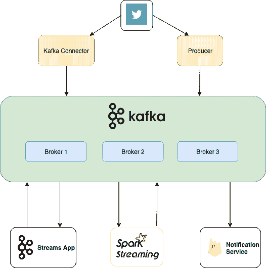

# 使用 Kafka 和 Spark 处理流 Twitter 数据——第 2 部分:创建 Kafka Twitter 生产者

> 原文：<https://dev.to/dbsheta/processing-streaming-twitter-data-using-kafka-and-spark-part-2-creating-kafka-twitter-streamproducer-12ko>

使用 Kafka 和 Spark 系列处理流 Twitter 数据。
第 0 部分:[计划](https://medium.com/dhoomil-sheta/processing-streaming-twitter-data-using-kafka-and-spark-the-plan-58b893e42403)
第 1 部分:[设置卡夫卡](https://medium.com/dhoomil-sheta/processing-streaming-twitter-data-using-kafka-and-spark-part-1-setting-up-kafka-cluster-6e491809fa6d)

## 建筑

在我们开始实现任何组件之前，让我们设计一个架构或框图，我们将尝试在本系列中一个接一个地构建它。由于我们的目的是使用一个用例来学习更多的技术，这正合适。

[T2】](https://res.cloudinary.com/practicaldev/image/fetch/s--ji89i_Jd--/c_limit%2Cf_auto%2Cfl_progressive%2Cq_auto%2Cw_880/https://cdn-images-1.medium.com/max/2000/1%2AzTHQFs9KDNV24Phd98u60w.png)

这张图表涵盖了我在[计划](https://medium.com/dhoomil-sheta/processing-streaming-twitter-data-using-kafka-and-spark-the-plan-58b893e42403)中列出的所有要点。我们已经在第 1 部分中完成了 Kafka 集群的设置。

在本文中，我们将专注于构建一个生产者，它将在 *#bigdata* 上获取最新的推文，并将它们推送到我们的集群。

## 什么是制片人？

每个人可能想用卡夫卡的目的不同。有些人可能想把它用作队列，有些人想把它用作消息总线，而有些人想把它用作数据存储平台。无论是哪种情况，您都将通过编写一个向 Kafka 写入数据的生产者、一个从 Kafka 读取数据的消费者或一个服务于这两种角色的应用程序来使用 Kafka。

Kafka 有内置的客户端 API，开发人员在开发与 Kafka 交互的应用程序时可以使用这些 API。在本文中，我们将使用 Producer API 来创建一个客户端，该客户端将从 Twitter 获取 tweets 并将其发送到 Kafka。

卡夫卡的笔记:权威指南:

> 除了内置客户端之外，Kafka 还有一个二进制有线协议，您可以用自己选择的编程语言来实现它。这意味着应用程序只需将正确的字节序列发送到 Kafka 的网络端口，就可以从 Kafka 读取消息或向 Kafka 写入消息。这样的客户端不是 Apache Kafka 项目的一部分，但是在[项目 wiki](https://cwiki.apache.org/confluence/display/KAFKA/Clients) 中维护了一个非 Java 客户端的列表。

以下是 Kafka 附带的 Java Producer API 的特性:

1.  生成器是线程安全的，跨线程共享单个生成器实例通常比拥有多个实例要快。

2.  生产者有一个缓冲空间池，用于保存尚未传输到服务器的记录

3.  它还有一个后台 I/O 线程，负责将这些记录转换成请求，并将它们传输到集群。

4.  使用后不关闭生成器将会泄漏这些资源。

## 如何获取最新的推文？

Twitter 提供了一个名为 Hosebird(hbc)的开源客户端，这是一个健壮的 Java HTTP 库，用于使用 Twitter 的流媒体 API。

它是一个健壮的 Java HTTP 库，用于消费 Twitter 的[流 API](https://dev.twitter.com/docs/streaming-apis) 。它使客户能够近乎实时地接收推文。每个 Twitter 帐户都可以访问流媒体 API，任何开发者都可以使用它来构建应用程序。

## 生成 Twitter API 密钥

1.  如果你没有开发者权限，去[https://dev.twitter.com/apps/new](https://dev.twitter.com/apps/new)申请开发者权限。

2.  转到[https://developer.twitter.com/en/apps](https://developer.twitter.com/en/apps)并创建一个新应用程序。(将回拨 URL 留空)

3.  转到 ***密钥*** 和令牌 ***选项卡*** 并将消费者密钥和秘密对复制到一个文件中以备后用。

4.  单击“创建”以生成访问令牌和密码。将它们复制到一个文件中。

5.  现在，您已经拥有了开发生成器所需的所有东西。

让我们开始实现一个 Kafka Producer 客户端，它将利用这个服务。对于所有想看完整代码的人，这里有链接:[https://github.com/dbsheta/kafka-twitter-producer](https://github.com/dbsheta/kafka-twitter-producer)

## 创建 Maven 项目

1.  打开您选择的 IDE 并创建一个新的 maven 项目。我将我的名字命名为*卡夫卡-推特-制片人*

2.  在 *pom.xml* 中添加 Kafka、Twitter 和 Gson 依赖项，重新构建项目。

## 实现生产者

首先让我们定义常量来配置 Kafka Producer。

现在，我们将从 Twitter 开发人员控制台复制秘密和令牌。

Twitter API 返回的 tweet 是一个非常大的字符串(json ),包含我们项目所需的所有细节。你可以在这里找到完整的回应。

我们创建两个实体 *Tweet* 和 *User* 来保存 json 响应，因为使用 POJOs 比使用字符串响应更容易。此时，在向 Kafka 发送 Tweet 时，我们将在 Tweet 对象上调用 ***toString()*** ，这样我们就不必为我们的自定义类编写序列化程序。

> **注**:这种场景最好使用序列化库。我们将在以后的文章中看到，我们如何使用 Avro 来序列化/反序列化 java 对象，同时发送到 Kafka 或从 Kafka 消费。我们将在那时讨论使用 Avro 和 Schema registry 的好处。

现在，我们有了实现 producer 所需的所有基本东西。让我们开始创建 TwitterKafkaProducer。

我们将在 producer 类的构造函数中初始化我们的 Twitter 客户端。我们必须传递密钥、秘密和令牌来进行认证。然后我们必须传递一个我们想要跟踪的术语列表。目前，我只关注 *#bigdata*

这就完成了 twitter 客户端的配置。现在我们必须配置 Kafka producer。下面我创建了一个相当简单的生产者。

让我们回顾一下我们在这里讨论过的主要问题。你可以很容易地在 Kafka 文档中找到 Rest，并且它们是不言自明的。

1.  ***BOOTSTRAP _ SERVERS _ CONFIG***:充当集群初始联系点的代理列表。建议传递多个代理，以防其中一个代理关闭，生产者仍然应该有连接到集群的选项。

2.  ***ack _ CONFIG***:0、1 或全部。“0”表示生成器不等待确认。“1”表示生产者等待领导者确认其已写入磁盘。“all”表示生成器等待确认所有同步副本都保存了消息。我们使用“1 ”,因为在我们的情况下，数据不需要严格的确认。对我们来说，即使我们得到一个确认也没问题，因为数据不是那么敏感。轻微的数据丢失对我们来说没问题。

3.  ***RETRIES_CONFIG*** :消息未被确认时生产者退出的次数(如果*ack*设置为‘1’或‘全部’)。请注意，将此值设置为大于 0 可能会导致重试消息被无序传递。您可能需要再转动几个旋钮来确保相同的顺序，这超出了本文的范围。感兴趣的人可以在评论区提问。

## 向 Kafka 集群发送流推文

现在，在配置了 twitter 客户端和 producer 之后，我们只需要使用客户端连接到 twitter，等待有人使用#bigdata 发布 tweet。一旦我们得到一条 tweet，使用 producer 发送给 kafka。

客户端负责获取#bigdata 上的最新推文，并将其推送到 BlockingQueue。在无限循环中，我们通过使用 tweet ID 作为 ***键*** 和整个 Tweet 作为 ***值*** ，一次从队列中取出一条 Tweet，并将其推送给 kafka。由于我们使用了 BlockingQueue， *queue.take()* 将阻塞流，直到 twitter 客户端获取新的 tweet。

完整代码可从[https://github.com/dbsheta/kafka-twitter-producer](https://github.com/dbsheta/kafka-twitter-producer)获得

## 灯亮。相机。行动。

让我们看看我们的代码在运行！首先，我将创建一个新主题 *bigdata-tweets* ，复制因子为 2，分区数量为 3。

```
> bin/kafka-topics.sh --create --zookeeper X.X.X.X:2181 --replication-factor 2 --partitions 3 --topic bigdata-tweets

> bin/kafka-topics.sh --describe --zookeeper X.X.X.X:2181 --topic bigdata-tweets

    Topic:bigdata-tweets    PartitionCount:3    ReplicationFactor:2    Configs:
    Topic: bigdata-tweets    Partition: 0    Leader: 0    Replicas: 0,1    Isr: 0,1
    Topic: bigdata-tweets    Partition: 1    Leader: 1    Replicas: 1,2    Isr: 1,2
    Topic: bigdata-tweets    Partition: 2    Leader: 2    Replicas: 2,0    Isr: 2,0 
```

现在，为了验证 tweets 确实是由 kafka 保存的，我们将启动一个由 Kafka 发行版提供的简单控制台消费者。

```
 > bin/kafka-console-consumer.sh --bootstrap-server bigdata-1:9092 --topic bigdata-tweets --from-beginning 
```

运行 TwitterKafkaProducer 应用程序。它应该开始向卡夫卡发送数据。

您应该会在您的控制台消费者上看到类似这样的内容:

```
Tweet{id=1059434252306210817, text='I want to assist to meet you and see your latest tools', lang='en', user=User{id=198639877, name='Antonio Molina', screenName='amj_69', location='Moralzarzal-Madrid-Spain', followersCount=399}, retweetCount=0, favoriteCount=0}

Tweet{id=1059434263232348160, text='RT @InclineZA: #AI &amp; #MachineLearning: Building use cases &amp; creating Real-Life Benefits &gt;&gt;  https://t.co/noWy1NS3OU 
```

如果你看到这样的推文，祝贺我的朋友，你已经创建了一个数据管道！您从一个源(Twitter)获取数据，将其推送到一个消息队列，并最终消费它(打印在控制台上)。

## 结论

我们使用 Twitter Streaming API 和 Kafka Clients API 实现了一个 Producer 应用程序，它从 Twitter 获取数据并实时发送给 Kafka。在下一部分中，我们将了解如何使用这些数据来实时收集流数据的一些统计数据。

在那之前 …

[T2】](https://res.cloudinary.com/practicaldev/image/fetch/s--K_nZKCnH--/c_limit%2Cf_auto%2Cfl_progressive%2Cq_66%2Cw_880/https://cdn-images-1.medium.com/max/2000/1%2AOwkfEOCQTC0YGxZLWx2juQ.gif)