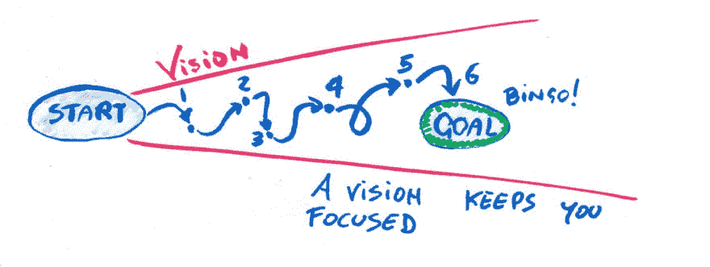
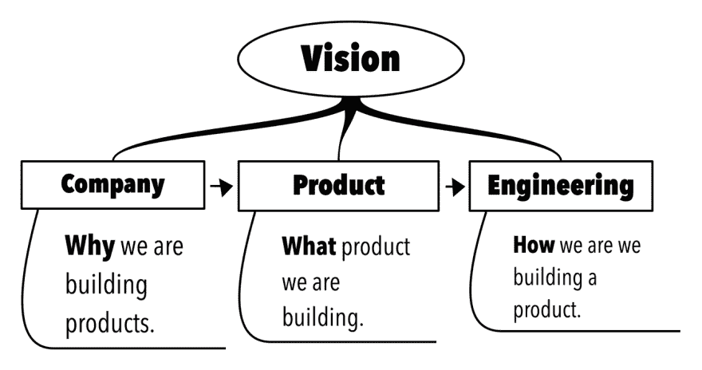

# 产品愿景、敏捷和登月

> 原文：<https://dev.to/lpasqualis/product-vision-agile-and-going-to-the-moon-1li2>

这篇文章最初发表在 [CoderHood](https://coderhood.com) 上，名为[产品愿景、敏捷和登月](https://www.coderhood.com/product-vision-agile-going-to-the-moon/)。CoderHood 是一个致力于软件工程人类层面的博客。

阅读时间:6 分钟

> 视觉:生动的精神形象，尤指对未来的幻想。

## 清晰的视野

在 1969 年 7 月 20 日见证阿波罗 11 号任务之前，每个人都只能梦想触摸月球。1865 年，法国小说家儒勒·凡尔纳以小说的形式实现了这个梦想，他将其命名为“从地球到月球”他讲述了一群枪支爱好者的故事，他们试图建造一个巨大的太空枪，将三个人发射到月球上。

人类又花了 104 年才找到实现这个梦想的方法。当它发生时，它是人类最骄傲的成就之一；这是一个辉煌的时刻，需要大量的计划和工作。

在我们迈出这一大步之前，需要实现许多微小而重要的科学里程碑。首先，在 1609 年，伽利略发现月球是一个世界。这个发现对我们想象去那里是可能的是必要的。1687 年，艾萨克·牛顿推断，一门威力足够大的大炮可以将一枚炮弹送入轨道。如果子弹射得更快，它就会离开地球进入太空。1903 年，俄罗斯科学家康斯坦丁·齐奥尔科夫斯基定义了火箭方程，这是空间推进的数学基础。这个清单还在继续。

每个里程碑本身并不足以让我们到达目的地，但结合起来创造了必要的临界质量。

推动我们前进的愿景很简单:将人类送上月球。工程愿景更加复杂，但仍然清晰:建立必要的技术将人类送上太空，保持他们的健康，将他们放在月球上，并让他们活着返回地球。最后一部分非常复杂。

## 敏捷和远见不是敌人

我承认；太空任务和软件产品是非常不同的东西。然而，它们确实有共同点。它们都包含复杂的工程挑战，需要克服这些挑战才能实现目标。

阿波罗 11 号任务主要是使用瀑布过程来计划和驱动的。这就是我们当时设计大多数东西的方式。今天，许多工程问题以一种更加“敏捷”的方式被处理。敏捷宣言为这种思维方式奠定了基础:

> ### [T2】敏捷宣言](#agile-manifesto)
> 
> *   And personal interaction over processes and tools.
> *   The software is fully documented.
> *   Customer collaboration exceeds contract negotiation.
> *   Respond to changes as planned.

根据宣言进行操作在软件行业很常见。不幸的是，这份宣言非常含糊，可以随意解释，而且通常会被误解。敏捷的 12 个原则更详细地阐述了这一哲学，但是它们仍然(通过设计)留给人们很多想象的空间:

> ### [T2】敏捷原则](#agile-principles)
> 
> 1.  Our highest priority is to satisfy customers through early and continuous delivery of valuable software.
> 2.  Welcome changing requirements, even in the late stage of development. Agile processes take advantage of changes to bring competitive advantage to customers. Deliver working software frequently, from weeks to months, and give priority to a shorter time scale. Throughout the project, business people and developers must work together every day.
> 3.  Build projects around motivated individuals. Give them the environment and support they need, and believe that they can finish the work. The most effective way to convey information to and within the development team is to talk face to face.
> 4.  Working software is the main measure of progress.
> 5.  Agile process promotes sustainable development. Sponsors, developers and users should be able to keep a constant pace indefinitely.
> 6.  Continuous attention to excellent technology and excellent design enhances agility. Simplicity-the art of maximizing unfinished work-is crucial. The best architecture, requirements and designs come from self-organizing teams. The team regularly reflects on how to become more efficient, and then adjusts its behavior accordingly.

在宣言或原则中没有提到产品愿景或工程愿景。它或多或少地表明，愿景需要在小的功能发布中实现，并且计划会随着时间的推移而改变。

不幸的是，敏捷经常与“没有计划就开始做事”相混淆这是一个导致巨大问题的谬论。宣言和原则并没有说你应该在不知道产品走向的情况下开始写代码。事实上，从清晰的愿景开始是“敏捷项目管理 101”的基础，但这也是经常被遗忘的第一步。

从产品愿景来看，一个工程团队应该创建一个工程愿景。这是一个如何实现产品愿景的高层次想法。

朝着目标迈出第一步不是正确的方法，因为它会导致许多错误的开始和错误的道路。我给你举个例子。

## 去月球

假设阿波罗 11 号任务没有发生，你的目标是第一次去月球旅行。“产品愿景”是宇航员在月球上插一面旗帜的想法。这就是你想要达到的目标，或者说“什么”这是一个愿景，因为你可以在头脑中看到它。根据这个想法，你需要想象你将如何实现它；我称之为工程愿景。

在一个敏捷的世界里，你可能会受到诱惑，急于采取第一个让你更接近实现目标的行动。例如，你可以从沿着月球的大致方向行走开始。这似乎是一件很棒的事情，因为它让你更接近目的地。然而，虽然走在正确的方向上减少了你和月球之间的物理距离，但它没有成功的机会，因为你不能走到太空。

[T2】](https://res.cloudinary.com/practicaldev/image/fetch/s--MtCGO6ZP--/c_limit%2Cf_auto%2Cfl_progressive%2Cq_auto%2Cw_880/https://thepracticaldev.s3.amazonaws.com/i/1awtgvf5s47zeb0h32ii.jpg)

行走是误入歧途走向死胡同的第一步。向死胡同迈出一堆第一步不是敏捷；只是缺乏想象如何达到目标的能力或愿望。换句话说，就是缺乏远见。

[T2】](https://res.cloudinary.com/practicaldev/image/fetch/s--Ym-zWrLL--/c_limit%2Cf_auto%2Cfl_progressive%2Cq_auto%2Cw_880/https://thepracticaldev.s3.amazonaws.com/i/yx1twegpjfly3f3m1e30.jpg)

一个更好的第一步是考虑如何到达月球。即使不知道细节，也要想象如何去做，这是你实现目标所需要的工程愿景。这个愿景让你保持专注。例如，如果你设想要建造一枚火箭，你接下来要做的就是专注于这个具体的目标。

[T2】](https://res.cloudinary.com/practicaldev/image/fetch/s--ynZmib3Y--/c_limit%2Cf_auto%2Cfl_progressive%2Cq_auto%2Cw_880/https://thepracticaldev.s3.amazonaws.com/i/xkrf0jcww670ojy10905.jpg)

专注于火箭(工程愿景)，你可以采取有机会让你到达目的地的步骤。

[T2】](https://res.cloudinary.com/practicaldev/image/fetch/s--kOg97D6q--/c_limit%2Cf_auto%2Cfl_progressive%2Cq_auto%2Cw_880/https://thepracticaldev.s3.amazonaws.com/i/bz26get4qe14hvut4n3f.jpg)

这一愿景至关重要。如果你设想了错误的事情(例如，走向月球)，你就会专注于向错误的方向迈出步伐。这就是敏捷哲学发挥作用的地方。应用敏捷方法一旦你有了一个愿景，你就实现了功能性的中间步骤，同时继续评估过程和整个策略。

## 软件产品愿景的层次

我们已经看到，工程愿景取决于产品愿景。同样，产品愿景取决于公司愿景。

这是因为公司愿景告诉你**为什么**应该生产一种产品。产品愿景告诉**应该制造什么**产品，最后，工程愿景告诉**产品将如何开发**。

[T2】](https://res.cloudinary.com/practicaldev/image/fetch/s--9L3SV6H6--/c_limit%2Cf_auto%2Cfl_progressive%2Cq_auto%2Cw_880/https://thepracticaldev.s3.amazonaws.com/i/4e16mfq78mwe9k1uaei4.png)

这三个层次的视觉共同给出了产品的完整叙述。拥有这样的叙述对于描述产品建成后的现实世界是必要的。

### 这张图中营销和销售在哪里？

如果你不知道你将如何营销或销售一个产品(至少在一个高层次上)，这个产品将会举步维艰。看看 Twitter 花了多长时间才发现如何将他们的服务货币化。因此，营销和销售策略应该是产品愿景的一部分。

要扩展上面的思维导图:

[T2】](https://res.cloudinary.com/practicaldev/image/fetch/s--yN8Rpqqn--/c_limit%2Cf_auto%2Cfl_progressive%2Cq_auto%2Cw_880/https://thepracticaldev.s3.amazonaws.com/i/2aauq095vojy10c5semj.png)

更具体地说，在亚马逊，产品的愿景始于一份模拟新闻稿。这迫使产品经理从一开始就考虑产品所有面向客户的方面。对市场和销售现实的思考对产品设计有着深远的影响，而产品设计对工程方向有着广泛的影响。

## 结论

敏捷方法影响了软件构建的方式，但也以幼稚的方式被应用。他们的目标是消除不必要的和昂贵的过度形式化，使开发人员不必提前说明所有细节就能取得进展。这不应与草率地朝着看似正确的方向迈出一步相混淆。

敏捷方法不应该成为在没有计划或者不知道我们想要构建什么或者如何构建的情况下试图获得结果的借口。清晰的产品愿景仍然至关重要。小批量视觉和增量视觉都是矛盾的。

* * *

### 如果你喜欢这篇文章，请保持联系！

*   在 CoderHood 上找到我所有的帖子。不要忘记订阅邮件来接收新帖子的通知。
*   在 LinkedIn 上加入我的职业网络。
*   在推特上关注我。
*   加入我的脸书主页。
*   最后，请在 dev.to 上关注我！