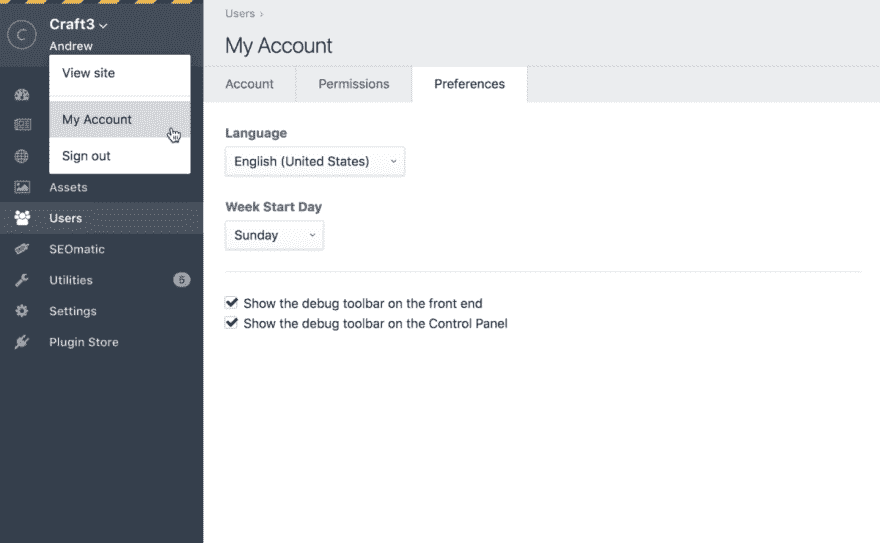
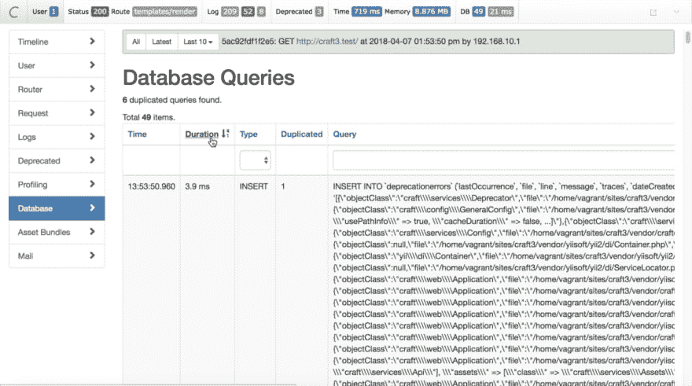
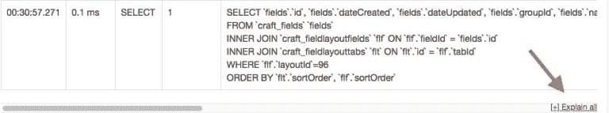
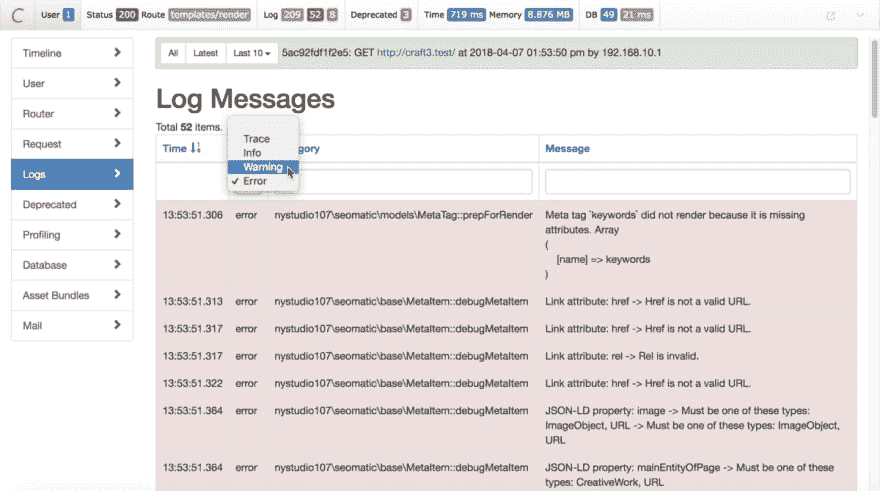
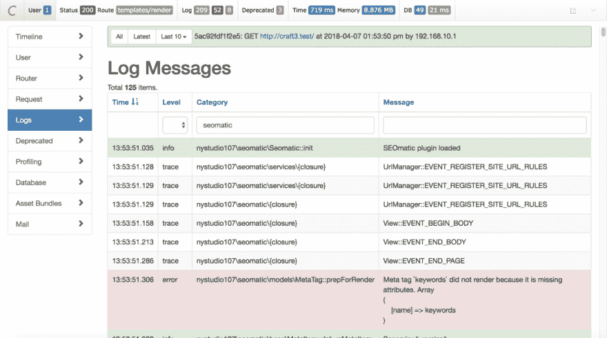
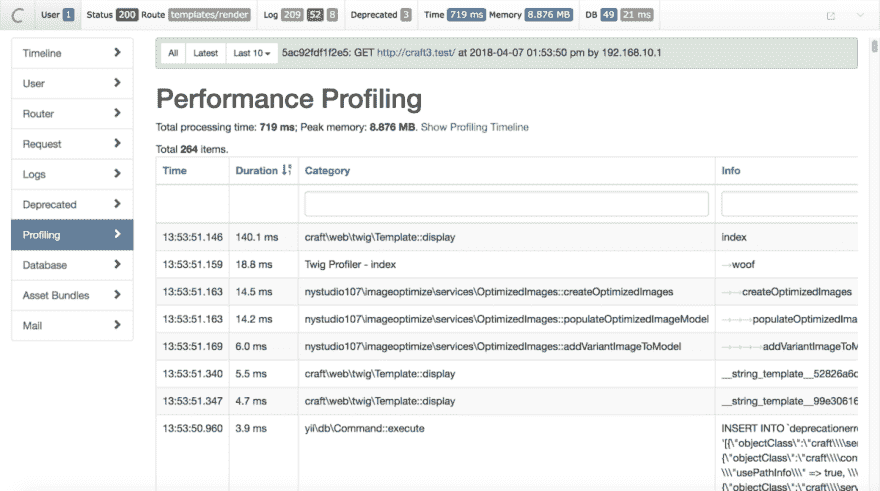
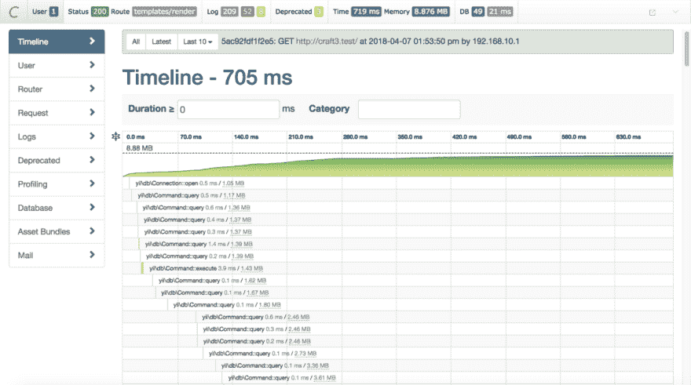
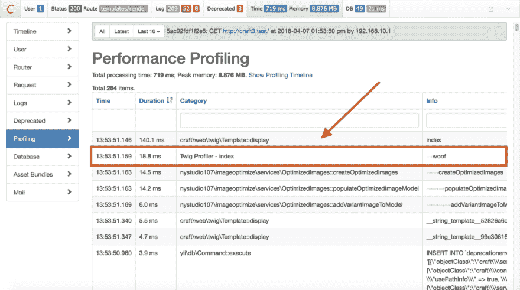
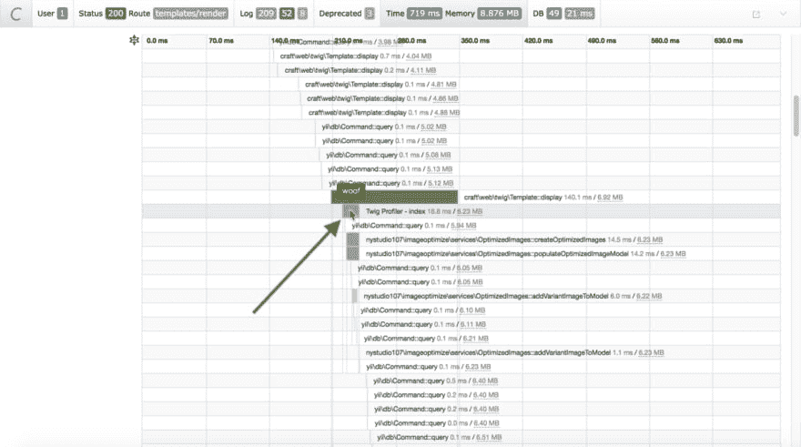
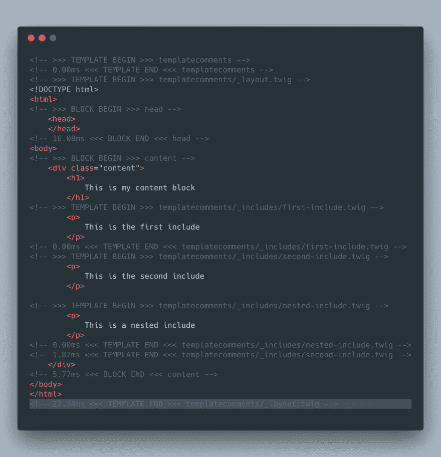

# 用 Craft CMS 3 的调试工具栏分析你的网站

> 原文：<https://dev.to/gaijinity/profiling-your-website-with-craft-cms-3-s-debug-toolbar-5961>

# 使用 Craft CMS 3 的调试工具栏分析你的网站

### Craft CMS 3 有一些大的变化，其中之一是增加了调试工具栏，可以帮助你对网站进行归档和调试

安德鲁·韦尔奇

[T2】](https://res.cloudinary.com/practicaldev/image/fetch/s--sieboFaB--/c_limit%2Cf_auto%2Cfl_progressive%2Cq_auto%2Cw_880/https://nystudio107-ems2qegf7x6qiqq.netdna-ssl.com/img/blog/_1200x675_crop_center-center_82_line/craft-cms-debug-toolbar-debugging.jpg)

随着 2018 年 4 月 4 日<sup>日</sup>Craft CMS 3 正式发布，人们开始进入并开始了解 Craft CMS 3 的新内容。

《星际争霸 3》测试版执行摘要和[建立了一个新的《星际争霸 3》项目](https://dev.to/gaijinity/setting-up-a-new-craft-cms-3-project-107b-temp-slug-1098923)文章从一个完形剧本的角度对此进行了报道。在这篇文章中，我们将深入研究一个 spe cif ic 顶级 ic:全新的调试工具栏。

在 Craft 2.x 中，我们习惯于查看 web 控制台来查看我们网站上的调试和性能信息。在 Craft 3 中，通过将所有这些整合到调试工具栏中，这已经得到了很大的改进。

<aside>With the Debug Tool­bar, you now have one place to look for debug­ging & per­for­mance information.</aside>

调试工具栏实际上是来自 Yii2 的，由像素&吨集成电路的人在顶部放置了一些额外的 mag ic。最重要的是，它是可搜索的、可排序的，并且比旧的 Craft 2.x 将信息转储到 web 控制台的方法更有用。

它看起来是这样的:

[T2】](https://res.cloudinary.com/practicaldev/image/fetch/s--o5yb_mSW--/c_limit%2Cf_auto%2Cfl_progressive%2Cq_auto%2Cw_880/https://nystudio107-ems2qegf7x6qiqq.netdna-ssl.com/img/blog/_1200x46_crop_center-center_100_line/debug-toolbar.png)

## 启用调试工具栏

那么，我们怎样才能让这个小恶魔出现在我们面前呢？

[T2】](https://res.cloudinary.com/practicaldev/image/fetch/s--FRNBNeSA--/c_limit%2Cf_auto%2Cfl_progressive%2Cq_auto%2Cw_880/https://nystudio107-ems2qegf7x6qiqq.netdna-ssl.com/img/blog/_992x558_crop_center-center_82_line/craft-cms-debug-toolbar-spider-closeup.jpg)

接下来，您需要指定启用调试工具栏。这是基于每个用户完成的，因此我们需要转到 AdminCP 中的**我的帐户**页面:

[T2】](https://res.cloudinary.com/practicaldev/image/fetch/s--w7QPSy5n--/c_limit%2Cf_auto%2Cfl_progressive%2Cq_auto%2Cw_880/https://nystudio107-ems2qegf7x6qiqq.netdna-ssl.com/img/blog/_1200x741_crop_center-center_100_line/enable-debug-toolbar.png)

进入**我的帐户**页面后，点击**偏好**选项卡，然后根据您希望工具栏出现的位置，选中**在前端显示调试工具栏**和/或**在控制面板上显示调试工具栏**复选框。

就是这样！现在，您应该已经准备好了全新的调试工具栏，等待它来帮助您解决问题。

因为显示调试工具栏(或不显示)的偏好与您的帐户相关，所以您显然也必须登录。因此，如果我很可能没有为您显示，请确保您仍然登录！

注意，如果`devMode`没有打开，您仍然可以使用调试工具栏，但是不会记录太多信息。如果`devMode`未打开，将只记录`error`和`warning`消息以及定时拍摄信息。

那么调试工具栏能为你做什么呢？请继续阅读，我们将为您介绍阿尔一些有用的东西！

## 专业数据库查询

现在我们已经有了调试工具栏，让我们用它来做一个非常常见的用例:处理数据库查询。

[T2】](https://res.cloudinary.com/practicaldev/image/fetch/s--zacVh4wA--/c_limit%2Cf_auto%2Cfl_progressive%2Cq_auto%2Cw_880/https://nystudio107-ems2qegf7x6qiqq.netdna-ssl.com/img/blog/_1200x675_crop_center-center_82_line/craft-cms-debug-toolbar-housefly.jpg)

正如文章中所讨论的那样，我们希望我们的网站符合 mant 的需求。一个好的开始是减少我们正在进行的数据库查询的数量。

点击调试工具栏的 **DB** 部分，调出数据库查询面板:

[T2】](https://res.cloudinary.com/practicaldev/image/fetch/s--lL1445k4--/c_limit%2Cf_auto%2Cfl_progressive%2Cq_auto%2Cw_880/https://nystudio107-ems2qegf7x6qiqq.netdna-ssl.com/img/blog/_1200x669_crop_center-center_100_line/debug-toolbar-database-queries.png)

在这里，我们可以看到加载网页时出现的所有数据库查询。虽然我们希望通过使用诸如[缓存](https://dev.to/gaijinity/the-craft-cache-tag-in-depth-207b-temp-slug-8529389)和[快速加载](https://dev.to/gaijinity/speed-up-your-craft-cms-templates-with-eager-loading-3fhl-temp-slug-8713610)等技术来尽可能减少查询的数量，但是我们希望将重点放在花费时间最多的查询上。

<aside>It’s not just about the num­ber of queries, it’s about how per­for­mant those queries are.</aside>

调试工具栏的好处是，我们可以通过**持续时间**对查询进行排序，以找到我们应该关注的非 per for mant 查询。

这肯定比一个接一个地浏览每个查询要好:我们可以专注于那些重要的查询。

**专业提示**:一直滚动到页面的底部，点击解释所有链接，你会看到每个查询的可读摘要:

[T2】](https://res.cloudinary.com/practicaldev/image/fetch/s--jc9j-bn7--/c_limit%2Cf_auto%2Cfl_progressive%2Cq_auto%2Cw_880/https://nystudio107-ems2qegf7x6qiqq.netdna-ssl.com/img/blog/_768x143_crop_center-center_100_line/debug-toolbar-explain-all.jpg)

## 筛选日志

如果你做过一些 Craft CMS 2.x 开发，你至少已经花了一些时间通读`craft.log`来找出哪里出错了。非常感谢，调试工具栏也使这变得容易了！

[T2】](https://res.cloudinary.com/practicaldev/image/fetch/s--o2ye484Z--/c_limit%2Cf_auto%2Cfl_progressive%2Cq_auto%2Cw_880/https://nystudio107-ems2qegf7x6qiqq.netdna-ssl.com/img/blog/_1200x675_crop_center-center_82_line/craft-cms-debug-toolbar-creature.jpg)

点击调试工具栏的**日志**部分，调出日志消息面板:

[T2】](https://res.cloudinary.com/practicaldev/image/fetch/s--pCYxVWU4--/c_limit%2Cf_auto%2Cfl_progressive%2Cq_auto%2Cw_880/https://nystudio107-ems2qegf7x6qiqq.netdna-ssl.com/img/blog/_1200x669_crop_center-center_100_line/debug-toolbar-log-levels.png)

Craft CMS 3 中的所有日志现在都放在一个主日志文件中，`web.log`，调试工具栏可以让你浏览所有日志。Every thing Craft 日志，以及 everything plus ins 日志都在调试工具栏的一个地方。

您可以选择查看哪些*类型*的日志消息，从最不严重到最严重:

*   **Trace** —显示应用流程的日志消息
*   **信息** —信息性消息
*   警告 —警告可能有问题的信息
*   **错误** —硬错误，完全错误的事情

通过限制显示的日志消息的类型，您可以更容易地发现重要问题。在调试工具栏本身，**信息** =灰色，**警告** =橙色，**错误** =红色。

您也可以通过在下面的文本框中键入内容来通过**目录搜索**进一步过滤信息:

[T2】](https://res.cloudinary.com/practicaldev/image/fetch/s--8QBhaWTb--/c_limit%2Cf_auto%2Cfl_progressive%2Cq_auto%2Cw_880/https://nystudio107-ems2qegf7x6qiqq.netdna-ssl.com/img/blog/_1200x669_crop_center-center_100_line/debug-toolbar-log-filtering.png)

这可以让你快速搜索 Craft 所做的复制日志，快速找到你要找的东西。

这比在文本编辑器中浏览单一的日志文件要好得多。

**Pro 提示:**如果你点击调试工具栏最左边的 **C** 图标，它会全屏显示，这样你可以看到更多信息。

## 超过所有人力分析

调试工具栏也有一些令人惊叹的性能强大的工具，可以让你确切地看到当你的网页被加载时发生了什么。

[T2】](https://res.cloudinary.com/practicaldev/image/fetch/s--cPIoRPwR--/c_limit%2Cf_auto%2Cfl_progressive%2Cq_auto%2Cw_880/https://nystudio107-ems2qegf7x6qiqq.netdna-ssl.com/img/blog/_1200x675_crop_center-center_82_line/craft-cms-debug-toolbar-solent-bugs.jpg)

点击调试工具栏的**时间**部分，弹出性能测试面板:

[T2】](https://res.cloudinary.com/practicaldev/image/fetch/s--0l1rxXJs--/c_limit%2Cf_auto%2Cfl_progressive%2Cq_auto%2Cw_880/https://nystudio107-ems2qegf7x6qiqq.netdna-ssl.com/img/blog/_1200x669_crop_center-center_100_line/debug-toolbar-performance-profiling.png)

在这里，您可以看到页面加载所花费的总时间，以及页面加载时的内存使用峰值。

您还可以以更细粒度的方式查看性能测试，并且可以按**持续时间**或按**目录**筛选进行排序，就像在调试工具栏的其他部分一样。

右边的**信息**列中显示的数据将被缩进以显示其嵌套级别。

点击左边的**时间线**会显示出你的网页是如何加载的:

[T2】](https://res.cloudinary.com/practicaldev/image/fetch/s--W0AiKFPB--/c_limit%2Cf_auto%2Cfl_progressive%2Cq_auto%2Cw_880/https://nystudio107-ems2qegf7x6qiqq.netdna-ssl.com/img/blog/_1200x669_crop_center-center_100_line/debug-toolbar-timeline.png)

这给了你一个非常好的页面加载的可视化效果；你可以通过`10ms`左右来填充**持续时间**，以便只看到那些需要花费时间的东西。

所有这些拍摄都非常令人惊叹，但它只是向我们展示了工艺或 plu g ins 可能记录的拍摄信息。如果我们希望 ed 对我们自己的树枝模板进行专业归档呢？请继续阅读！

[T2】](https://res.cloudinary.com/practicaldev/image/fetch/s--NTxoj12H--/c_limit%2Cf_auto%2Cfl_progressive%2Cq_auto%2Cw_880/https://nystudio107-ems2qegf7x6qiqq.netdna-ssl.com/img/blog/_1200x675_crop_center-center_82_line/craft-cms-debug-toolbar-insects-unlocked.jpg)

很多时候，我们可能想对我们的小模板进行切片。为了使这个帖子可行，我创建了一个免费的名为 [Twig Pro fil er](http://github.com/nystudio107/craft-twigprofiler) 的 Craft CMS 3 plu g in，它允许你包装你想要分析的代码块:

```
 
    {# code goes here #}
 
```

只需通过 Craft CMS 3 AdminCP 中的**插件商店**安装 **Twig Pro fil er** 插件，就可以开始了！

您传入的参数(上例中的`woof`)对于每个 pro file 块应该是唯一的，这样您就可以在查看 pro file 数据时识别它。

重新加载你的页面，然后点击调试工具栏的**时间**部分，你会看到你的 pro 文件数据:

[T2】](https://res.cloudinary.com/practicaldev/image/fetch/s--96iHtnum--/c_limit%2Cf_auto%2Cfl_progressive%2Cq_auto%2Cw_880/https://nystudio107-ems2qegf7x6qiqq.netdna-ssl.com/img/blog/_1200x669_crop_center-center_100_line/performance-profiling.png)

**目录**中会一直有**小树枝档案**列表，所以你可以通过它快速找到你的档案资料。Twig Pro fil er 还会附加当前租赁项目模板的名称，以便为您提供一些额外的背景信息。

点击左侧的时间线部分，将向您显示 pro 文件数据的可视化时间线:

[T2】](https://res.cloudinary.com/practicaldev/image/fetch/s--I1hiUFsv--/c_limit%2Cf_auto%2Cfl_progressive%2Cq_auto%2Cw_880/https://nystudio107-ems2qegf7x6qiqq.netdna-ssl.com/img/blog/_1200x669_crop_center-center_100_line/performance-timeline.png)

一个页面上可以有任意多的```` block 标签，它们可以包含任何你喜欢的分支代码(`include`、`block`等等)。你也可以任意嵌套```` block 标签。

一个好的方法是在你的`layout`模板的所有````标签中包含````标签，这样你就可以自动填充你的模板了。

您可以根据需要在 tem 模板中添加更多细粒度的````标签。

<aside>You want to col­lect pro­fil­ing data before you have per­for­mance prob­lems, not after.</aside>

因为标签增加了一点，所以把它们放在那里没有坏处。然后，如果您确实有性能问题，您将可以轻松获得请求 ui 站点提供的数据。

在引擎盖下，它使用与 Craft/ Yii2 记录专业数据完全相同的方法。

另一个有助于诊断细枝透射电镜的工具是一个叫做[透射电镜注释](http://github.com/nystudio107/craft-templatecomments)的免费软件 CMS 3 plug in we create。该插件添加了一个带有性能计时的 HTML 注释，用于描述````和每个被`include` d 或扩展的分支模板:

[T2】](https://res.cloudinary.com/practicaldev/image/fetch/s--XVCnMSE9--/c_limit%2Cf_auto%2Cfl_progressive%2Cq_auto%2Cw_880/https://nystudio107-ems2qegf7x6qiqq.netdna-ssl.com/img/blog/_1616x1674_crop_center-center_line/templatecomments-example.png)

只需通过 Craft CMS 3 AdminCP 中的 **Plu g in Store** 安装 **Tem plate Com ments** plu g in，它就会自动开始将这些 HTML com ments 添加到本地 dev 中的 Tem plate 中。如果`devMode`关闭，它甚至不会自己安装。

除了性能时间之外，林德吃每一个````和每一个`include` d 的模板的注释使得追踪什么从哪里来变得更容易。

## Plu g in 开发者

如果你是一个优秀的开发者，做好你自己(和你的用户！)用:
包装重要的代码块

```
 Craft::beginProfile('someUniqueIdentifier', __METHOD__ );
// Insert code here
Craft::endProfile('someUniqueIdentifier', __METHOD__ ); 
```

这允许您评估您的插件对页面加载性能的影响。这很简单，很容易做到，将来你会感谢自己这样做的。

这正是 Craft/ Yii2 和 Twig Pro fil er 用来记录专业数据的方法。

查看 Yii2 文档的[部分了解详情。](http://www.yiiframework.com/doc/guide/2.0/en/runtime-logging#performance-profiling)

## 把乒包起来

调试工具栏对于理解你的网页是如何加载的有很大的帮助；它甚至比这里描述的还要多。

希望这篇介绍已经给了你足够的帮助，让你开始工作。

Hap py 侧写！

## 进一步阅读

如果你想获得新文章的通知，请在 Twitter 上关注[纽约时报 107](https://twitter.com/nystudio107) 。

版权所有 2020 nystudio107。由 nystudio107 设计