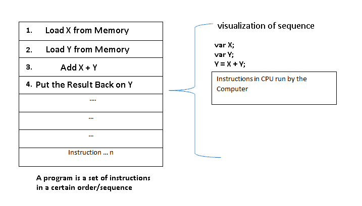
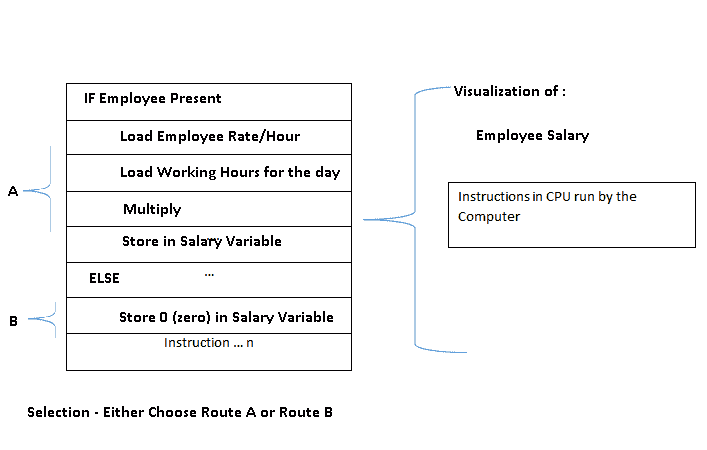
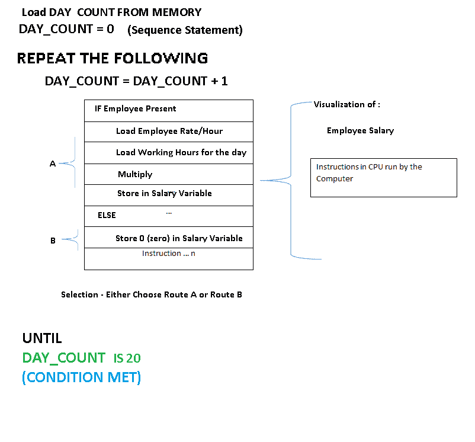
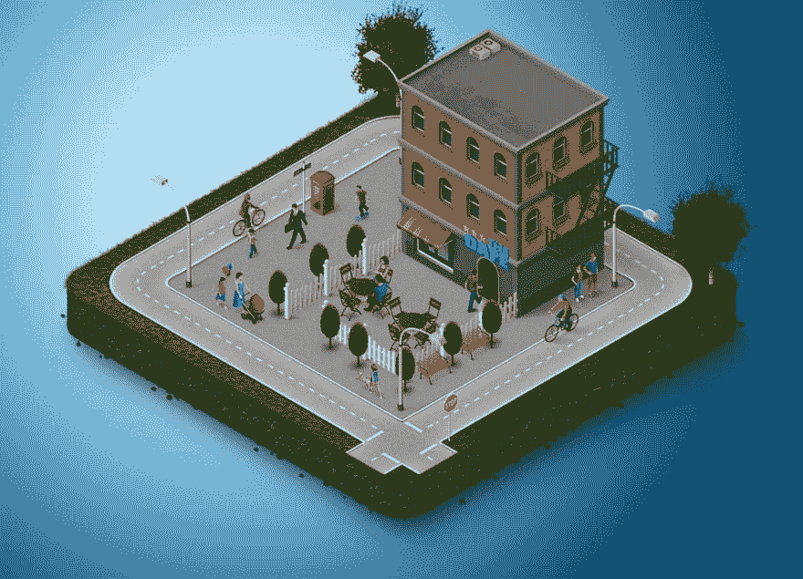

# 面向初学者的编程结构

> 原文：<https://dev.to/lucpattyn/programming-constructs-for-beginners--jae>

*上一篇文章([https://dev . to/lucpattyn/basic-programming-concepts-for-初学者-2o73](https://dev.to/lucpattyn/basic-programming-concepts-for-beginners-2o73) )讨论了变量如何驻留在内存中，它们如何被引用和用于基本操作，以及最终被赋值或覆盖。考虑到是地下室，是时候去一楼和更高的楼层了..*

[T2】](https://res.cloudinary.com/practicaldev/image/fetch/s--IYevXKgO--/c_limit%2Cf_auto%2Cfl_progressive%2Cq_auto%2Cw_880/https://thepracticaldev.s3.amazonaws.com/i/bmr8mqwbg62modu7fbzf.jpg)

## 编程结构

回想一下上次，程序是计算机执行的一组指令。但我没有详细说明他们将被执行的命令。这是编程结构发挥作用的地方。它们用于控制指令执行(或不执行)的顺序/流程。在编程语言中，翻译成指令的表达式被称为编程语句或简称语句。

有许多公认的基本编程结构，可以分类如下:

1)序列(第一层)
2)选择(第二层)
3)重复(第三层)

我们还可以添加例程调用(如第四层)。但是让我们暂时坚持第一、第二和第三。

我使用了“楼层”的概念来帮助你更好地想象如何去构建一个程序。

记住上次的内容——程序是加载到 CPU 中的一组指令，CPU 执行这些指令以获得结果。让我用
*来重新表述一下，程序是加载在 cpu 中的一组指令，CPU 按照一定的顺序(或者当你有不止一个 CPU 时按照一定的顺序)执行这些指令以达到一个结果*

现在继续..

## 1.顺序

序列结构告诉 CPU(处理器)接下来要执行哪个语句。默认情况下，在流行的语言中，这是程序中当前语句或第一条语句之后的语句。换句话说，这是编写程序的最基本的结构。你只需要一行一行地写下你心中所想(当然与编程有关)。

[T2】](https://res.cloudinary.com/practicaldev/image/fetch/s--jT9Oqg6x--/c_limit%2Cf_auto%2Cfl_progressive%2Cq_auto%2Cw_880/https://thepracticaldev.s3.amazonaws.com/i/obqvag8n61tuvce59ys8.png)

<small>除了默认序列，有些语言支持“goto”语句跳过某些语句，跳转到完全不同的一组语句；然而，这是非常令人沮丧的。如果热心的读者已经很好地理解了其他编程结构，他们可以在网上查找。</small>

## 2.选择

选择语句提供了选项之间的选择，如指令执行的可用路由选项中的选项。一个程序可以根据情况选择特定的路线，选择语句有助于在路线之间进行选择。

例如，
在一个工厂，如果一个员工在场那么计算 8 个小时的工资，
否则不计算工资，只放一个大零(没有工作就没有 doe)。

因此，根据雇员的状态(是否在场),您要求程序做两件事之一——a)当雇员在场时计算工资，b)当雇员不在时，将工资设为 0，处理器将选择“路径 a”或“路径 b ”,而不是两者都选。

这是一个选择的例子，下面有一点说明:

[T2】](https://res.cloudinary.com/practicaldev/image/fetch/s--trT14u0v--/c_limit%2Cf_auto%2Cfl_progressive%2Cq_auto%2Cw_880/https://thepracticaldev.s3.amazonaws.com/i/7lobdqoi1uv572qbmymg.png)

现在开始重复..

## 3.重复

重复结构导致一组一个或多个程序语句被重复调用，直到满足某个结束条件。

还是坚持工资案吧，尽量给一整月的工资。为了简单起见，让我们假设一个月有 20 个工作日，我们必须计算员工整个月的工资。

由于我们已经根据员工的出勤情况计算了 1(一)天的工资，我们重复同样的过程 20 天，然后我们已经计算了员工整个月的工资。简单(！)不是吗？

在这种情况下,“满足某些结束条件”指的是我们是否已经*重复了相同的指令序列*或*重复了* 20 次。我们也使用术语“循环”来代替重复或迭代。
(这里 20 天需要 20 次迭代)。

所以整个过程在下面的一个可视化中:

[T2】](https://res.cloudinary.com/practicaldev/image/fetch/s--qO5djBFy--/c_limit%2Cf_auto%2Cfl_progressive%2Cq_auto%2Cw_880/https://thepracticaldev.s3.amazonaws.com/i/ebiaw18wnm51np5fowji.png)

请注意，我们几乎无缝地从一个楼层移动到下一个楼层，从零开始(基本编程概念)。第一层是正常事情一件接一件发生的地方，在这里我们只有一个基本流程- *一个接一个的陈述*。

然后我们去二楼，在那里计算当天的员工工资。在这一层，我们学习了如何在计算工资和跳过工资之间做出选择- *在特定条件下选择正确的道路*。

最后到第三层，这里发生了一件非常重要的事情。在那里，*重复*前面几层的经验(采取的步骤)，我们实际上开发了一个完整的工作流程，在这个流程中，员工的工资是在(20 个工作日)月末计算和发放的。

[T2】](https://res.cloudinary.com/practicaldev/image/fetch/s--li9k4feh--/c_limit%2Cf_auto%2Cfl_progressive%2Cq_auto%2Cw_880/https://thepracticaldev.s3.amazonaws.com/i/uppz8ul5yb0hfmphz5ev.jpg)

信不信由你，我们刚刚跨过了编程的本质-

1.  一个接一个地下达指示
2.  基于特定条件选择特定路径
3.  一遍又一遍地重复/循环前面的步骤，直到我们达到某个结果。

现在记住这一点，如果你开始从互联网上寻找代码，希望你能理解其中的一些，假设你学习了你感兴趣的语言的基本结构。

快乐编码。

这是我侄女阿娜系列文章的第二篇。她刚刚完成高中学业。她和那些十八九岁的孩子一起给出了判断——这种方法很容易理解编程的意义。然而，评论和建设性的批评总是受欢迎的..T3】

## 致谢:

[https://CGI . CSC . liv . AC . uk/~ Frans/old readings/2c 45/Prog con/Prog con . html](https://cgi.csc.liv.ac.uk/%7Efrans/OldLectures/2CS45/progCons/progCons.html)

## 历史:

文章首次发布-2018 年 3 月 31 日