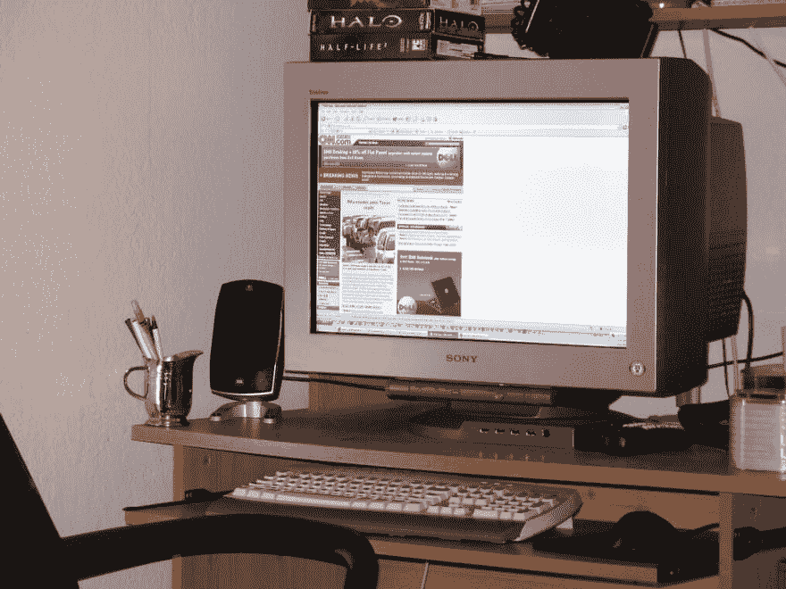
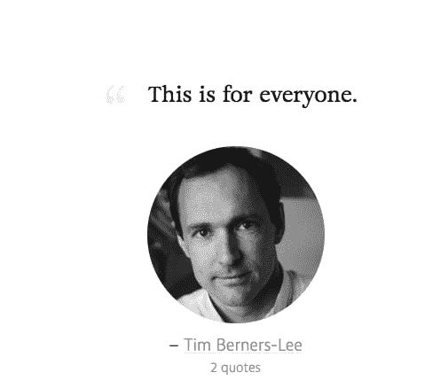

# 渐进增强是没有商量余地的。

> 原文：<https://dev.to/pixeline/progressive-enhancement-is-non-negotiable--1g57>

早在 1997 年，当我有了一个合适的(ISDN！我在一家欧洲大公司的第一个办公室职位上的关系。这是 FrontPage 女士的时代。我建立的网站是一堆可怕的代码，混杂着低劣的 html 和微软的史前版 Javascript 的一些专有版本。

浏览器大战正在激烈进行，网景公司显然是领先者。几乎只有一种屏幕标准:1024x768 分辨率取代了传统的 800x600。它看起来很大！屏幕是笨重的模拟监视器。当然，我们用了`<table>`和 loads 的 1px 见方的透明 gif 文件作为间隔器来做界面，由 print(！)设计师。

除了像纵火狂一样编码别无选择。

[T2】](https://res.cloudinary.com/practicaldev/image/fetch/s--YrkGGVpL--/c_limit%2Cf_auto%2Cfl_progressive%2Cq_auto%2Cw_880/https://thepracticaldev.s3.amazonaws.com/i/4vkx991cgq3t1xkqann2.jpg)

21 年后，这是 2018 年。我们仍然建立静态网站(几年前没有动态网站几乎被认为是过时的),但也建立 SPA(单页应用程序)和渐进式网络应用程序。虚拟现实正在成为主流。冰箱自动从网上乳制品商店订购明天的牛奶。html、css 和 javascript 的标准已经出现。构建一个东西并把它放到网上从来没有这么容易过。

然而，关掉 javascript，一半的互联网就中断了。因为“很酷的 javascript 框架”允许几乎任何人快速构建东西，甚至不需要理解底层架构，或者 JS 框架的目的:SPA，而不是表示性的网站。

通常情况下，对开发人员来说“快”意味着对最终用户来说“坏”。

作为开发人员，为了保持我们放在网上的信息的普遍可访问性(以及我们存在的理由)，我们需要重新声明渐进增强方法。以下是几个原因:

## 1。这对用户来说是好的

*   残疾人，对他们来说，静态渲染和整页重新加载通常更容易(不是唯一的，而是更多，更容易)获得。
*   搜索引擎蜘蛛(据说 GoogleBot 解析 javascript，但是到底有多好呢？Google 不推荐只有 js 的接口，所以，就是这样)

## 2。这对开发商来说是好事

*   这并不难:`html.js`技巧使得编写的 CSS 只适用于支持 javascript 的上下文。Javascript 框架？至少使用`<noscript>`标签，这样每个人(包括 GoogleBot)都可以访问你的内容。
*   这并不昂贵，相反:您赢得了时间，因为您的代码更易于维护和调试。谢谢[分离小姐的关心](https://en.wikipedia.org/wiki/Separation_of_concerns#HTML,_CSS,_JavaScript)。
*   你不知道两年后你的代码会在什么设备上运行。打造“经得起未来考验”的数字产品，而不是被下一波浪潮摧毁的沙堡。

## 3。这就是互联网诞生的原因。

[T2】](https://thatsthespir.it/quote/view/188)

## 4。只需几分钟就能掌握。

这是我在 BeCode 为我的糟糕的初级开发人员做的演示。浏览一下。

[T2】](https://app.ludus.one/8c042d9a-e404-4df5-b14e-48e3eb6e6014)

还不相信吗？越过这个 [Reddit 线程](https://www.reddit.com/r/webdev/comments/48z7jz/do_you_take_into_account_those_who_disable/)。

我把最后的决定权留给**谢宛婷** (Shopify) ( [来源](https://www.shopify.com/partners/blog/what-is-progressive-enhancement-and-why-should-you-care)

> 考虑到事物变化的速度有多快，以及每年有多少新设备出现，我们必须继续构建能够扩展、改变和采用新功能的网站和应用程序。为了做到这一点，并继续确保所有人都可以访问网络，我们需要确保逐步增强是我们所做一切的核心。