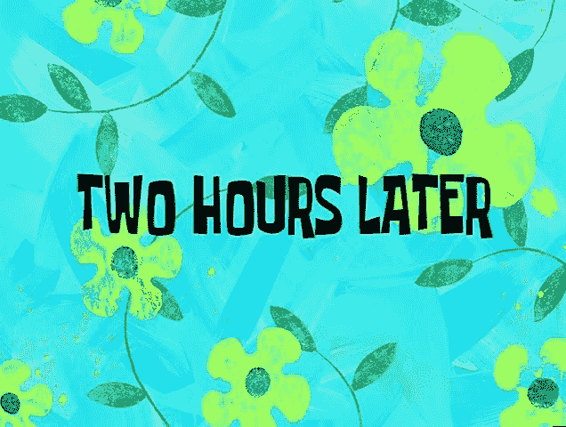
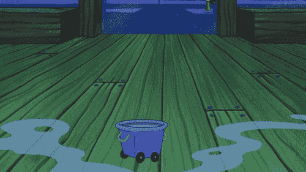

# React 中的渐进图像

> 原文：<https://dev.to/bryce/progressive-images-in-react-iph>

几乎数字出版物网站上的每一篇文章都会有一张图片。其中大多数都有多个图像。有时 10，20...30...💤

[T2】](https://res.cloudinary.com/practicaldev/image/fetch/s--DsBrxxiP--/c_limit%2Cf_auto%2Cfl_progressive%2Cq_auto%2Cw_880/https://thepracticaldev.s3.amazonaws.com/i/6cwjucjndxb0k1ihyzk5.jpg)

#### 所以要懒！

延迟加载图像以减少加载时间并不是什么新鲜事。人们利用不同的概念提出了不同的实现，但目标是相同的:尽可能快地加载页面，同时最小化对 UX 的影响。

本演练将(希望)让您了解以性能方式加载图像的方式，类似于 [Medium](https://jmperezperez.com/medium-image-progressive-loading-placeholder/) 加载图像的方式。它假设您对 React 有基本的了解，并且服务器端呈现的组件在客户机上是由 javascript 包提供的。

# 渲染服务器❄️上的静态组件

让我们制作一个可以渲染两幅图像的基本组件，稍后我们会在这两幅图像之间进行切换:

```
const BlurredImg = styled.img`
    filter: blur(6px);
    transition: opacity 0.2s ease-in;
`;

const smallImageUrl = `www.images.com/low-quality/${this.props.id}.${this.props.format}`;
const fullImageUrl = `www.images.com/high-quality/${this.props.id}.${this.props.format}/`;

return (
    <React.Fragment>
        <BlurredImg src={smallImageUrl} data-id={this.props.id} data-format={this.props.format} />
        {this.props.pageLoaded && }
    </React.Fragment>
); 
```

Enter fullscreen mode Exit fullscreen mode

*如果你不熟悉[样式组件](https://github.com/styled-components/styled-components)，那么`styled`语法本质上是围绕着`img`标签的 CSS 块。*

`pageLoaded` prop 将阻止更高质量的图像在服务器上呈现。以后补水的时候我们会把这个设置成`true`。

`BlurredImg`元素做两件事:

*   1.渲染图像的低质量版本，带有模糊
*   2.将 [`data`属性](https://developer.mozilla.org/en-US/docs/Learn/HTML/Howto/Use_data_attributes)暴露给 DOM*

*因为服务器返回的是原始 HTML，我们用来渲染组件的道具会丢失。你如何选择在服务器和客户端之间保持道具的一致性取决于你；这个实现将依靠数据属性来保持简单。或者，您可以传递一个以 image `id`为关键字的数据块，等等。

# 客户端上的水合物组分💧

[T2】](https://res.cloudinary.com/practicaldev/image/fetch/s--SA1yC6l6--/c_limit%2Cf_auto%2Cfl_progressive%2Cq_66%2Cw_880/https://thepracticaldev.s3.amazonaws.com/i/pzru8avly79ho8vkm7rq.gif)

对组件进行水化处理可以让它加载更高质量的图像来替换模糊的版本。前面说过，道具是由数据属性决定的:

```
const imageElement = document.querySelector('.lazy-image-wrapper');

ReactDOM.hydrate(
    <ProgressiveImageExample
        id={imageElement.dataset.id}
        format={imageElement.dataset.format}
        pageLoaded={true}
    />,
    imageElement
); 
```

Enter fullscreen mode Exit fullscreen mode

注意`pageLoaded`现在是`true`，这使得真正的``能够加载。但是即使加载了另一个，模糊的图像仍然显示...

# 交换图像🌃🤝🏞

这引入了需要`state`的复杂性，所以我们需要将它添加到构造函数中:

```
constructor(props) {
    super(props);

    this.state = {
        imageLoaded: false
    };
} 
```

Enter fullscreen mode Exit fullscreen mode

并更新我们的组件，使其更加全面:

```
const BlurredImg = styled.img`
    filter: blur(6px);
    opacity: ${props => props.shouldBeVisible ? 1 : 0};
    transition: opacity 0.2s ease-in;
`;

return (
    <React.Fragment>
        <BlurredImg 
            src={smallImageUrl} 
            data-id={this.props.id} 
            data-format={this.props.format} 
            shouldBeVisible={!this.state.imageLoaded} 
        />
        {this.props.pageLoaded && }
    </React.Fragment>
); 
```

Enter fullscreen mode Exit fullscreen mode

注意`onLoad`处理器——这表示真实的图像准备好了&我们可以淡出模糊的图像:

```
handleImageLoaded = () => {
    this.setState({
        imageLoaded: true
    });
} 
```

Enter fullscreen mode Exit fullscreen mode

太好了！所以我们在最初加载页面后加载图像。但是这仅仅让我们走了一大段路，因为它们都将在水合作用后立即加载(对于页面上的所有图像)。那我们该怎么办？

# 跟踪能见度🔎

[T2】](https://res.cloudinary.com/practicaldev/image/fetch/s--KmwiomCD--/c_limit%2Cf_auto%2Cfl_progressive%2Cq_66%2Cw_880/https://thepracticaldev.s3.amazonaws.com/i/d9t558qjq9l6n26bwskk.gif)

[react-on-screen](https://github.com/fkhadra/react-on-screen) 库创建了一个简单的高阶组件来完成这项工作，并向该组件传递了一个`isVisible` prop。但是任何视口内可见性跟踪器都可以。由于这引入了另一个`state`，我们需要将`{ imageSeen: false }`添加到初始状态。

然后，我们可以观察更新的道具，并在图像已经在视窗中时将`imageSeen`设置为`true`，防止它在组件滚动到屏幕外时再次被加载:

```
componentDidUpdate() {
    if (!this.state.imageSeen && this.props.isVisible) {
        this.setState(prevState => ({
            ...prevState,
            imageSeen: this.props.isVisible
        }));
    }
} 
```

Enter fullscreen mode Exit fullscreen mode

现在你知道了！一个快速、高效并且一点也不蹩脚的图像渲染组件！