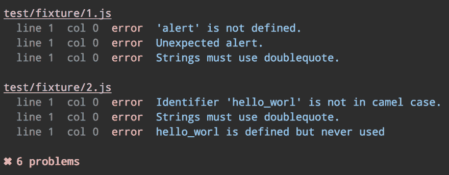

# 渐进式 JavaScript 林挺

> 原文：<https://dev.to/kbariotis/progressive-javascript-linting-ghi>

林挺和自动格式化在 JavaScript 开发人员中是一个众所周知的过程，尽管由于缺乏一个标准的工具，很多人并不知道它。当 linter 分析您的代码并警告您潜在的问题时，格式化程序可以根据您的偏好自动格式化它。

[T2】](https://res.cloudinary.com/practicaldev/image/fetch/s--a6s4IIxw--/c_limit%2Cf_auto%2Cfl_progressive%2Cq_auto%2Cw_880/https://raw.githubusercontent.com/kbariotis/kostasbariotis.com/master/src/pages/progressive-linting/eslint-example.png)

很多时候，我不得不处理缺少适当的样式指南和规则的 JavaScript 代码库。整个项目的编码风格是不同的，未使用的或隐含的全局变量和未使用的必需依赖到处都是。

在这篇文章中，我将分享我的计划，关于如何添加一个适当的工具链和一个过程到一个代码库中，这个代码库除了以一种受控的和渐进的方式做之外别无其他。我将使用 [ESLint](https://eslint.org) 作为 linter，使用[pretty](https://prettier.io)作为格式化程序(但是作为 ESLint 的一个插件),使用推荐的规则集。ESLint 已经走了很长的路，并且有很多插件被社区广泛采用。较美丽...嗯，比 ESLint 的[修复模式好看。](https://eslint.org/docs/user-guide/command-line-interface#--fix)

## 问题

当我第一次面对一个情况时，我想到的第一件事是停止一切，专注于添加一个 linter，修复和重构整个代码库。我立即放弃了这个选择。

虽然重构很有趣(至少对我来说)，但没有人真的喜欢长时间这样做，更不用说我们不能不顾一切地停止向客户发布功能。代码库越大，对其进行整体重组的时间就越长。

但是，即使我们有这样做的奢侈，代码库中的主要变化可能会导致意想不到的行为，这可能会导致严重的错误，这肯定会导致在调试中浪费大量的时间。

> ...因为每次重构都很小，所以出错的可能性更小。在每一次小的重构之后，系统也保持完全工作，减少了系统在重构过程中被严重破坏的机会。

在我脑海中有了 Martin Fowler 的声明[,我提议开始逐步修复代码，只重构我们每个团队成员工作的每个特性分支上受影响的代码。](https://refactoring.com/)

通过这种方式，我们可以完全控制那些会破坏我们代码的变更，并且在它们发布之前修复它们。

## 计划

简单。我们将首先讨论并同意(如果在团队中)我们想要遵循的样式指南，然后为我们的工具放置一个配置文件。

然后我们想运行这个过程一次，让格式化程序修复简单的部分(缺少空格、分号等)..)希望这些变化不需要人为干预。

最后一部分将设置一个预提交 git 挂钩，该挂钩将触发林挺，如果没有通过就拒绝提交。这样我们就可以确保没有“坏”代码进入代码库。

让我们从安装依赖项开始:

`npm i --save-dev eslint prettier eslint-config-prettier eslint-plugin-prettier`

然后添加包含内容的`.eslintrc`文件。这只是一个示例设置，我是为了简单起见而入侵的。它遵循了 ESLint 推荐的规则，并且还进行了更漂亮的扩展，以便与 ESLint 无缝协作。最后，我添加了一些自定义规则。

```
{  "extends":  [  "eslint:recommended",  "plugin:prettier/recommended"  ],  "parserOptions":  {  "ecmaVersion":  6  },  "rules":  {  "prettier/prettier":  [  "warn",  {  "singleQuote":  true,  "trailingComma":  "es5",  "printWidth":  100  }  ]  }  } 
```

Enter fullscreen mode Exit fullscreen mode

该配置应用了 ESLint 推荐的一组规则和更漂亮的插件，它们将覆盖 ESLint 的格式规则，并在 ESLint 运行时运行得更漂亮。然后我们覆盖漂亮的默认规则，以符合我们的喜好。

现在我们的配置已经就绪，让我们运行它，看看效果如何。将这个添加到您的`package.json`(我们稍后会用到)并运行`npm run lint`。

```
{  ...  "scripts":  {  "lint":  "./node_modules/.bin/eslint --ext .js --ext .jsx src",  }  ...  } 
```

Enter fullscreen mode Exit fullscreen mode

如果一切顺利，你会在你的控制台上看到一堆错误，但你也会注意到更漂亮的代码格式！

现在你有工作要做了。首先，运行您的测试和/或进行一些手动测试，以确保一切都像以前一样工作。然后，检查控制台中的错误，确保您对它们满意。记住他们不会永远呆在那里。样式指南可以改变和适应，所以不要浪费时间去弄清楚特定的边缘情况。

完成后，提交所有的更改，因为这将是您最后一次提交代码库中有错误的代码。

现在我们想设置 linter，使其只在修改后的文件上运行预提交。让我们再次安装一些依赖项来帮助我们做到这一点。

`npm i --save-dev husky lint-staged`

然后修改你的`package.json` :

```
{  ...  "scripts":  {  "precommit":  "lint-staged",  },  ...  "lint-staged":  {  "*.{js,jsx}":  [  "./node_modules/.bin/eslint --fix",  "git add"  ]  }  ...  } 
```

Enter fullscreen mode Exit fullscreen mode

[Husky](https://github.com/typicode/husky) 将添加`precommit`脚本作为 Git 的预提交钩子。每次你要提交一堆文件时，都会运行 [lint-staged](https://github.com/okonet/lint-staged) ，它会依次列出所有当前暂存的文件，并对每个文件运行 ESLint。如果一个失败了，钩子也会失败。

现在尝试修改一个文件并提交它。Husky 将仅对您尝试修改的文件运行预提交挂钩。除非上面说了，否则你不能承诺。

## 结果

这个计划非常有效，几个星期后，整个代码库彻底改变了。在编写代码时，我们没有费心去格式化我们的代码，并且我们可以确信在每次提交时，我们没有忘记在使用变量之前初始化它。

处于类似的位置你会怎么做？