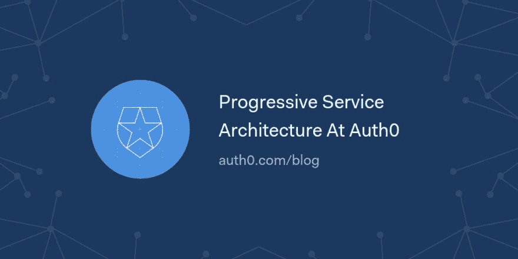

# Auth0 处的渐进式服务架构

> 原文：<https://dev.to/auth0/progressive-service-architecture-at-auth0-4al2>

在这篇博文中，我们将讨论由 Hernán Meydac Jean 领导的 Auth0 Site Reliability 团队如何使用渐进式方法来构建一个以高可用性和可靠性为特征的成熟服务架构。

在 Auth0，我们为客户管理不同的功能。我们使用特性标志在不破坏任何东西或改变代码的情况下将特性添加到代码库中。根据 Pete Hodgson 的定义，特性标志或特性切换是一种灵活而强大的技术，允许开发人员在不改变代码的情况下修改系统的行为。特性标志允许开发团队在系统中打开和关闭特性，即使是在产品化之后。

[读下去🏛](https://auth0.com/blog/progressive-service-architecture-at-auth0/?utm_source=dev&utm_medium=sc&utm_campaign=aueng_psa)

[T2】](https://res.cloudinary.com/practicaldev/image/fetch/s--3XXmQrhy--/c_limit%2Cf_auto%2Cfl_progressive%2Cq_auto%2Cw_880/https://thepracticaldev.s3.amazonaws.com/i/8125biu0z8ig8j59wuvd.png)