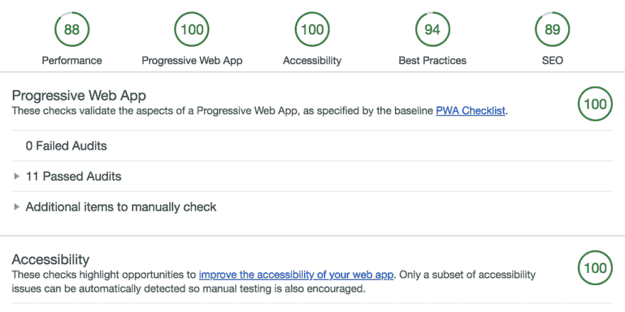
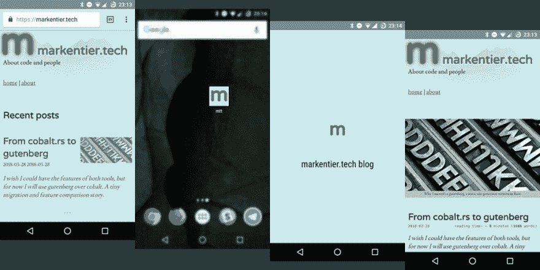

# 渐进式网络应用

> 原文：<https://dev.to/asaaki/progressive-web-app-nfi>

markentier.tech 现在也是一个进步的网络应用。这是什么意思，为什么 PWAs 这么酷？主要原因:关乎速度！

> 渐进式 web 应用程序(PWAs)是常规网页或网站的 Web 应用程序，但可以像传统应用程序或本地移动应用程序一样出现在用户面前。应用程序类型试图将大多数现代浏览器提供的功能与移动体验的优势结合起来。
> — [维基百科:渐进式网络应用](https://en.wikipedia.org/wiki/Progressive_Web_Apps)

我已经很久没有真正关注过**渐进式网络应用**(简称:`PWA`)的发展了。我想我最后一次围绕这个话题做实验是在*应用缓存*(或者 [AppCache](https://www.html5rocks.com/en/tutorials/appcache/beginner/) )还是一个东西的时候。所以是的，很久以前。

我已经忘记了网站/应用程序优化，只是因为我多年来没有真正的网站来建立和维护。我拥有的网站要么被废弃，要么我不太关心它们的性能。

很多人可能会问的第一个问题是:

### 既然我要做的只是一个静态网站，为什么还要费心去读它呢？

好吧，如果你真的关心网络性能和速度，你可能要考虑所有可用的工具。

如果你完全控制了输出(HTML，CSS，JS，图片，字体，...)你已经有很多机会了。您可以最小化和压缩文件。HTML、CSS 和 JavaScript 的东西相当容易，因为它们都存在在线服务或 CLI 可执行文件。

但是不要忘记你的资产，比如图像(和音频/视频，如果你自己托管的话)，它们中的大多数可以做得更小。PNG 和 JPEG 仍然是最常用的图像文件格式(嗯，还有动画的 gif)， [WebP](https://developers.google.com/speed/webp/) 是有的，但我还没有真正看到认真的用法。每种格式通常支持无损和/或有损压缩。我仍然更喜欢 PNG 作为我的标准图像格式，我喜欢有工具帮助我挤出最后一点点来获得一个非常小的文件大小。

### 用于缩小和压缩的工具

在我开始 PWA 部分之前，让我们来看看可以(并且应该)做些什么，不管你有什么样的网站。

#### HTML

到目前为止，我在这里只提到我的首选工具: [tidy-html5](http://www.html-tidy.org/) 。我[在我的上一篇文章](https://dev.to/posts/2018/03/from-cobalt-to-gutenberg/#tidy-html5)中做了进一步的阐述，当时我写了关于改变我的静态站点生成器。

另一方面，对于胖站点来说，HTML 页面的臃肿和空白可能不是最大的问题。

#### 样式表(CSS)和 JavaScript (JS)

与其推荐一个特定的工具，我宁愿指向像 [webpack](https://webpack.js.org/) 、 [parcel](https://parceljs.org/) 这样的项目，或者你最喜欢的静态站点生成器。此外，如果你使用像 [Netlify](https://www.netlify.com/) 这样的服务，你可以启用资产优化，他们会为你处理字节运算，这同样适用于

即使你使用 WordPress，我知道人们已经编写了很好的插件来帮助你完成这样的任务。没有人需要再手工操作了。图像也是如此，但出于某些原因，我将它单列一节:

#### PNG 等图片

虽然像 Netlify 这样的服务声称支持图像压缩，但我很肯定他们会在更快地发布和交付网站方面做出权衡。由于图像是页面总重量中最大的一块，我认为它们应该得到更多的关注。

首先，你知道你已经需要什么尺寸了吗？不要简单地把你想要的图片原封不动地放到你的博客文章中。除非你总是选择太小的图像，否则你可能会嵌入太大的文件。当阅读你的文章时，没有人真的需要那张 3000x5000 的照片。如果您想为他们提供原始文件供以后使用，请提供一个下载链接。因此，根据您的需要调整图像的大小。考虑所有常见的表示层。大多数人可以接受 1024 像素的最大高度或宽度，根据你的主题，你甚至可以使用更小的默认尺寸。

*我使用的长宽比是`2:1`，所以我的默认图像尺寸是`1024x512`，用于我的封面和其他图像。我使用这个最大值作为缺省值，即使我的文章正文宽度有点小。原因是封面图片也用于[推特卡](https://developer.twitter.com/en/docs/tweets/optimize-with-cards/overview/abouts-cards)(和脸书)展示。两个平台要么支持要么建议更大的尺寸，但现在我认为这是多余的。*

如前所述，我喜欢 png，尽管 JPEG 格式的照片可能更适合。无论如何，有很多工具可以优化 PNG。

最知名的是 [ImageMagick](http://www.imagemagick.org/) ，可以用于很多不同的图像格式。我特别用它来调整大小和生成我的封面图片的缩略图。缩小到可见的渲染尺寸已经节省了大量的字节，因此也节省了带宽！

说到缩略图，我更进一步，因为它们不仅尺寸小，而且高度缩小和压缩，因为它们充当视觉挂钩，但不需要是有史以来最漂亮的照片。

因此，用 [pngquant](https://pngquant.org/) 减少调色板是一件好事；熟悉 GIF 优化的人现在知道这已经很有帮助了。

第二步通过[选项](http://optipng.sourceforge.net/)完成。 *pngquant* 已经可以做很多繁重的工作了，所以也许同伴事后没有那么多，但也许它会找到一个文件做进一步优化。

最初我也有 [pngcrush](https://pmt.sourceforge.io/pngcrush/) 在管道中，但是在检查了文件的实际字节大小后，我发现它后来大部分都增加了；我删除了它，因为我对内容的去优化不感兴趣。😅

对于 GUI 爱好者来说，macOS 用户有一个方便的工具: [ImageOptim](https://imageoptim.com/mac) 。这适用于一系列图像文件格式，并且使用了相当多的工具。

### 缓存

最小化和压缩只是一个快速服务网站的开始。一旦所有的文件都上传到服务器上，等待被传送到世界各地，它们也不会经常改变。尤其是包含所有资产的非常静态的页面不太可能发生变化(比如博客帖子和 about 和 imprint 页面)。

因此，为了防止每个请求的所有位和字节不断流动，我们希望缓存它们，并且理想情况下尽可能靠近用户，以便下次他们请求完全相同的数据时，他们可以从他们的设备获得服务。对于像 CSS 和 JS 这样在整个站点共享的重复使用和请求的文件，这变得非常高效。同样，你的 logo 和标题图片也不需要每次都这样移动。

顺便说一下，中间步骤是服务器端缓存和 cdn，但我现在不关注这个。

另外:缓存本身是一个棘手的问题，应该有自己的文章。

一般来说,[缓存控制头](https://developer.mozilla.org/de/docs/Web/HTTP/Headers/Cache-Control)是一个很好的起点，它帮助浏览器决定应该把什么样的文件保存在手边以及保存多长时间，而不是从互联网上获取。

[T2】](https://res.cloudinary.com/practicaldev/image/fetch/s--kQko4qbz--/c_limit%2Cf_auto%2Cfl_progressive%2Cq_auto%2Cw_880/https://markentier.tech/posts/2018/04/progressive-web-app/google-lighthouse-report.png)

### 下一级:渐进式网络

虽然我已经听说过*渐进式网络应用*，但我从来没有关注过它。一旦我想出了一个 web 应用程序项目，我肯定会认为研究这个主题可能会很酷。一个静态网站绝对不是一个触发器。我大错特错了。

当我在谷歌 Chrome 开发者工具中运行**审计**工具时，我不知道这个[灯塔](https://developers.google.com/web/tools/lighthouse/)是什么东西。我记得在以前的 Chrome 版本中，有一个*页面速度洞察*标签，这个标签已经被废弃，现在只作为 [web 服务](https://developers.google.com/speed/pagespeed/insights/)提供。它本身仍然是一个有用的工具。但是 **Lighthouse** 提供了更多的性能和优化数据。

所以当报告生成时，我有点困惑，它有这个*渐进式网络应用*部分。当然，一些网站可能需要这些信息，但是整个互联网不仅仅是关于动态应用的，不是吗？

好了，是时候再次深入这个先前被忽视的话题了。我阅读并了解了 [Web 应用清单(manifest.json)](https://developer.mozilla.org/de/docs/Web/Manifest) 和 [PWA 清单](https://developers.google.com/web/progressive-web-apps/checklist)。

基线的一个重要步骤是:

> 离线时加载所有应用程序 URL

建议通过这样做来修复它:

> 请使用维修人员。

哦，我也读过关于他们的文章，但是出于同样的原因，我也忽略了这个话题。如果你想知道你能用它们做什么，请查看

作为一个初学者，我选择了谷歌提供的非常简单的设置。而且还会进一步迭代。告诉我，如果有些事情做得不好，或者网站只是看起来很丑(无风格)。

酷的是，它不仅使你的网站运行更快，缓存项目，而且还提供离线功能。

[T2】](https://res.cloudinary.com/practicaldev/image/fetch/s--j9Y-M0wi--/c_limit%2Cf_auto%2Cfl_progressive%2Cq_auto%2Cw_880/https://markentier.tech/posts/2018/04/progressive-web-app/app-screens.png)

上面的截图是一个例子，展示了如果你决定将 *markentier.tech* 添加到你的主屏幕上会是什么样子。给地址栏着色也是一个不错的花招。

到目前为止，我还不能告诉你更多关于 PWAs 的事情，因为我正在学习这些东西。

我鼓励你也研究一下这个话题。希望我给你提供了足够的链接，让你开始自己的旅程。