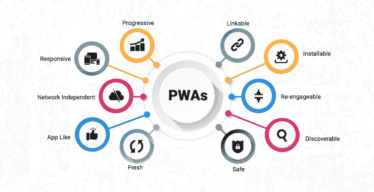
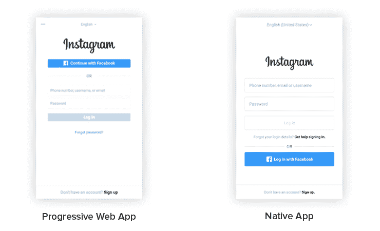
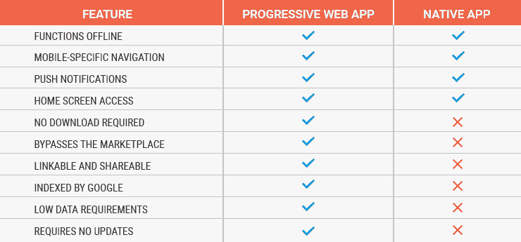
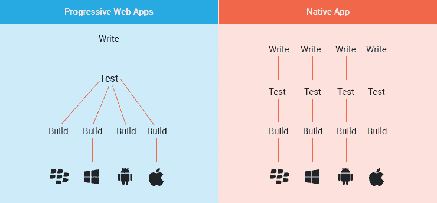

# 渐进式网络应用——模糊网络和移动应用之间的界限

> 原文：<https://dev.to/topsinfosol/progressive-web-apps---blurring-the-lines-between-web-and-mobile-apps-53i>

[T2】](https://res.cloudinary.com/practicaldev/image/fetch/s--Q7rDf_4J--/c_limit%2Cf_auto%2Cfl_progressive%2Cq_auto%2Cw_880/https://thepracticaldev.s3.amazonaws.com/i/u3yc5tqxb43ijno5ia2r.jpg)

史蒂夫·乔布斯推出了 iPhone，开启了智能手机革命，iPhone 上有一种移动浏览器，但上网体验很差。一年后，苹果推出了应用程序商店，你已经有了原生应用程序，这是一种与在线内容互动的非常好的方式，我相信在过去的 10 年里，你们都使用过大量的应用程序。

用于发送电子邮件的 Gmail 应用程序，用于发送推文的 Twitter 应用程序，以及用于发送两张自己可爱照片的 Snapchat 应用程序。谈到这些应用程序的浏览时间，我敢肯定你会花很多周甚至几个月的时间玩 Flappy Birds

自 2008 年以来，移动网络急剧增长。我确信你们中的许多人正在用 Chrome 阅读这篇文章。

什么是渐进式网络应用程序(PWA)？

这个想法可以追溯到 2015 年谷歌工程师亚历克斯·罗素写的一篇文章中。在那篇文章中，他概述了 PWA(渐进式网络应用程序)的需求。从那以后，整个行业都在朝着进步的网络应用努力。所以，谷歌 Chrome 支持它。Edge 将在 Redstone4 中支持它。甚至 Safari 也将在今年晚些时候推出 11.3 版本。

渐进式网络应用程序的独特之处在于它的能力。网络应用程序第一次可以离线并在后台工作，这是通过一个叫做服务工作者的东西来完成的。

可以把服务人员想象成在后台工作的小 web 组件。他们接收通知。他们缓存应用程序数据。他们就是这样离线工作的。当您启动渐进式 web 应用程序时，它看起来不像是在浏览器中。它看起来像一个应用程序。

[T2】](https://res.cloudinary.com/practicaldev/image/fetch/s--07gFv17V--/c_limit%2Cf_auto%2Cfl_progressive%2Cq_auto%2Cw_880/http://www.topsinfosolutions.com/wp-content/uploads/2018/07/instagram-native-and-pwas.png)

例如，Instagram 有一个 PWA。如果你在你的 Android 手机上进入 Instagram，假设这是一个现代的手机，你登录后，你会被问及是否要将它钉在你的开始屏幕或应用程序屏幕上，以及你是否希望接收通知。一旦你这样做了，然后你打开那个应用程序，它看起来就像普通的 Instagram 应用程序一样。事实上，滚动比 Android 的一个原生应用更好，这告诉了你很多东西。

**渐进式网络应用 vs 本地应用**

[T2】](https://res.cloudinary.com/practicaldev/image/fetch/s--MmmU1Smh--/c_limit%2Cf_auto%2Cfl_progressive%2Cq_auto%2Cw_880/http://www.topsinfosolutions.com/wp-content/uploads/2018/07/PWA-Features-comparison-with-Native-apps.png)

原生应用在很多领域都有巨大的优势:它们反应迅速。你有一个非常好的图标，你可以点击它。只要你点击它，你就会看到一个非常漂亮的“脚手架”应用程序屏幕。假设你去了脸书。这是一种不错的蓝色外观，你有一个脸书图标。

**原生应用的优势**

当我结束我的推特时，我有很多推文。从 Twitter 应用程序中，我可以直接看到没有进入 Chrome 并试图找到一个 URL 并加载一个页面。

应用程序也有一个平滑一致的独立用户界面，在你的智能手机上看起来非常好。最好的一点是，本地应用在离线状态下也能正常工作。

[T2】](https://res.cloudinary.com/practicaldev/image/fetch/s--pduXtLTz--/c_limit%2Cf_auto%2Cfl_progressive%2Cq_auto%2Cw_880/http://www.topsinfosolutions.com/wp-content/uploads/2018/07/PWA-vs.-Native-Apps.png)

如果你在没有盲区的情况下查看邮件，那没关系。你可以在地下室、地铁站和其他应用程序白天无法覆盖的地方查看邮件。你甚至可以回复那些邮件。当你进入覆盖区域时，它就会运行，一切都会很好。

**应用开发可能会很痛苦**

原生应用开发可能会很痛苦。Android 和 iOS 有不同的语言。你有爪哇咖啡。或许，你的潮人用的是科特林。否则，您使用的是 Swift。你可以使用 React Native，但仍然需要改变你开发一大堆东西的方式。

在 React Native 中，你必须根据你所在的平台做不同的事情，即使这样，你也必须为网络做不同的开发。你已经在为三个不同的平台开发了。开发成本很高。

如果你想在网上发布应用程序，它会直接送到你的客户那里，而本地应用程序则需要通过应用商店的认证。安卓和 iOS 都有单独的应用商店。

**进步的网络应用拯救世界...**

渐进式网络应用最大的好处之一就是它使用了网络标准技术。它使用 JavaScript。它使用 JSON。

它获得了原生应用的大部分好处，包括性能和用户界面的调整。

写一次就能到处工作。您只需构建一次，希望它在任何地方都可以工作。你有一个团队。根据目标平台的不同，您可能需要做一些调整。

**递进是什么意思？**

在过去，我们只有静态的 HTML 页面，然后 JavaScript 出现了，我们想增强我们的页面。JavaScript 可以让应用程序更快，感觉更好，但如果你不运行 JavaScript，它仍然可以工作。这是一回事。渐进式改进是一整套可以添加到应用程序中的功能。谷歌列出了一个级别，每个级别都应该改善客户的体验。如果他们的平台没有这些功能，它不应该破坏你的应用程序。

渐进式网络应用是额外技术的一个例子。它们可以提高你的应用程序的性能。随着更多的功能，桌面和网络的优势总是与原生应用相比较，但许多这些性能也在网站上。

如果你有一个网站，你真的不太关心你的移动客户，很多这些技术真的可以提高你的网站的性能。

**应用商店的发现和未来**

由于渐进式网络应用程序归根结底是网站，应用程序商店不需要出版商的许可就可以在他们的平台上发布。他们所做的只是把网站放在商店里。他们的行为很像网站目录。应用程序商店将不得不查看现在正在运行的 PWA 网站，如果它们符合某些标准，它们将自动将这些网站放入商店。因此，我们可以预计可能会有几百个甚至一千个这样的东西突然出现在商店里。

现在，由于没有钱在这里被蒸发，应用程序商店没有通过这些东西在广告上赚钱。都是从一个公司拉一个网站而已。没有理由一家公司需要它的许可。推特就是推特。如果 Twitter 想要拒绝 Windows10 上的 PWA，他们实际上是在说，你不能在你的网络浏览器上去 twitter.com，这太疯狂了。

通过把进步的网络应用程序放在商店里，它将为用户服务，但没有被发现的问题，你必须去网站，登录，然后把它钉在你的开始屏幕上。这是一件独特的事情，在未来的时间里应该会发生得更多。

渐进式网络应用现在是什么状态？

许多先进的网络应用已经出现，包括谷歌地图。你可以把它钉在你的开始屏幕上，然后有一个谷歌地图的 PWA，它使用你的位置，就像应用程序本身一样工作。

星巴克有预览版。如果你在手机上打开[app.starbucks.com](https://app.starbucks.com/)，你可以在那里看到它，登录，然后把它钉在你的开始屏幕上，那也是一个 PWA。你还有 Twitter、Instagram、Tinder、优步和 Lyft。连 Pinterest 都有 PWA。所有的大公司都接受这一点，因为公司讨厌付钱给开发者。他们宁愿只找一个网络开发人员，做一个 PWA 网站，然后收工。

未来会怎样？

我还预计会有很多银行加入进来，因为维护一个银行应用程序非常昂贵。这涉及到很多安全措施。实际上，他们需要遵守许多法律。这也是为什么 Windows 10 总是在银行应用上有问题的一个原因。维护它们非常昂贵。

但是，什么是始终保持的呢？一个银行网站。事实上，它甚至比任何 iOS 和 Android 应用程序都更早更新。因此，如果一家银行能够维护 PWA 网站，那么这对所有人都是双赢的，包括他们和他们的消费者。

[T2】](http://www.topsinfosolutions.com/inquiry/)

帖子[进步网络应用-模糊网络和移动应用之间的界限](http://www.topsinfosolutions.com/blog/progressive-web-apps-web-mobile-apps/)最初发表在 [TOPS Infosolutions](http://www.topsinfosolutions.com) 上