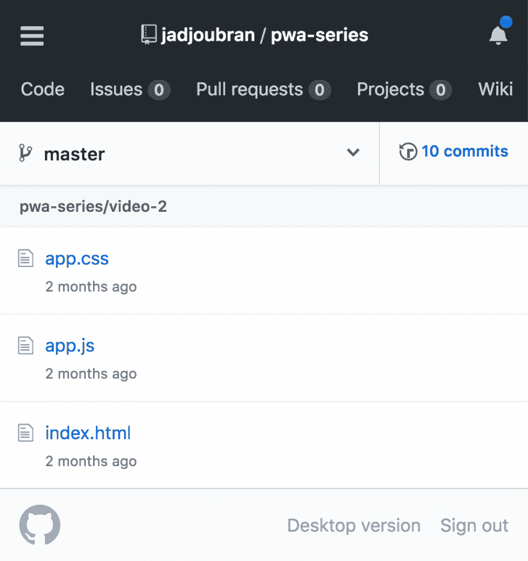
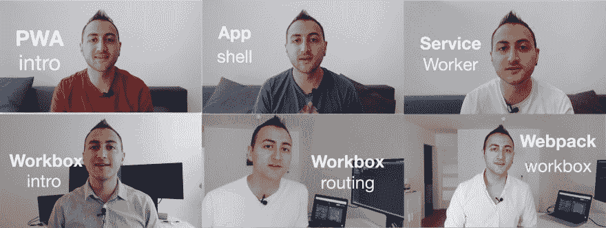

# 渐进式网络应用教程从零开始

> 原文：<https://dev.to/jadjoubran/progressive-web-apps-tutorial-from-scratch-3eim>

现代网络超级令人兴奋。由于一系列新的 web APIs，我们的 Web 开发者有了一系列全新的可能性，这些 API 被统称为渐进式 Web 应用。

当有人问我什么是 PWA 时，总是很难给出一个不包含大量技术术语的简明定义。然而，我最终得出了一个在大多数情况下都适用的定义:

> 渐进式网络应用是一个现代化的网站，能够持续提供卓越的用户体验。 ✨

我认为这适用于大多数场景的原因是，它涵盖了 PWAs 可能的大多数技术特性。这里有一个例子:
让你的网站离线工作是关于用户体验的。如果你的用户因为暂时失去连接而被离线恐龙打断，那么这是一个糟糕的用户体验。

> 一切都围绕着用户体验。

## 怎么学的？

现在最大的问题是，我们如何学习渐进式网络应用？

这就是为什么我有一个极其重要的 3 步建议:

1.  将您选择的前端框架放在一边
2.  从头开始学习渐进式网络应用程序
3.  将您在 PWAs 中学到的知识应用到您的前端框架中

前端框架很棒，但 web 平台发展如此之快，以至于我们作为 web 开发人员需要通过了解这些新的 Web APIs 如何工作来跟上它。

在这些 API 之上有一个包装器对于生产力来说是很好的，但是对于理解事物如何工作来说是很糟糕的。

[T2】](https://res.cloudinary.com/practicaldev/image/fetch/s--7AS6-8IL--/c_limit%2Cf_auto%2Cfl_progressive%2Cq_auto%2Cw_880/https://i.imgur.com/AFAHXfN.png)

这正是为什么我在 YouTube 上录制了一个免费视频系列，从头开始教授渐进式 Web 应用程序。我们从一个包含简单 index.html、app.js 和 app.css 的存储库开始，一直到构建一个简单的 PWA。

[T2】](https://res.cloudinary.com/practicaldev/image/fetch/s--S2xHslGb--/c_limit%2Cf_auto%2Cfl_progressive%2Cq_auto%2Cw_880/https://i.imgur.com/pJKxBqS.jpg)

观看[📽PWA 视频系列](https://www.youtube.com/watch?v=GSSP5BxBnu0&list=PLIiQ4B5FSuphk6P-zg_E3W9zL3J22U4dT&index=1)免费！