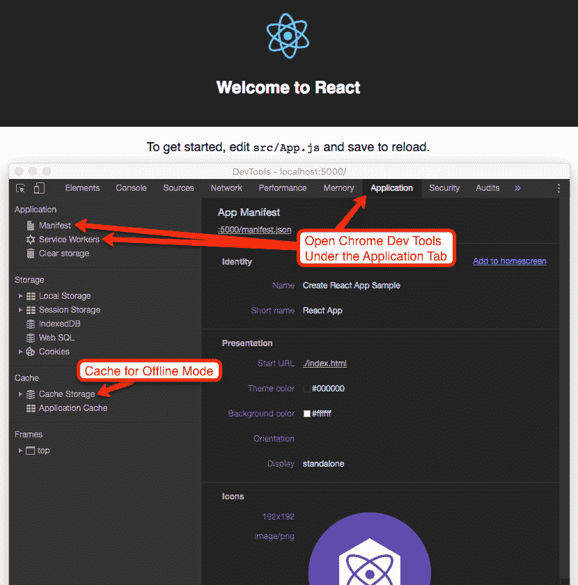
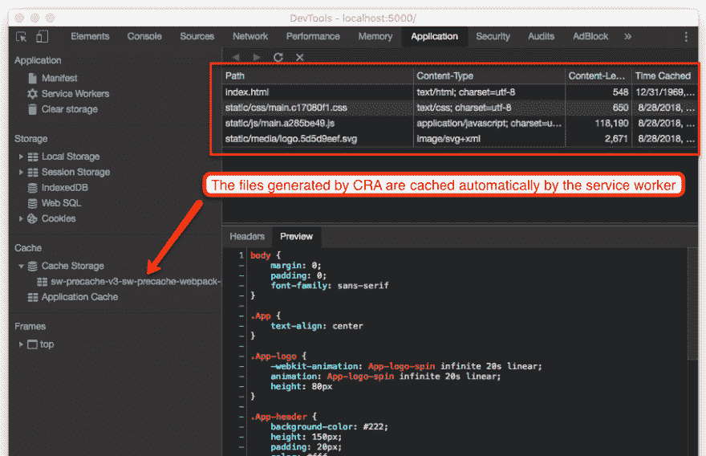
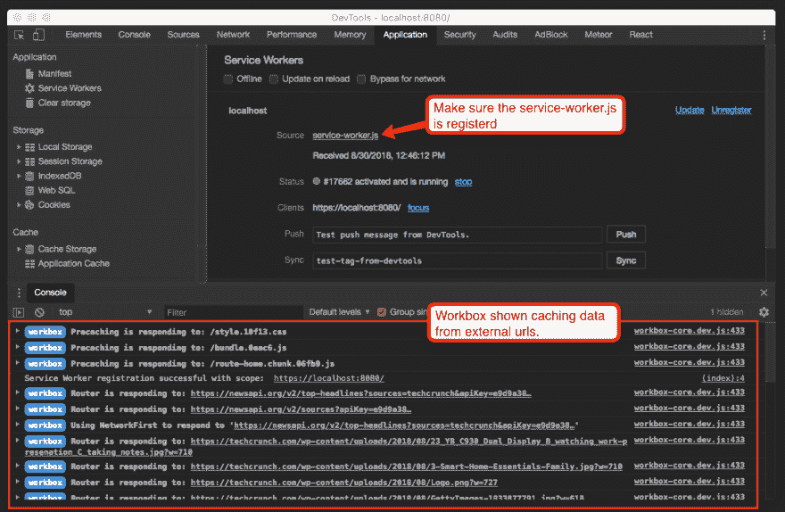
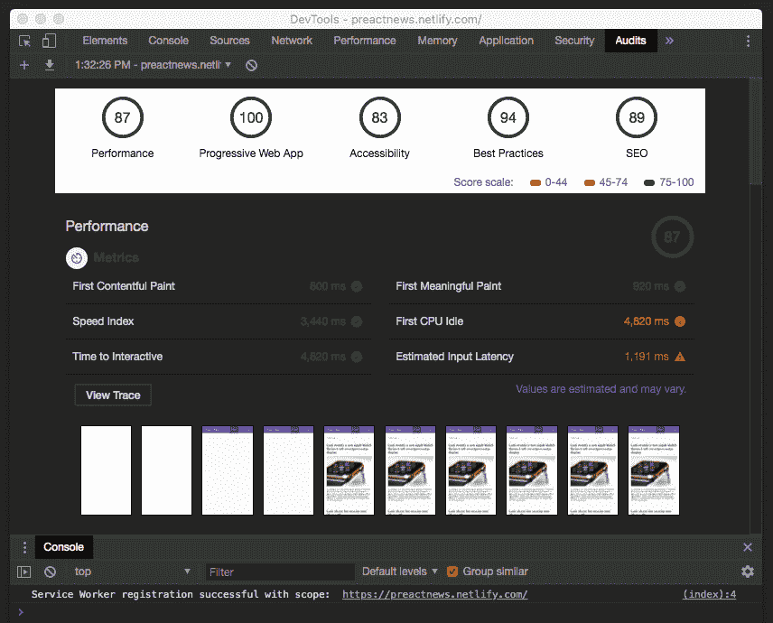

# 使用 React & Preact.js 的渐进式网络应用

> 原文：<https://dev.to/changoman/progressive-web-apps-with-react--preactjs-401m>

*本帖最初发表于[codebushi.com](https://codebushi.com/pwa-with-react-and-preact/)T3】*

[T2】](https://res.cloudinary.com/practicaldev/image/fetch/s--Jo5HOGLw--/c_limit%2Cf_auto%2Cfl_progressive%2Cq_auto%2Cw_880/https://thepracticaldev.s3.amazonaws.com/i/uu0964rxp8y27sebldml.jpg)

渐进式 web 应用程序(PWA)已经大规模出现，随着越来越多的移动浏览器支持它们，它们很可能成为 Web 应用程序的未来。PWA 实际上非常简单，几乎任何网站或应用程序都可以转换成基本的渐进式 Web 应用程序。这里有一份来自谷歌的清单，列出了一个网站被认为是 PWA 所需要的所有东西。基本上，如果你有一个网站或网络应用程序，加载速度快，在 HTTPS 上提供服务，并且对移动设备和平板设备有响应，那么你已经成功了。您只需要一个`manifest.json`文件和一个[服务人员](https://developers.google.com/web/fundamentals/primers/service-workers/) JavaScript 文件。

`manifest.json`文件告诉兼容的浏览器，你有一个渐进式网络应用程序，在某些移动设备上，它会触发一个提示，将应用程序添加到主屏幕。它还包括添加到主屏幕后显示的图标信息以及应用程序的名称。

服务人员稍微复杂一点，但也非常强大。它本质上是一个 JavaScript 文件，在后台运行并监听事件，即使网站或应用程序关闭。它可以缓存网站文件以供离线访问，启用推送通知，甚至访问移动设备的摄像头。这就是赋予你的 PWA 超能力，让它感觉像一个本地移动应用程序。

#### 使用 React.js 和 Create React 应用程序的渐进式 Web 应用程序

如果你使用 React.js 和 [Create React App](https://github.com/facebook/create-react-app) (CRA)来启动你的项目，好消息是，默认情况下，生成的应用将是一个渐进式 Web 应用。Create React App 已经拥有了所需的一切，包括`manifest.json`(在`/public`目录中)和一个名为`service-worker.js`的服务工作者文件(由`registerServiceWorker.js`处理)。你必须运行`yarn build`或`npm run build`，然后服务`/build`文件夹，才能看到它们的运行。

[T2】](https://res.cloudinary.com/practicaldev/image/fetch/s--J-qD9YE8--/c_limit%2Cf_auto%2Cfl_progressive%2Cq_auto%2Cw_880/https://content.screencast.com/users/hunter1291/folders/Jing/media/c87e38d5-6b92-4219-9816-48cd92fc4ad0/00000491.png)

使用`manifest.json`，你需要为各种各样的设备生成并添加合适的图标。生成合适的`manifest.json`文件的一个很好的资源是 app-manifest.firebaseapp.com 的。

CRA 提供的服务人员将为离线模式提供支持。这意味着它将缓存 CRA 在构建过程中生成的所有文件，并将它们存储在浏览器的缓存中。如果你关掉网络连接。应用程序仍将加载！

[T2】](https://res.cloudinary.com/practicaldev/image/fetch/s--lYmUXSI_--/c_limit%2Cf_auto%2Cfl_progressive%2Cq_auto%2Cw_880/https://content.screencast.com/users/hunter1291/folders/Jing/media/d887941e-54d8-4a5e-9a6a-71be1d429445/00000492.png)

然而，这是 PWA 的最低要求。默认的`service-worker.js`不会缓存任何外部数据或资源，也没有推送通知等简洁的功能。如果你想充分利用你的 PWA，你可能需要[注册一个客服人员](https://medium.freecodecamp.org/how-to-build-a-pwa-with-create-react-app-and-custom-service-workers-376bd1fdc6d3)。

#### 带有 Preact.js、定制服务工人和工具箱的 PWAs

虽然 CRA 是一个神奇的工具，但它在代码优化方面并没有为你做太多。渐进式 Web 应用程序需要尽可能的快和高性能，这意味着更小的 JavaScript 包和代码分割。输入 [Preact.js](https://preactjs.com/) ，这是 react 的一个更精简的替代方案，也内置了对 PWAs 的支持。 [Preact CLI](https://github.com/developit/preact-cli) 的功能很像 Create React 应用程序，同样易于使用。

Preact CLI 生成的服务工作器(称为`sw.js`)将缓存任何生成的文件以供离线使用，但是如果我们的 web 应用程序使用外部 API 呢？如果我们从外部站点获取数据或图像，那么这些资源不会被我们的默认服务人员缓存。我们需要注册我们自己的*定制*服务人员，以实现更强大的 PWA 功能。

戴夫·哈德森(Dave Hudson)写了一篇精彩的文章，讲述如何在 Preact.js 中实现一个定制服务工人。如果你想跳过他的帖子，我在这里做了一个他的[成品的报告供下载](https://github.com/ChangoMan/Preact-Workbox)。回购中还包括最新版本的[工具箱](https://developers.google.com/web/tools/workbox/)，这是谷歌为 PWAs 提供的一套库。Workbox 使编写我们的定制服务人员变得更加容易，并公开了 PWA 的许多高级功能。

#### 使用 Preact.js 构建新闻提要 PWA

从 [Preact-Workbox repo](https://github.com/ChangoMan/Preact-Workbox) 开始，我们将创建一个超级简单的渐进式 Web 应用程序，使用这个[新闻 API](https://newsapi.org/) 获取新闻。然后，我们将在我们的服务工作者中添加几行简单的代码来启用 Workbox 的离线缓存特性。

#### [Preact.js 新闻供稿 PWA](https://preactnews.netlify.com/) <small>( [查看来源](https://github.com/ChangoMan/Preact-PWA-News) )</small>

让我们从克隆 repo 并运行开发环境开始。

```
git clone https://github.com/ChangoMan/Preact-Workbox.git preact-demo
cd preact-demo
npm install npm run dev
# Navigate to http://localhost:8080 in your browser 
```

在这里，您将看到使用 CLI 创建的 Preact 应用程序的默认样板文件。让我们添加一些代码来制作我们非常基本的新闻订阅应用程序。在`src/style/index.css`打开主 CSS 文件，替换为以下内容:

```
html,
body {
  height: 100%;
  width: 100%;
  padding: 0;
  margin: 0;
  background: #fafafa;
  font-family: "Helvetica Neue", arial, sans-serif;
  font-weight: 400;
  color: #444;
  -webkit-font-smoothing: antialiased;
  -moz-osx-font-smoothing: grayscale;
}

* {
  box-sizing: border-box;
}

#app {
  height: 100%;
}

.site-header {
  padding: 2rem 0 1rem;
}

main {
  display: grid;
  grid-gap: 30px;
  grid-template-columns: repeat(auto-fit, minmax(300px, 1fr));
  grid-auto-rows: max-content;
  grid-auto-flow: row dense;
}

.article a,
.article a:visited {
  text-decoration: none;
  color: inherit;
}

.article img {
  width: 100%;
}

.error {
  display: flex;
  justify-content: center;
  align-items: center;
  height: 100%;
}

.alert {
  display: inline-block;
  padding: 15px;
  border-radius: 0.25rem;
}

.alert--error {
  background-color: #f8d7da;
  color: #721c24;
} 
```

在主页组件下。我们将使用 newsapi.org API 添加获取新闻的功能。如果你还没有这样做，注册一个免费帐户来获得你自己的 API 密匙。打开位于`/src/routes/home/index.js`的文件，并替换为以下内容。

```
import { h, Component } from "preact";
import style from "./style";

const apiKey = "YOUR_NEWS_API_KEY";

export default class Home extends Component {
  constructor(props) {
    super(props);
    this.state = {
      error: null,
      isLoaded: false,
      selectedSource: "techcrunch",
      articles: [],
      sources: []
    };
  }

  componentDidMount() {
    this.updateNews(this.state.selectedSource);
    this.updateSources();
  }

  updateNews = async (source = this.state.selectedSource) => {
    try {
      const res = await fetch(`https://newsapi.org/v2/top-headlines?sources=${source}&apiKey=${apiKey}`);
      const json = await res.json();

      this.setState(() => ({
        isLoaded: true,
        articles: json.articles,
        selectedSource: source
      }));
    } catch (error) {
      this.setState(() => ({ error }));
    }
  };

  updateSources = async () => {
    try {
      const res = await fetch(`https://newsapi.org/v2/sources?apiKey=${apiKey}`);
      const json = await res.json();

      this.setState(() => ({
        sources: json.sources
      }));
    } catch (error) {
      this.setState(() => ({ error }));
    }
  };

  render() {
    const { error, isLoaded, articles } = this.state;
    if (error) {
      return (
        <div className="error">
          <div className="alert alert--error">Error: {error.message}</div>
        </div>
      );
    } else if (!isLoaded) {
      return <div>Loading...</div>;
    } else {
      return (
        <div className={style.home}>
          <div className="site-header">
            <div className="select">
              <select
                value={this.state.selectedSource}
                onChange={e => {
                  this.updateNews(e.target.value);
                }}>
                {this.state.sources.map(source => {
                  return (
                    <option value={source.id} key={source.id}>
                      {source.name}
                    </option>
                  );
                })}
              </select>
            </div>
          </div>
          <main>
            {articles.map((article, index) => (
              <div className="article" key={index}>
                <h2>
                  <a href={article.url}>{article.title}</a>
                </h2>
                
                <p>{article.description}</p>
              </div>
            ))}
          </main>
        </div>
      );
    }
  }
} 
```

你的应用程序现在应该可以获得一些新闻文章，默认的下拉源是`techcrunch`。如果您将下拉列表更改为不同的来源，它将会拉入一组不同的文章。让我们打开我们的`service-worker.js`文件，看一看。

```
workbox.precaching.precacheAndRoute(self.__precacheManifest || []); 
```

服务人员使用 Workbox 预先缓存 Preact.js 在构建过程中生成的任何文件。这很像上面提到的 CRA 提供的默认行为。然而，我们还想检测和缓存由新闻 API 获取的新闻文章。我们将简单地用下面的内容替换它:

```
// Default Precache for files generated by Preact.js
workbox.precaching.precacheAndRoute(self.__precacheManifest || []);

// Detect and register any fetch calls using 'https://' and use the Network First Strategy by Workbox
workbox.routing.registerRoute(/(?:https:\/\/.*)/,workbox.strategies.networkFirst());

// Handle any images
workbox.routing.registerRoute(
  // Cache image files
  /.*\.(?:png|jpg|jpeg|svg|gif)/,
  // Use the cache if it's available
  workbox.strategies.cacheFirst({
    // Use a custom cache name
    cacheName: "image-cache",
    plugins: [
      new workbox.expiration.Plugin({
        // Cache only 20 images
        maxEntries: 20,
        // Cache for a maximum of a week
        maxAgeSeconds: 7 * 24 * 60 * 60
      })
    ]
  })
); 
```

使用 Workbox，我们可以快速轻松地检测获取请求，并使用 [Workbox 策略](https://developers.google.com/web/tools/workbox/guides/route-requests#handling_a_route_with_a_workbox_strategy)处理它们。还有各种各样的[工具箱配方](https://developers.google.com/web/tools/workbox/guides/common-recipes)来帮助像图像缓存和谷歌字体这样的事情。加上这个，我们的渐进式网络应用程序就完成了！它仍然是非常基本的，但它会离线加载并适当缓存新闻文章。我们可以做最后的构建和预览我们的应用程序。

```
# Build and serve the assets
npm run serve 
```

当你用 Preact`serve`时，它会提示你接受一些权限，这样它就可以加载超过`https`。如果你导航到 [https://localhost:8080](https://localhost:8080) ，打开你的 Chrome 浏览器，前往应用程序标签。确保`service-worker.js`处于活动状态，并且工具箱正在工作。您可能需要多次重新加载页面，以使缓存生效。

[T2】](https://res.cloudinary.com/practicaldev/image/fetch/s--0IwD--7D--/c_limit%2Cf_auto%2Cfl_progressive%2Cq_auto%2Cw_880/https://content.screencast.com/users/hunter1291/folders/Jing/media/428e7df0-c6d6-4613-b7cb-92b70a41c6f0/00000494.png)

如果事情看起来不对劲，尝试在`Clear storage > Clear site data`下清除应用程序的缓存并重新加载页面。您可以通过选中服务人员下的`Offline`框来模拟离线。即使离线，该应用程序仍应加载 Tech Crunch 的文章。如果您在离线前浏览其他资源，这些资源也应该被缓存和提供。如果您在脱机状态下尝试选择您没有访问过的资源，将会导致错误。

要审计你的 PWA，使用谷歌 Chrome 开发工具中的 [Lighthouse](https://developers.google.com/web/tools/lighthouse/) 。它将模拟一个移动设备，将互联网速度调节到 3G，最终给你一些分数和改进建议。

[T2】](https://res.cloudinary.com/practicaldev/image/fetch/s--Qoia4lg8--/c_limit%2Cf_auto%2Cfl_progressive%2Cq_auto%2Cw_880/https://content.screencast.com/users/hunter1291/folders/Jing/media/f130f210-a6ca-4d57-99b0-463464eb8bbd/00000495.png)

你也可以用多种方式托管应用程序，因为在构建过程之后，它本质上是一个静态网站。使用装有 Chrome 的 Android 设备访问你的托管应用程序或[示例应用程序](https://preactnews.netlify.com/)，你会看到将应用程序添加到主屏幕的提示。苹果 iOS 11.3 及以上版本也将支持渐进式网络应用，但我不确定移动端的 Safari 会像 Chrome 一样弹出提示。

希望这是对渐进式网络应用的一个很好的介绍。你可以通过尝试更多的 Google Workbox 的配方和功能来做得更好，让你的 PWA 变得更好！

#### [Preact.js 新闻供稿 PWA](https://preactnews.netlify.com/) <small>( [查看来源](https://github.com/ChangoMan/Preact-PWA-News) )</small>