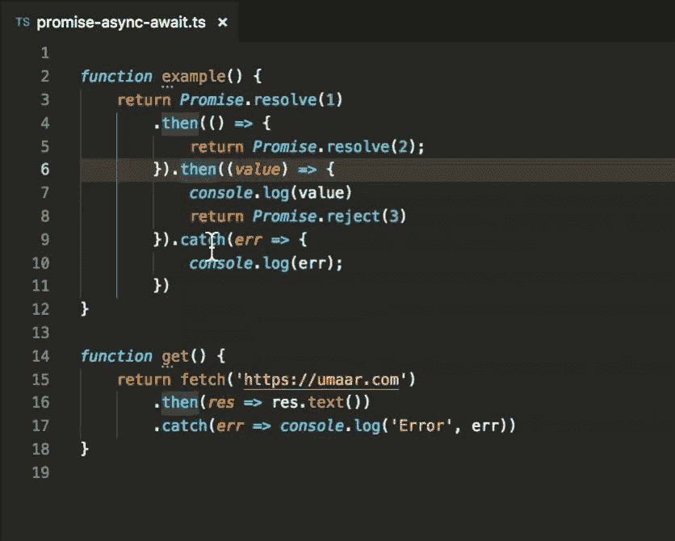

# 承诺链已经死了。异步/等待万岁

> 原文：<https://dev.to/bnevilleoneill/promise-chaining-is-dead-long-live-async-await-52aa>

[T2】](https://res.cloudinary.com/practicaldev/image/fetch/s--5UeESUs3--/c_limit%2Cf_auto%2Cfl_progressive%2Cq_auto%2Cw_880/https://cdn-images-1.medium.com/max/1024/1%2Ag4lmTSnkQrovZDS0JfrsbA.png)

虽然异步函数一直存在，但它们经常被搁置不用。Async/await 可能被一些人认为是一个弃儿。

为什么？

一个常见的误解是 async/await 和 promises 是完全不同的东西。

剧透一下，他们不是！Async/await 基于承诺。

仅仅因为你使用承诺并不意味着你被束缚在承诺链的野蛮中。

在本文中，我们将了解 async/await 如何真正让开发人员的生活变得更加轻松，以及为什么您应该停止使用承诺链。

我们来看看承诺链:

```
// Using promise chaining
getIssue()
  .then(issue => getOwner(issue.ownerId))
  .then(owner => sendEmail(owner.email, 'Some text')) 
```

现在让我们看看用 async/await 实现的相同代码:

```
// Using async functions
const issue = await getIssue()
const owner = await getOwner(issue.ownerId)
await sendEmail(owner.email, 'Some text') 
```

嗯，它看起来像简单的语法糖，对不对？

像大多数人一样，我经常发现我的代码看起来简单、干净、易读。其他人似乎也同意。但是到了要做出改变的时候，修改比预想的要难。这并不奇怪。

这正是承诺链所发生的事情。

我们来看看为什么。

[T2】](https://logrocket.com/signup/)

### 易于阅读，易于维护

假设我们需要在之前的代码中实现一个非常小的变化(例如，我们需要在电子邮件内容中提到问题编号——类似于文本#issue-number)。

我们该怎么做？对于异步/等待版本，这是微不足道的:

```
const issue = await getIssue()
const owner = await getOwner(issue.ownerId)
await sendEmail(owner.email, `Some text #${issue.number}`) // tiny change here 
```

前两行不受影响，第三行只需要做很小的改动。

承诺链版本呢？让我想想。

在最后。然后()我们可以访问所有者，但不能访问问题引用。这就是承诺链开始变得混乱的地方。我们可以尝试用这样的东西来清理它:

```
getIssue()
  .then(issue => {
    return getOwner(issue.ownerId)
      .then(owner => sendEmail(owner.email, `Some text #${issue.number}`))
  }) 
```

正如您所看到的，一个小的调整需要更改几行原本很漂亮的代码(比如 getOwner(issue.ownerId))。

### 代码是不断变化的

当实现非常新的东西时尤其如此。例如，如果我们需要在电子邮件内容中包含来自对名为 getSettings()的函数的异步调用的附加信息，该怎么办？

它可能类似于:

```
const settings = await getSettings() // we added this
const issue = await getIssue()
const owner = await getOwner(issue.ownerId)
await sendEmail(owner.email,
  `Some text #${issue.number}. ${settings.emailFooter}`) // minor change here 
```

你如何使用承诺链来实现它？您可能会看到类似这样的内容:

```
Promise.all([getIssue(), getSettings()])
  .then(([issue, settings]) => {
    return getOwner(issue.ownerId)
      .then(owner => sendEmail(owner.email,
        `Some text #${issue.number}. ${settings.emailFooter}`))
  }) 
```

但是，对我来说，这导致了草率的代码。每当我们需要对需求进行更改时，我们都需要对代码进行太多的更改。恶心。

因为我不想嵌套更多的 then()调用，而且我可以并行地使用 getIssue()和 getSettings()，所以我选择了使用 Promise.all()，然后进行一些解构。的确，与 await 版本相比，这个版本是最佳的，因为它是并行运行的，但仍然很难阅读。

我们能否优化 await 版本，使事情并行运行，而不牺牲代码的可读性？我们来看看:

```
const settings = getSettings() // we don't await here
const issue = await getIssue()
const owner = await getOwner(issue.ownerId)
await sendEmail(owner.email,
  `Some text #${issue.number}. ${(await settings).emailFooter}`) // we do it here 
```

我已经移除了 settings 赋值右侧的 await，并将它移动到 sendEmail()调用中。通过这种方式，我创造了一个承诺，但不是等到我需要它的价值的时候。与此同时，其他代码可以并行运行。就这么简单！

### 你不需要 Promise.all()因为它死了

我已经演示了如何在不使用 Promise.all()的情况下轻松有效地并行运行 promises。所以这意味着它完全死了，对吗？

嗯，有些人可能会说，一个完美的用例是当你有一个值数组，你需要把它映射()到一个承诺数组。例如，你有一个要读取的文件名数组，或者一个要下载的 URL 数组，等等。

我认为那些人错了。相反，我建议使用外部库来处理并发性。例如，我将使用蓝鸟的 Promise.map()，在那里我可以设置一个[并发限制](http://bluebirdjs.com/docs/api/promise.map.html#map-option-concurrency)。如果我必须下载 N 个文件，用这个工具我可以指定不超过 M 个文件同时下载。

### 你几乎可以在任何地方使用 await

当你试图简化事情时，Async/await 大放异彩。想象一下，如果使用承诺链，这些表达式会有多复杂。但是有了 async/await，它们就简单明了了。

```
const value = await foo() || await bar()

const value = calculateSomething(await foo(), await bar()) 
```

### 还不服气？

假设你对我喜欢漂亮的代码和易于维护不感兴趣。相反，你需要确凿的事实。它们存在吗？

没错。

当将 promise chaining 合并到他们的代码中时，开发人员会在每次有 then()调用时创建新的函数。这本身会占用更多的内存，但是这些函数总是在另一个上下文中。因此，这些函数变成了闭包，这使得垃圾收集变得更加困难。此外，这些函数通常是匿名函数，会污染堆栈跟踪。

既然我们正在讨论堆栈跟踪:我应该提到有一个可靠的[提议](https://docs.google.com/document/d/13Sy_kBIJGP0XT34V1CV3nkWya4TwYx9L3Yv45LdGB6Q/edit)来为异步函数实现**更好的堆栈跟踪**。这太棒了，有趣的是…

*只要开发者坚持只使用异步函数和异步生成器，而不是手工编写 Promise 代码*

…如果使用承诺链，将不起作用。所以这又是一个总是使用异步/等待的理由！

### 如何迁移

首先(现在应该很明显了):开始使用异步函数，停止使用承诺链。

其次，您可能会发现 Visual Studio 代码对此非常方便:

> <video loop="" controls=""><source src="https://video.twimg.com/tweet_video/DoLowPkW0AA8Wfi.mp4" type="video/mp4"></video>Umar Hansa[@ umaar](https://dev.to/umaar)Visual Studio 代码现在可以将您的 Promise.then()的长链转换为 async/await！🎊在 JavaScript 和 TypeScript 文件中都能很好地工作。。catch()也正确转换为 try/catch✅2018 年 9 月 28 日下午 12:42[](https://twitter.com/intent/tweet?in_reply_to=1045655069478334464)[](https://twitter.com/intent/retweet?tweet_id=1045655069478334464)1775[](https://twitter.com/intent/like?tweet_id=1045655069478334464)4673

### 结论

*   Async/await 已经得到了广泛的支持。除非你需要支持 IE 你很好。
*   Async/await 可读性更强，易于维护。
*   只使用 async/await 也有技术上的原因。
*   有了 Visual Studio 代码和其他 ide，你可以很容易地移植现有的 promise chained 代码！* * * ### Plug: [LogRocket](https://logrocket.com/signup/) ，一款适用于网络应用的 DVR

[](https://logrocket.com/signup/)

<figcaption>[https://logrocket.com/signup/](https://logrocket.com/signup/)</figcaption>

LogRocket 是一个前端日志工具，可以让你回放问题，就像它们发生在你自己的浏览器中一样。LogRocket 不需要猜测错误发生的原因，也不需要向用户询问截图和日志转储，而是让您重放会话以快速了解哪里出错了。它可以与任何应用程序完美配合，不管是什么框架，并且有插件可以记录来自 Redux、Vuex 和@ngrx/store 的额外上下文。

除了记录 Redux 操作和状态，LogRocket 还记录控制台日志、JavaScript 错误、堆栈跟踪、带有头+正文的网络请求/响应、浏览器元数据和自定义日志。它还使用 DOM 来记录页面上的 HTML 和 CSS，甚至为最复杂的单页面应用程序重新创建像素级完美视频。

免费试用。

* * *

帖子[承诺链已死。异步/等待万岁](https://blog.logrocket.com/promise-chaining-is-dead-long-live-async-await-445897870abc/)首先出现在[日志博客](https://blog.logrocket.com)上。