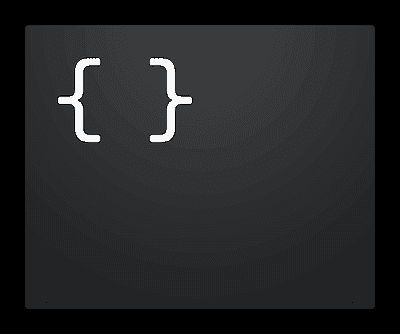

# 用 JSON 创建一个定制的终端提示符

> 原文：<https://dev.to/brandonweiss/promptconfig-a-way-to-craft-a-custom-terminal-prompt-with-json-3fa4>

[T2】](https://res.cloudinary.com/practicaldev/image/fetch/s--_RwPfXiH--/c_limit%2Cf_auto%2Cfl_progressive%2Cq_auto%2Cw_880/https://thepracticaldev.s3.amazonaws.com/i/jyl2ikw6s9rob492lw9k.png)

[PromptConfig](https://github.com/brandonweiss/promptconfig) 让你用 JSON 来描述你的提示，然后它被编译成 Bash。一个非常简单的提示可能是这样的:

```
{
  "prompt": ["character", "space"],
  "components": [
    {
      "key": "character",
      "value": "❯",
      "color": "magenta"
    }
  ]
} 
```

Enter fullscreen mode Exit fullscreen mode

它将生成如下所示的 Bash:

```
function _promptconfig_prompt() {
  local prompt=''
  prompt+='\[\e[38;5;5m\]'
  prompt+='❯'
  prompt+='\[\e[0m\]'
  prompt+=' '
  PS1=$prompt
}

PROMPT_COMMAND="_promptconfig_prompt; $PROMPT_COMMAND" 
```

Enter fullscreen mode Exit fullscreen mode

## 为什么？

狂欢很难。这是一种晦涩难懂的语言和环境，有着陡峭的学习曲线。大多数程序员最终只是在非常肤浅的层面上使用它，计算出足够完成他们需要做的事情。

不幸的是，正确定制提示符需要对 Bash 和终端的工作方式有非常深刻的理解，而这与您实际要做的事情是不相称的。互联网上充斥着各种建议，这些建议会以微妙的方式破坏你的提示，这些方式不会立即显现出来，以后你可能会不明白是由你的自定义提示引起的。我是从个人经验来说的。😭

它不应该那么复杂，希望现在不是。

[看一看](https://github.com/brandonweiss/promptconfig)让我知道你的想法！