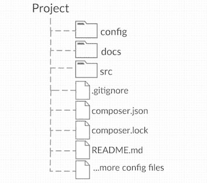

# 正确的 Magento 2 编写器设置

> 原文：<https://dev.to/jalogut/proper-magento-2-composer-setup-40dm>

*这篇文章最初发表在我同事的博客上[https://blog.hauri.me/](https://blog.hauri.me/proper-magento2-composer-setup.html)T3】*

## 目标

当考虑如何设置 Magento 2 项目时，您应该有以下目标:

*   简单的存储库结构
*   仅版本控制下的项目文件
*   在本地安装中轻松识别哪些文件属于 repo，哪些文件是由 composer 安装的

这些目标对于保持库的轻量级、良好的组织和开发者知道哪些文件在 VCS 下是非常重要的。

也就是说，我们会想要这样的图像。

[T2】](https://res.cloudinary.com/practicaldev/image/fetch/s--abYRKh4y--/c_limit%2Cf_auto%2Cfl_progressive%2Cq_auto%2Cw_880/https://thepracticaldev.s3.amazonaws.com/i/msrqkgehfppic5j1vi1a.png)

在安装完所有外部依赖项和 Magento 2 项目文件后，我们还会在本地看到相同的结果。

## 错误的 Magento 文档

如果你简单的按照 [Magento Docs](http://devdocs.magento.com/guides/v2.2/install-gde/prereq/integrator_install_ce.html) 操作，他们会告诉你运行:

```
composer require magento/project-community-edition 
```

这种配置本身是不够的，因为您最终会在本地得到类似的东西。

[T2】](https://res.cloudinary.com/practicaldev/image/fetch/s--Ve1YbcAc--/c_limit%2Cf_auto%2Cfl_progressive%2Cq_auto%2Cw_880/https://thepracticaldev.s3.amazonaws.com/i/4hdyuv4q57uvc1zmua20.png)

正如您所看到的，在您的项目根目录中安装了许多 Magento 文件。只有红色的部分来自项目资源库。这个解决方案对我们来说是无效的，因为开发人员不能清楚地看到哪些文件在版本控制下，哪些文件是由 composer 安装的。`.gitignore`也很复杂，因为你需要忽略由 composer 从供应商文件夹中安装的几个单独的文件。

## 适当配置

为了改善这一点，我们采取了一种稍微不同的方法:

1-将所有 Magento 文件和依赖项放在一个特定的文件夹下，这样它们就不会污染你的项目根目录。在我们的例子中，我们决定将该文件夹命名为`magento`。

为此，您只需要在您的`composer.json`的几个地方添加`magento/`前缀路径:

```
 "config": {
        "vendor-dir": "magento/vendor"
    },
    "extra": {
        "magento-root-dir": "magento/"
    },
    "autoload": {
        "psr-4": {
            "Magento\\Setup\\": "magento/setup/src/Magento/Setup/"
        },
        "psr-0": {
            "": "magento/app/code/"
        },
        "files": [
            "magento/app/etc/NonComposerComponentRegistration.php"
        ]
    },
    "autoload-dev": {
            "psr-4": {
            "Magento\\Sniffs\\": "magento/dev/tests/static/framework/Magento/Sniffs/",
            "Magento\\Tools\\": "magento/dev/tools/Magento/Tools/",
            "Magento\\Tools\\Sanity\\": "magento/dev/build/publication/sanity/Magento/Tools/Sanity/",
            "Magento\\TestFramework\\Inspection\\": "magento/dev/tests/static/framework/Magento/TestFramework/Inspection/",
            "Magento\\TestFramework\\Utility\\": "magento/dev/tests/static/framework/Magento/TestFramework/Utility/"
            }
      } 
```

2- `.gitignore`现在也简单多了。你只需要忽略`magento`文件夹，除了你在`magento/app`和`magento/app/etc/config.php`中的项目特定文件:

```
 # Ignore all Magento code files except our code in "magento/app"
    /magento/*
    !/magento/app
    /magento/app/etc/*
    !/magento/app/etc/config.php
    /magento/app/code/Magento
    /magento/app/design/*/Magento
    /magento/app/i18n/magento
    /magento/app/*.* 
```

3-符号链接`magento`文件夹中的`composer.json`和`composer.lock`文件。出于一些奇怪的原因，Magento 控制台需要将`composer`文件与 Magento 根文件放在同一个目录下。有了这个设置，情况就不一样了，所以你需要在`composer install/update`命令后符号链接这些文件:

```
 "scripts": {
        "symlinkComposerFilesToMagentoRoot": "cd magento && ln -sf ../composer.* .",
        "post-install-cmd": [
            "@symlinkComposerFilesToMagentoRoot"
        ],
        "post-update-cmd": [
            "@symlinkComposerFilesToMagentoRoot"
        ]
    } 
```

4-只需提到现在您的服务器`DocumentRoot`配置必须指向`<project_path>/magento/pub`

## 结果

现在，如果您在一个干净的文件夹中执行`composer install`,您应该将所有的 composer 文件安装在`magento`文件夹下。

太好了！不是吗？现在，本地安装看起来更加整洁，与我们的存储库完全相同。

[T2】](https://res.cloudinary.com/practicaldev/image/fetch/s--WS7nFy5Q--/c_limit%2Cf_auto%2Cfl_progressive%2Cq_auto%2Cw_880/https://thepracticaldev.s3.amazonaws.com/i/m60bbx3n8j2k4ukefoei.png)

## 额外提示:

如果你想变得更聪明，你可以使用一个叫做 [symlinker-pro](https://github.com/staempfli/symlinker-pro) 的工具在`composer install/update`之后添加你的符号链接。使用该工具有以下优点:

*   符号链接配置集中在一个文件中
*   可以用你的项目特定的配置覆盖 Magento 默认配置文件。例如:
    *   `magento/dev/integration/phpunit.xml`
    *   `magento/dev/unit/phpunit.xml`
    *   `magento/dev/tools/grunt/configs/themes.js`

在我们的例子中，我们将这个工具配置为将我们的`symlinks`文件夹中的每个文件符号链接到原始的`magento`目录。

## 故障排除

尝试安装 Magento 示例数据时，此安装程序返回一个错误。

问题:

*   `sampledata:deploy`命令将作曲者`--working-dir`改变到 magento 路径。

解决方法:

*   在执行`sampledata:deploy`之前，移除`\Magento\SampleData\Console\Command\SampleDataDeployCommand::82`上的`'--working-dir' => $baseDir`

## 摘要和文件概述

应用这些配置后，我们的设置和文件将如下所示:

### 项目结构

[T2】](https://res.cloudinary.com/practicaldev/image/fetch/s--3kh8FLM6--/c_limit%2Cf_auto%2Cfl_progressive%2Cq_auto%2Cw_880/https://thepracticaldev.s3.amazonaws.com/i/4u73br9ls7g5k5lug06p.png)

### magento.symlinks

```
composer.json=>magento/composer.json
composer.lock=>magento/composer.lock

symlinks/magento/**=>magento 
```

### composer.json

```
{
  "name": "project/magento2-project-name",
  "description": "Magento Project Name",
  "type": "project",
  "license": [
    "proprietary"
  ],
  "authors": [
    {
      "name": "Your name",
      "email": "your.name@domain.com"
    }
  ],
  "config": {
    "vendor-dir": "magento/vendor",
    "use-include-path": true
  },
  "repositories": [
    {"type": "composer", "url": "https://repo.magento.com/"}
  ],
  "require": {
    "n98/magerun2": "^1.4",
    "magento/product-community-edition": "*",
    "composer/composer": "@alpha",
    "staempfli/symlinker-pro": "~1.0"
  },
  "require-dev": {
    "phpunit/phpunit": "^4.1"
  },
  "extra": {
    "magento-root-dir": "magento/",
    "magento-force": "override"
  },
  "autoload": {
    "psr-4": {
      "Magento\\Setup\\": "magento/setup/src/Magento/Setup/"
    },
    "psr-0": {
      "": "magento/app/code/"
    },
    "files": [
      "magento/app/etc/NonComposerComponentRegistration.php"
    ]
  },
  "autoload-dev": {
    "psr-4": {
      "Magento\\Sniffs\\": "magento/dev/tests/static/framework/Magento/Sniffs/",
      "Magento\\Tools\\": "magento/dev/tools/Magento/Tools/",
      "Magento\\Tools\\Sanity\\": "magento/dev/build/publication/sanity/Magento/Tools/Sanity/",
      "Magento\\TestFramework\\Inspection\\": "magento/dev/tests/static/framework/Magento/TestFramework/Inspection/",
      "Magento\\TestFramework\\Utility\\": "magento/dev/tests/static/framework/Magento/TestFramework/Utility/"
    }
  },
  "scripts": {
    "preventRunningComposerInMagentoFolder": "[ ! $(basename `pwd`) = 'magento' ] || { echo 'Checking current dir is not magento folder'; exit 1; }",
    "setPermissionsBin": "chmod -R +x bin magento/vendor/bin",
    "setSymlinks": "magento/vendor/bin/symlinker-pro create:from:file config/symlinks/magento.symlinks -f --enable-wildcards",
    "pre-install-cmd": [
        "@preventRunningComposerInMagentoFolder"
    ],
    "pre-update-cmd": [
        "@preventRunningComposerInMagentoFolder"
    ],
    "post-install-cmd": [
        "@setPermissionsBin",
        "@setSymlinks"
    ],
    "post-update-cmd": [
        "@setPermissionsBin",
        "@setSymlinks"
    ]
  }
} 
```

### 。吉蒂尔

```
.idea
.DS_Store

# Ignore all Magento code files except our code in "magento/app"
/magento/*
!/magento/app
/magento/app/etc/*
!/magento/app/etc/config.php
/magento/app/code/Magento
/magento/app/design/*/Magento
/magento/app/i18n/magento
/magento/app/*.* 
```