# 在 AWS S3、谷歌云存储和 Azure Blob 存储之间，公共云对象存储的性能非常不均衡

> 原文：<https://dev.to/sachinkagarwal/public-cloud-object-store-performance-is-very-unequal-across-aws-s3-google-cloud-storage-and-azure-blob-storage-13do>

在本文中，我们比较了亚马逊网络服务(S3)、谷歌云存储和微软 Azure Blobs 在本地冗余配置(无地理复制)中的对象存储性能。我们发现非常显著的性能差异会对用户应用程序产生直接影响。

[对象或 blob 存储](https://en.wikipedia.org/wiki/Object_storage)云上的服务提供内容可寻址存储，用户可以在其中保存无法通过 HTTP(s)连接和简单 CRUD 语义(GET to download，PUT to upload 等)上的 URL 访问的任意文件。).对象存储既方便又便宜，这使得它成为从少于几千字节的小型配置文件到大型虚拟机映像或备份归档的所有存储后端的首选。它也是保存大数据分析中使用的原始数据文件的最常见存储选项。

在许多用例中，降低对象存储延迟(上传和下载文件的时间)非常重要。例如，下载数据库备份所需的时间将是灾难恢复计划的恢复时间目标的主要因素。如果托管原始数据的后端对象存储具有很高的文件服务延迟，那么 Apache spark 等大数据应用程序可能会显得迟缓。有许多重复且频繁地读写小文件到对象存储器(例如图像缩略图)的应用程序；这些将受益于较低延迟的小对象性能。

我们的主要发现是:

1.  与谷歌云存储或 AWS S3 大型对象下载相比，Azure 中的大型 blob 下载要慢得多(高达 4 倍)。
2.  小型 Azure blobs 具有较低的上传延迟。
3.  总的来说，(相对较新的)加拿大地区与老的美国东部地区相比，对象存储操作的延迟较低。

## 设置

我们在云区域为 AWS-S3、Google 云存储和 Azure blob 存储设置了本地冗余对象存储桶，并在同一个云区域创建了一个虚拟机(每个提供商一个)。“本地冗余”是指对象没有被地理复制到另一个区域；我们将在另一篇文章中分析地理复制对象。

图 1:本地冗余对象存储测试的测试设置。我们报告了客户端将对象放入对象存储库/从对象存储库中获取对象的上传和下载延迟。
[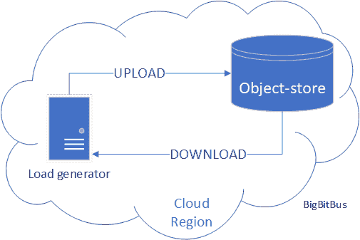T5】](https://res.cloudinary.com/practicaldev/image/fetch/s--_LqrjBVe--/c_limit%2Cf_auto%2Cfl_progressive%2Cq_auto%2Cw_880/https://thepracticaldev.s3.amazonaws.com/i/mf327ygf9n11vfihr5p3.png)

负载测试器虚拟机加载了我们定制的开源基准测试程序 [object bench](https://github.com/bigbitbus/objectbench) ，它可以将不同大小的随机生成的文件上传和下载到对象存储中。该工具使用来自每个提供者的 python SDKs(因此客户端实现严格按照提供者标准)。该工具被设置为连续上传和下载不同大小的随机生成的文件(大小从 1kB 到 100MB 不等)。我们重复实验 100 次，我们所有的结果都是这 100 次运行的平均值；我们也在图中显示误差线。

## 结果

我们测量了从对象存储上传和下载对象的应用程序所看到的延迟。我们为每个提供商提供美国东部地区和加拿大地区的结果(具体名称因提供商而异)。通过为每个提供者选择两个不同的区域，我们消除了在特定区域测试 VM 客户机时负载不佳或对象存储配置不佳的可能性。我们还发现了同一家云提供商在不同地区的性能差异；希望在公共云对象存储上获得最佳性能的用户应该在选择特定区域之前仔细评估不同区域之间的性能差异。并非所有的云区域*都具有相同的性能。*

### 美国地区

我们分别为 AWS、Google cloud 和 Azure 选择了 *us-east-1* 、 *us-east1* 和 *eastus* 区域(以下图中统称为 USEast)。对于每个云提供商，负载测试虚拟机在属于这些区域的一个分区中启动。

#### 小物体尺寸

图 2 和图 3 示出了美国东部地区的小对象上传和下载延迟。与 AWS S3 或谷歌云存储相比，Azure blob store 的上传延迟明显更低。在不了解实现的情况下，很难说为什么会有如此明显的差异。我们有一个有争议的假设——也许对 Azure blob store 的上传(写)被缓存在内存中(稍后在磁盘上持久化),并且确认被立即发送到上传客户端。

**图 2:美国东部**
[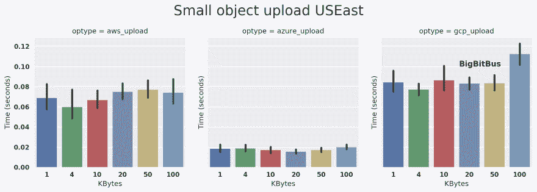](https://res.cloudinary.com/practicaldev/image/fetch/s--cJ6qu6G_--/c_limit%2Cf_auto%2Cfl_progressive%2Cq_auto%2Cw_880/https://thepracticaldev.s3.amazonaws.com/i/282keg8wgh9e0pi8pi2g.png) 小对象(最大 100kB)上传延迟

**图 3:美国东部**
[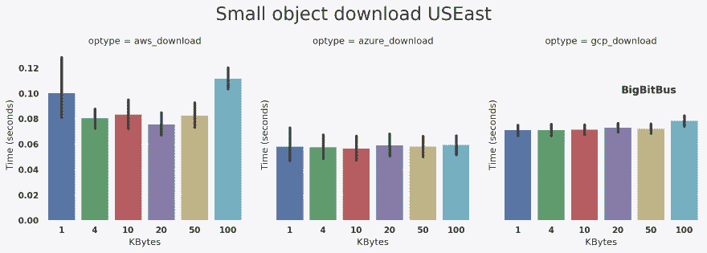](https://res.cloudinary.com/practicaldev/image/fetch/s--U7eBRGoO--/c_limit%2Cf_auto%2Cfl_progressive%2Cq_auto%2Cw_880/https://thepracticaldev.s3.amazonaws.com/i/woziab8o8f0w5l0tikvt.png) 小对象(高达 100kB)下载延迟

#### 大型物体尺寸

图 4 和图 5 示出了美国东部地区的大对象上传和下载延迟。对于上传，所有三个对象存储的性能非常相似。Azure 下载速度惊人的慢是这里的亮点(图 5)。我们认为这是 Azure 中的一个严重问题——特别是对于备份/恢复用例。数据显示，从 Azure blob-store 下载一个 100MB 的对象需要 4 秒多，而在谷歌云存储中只需 1 秒。下载一个由 100 个这样的 100MB 对象组成的 10GB 备份集，在 Azure 中需要 4000 多秒，而在 Google cloud 中只需要 1000 秒。这对 Azure 用户的恢复时间目标是一个巨大的打击。

**图 4:美国东部**
[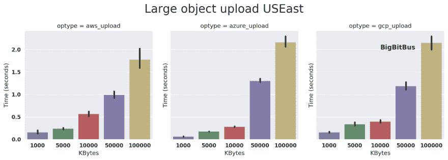](https://res.cloudinary.com/practicaldev/image/fetch/s--DZw7_KAw--/c_limit%2Cf_auto%2Cfl_progressive%2Cq_auto%2Cw_880/https://thepracticaldev.s3.amazonaws.com/i/9bgstzn0dovi5qgdyrx2.png) 大型对象(1MB - 100MB)上传延迟

**图 5:美国东部**
[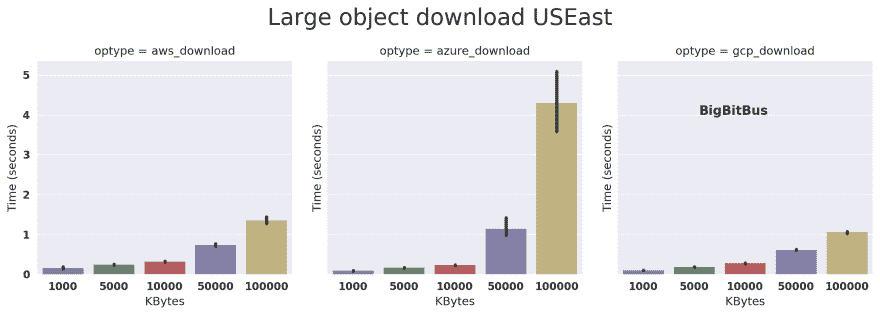](https://res.cloudinary.com/practicaldev/image/fetch/s--MMYZJKYP--/c_limit%2Cf_auto%2Cfl_progressive%2Cq_auto%2Cw_880/https://thepracticaldev.s3.amazonaws.com/i/rur5rkj3ucke8ljgczrs.png) 大型对象(1MB - 100MB)下载延迟

#### 对象删除

图 6 显示了不同大小对象的删除等待时间。这里值得注意的特点是谷歌云(GCP)数据的一致性。

**图 6:美国东部**
[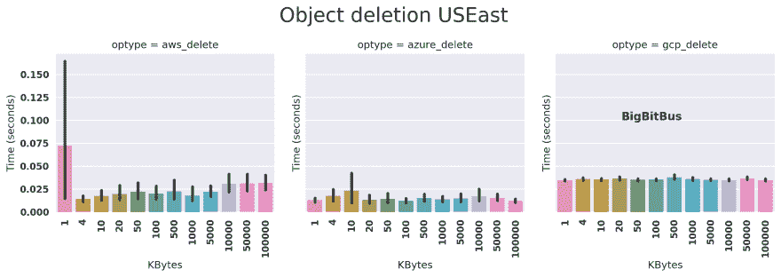](https://res.cloudinary.com/practicaldev/image/fetch/s--hFPCfWLS--/c_limit%2Cf_auto%2Cfl_progressive%2Cq_auto%2Cw_880/https://thepracticaldev.s3.amazonaws.com/i/i9pi0ngex518jat6yd8f.png) 的对象删除延迟

### 加拿大地区

我们在加拿大公共云区域重复了上述所有实验。图 7-11 显示了相应的加拿大地区号码。注意一些图表中不同的 Y 轴；总体而言，加拿大地区的延迟时间低于美国东部地区。我们假设这是因为加拿大地区相对较新且利用率较低。在这些结果中也可以看到 Azure blobs 同样出色的小对象性能和糟糕的大 blob 下载性能。

我们分别为 AWS、Google cloud 和 Azure 选择了 *ca-central-1* 、 *northamerica-northeast1* 和 *canadacentral* 地区(以下图中统称为加拿大)。

#### 小物体尺寸

**图 7:小对象(高达 100kB)在加拿大的上传延迟**
[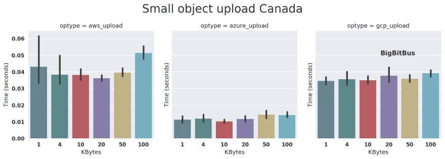](https://res.cloudinary.com/practicaldev/image/fetch/s--4GISMGn_--/c_limit%2Cf_auto%2Cfl_progressive%2Cq_auto%2Cw_880/https://thepracticaldev.s3.amazonaws.com/i/2795vznfyngmdc8f7tgf.png)

**图 8:加拿大小对象(高达 100kB)下载延迟**
[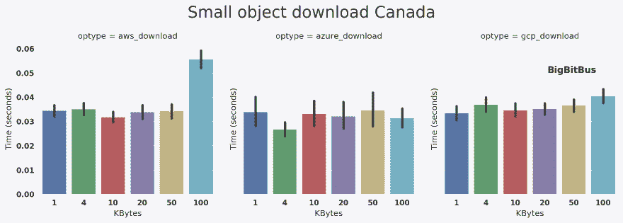](https://res.cloudinary.com/practicaldev/image/fetch/s--eaeK3B2m--/c_limit%2Cf_auto%2Cfl_progressive%2Cq_auto%2Cw_880/https://thepracticaldev.s3.amazonaws.com/i/ph7b1dy5prcx24fiiumr.png)

#### 大型物体尺寸

**图 9:加拿大大对象(1MB - 100MB)上传延迟**
[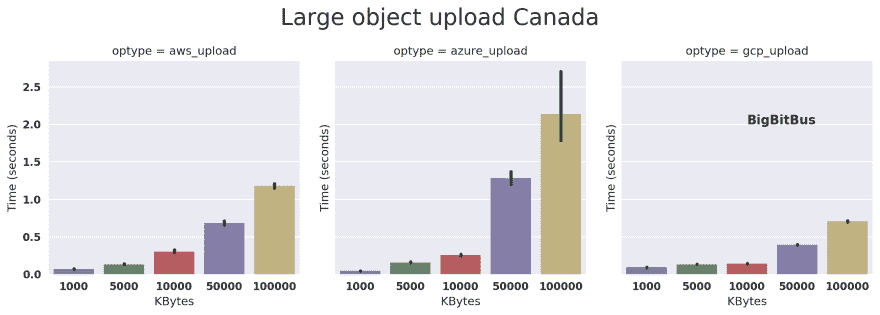](https://res.cloudinary.com/practicaldev/image/fetch/s--jm9cNtWw--/c_limit%2Cf_auto%2Cfl_progressive%2Cq_auto%2Cw_880/https://thepracticaldev.s3.amazonaws.com/i/23ra3dkgxzqanaz9cobh.png)

**图 10:加拿大大型对象(1MB - 100MB)下载延迟**
[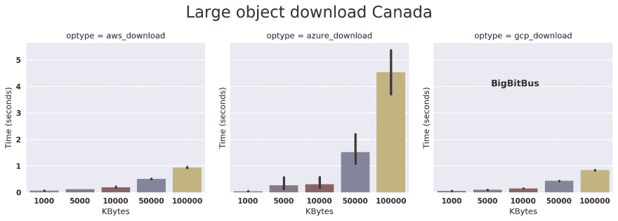](https://res.cloudinary.com/practicaldev/image/fetch/s--KJAzWXhB--/c_limit%2Cf_auto%2Cfl_progressive%2Cq_auto%2Cw_880/https://thepracticaldev.s3.amazonaws.com/i/r4jdwlxu5wc14ug9bmge.png)

#### 对象删除

**图 11:加拿大的对象删除延迟**
[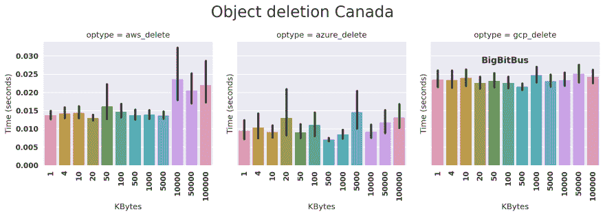](https://res.cloudinary.com/practicaldev/image/fetch/s--UodV2nAJ--/c_limit%2Cf_auto%2Cfl_progressive%2Cq_auto%2Cw_880/https://thepracticaldev.s3.amazonaws.com/i/cnjthcm4e04swb8mzssb.png)

## 展望

本文中报告的延迟指标对于许多用户应用程序来说至关重要。我们的结果显示，当使用 Azure blob store 存储大型对象时——如恢复备份、下载大型媒体文件和虚拟机映像等操作——存在明显的劣势。Azure 服务在小对象上胜出——上传速度一直比 AWS S3 和谷歌云存储对象存储快。对于更新、保存和删除大量临时对象的应用程序来说，对象删除时间非常重要。与其他对象存储相比，Google cloud 删除时间的一致性给我们留下了深刻的印象。

我们的目标是捕捉由于不同的对象存储实现而产生的性能差异。鉴于不同实现之间的性能差异，我们希望这些服务背后的工程团队将调整和改进他们的系统，使他们的系统达到最佳水平。

请继续关注我们在本系列中对地理复制对象性能、冷存储对象存储和对象元数据性能的研究。

*

*本文首次发表于[www.bigbitbus.com](http://www.bigbitbus.com)T3】*

Sachin Agarwal 是一名计算机系统研究员，也是 BigBitBus 的创始人。

*BigBitBus 的使命是提高公共云和托管大数据及分析服务的透明度。*