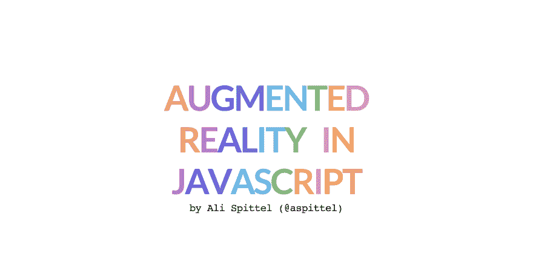
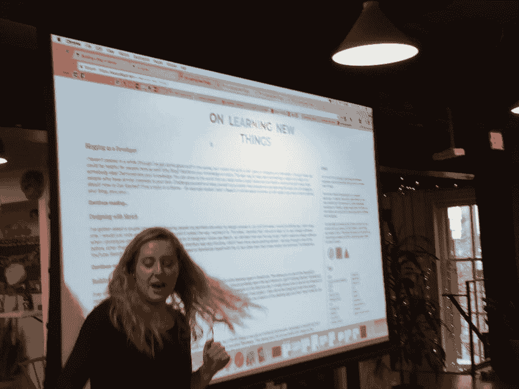

# 作为开发人员的公开演讲

> 原文：<https://dev.to/aspittel/public-speaking-as-a-developer-2ihj>

作为我三月份[作为开发者写博客](https://dev.to/aspittel/blogging-as-a-developer--5h0m)的后续，我想给出我作为一个开发者做公开演讲活动的技巧。一年多以前，我在我居住的 DC 向 Code(Her)会议提交了我的第一份征文申请。它被接受了，去年八月我做了我的第一次会议演讲。大约在同一时间，我从传统的软件工程工作转到了在大会训练营教书。从那时起，在过去的一年里，我在各种会议上做了 20 多次演讲。话虽如此，我还是想给出我的建议——从申请过程到实际演讲。

## 为什么说话？

这些理由看起来和我写博客的理由非常相似！

*   强化你的主题知识。真正深入学习的最好方法是把它教给别人！
*   展示你的知识。你可以向世界展示你真的对一个话题了如指掌！
*   建立一个社区，结识和你有相似兴趣的人。
*   挑战自己，让自己负责任。
*   帮助那些正在学习你正在谈论的话题的人！

此外，大多数会议给演讲者免费入场甚至旅行补助，这使得参加会议在经济上容易得多。

## 挑题目

为了演讲，你要做的第一件事就是想清楚你想说什么。我会选择一些你可以讲一个好故事的东西，你对它充满热情，你觉得谈论一个小时左右会很舒服。你不需要成为这个话题的专家，事实上，从一个新手的角度谈论你的学习过程或听到一些事情有时会带来最好的谈话。此外，你的演讲不需要太过技术化——我最喜欢的一些演讲甚至很少谈到代码！我通常把我的博客文章转换成演讲，因为我已经是其中的一部分了！

我做过的一些演讲是:

*   通过艺术创作学习 CSS
*   网络增强现实
*   面向数据科学家的 Web 开发
*   Web 框架简介
*   用 Gatsby 构建渐进式 Web 应用程序
*   Python 中带散景的 Web 就绪数据可视化
*   编程 001
*   用代码构建艺术
*   教学代码

由于我是全职教代码的，所以我倾向于举办研讨会和更多的代码讲座，所以这对我来说是最自然的。

## 征稿流程

大多数演讲的第一步是征集论文的过程，你申请做演讲。不同的会议对 CFP 有不同的要求，但通常有两个主要部分:一个简短的摘要，总结你的演讲，如果被接受，会议将使用它来营销。然后，对你的演讲有一个更长的描述，你可以提供一个你将要谈论的内容和原因的大纲。

你的摘要要简洁明了——把这当成你的推销词和你演讲的总结。这些通常有一个字符的限制，所以你真的必须考虑每一个词，并在这里尽可能地推销你的讲话！

我的“网络增强现实”演讲的 300 字摘要如下:

> 增强现实因其艺术和商业应用而变得越来越受欢迎。本次演讲将探索使 AR 对开发者更加友好的框架和工具，包括用 47 行 JavaScript 代码为网络摄像头图像添加实时遮罩！

有很多方向，你可以把你的完整描述；然而，我通常使用的公式如下:

*   讲座的学习目标。我通常会给出三到四个要点，说明我希望与会者在我的演讲中能学到什么。
*   对演讲和演讲中使用的技术的描述。我写了几段关于我为什么要做这个演讲，演讲的背景，为什么它很适合这个会议，以及演讲中使用的“堆栈”。
*   会谈的议程。我粗略地列出了这次演讲的时间安排。《出埃及记》5 分钟介绍，10 分钟演示，10 分钟现场代码，15 分钟问答等。
*   与会者将带着什么离开。我试着思考为什么人们应该来听我的演讲，他们会从我的演讲中得到什么。我喜欢举办研讨会，所以在这种情况下，答案通常是演示和他们自己的迷你项目。对于短时间的谈话，这可以是对一项技术的新的热情或关于图书馆的新知识。
*   现有材料的链接。再说一次，我通常会根据我的博客帖子来发表我的演讲，所以我会附上这些帖子。如果我以前做过演讲，我也会附上我用过的幻灯片。

这里的和[这里的](https://github.com/superbuggy/cfps/blob/master/papercall.md)是我存放 CFP 的地方，如果你想通读的话！第二个是一个非常酷的和我朋友的合作演讲，如果有人想找演讲者，我很乐意在这个秋天举办！

## 发现事件

下一步是找到一个你想发言的会议。我用一些资源来找到这些。第一个是 [PaperCall](https://www.papercall.io/) ，它列出了您可以通过其网站提交的公开 CFP。我也在推特上关注[的 Mozilla 技术 CFPs](https://twitter.com/moztechcfps) 和[的 CallbackWomen](https://twitter.com/CallbackWomen) 来了解当地的事件。我不时会在一些网站上看到即将召开的会议。最后，我是当地技术社区 Slack 小组的成员，看到很多 CFP 和人们在那里寻找 meetup 演讲者。

一旦你参加了会议，如果你没有被每个人接受，不要气馁！不同的会议在寻找不同的东西，他们有不同的受众。此外，可能还有其他人提交类似的提案，所以他们只能就一个话题选择一个话题！我收到了很多拒绝和很多接受！我还会说，以我的经验来看，以初学者为中心的谈话更难被接受，因为在技术会议上新开发人员通常更少！你也可以在一个会议上提交多个演讲，我通常也是这样做的！

> 这种情况要到 2 月份才会再次发生，但我参加了今年的全球多元化 CFP 日，这太棒了！把它放在你的日历上！

## 展开你的谈话

现在到了困难的部分——发展和练习你的演讲。当然，根据内容的不同，每次谈话都会采取不同的步骤。我倾向于从一份减价文件开始，只是概述我的想法。我做我需要做的关于技术主题的研究——我阅读文章，观看其他会议讨论，浏览我自己和其他人的代码。我把所有有用的链接都放在一个地方，这样我以后就可以回头再看它们，我也写下我所有的笔记。

然后，我给谈话添加一些结构——我开始为我想谈的内容和时间制定一个时间表。

通常，最好的演讲会讲述一些故事，给你的听众上一课。我喜欢 Saron Yitbarek 的这个关于如何组织你的技术演讲的演讲。

之后，我写我的幻灯片。我为每次演示使用的 impress.js 定制了 CSS。我有几个 web 组件，我也用它们来让幻灯片按照我想要的方式运行。最初设置它有点困难，但我个人认为从长远来看，拥有一个我真正喜欢的设置是值得的。

我倾向于在我的幻灯片上使用很少的词，我也喜欢在上面使用大量的图像。很多人都是视觉学习者，所以有图确实能让概念更清晰。我链接到我打算在演讲中使用的任何代码演示的完成版本。我通常也有很多更多资源的链接

[这里](https://www.alispit.tel/ar-javascript/#/intro)是我幻灯片的一个例子！

[T2】](https://res.cloudinary.com/practicaldev/image/fetch/s--pePdmZDE--/c_limit%2Cf_auto%2Cfl_progressive%2Cq_auto%2Cw_880/https://thepracticaldev.s3.amazonaws.com/i/dh2s8xntfxmkforp2ish.png)

我倾向于把我的 Twitter 句柄放在第一张幻灯片上，这样人们可以在我走的时候给我贴标签，有些人甚至把他们的句柄放在每张幻灯片上！我在最后一张幻灯片上也有我所有的链接，这样人们可以在之后联系我。

我建议多练习——如果你做好准备，你可能会不那么紧张，时间安排和过渡也会更顺畅。如果你在做现场编码，确保你对代码了如指掌！

一定要注意你讲话的长度！有些会议有 30 分钟的时段，有些有 45 分钟，有些甚至有 1 小时 15 分钟的时段！提前检查，确保你的演讲在你的时间段内有适当的内容。

## 你说话的日子

[T2】](https://res.cloudinary.com/practicaldev/image/fetch/s--3PJUGvi6--/c_limit%2Cf_auto%2Cfl_progressive%2Cq_auto%2Cw_880/https://thepracticaldev.s3.amazonaws.com/i/y9ckdz5mc77013uawwq7.jpg)

所以，我不会粉饰这一点，你几乎肯定会在你演讲的那天感到紧张，尤其是在演讲之前。它发生了！我还是会紧张，我总是这样！我最大的建议是在演讲前听你真正喜欢的欢快音乐——我每次演讲前都会听布兰妮·斯皮尔斯和碧昂斯的音乐，我很喜欢。我穿自己觉得舒服的衣服，这通常是一种声明——这是另一件让我在众人面前更自信的事情。

另一个建议是尽可能假装自信和精力充沛，即使你并不这样认为——人们通常无法区分。最后，我通常会在演讲当天反复看几次幻灯片，这样我就能真正记住我要讲的所有内容。

你的演讲是一种表演——你是在舞台上或在一屋子人面前，所以引人入胜是很重要的。我用手说话，听起来超级兴奋，一直在说我有多爱写代码。这也让我的听众更加兴奋，他们一直在关注我的演讲。同理，你想让人理解，那就说清楚，有投射，不要急。

在我演讲之前，我会向观众展示我的幻灯片，以便他们能够跟上。我将在投影仪上使用 [BigTextBox](http://bigtextbox.com/) 来显示幻灯片的链接，我将把链接放在 conference Slack 组中，并带有 Twitter 上的 conference 标签。我提前把它们发送出去，这样人们就可以在他们自己的计算机上继续学习——他们可以更容易地阅读文本，玩演示，并看到我的代码示例。我还保留了我的幻灯片的链接，这样人们可以回到我链接的资源。

一些技术几乎肯定会在会议期间失败，所以要做好准备。您可能几乎没有互联网，您的麦克风可能会失灵，演示可能会中断，或者您的投影仪可能会很糟糕。它发生了！不要太在意，事情发生了，人家理解！今年早些时候，由于会议中心的互联网无法工作，我不得不通过手机放映我的一些演示。我还建议你带上自己的适配器，以防会议工作人员手头没有适合你笔记本电脑的适配器。我个人不使用遥控器在幻灯片之间切换，我只用键盘，但是很多人真的很喜欢它们！

如果你想看我的演讲，几周前我为 dev.to 做了我的 CSS 艺术演讲，非常有趣！

抓住机会——会议是结识新朋友和学习新事物的好地方。尽力而为，但不要担心完美！

## 保持联系！

如果你喜欢这篇文章，它的出处还有很多！我每周都会发一份简讯,上面有我最喜欢的链接和我那周写的东西。你也可以[在 Twitter 上关注我](https://mailchi.mp/b4216331e284/zen-of-programming)来查看我发布的帖子！

明天请继续关注我最喜欢的会议演讲的帖子！