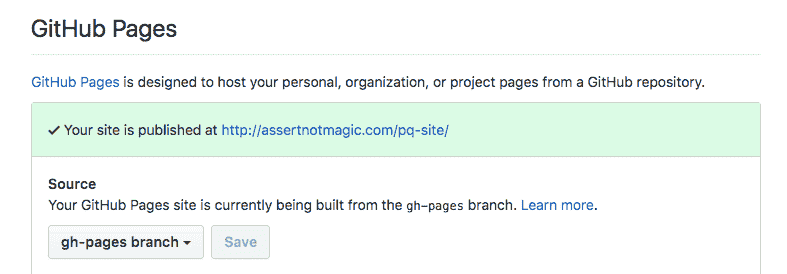

# 将单个目录发布到另一个分支

> 原文：<https://dev.to/rpalo/publish-single-directories-to-another-branch--l8b>

快速提示！

假设你和我一样。你一直在做一个 web 项目:HTML、CSS，可能还有一些 JavaScript。你完成了，你准备向世界展示你的项目，所以你想得到它的建立，编译，缩小，并把它放在某个地方。但是怎么做呢？`git subtree`。我带你去看。一个命令。

还有，你看到封面图片了吗？子树？哈！

让我们假设您有一个这样的项目:

```
my-dope-project
|- README.md
|- src
|   |- index.html
|   |- css
|       |- styles.sass
|   |- js
|       |- main.js
|       |- helper.js
|- dist
|- webpack.config.js
|- package.json
|- .gitignore
|- node_modules
    |- OMG so much stuff 
```

Enter fullscreen mode Exit fullscreen mode

或者什么的。我不知道你的生活。所以你用一个`npm run build`来建立你的网站。现在你的`dist`目录中充满了你漂亮的捆绑新网站。那么如何把它放在某个地方呢？

## 1。确保 dist 文件夹确实已签入您的 repo。

把它从你的`.gitignore`和`add/commit/push`中取出来。

## 2。使用子树，卢克(和/或莱娅)。

```
$ git subtree push --prefix dist origin gh-pages 
```

Enter fullscreen mode Exit fullscreen mode

这里，`dist`是你要发布的目录子树。`origin`是您推送的远程回购。`gh-pages`是您要推送的远程分支的名称。

然后转到您的 GitHub 并进入您的回购设置。

[T2】](https://res.cloudinary.com/practicaldev/image/fetch/s--p1PaCFt3--/c_limit%2Cf_auto%2Cfl_progressive%2Cq_auto%2Cw_880/https://assertnotmagic.com/img/gh-pages-settings.png)

将您创建的分支设置为公共分支。就是这样！去`<your-username>.github.io/<repo-name>`跳你的快乐舞吧！

我知道有一千种方法可以剥这只猫的皮，它们都有利弊。我真的很想分享这个特别的方法，因为我觉得它很棒。编码快乐！

* * *

*原载于 [`assert_not magic?`](https://assertnotmagic.com/2018/03/08/publish-directories-to-github-pages/)*