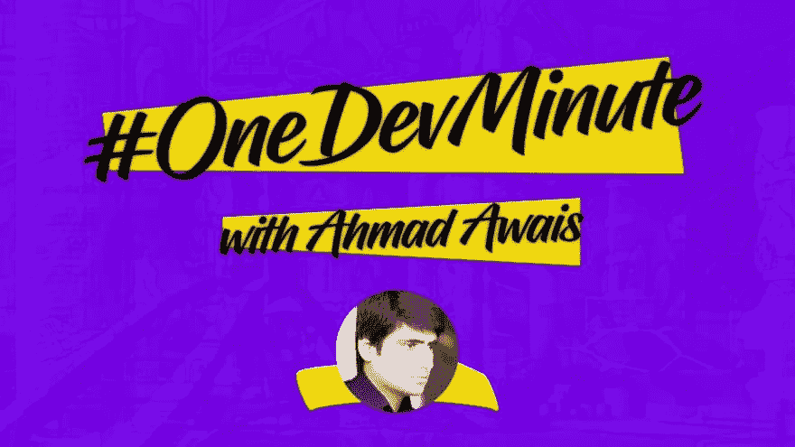

# pudl —用于快速原型制作的 JavaScript 静态站点生成器#OneDevMinute

> 原文：<https://dev.to/ahmadawais/pudl--javascript-static-site-generator-for-quick-prototyping-5bbp>

[`pudl`](https://github.com/maedahbatool/pudl) 是一个全新的基于 JavaScript 的静态站点生成器，我推荐您使用它来快速构建静态站点的原型。目前它只适用于 HTML 和 CSS，这两者都是通过为你编译`pug`和`sass`的`gulp`工作流生成的。

> 🌟确保您在 GitHub 上启动了 [`pudl`](https://github.com/maedahbatool/pudl) 回购。
> 【剧透预警】—v2 即将推出 webpack + JS 设置。

### 🐶pudl 能做什么？

1.  用 BrowserSync 实时重新加载浏览器。
2.  CSS:从 Sass 到 CSS 的转换，错误捕捉，自动修复和 CSS 缩小。
3.  监视文件中 CSS 的变化。
4.  更正行尾。
5.  注入 CSS 而不是重新加载浏览器页面
6.  向您发送消息通知。
7.  防止由错误引起的管道破裂。

```
# PREREQUISITE: Before getting started read all in this repo
# http://github.com/maedahbatool/pudl
# STEP #0: Download + Install → Node.js and npm https://nodejs.org/en/download/

# GETTING STARTED:
# Step #1: Download the Required Files by running the following command

curl -L https://git.io/pudlgfl -o "gulpfile.js" && curl -L https://git.io/pudlpkjs -o "package.json" && curl -L https://git.io/pudlgig -o ".gitignore" && curl -L https://git.io/pudlcg -o "config.js"

# Step #2: Editing the Project Variables config.js file according to your folder structure (Make sure to create style.scss and index.pug files)
# Step #3: Installing Node Dependencies by running
npm install

# Step #4: Finally run
npm start

# Step #5: Your site should be up on http://localhost:3000 
```

Enter fullscreen mode Exit fullscreen mode

> 📺在 [YouTube 上观看更详细的版本→](https://Youtu.be/Dc7LjO4ezr8)

我一直在推特上闲逛，让我们在那里做朋友吧→

> <video loop="" controls=""><source src="https://video.twimg.com/ext_tw_video/1047531128565981184/pu/pl/63LOrqaf6Llr3KmG.m3u8?tag=5" type="application/x-mpegURL"></video>艾哈迈德·阿瓦斯/🔜(vs code . pro)@ mrahmadawais🔥在一分钟内快速原型一个基于 pug + sass 的静态网站与这个 SSG 称为 pudl
> T25】🎩pudl — JavaScript SSG，用于研讨会中的快速原型制作
> 📺完整版:[Youtu.be/Dc7LjO4ezr8](https://t.co/iOJeJ78IDg)T29】📨简讯:[AhmdA.ws/tmpODM](https://t.co/b2AlhsNXni)T32】👩‍💻关注 dev {[@ maedabatool](https://twitter.com/MaedahBatool)}
> 
> 📯RT2018 年 10 月 03 日下午 17:07[](https://twitter.com/intent/tweet?in_reply_to=1047533645857247232)[](https://twitter.com/intent/retweet?tweet_id=1047533645857247232)[](https://twitter.com/intent/like?tweet_id=1047533645857247232)

> P.S .如果你喜欢我的作品，欢迎分享，喜欢。我在 twitter 上相当活跃，你可以在那里找到我讲的无聊笑话，也许[在 Twitter 上关注我](https://twitter.com/MrAhmadAwais)联系和[订阅我的 YouTube 频道→](https://YouTube/AhmadAwais)
> 
> 和平！✌️

如果你没得到什么，请在下面评论🗣️。