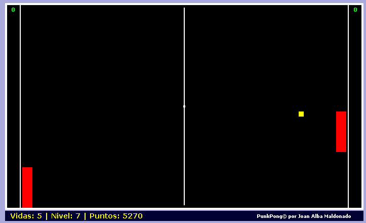

# JavaScript 中的乒乓游戏(2006 年 2 月)

> 原文：<https://dev.to/jalbam/punkpong--pong-game-in-javascript-february-2006-5dml>

“PunkPong”是一个完全用 DHTML (HTML，CSS 和 JavaScript)编写的开源 Pong 克隆。

[T2】](https://res.cloudinary.com/practicaldev/image/fetch/s--HSKLsk5X--/c_limit%2Cf_auto%2Cfl_progressive%2Cq_66%2Cw_880/http://dhtmlgames.com/punkpong/punkpong.gif)

这是我的第二个 DHTML 游戏，制作于 2006 年初。

它允许你使用鼠标或键盘来控制你的球拍。

尽管开始时非常容易，但每过一关难度就会慢慢增加，计算机将更难被击败。

你也可以通过编辑脚本开头的配置变量来改变游戏行为。

这个游戏根本不用任何图片，只用纯 HTML 和 CSS。

官方语言是西班牙语和英语。

你可以在互联网上找到这个游戏的其他修改和改编版本，包括一个 Opera 小部件，甚至一个 Drupal 模块。

这款游戏已经在 BeOS，Linux，NetBSD，OpenBSD，FreeBSD，Windows，Mac OS X，BlackBerry Tablet OS，Android，iOS 等平台下进行了测试。

在线英语游戏:[http://punkpong.tuxfamily.org/punkpong_english/](http://punkpong.tuxfamily.org/punkpong_english/)

英语在线游戏(镜像):[http://www.dhtmlgames.com/punkpong/punkpong_english/](http://www.dhtmlgames.com/punkpong/punkpong_english/)

西班牙语在线游戏:[http://punkpong.tuxfamily.org/punkpong_spanish/](http://punkpong.tuxfamily.org/punkpong_spanish/)

西班牙语在线游戏(镜像):[http://www.dhtmlgames.com/punkpong/punkpong_spanish/](http://www.dhtmlgames.com/punkpong/punkpong_spanish/)

官方网站:[http://punkpong.tuxfamily.org/](http://punkpong.tuxfamily.org/)(镜像在[http://www.dhtmlgames.com/punkpong/](http://www.dhtmlgames.com/punkpong/))。

这个库可以在 GitHub 上找到:[https://github.com/jalbam/punkpong](https://github.com/jalbam/punkpong)