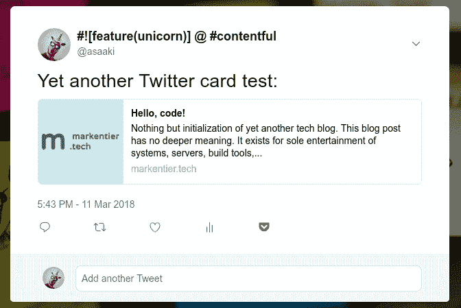

# 推，冲洗，重复，…

> 原文：<https://dev.to/asaaki/push-rinse-repeat---16jo>

*最初发布于 [markentier.tech](https://markentier.tech) 的[推送、冲洗、重复、…](https://markentier.tech/posts/2018/03/push-rinse-repeat/)T5】*

[T2】](https://res.cloudinary.com/practicaldev/image/fetch/s--gteqpEpc--/c_limit%2Cf_auto%2Cfl_progressive%2Cq_auto%2Cw_880/https://markentier.tech/posts/2018/03/push-rinse-repeat.png)

我已经很久没有启动博客或静态网站了。

有了 netlify 这样的服务，这就成了一项可以忍受的任务。

由于这个网站还没有受到太多的欢迎——它只存在了不到 24 小时——我甚至可以在现场和生产中玩这个游戏。就像过去 PHP-FTP 时代一样。

为了好玩，我已经为 Twitter 等社交媒体添加了一些元标签。

它应该看起来像文章图像。

这只是第二个相当无用的帖子，但我认为这对于新博客来说并不罕见。请耐心听我说，随后会有实际内容。因此有了这个新网站。；-)

*交叉发布到[媒体](https://medium.com/markentier-tech/push-rinse-repeat-1e277fa35942)。*