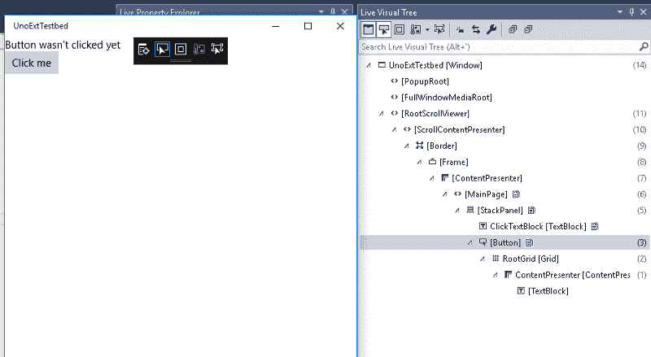
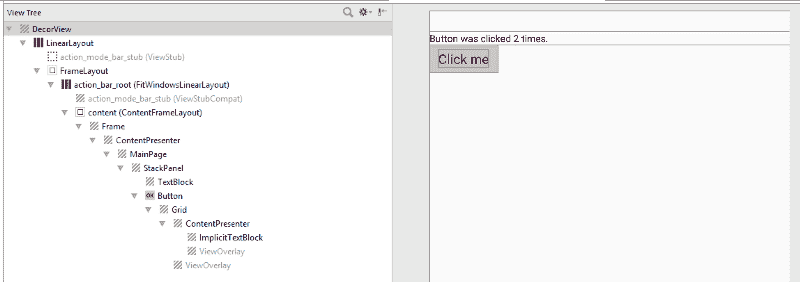
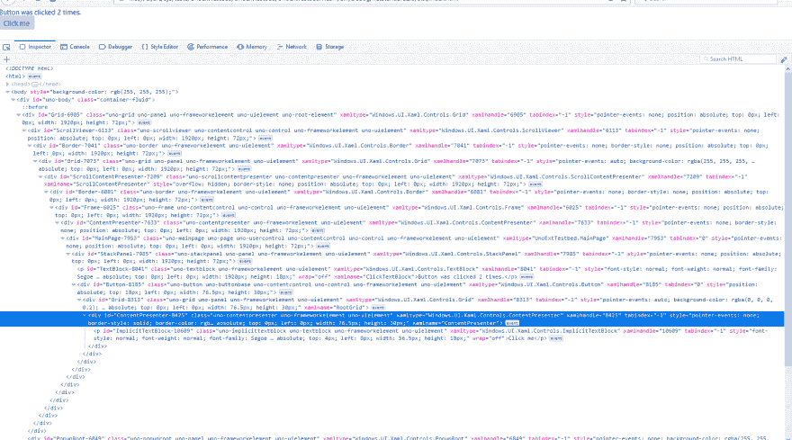

# 按下正确的按钮:Uno 如何实现视图

> 原文：<https://dev.to/uno-platform/pushing-the-right-buttons-how-uno-implements-views-57ld>

在[之前的一篇文章](https://medium.com/@unoplatform/under-the-hood-an-introduction-to-uno-platform-6064a765d6a)中，我概述了 [Uno 平台](https://platform.uno/)的三项主要工作，以便在 iOS、Android 和浏览器上运行 UWP 应用:

1.  解析 XAML 文件；
2.  实现数据绑定；
3.  为每个平台实现 [UWP 框架](https://docs.microsoft.com/en-us/windows/uwp/design/controls-and-patterns/controls-by-function)中的视图套件。

在这篇文章中，我想集中讨论最后一点。Uno 如何贯彻 UWP 的观点？作为一个案例研究，我将使用无处不在的 UI 控件，按钮。

### 这个数字上升了

我提出一个可以想象的最简单的交互应用程序，比“Hello World”高一步:

XAML:

```
<pre>&lt;Page x:Class="UnoExtTestbed.MainPage" 

  xmlns:x="http://schemas.microsoft.com/winfx/2006/xaml" 
  xmlns:d="http://schemas.microsoft.com/expression/blend/2008" 
  xmlns:mc="http://schemas.openxmlformats.org/markup-compatibility/2006" 
  mc:Ignorable="d"&gt;
&lt;StackPanel&gt; 
    &lt;TextBlock x:Name="ClickTextBlock" 
               Text="Button wasn't clicked yet" /&gt; 
    &lt;Button Content="Click me" 
            Click="Button_Click" /&gt; 
&lt;/StackPanel&gt; 
```

代码隐藏:

```
<pre>using System; 
```

使用 Windows。UI . Xaml
使用 Windows。UI . Xaml.Controls
namespace unexttestbed
{
public sealed partial class main Page:Page
{
public main Page()
{
this。initialize component()；
}
private int _ click count = 0；
私有 void Button_Click(object sender，routed eventargs e)
{
_ Click count++；
点击文本块。Text = $ "按钮被点击了{_clickCount}次。；
}
}

我使用 [Uno 解决方案模板](https://marketplace.visualstudio.com/items?itemName=nventivecorp.uno-platform-addin)制作了一个空白应用，并将这段代码放在主页上。每当点击[按钮](https://docs.microsoft.com/en-us/uwp/api/windows.ui.xaml.controls.button)，数字就会上升。再添加一点 chrome，我们就能有一个[病毒式的成功](https://en.wikipedia.org/wiki/Cow_Clicker)。

注意，XAML 在这里是有用的，但不是必须的，无论是在 UWP 还是在 Uno 上。如果我们真的想的话，我们可以用 C#定义和创建我们所有的视图。这种灵活性非常方便。

### 附录 A——视觉树

[T2】](https://res.cloudinary.com/practicaldev/image/fetch/s--nryWt8c4--/c_limit%2Cf_auto%2Cfl_progressive%2Cq_auto%2Cw_880/https://s3.amazonaws.com/uno-website-assets/wp-content/uploads/2018/08/20160015/Visual-Tree-information-for-UWP.png)

### 

*UWP 视觉树信息*

<figcaption>

<figcaption>

<figcaption>

[T2】](https://res.cloudinary.com/practicaldev/image/fetch/s--wZyzjYLM--/c_limit%2Cf_auto%2Cfl_progressive%2Cq_auto%2Cw_880/https://s3.amazonaws.com/uno-website-assets/wp-content/uploads/2018/08/20160007/Visual-Tree-information-for-Android.png)

*安卓视觉树信息*

[T2】](https://res.cloudinary.com/practicaldev/image/fetch/s--aoeOIQIM--/c_limit%2Cf_auto%2Cfl_progressive%2Cq_auto%2Cw_880/https://s3.amazonaws.com/uno-website-assets/wp-content/uploads/2018/08/17123932/visualtree-ios.png)

*iOS 的可视化树信息*

[T2】](https://res.cloudinary.com/practicaldev/image/fetch/s--L_SmJg8U--/c_limit%2Cf_auto%2Cfl_progressive%2Cq_auto%2Cw_880/https://s3.amazonaws.com/uno-website-assets/wp-content/uploads/2018/08/17124049/visualtree-wasm.png)

*WASM 视觉树信息*

那我们得到了什么？您可以在每个目标平台上看到生成的可视化树。它们基本上都相似。顶层包装略有不同，但在里面我们可以看到我们在 XAML 定义的`MainPage`、`StackPanel`、`TextBlock`和`Button`。(`Frame`是在项目模板附带的股票`App.xaml.cs`代码中创建的。)

您可能会注意到在`Button`中有几个额外的视图没有在 XAML 中明确定义。这些是按钮的[默认模板](https://msdn.microsoft.com/en-us/library/windows/apps/mt299109.aspx)的一部分。如果你不熟悉 UWP/WPF/Silverlight/etc 的控制模板的概念，关于主题的[有很多要说的，但是它的要点是任何从`Control`继承的视图都是一个白板，一个空容器，它将被其模板中定义的内部视图填充。(其中一些子视图本身可能是模板化的控件。)这是定制可重用控件外观的有力手段。](https://docs.microsoft.com/en-us/windows/uwp/design/controls-and-patterns/control-templates)

我们如何从 XAML 定义的逻辑树变成本地的可视化树？

让我们继续播放视觉教具。我们将创建一个继承自`Button`的空类，并看看它的继承层次。

```
  

             

            <p><em>Inheritance chains for the Button class on UWP, Android, iOS, and WASM</em></p> 
```

像视觉树一样，特定于平台的继承链在“向叶”端非常相似(事实上是相同的),在根端有点不同。让我们关注一下它们的不同之处:在 UIElement 类之后，UWP 的[基本视图类型](https://docs.microsoft.com/en-us/uwp/api/windows.ui.xaml.uielement)。

在 UWP 上，`UIElement`继承自 [DependencyObject](https://docs.microsoft.com/en-us/uwp/api/windows.ui.xaml.dependencyobject) ，它是支持使用 [DependencyProperty](https://docs.microsoft.com/en-us/windows/uwp/xaml-platform/dependency-properties-overview) 值进行数据绑定的类型的基类。

在 Uno。Android 和 Uno.iOS，任何`UIElement`都是原生基本视图类型( [Android)的实例。视图。视图](https://developer.android.com/reference/android/view/View)和 [UIKit。UIView](https://developer.apple.com/documentation/uikit/uiview) ，通过 [Xamarin](https://visualstudio.microsoft.com/xamarin/) 的魔力映射到托管类型。所以在 XAML 定义的视图也是本地视图。这意味着，例如，可以将对 Uno 一无所知的本地视图直接整合到应用程序的 XAML 中。以下内容适用于 iOS:

```
<Page x:Class="UnoExtTestbed.MainPage"

            ...

            xmlns:uikit="using:UIKit">

    ...

    <StackPanel>

            <uikit:UILabel Text="Native label"/>

    </StackPanel>

</Page>
```

这在 Uno 中是非常容易做到的。我们谈论“留有退路”:目标是 100%代码重用，但是如果你必须使用特定于平台的特性或视图库，灵活性就在那里。

但是等等，`DependencyObject`呢？

因为这是 UWP 合同的重要部分，我们不想把`DependencyObject`排除在外，但是我们也必须能够支持根本不是视图的`DependencyObjects`。([笔刷](https://docs.microsoft.com/en-us/windows/uwp/design/style/brushes)和[变换](https://docs.microsoft.com/en-us/windows/uwp/design/layout/transforms)，仅举几例。)因此在 Uno 中`DependencyObject`被定义为一个[接口](https://github.com/nventive/Uno/blob/39b0046ddc34cb3f023eff8db7c6e5ebc16ca670/doc/articles/api-differences.md#dependencyobject-is-an-interface)。然而，这是一个“特殊”的接口:Uno 的代码生成会在找到像`MyDependencyObject : DependencyObject`这样的类时自动添加支持方法，允许为 UWP 编写的代码在大多数情况下“正常工作”我将在以后关于 Uno 中的代码生成的文章中详细讨论它。

在 WebAssembly 中，现在继承层次稍微简单一些，并且`UIElement`位于类型树的根。截图中可以看到，Uno。WASM 正在为视觉树中的每个视图生成`<div>`元素。

### 风格点

上面的代码为我们提供了一个非常普通的按钮，但是我们可以很容易地增加它的趣味。我们将`Content`属性设置为一个文本字符串，但是`Content`可以是任何东西，甚至是另一个视图。我们的按钮可以是一个[图像](https://github.com/nventive/Uno.Playground/blob/master/src/Uno.Playground.Shared/Samples/Image.xaml)，一个[形状](https://github.com/nventive/Uno.Playground/blob/master/src/Uno.Playground.Shared/Samples/Shapes.xaml)，或者一个复杂的视觉层次。它甚至可以有另一个按钮在里面。

如果我们想反方向走呢？如果我们想完全放弃对按钮外观的控制呢？

Uno 实施的许多控制措施(包括在内)支持“本地”风格的概念。你得到的不是一个在你的应用程序的所有版本中都一致的按钮，而是一个目标平台的用户所期望的按钮。

它通过设置一个预定义的[样式](https://docs.microsoft.com/en-us/windows/uwp/design/controls-and-patterns/xaml-styles)来支持，该样式将本地控件的一个实例放入 XAML 控件中。在上面的代码中，我们可以写:

```
<Button Content="Click me"

                Click="Button_Click"

      Style="{StaticResource NativeDefaultButton}" />
```

由于 Android 的默认按钮看起来与 UWP 的非常相似，我将使用不同的控件 [ToggleSwitch](https://docs.microsoft.com/en-us/uwp/api/windows.ui.xaml.controls.toggleswitch) 来展示一个更直观的例子。我将使用来自 [Uno 画廊](https://github.com/nventive/Uno.Playground#uno-playground)应用的[样本](https://github.com/nventive/Uno.Playground/blob/master/src/Uno.Playground.Shared/Samples/ToggleSwitch.xaml)。

```
  

             

            <p><em>Uno’s ToggleSwitch control on Android and iOS, using default and native styles.</em></p> 
```

默认风格的`ToggleSwitch`在所有平台上看起来都一样，无论是静态的还是动态的。然而，在 Android 和 iOS 上，`NativeDefaultToggleSwitch`风格的`ToggleSwitch`复制了每个平台的原生切换控制。当然，您仍然可以像往常一样绑定到它在 XAML 的属性。这是另一个强大的选择:对于一些应用程序来说，看起来尽可能“原生”是有意义的，对于其他应用程序来说，拥有一个丰富的、定制的用户界面是可取的。你甚至可能想在你的应用中为不同的屏幕混合搭配不同的方法。使用 Uno 很简单。

### 我不喜欢纽扣怎么办？

事实上`UIElement`实现了类似 [PointerPressed](https://docs.microsoft.com/en-us/uwp/api/windows.ui.xaml.uielement.pointerpressed) 、`PointerReleased`等原始交互事件，所以 Uno 中的所有视图都可以处理触摸/点击，而不仅仅是`Button`。(除了 MVVM 友好的`Command`属性之外，使用`Button`的最大好处是它实现了[视觉状态](https://docs.microsoft.com/en-us/previous-versions/windows/apps/jj819808%28v=win.10%29)来激活你的按钮。)

还有很多要谈的，比如 UWP 的 API 被连接到每个平台的原生输入检测的方式，或者 about 是如何完成的，但现在就这些了。

试用 Uno，[如果有任何问题，请联系我们](https://gitter.im/uno-platform/Lobby)。

帖子[按下正确的按钮:Uno 如何实现视图](https://platform.uno/pushing-the-right-buttons-how-uno-implements-views%e2%80%8a/)首先出现在 [Uno 平台](https://platform.uno)。

</figcaption>

</figcaption>

</figcaption>