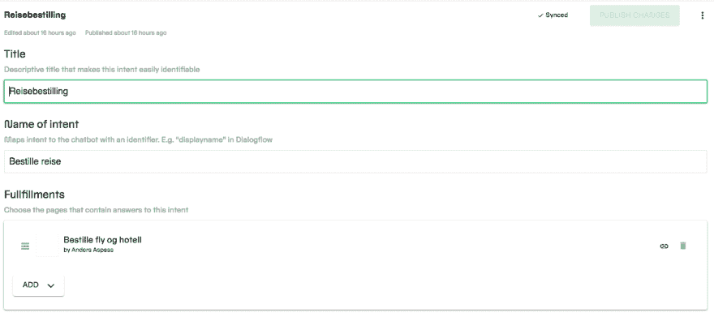
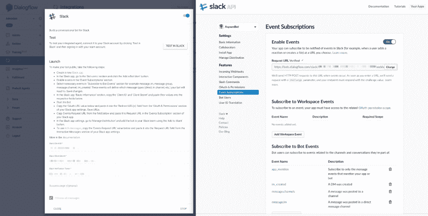

# 把你的聊天机器人放在你的无头 CMS 所在的地方

> 原文：<https://dev.to/sanity-io/put-your-chatbot-where-your-headless-cmsis--153d>

* * *

抬起头来！你需要掌握一些 JavaScript 知识来完成本教程，但是我们如何考虑将聊天机器人集成到 CMS 中仍然很有趣。

 
*图:让聊天机器人和对话用户界面成为你的内容管理系统的一部分。*

一个[无头内容管理系统](https://en.wikipedia.org/wiki/Headless_CMS)的想法是将你的内容从网页的约束中分离出来，以便在许多上下文中重用它。即使当你只想在网页上显示你的内容时，这也是有意义的，因为你可以以一种内容可以在许多页面上重用的方式来组织它，并且当更有趣的东西出现时，更容易切换你的前端代码。然而，当您设法在不同的界面中重用您的内容时，headless 的真正威力就显现出来了。

聊天机器人已经成为科技热潮的一部分有一段时间了，随着工具和人工智能模型变得越来越完善，需求似乎也在增加。Google 的 Dialogflow 刚刚推出了对我的母语挪威语的支持，这为我做一些实验提供了一个很好的借口。我一直在思考如何用我们在 [Netlife](https://www.netlife.com) 使用的无头 CMS 实现聊天机器人响应，这是理智的([在这里阅读更多关于我们为什么选择理智的信息](https://hackernoon.com/headless-in-love-with-sanity-689960571dc))。我想我找到了一种易于实现和维护的模式。

总之，您需要:

1.  在[对话流](https://console.dialogflow.com/api-client/)中设置代理
2.  在 Slack 中制作一个[自定义 app，](https://api.slack.com/apps)[将其连接到 Dialogflow](https://dialogflow.com/docs/integrations/slack)
3.  在 Sanity 中添加一些意图和实现模式
4.  用无服务器服务连接 Sanity 和 Dialogflow，在本例中是 [webtask.io](https://webtask.io/make)

## 一、在 Dialogflow 中做代理和意向

一旦登录到 Dialogflow，选择*创建新代理*并给它一个名称，选择适当的设置(我选择了 V2 API)。在我的例子中，我想做一个聊天机器人，可以将我们公司的内部网与 Slack 连接起来。我以我们的参谋长命名(当然，这个角色永远不可能完全自动化)。

一旦你创建了一个新代理，转到*意向*并选择*创建意向*按钮。你可以把“意图”理解为“用户想要做或者已经回答的某件事情”。我的意图是得到一个关于我们如何在网上生活图书旅行的答案。给意图一个描述性的名称；我们将明智地使用这个名称来映射正确的内容。填写不同的培训短语，这些短语是您的用户会写或说的示例。)以便请求所述信息。在这种情况下，它是“我如何预订旅行”等等的变体。希望在谷歌的机器学习算法能够将用户导向这一意图之前，你不需要输入许多选项。你可以在右边栏测试它的效果。

[T2】](https://res.cloudinary.com/practicaldev/image/fetch/s--KiAYMZmF--/c_limit%2Cf_auto%2Cfl_progressive%2Cq_auto%2Cw_880/https://thepracticaldev.s3.amazonaws.com/i/2z3hzf6pxif25psj895n.png)

*图:在 Dialogflow 中设置一个意图，在右边栏中测试它。在这里，我用挪威语为问题“我如何预订旅行”设置了替代选项*

你可以在 Dialogflow 的*回复*部分写出不同的可能答案，但这有什么意思呢？相反，打开*启用 webhook 调用用于此目的*。这将使 Dialogflow 向您在*完成*部分输入的任何 URL 发出请求。当我们在 webtaks.io 中设置我们的微服务时，我们将回到这一点。

## 二世。在 Slack 中制作一个自定义应用程序，并将其连接到 Dialogflow

如果你去 Dialogflow 左边栏的*集成*，你会发现它可以与许多不同的服务集成。设置将与他们中的大多数非常相似，但我们希望松弛。严格遵循松弛盒中*设置*的指示。我说的“密切”是指你应该花时间阅读说明书并试着理解它们。

 
*图:确保给 Slack bot 必要的事件订阅。*

您的 Slack-bot 将需要一些身份验证和事件订阅，以便能够在 Slack 中读取您的查询。你可以让它听所有的对话，但我更喜欢它只回答直接或间接的信息。部分原因是我不希望机器人在谈话中意外触发，部分原因是我不希望在没有非常好的理由的情况下，在我们谈话的每一行都输入 Dialogflow。

## 三世。在理智中为意图和实现添加一些模式

如果你还不熟悉理智，去尝试一下，15 分钟后回来。Sanity 中的内容模式(即文档类型和输入字段)是作为带有一些简单转换的 JavaScript 对象编写的。我们将通过为*意图*创建一个类型，并在我们的 intranet-post-type 中为*完成*添加一个内容字段，来进行一个非常简单的设置。

在我们为内部网写文章的 post 类型中，我添加了一个名为*fulfillments*的数组字段，它由一个简单的*字符串*字段组成。为了支持不同客户的消息，我们可以使它更复杂；例如，[我们可以有一个用于语音接口](https://developers.google.com/actions/reference/ssml)，一个用于带附件的[松弛响应](https://api.slack.com/docs/messages/builder)，一个用于[脸书信使模板](https://developers.facebook.com/docs/messenger-platform/send-messages/templates)。这一次，我们将保持简单，只用一些简单的文本响应就可以了。