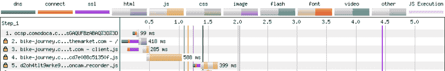
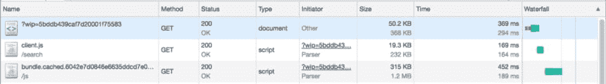
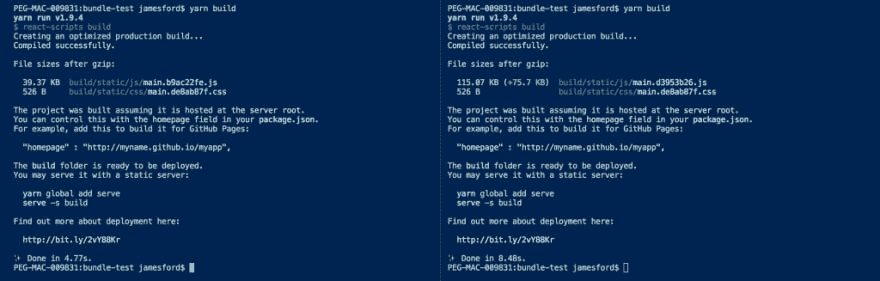
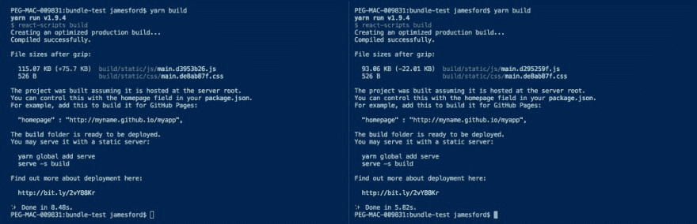
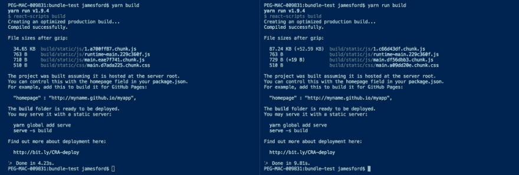

# 让我们的组件库节食。

> 原文：<https://dev.to/psyked/putting-our-component-library-on-a-diet-gfb>

#### 性能很重要，还有“休斯顿，我们有个问题。”

<figure>[](https://res.cloudinary.com/practicaldev/image/fetch/s--tLqR_KQM--/c_limit%2Cf_auto%2Cfl_progressive%2Cq_auto%2Cw_880/https://cdn-images-1.medium.com/max/1024/1%2A-urAq0XXMQ4RSLRAiP600Q.jpeg) 

<figcaption>照片由[伯纳德·赫尔曼](https://unsplash.com/photos/bSpqe48INMg?utm_source=unsplash&utm_medium=referral&utm_content=creditCopyText)上[下](https://unsplash.com/search/photos/balloon?utm_source=unsplash&utm_medium=referral&utm_content=creditCopyText)</figcaption>

</figure>

一组共享的组件是一个好主意，只要使用这些组件不会使您的客户端应用程序膨胀。这是一个简短的故事，讲述了我们是如何出错的，问题的原因是什么，以及我们是如何解决的。

#### 简介

在 c[omparethemarket.com](http://tech.comparethemarket.com)我们制作了一个 React 组件的内部库，在我们网站的不同部分使用，这是我们称之为“内部采购”的策略的一部分这是一个让我们的网站保持一致的好主意，但是我们很快意识到我们在性能、页面权重和下载时间上有一点问题。

<figure>[](https://res.cloudinary.com/practicaldev/image/fetch/s--1EP-jkEm--/c_limit%2Cf_auto%2Cfl_progressive%2Cq_auto%2Cw_880/https://cdn-images-1.medium.com/max/930/1%2AGP4hZgcAS1FRAoOs6NEj1A.png) 

<figcaption>一张来自 WebPageTest.org</figcaption>

</figure>

的网络图截图(裁剪)

<figure>[](https://res.cloudinary.com/practicaldev/image/fetch/s--ltxdR3mK--/c_limit%2Cf_auto%2Cfl_progressive%2Cq_auto%2Cw_880/https://cdn-images-1.medium.com/max/1024/1%2AtJ0KsYyUuJHv1N5niwnztA.png) 

<figcaption>一张来自 Chrome DevTools</figcaption>

</figure>

的(裁剪)截图

截图(上图)显示了我们的一个页面的一些统计数据，这个页面使用了我们组件库的早期版本。由此我们可以看出，加载我们的页面所需的 Javascript 文件大小约为 300 KB，并且在客户的浏览器上解压缩为 1.2 MB 的原始代码。😱

如上面的 WebPageTest.org 快照所示，这个文件的指示性性能影响大约为半秒钟。这是半秒钟的时间，浏览器除了下载、解析和执行这个文件之外什么也不做，在此期间，它什么也不向用户显示。

> 一般来说，大多数网站性能问题是前端问题，而不是硬件或网络问题。

[绩效黄金法则](https://www.stevesouders.com/blog/2012/02/10/the-performance-golden-rule/)

这个文件实际上是一个呈现整个页面的 React 应用程序。它是呈现阻塞的，这意味着它必须被浏览器下载并解析，然后页面上的任何内容才能显示，因此这一个文件是一个很大的性能问题。

### 页面大小很重要

关于页面速度和性能的一切都是混合在一起的，但是 Javascript 文件大小是一个很好的指标，可以显示文件下载、被浏览器解析然后执行需要多长时间。

对于我们的 Javascript，有一定量的文件大小是我们无法避免的。我们需要像 React 这样的库来提供我们正在开发的体验，一个共享的组件库是一个明智的想法，但是如果我们的输出包太大了，某个地方就会出现可怕的错误。—在某些情况下，我们看到关于添加单个按钮时引入了 **+500Kb** 文件大小的报告，所以有些事情是不正确的。

### 实验驱动开发

为了进一步了解发生了什么，我们创建了一个简单的 React 应用程序，查看了应用程序的大小，添加了一个单独的(样式化的按钮)组件，并再次查看了应用程序的大小。

作为默认构建过程的一部分，create-react-app 工具输出了一些相当不错的指标，因此这成为了我们测试我们的库对构建规模的影响的快速、简单、无副作用的环境。(很有可能在生成这些报告的代码的其他地方也有问题，所以有一个可靠的基准很重要。)

<figure>[](https://res.cloudinary.com/practicaldev/image/fetch/s--XweXtKlP--/c_limit%2Cf_auto%2Cfl_progressive%2Cq_auto%2Cw_880/https://cdn-images-1.medium.com/max/1024/1%2AClStjmpOU1aVgY8WToWyBw.png) 

<figcaption>左边:开箱即用的 app。右边:添加了单个组件。</figcaption>

</figure>

虽然没有压缩到+500 KB，但是对于一个单一样式的按钮来说，75 KB 仍然是过多的代码。查看输出包，很快就可以清楚地看到，当我们包含任何组件时，我们还会获得十几个其他组件的源代码，这些组件的源代码也包含在我们的库中，但实际上并没有被我们的示例应用程序使用。不太好。

<figure>[](https://res.cloudinary.com/practicaldev/image/fetch/s--AAOrNvQW--/c_limit%2Cf_auto%2Cfl_progressive%2Cq_auto%2Cw_880/https://cdn-images-1.medium.com/max/1024/1%2AjIJwzDv3t26povgiIjAo3Q.jpeg) 

<figcaption>照片由[马库斯·斯皮斯克](https://unsplash.com/photos/466ENaLuhLY?utm_source=unsplash&utm_medium=referral&utm_content=creditCopyText)上[下](https://unsplash.com/search/photos/dead-code?utm_source=unsplash&utm_medium=referral&utm_content=creditCopyText)</figcaption>

</figure>

#### 树摇动/死码消除

所有这些未使用组件的额外代码增加了我们的捆绑包大小，但我希望 web pack——通过其对[死代码消除](https://webpack.js.org/guides/tree-shaking/)的本机支持——自动删除未使用的库代码，并提供一个更优化的捆绑包。

[通过摇晃树来减少 JavaScript 负载|网络基础|谷歌开发者](https://developers.google.com/web/fundamentals/performance/optimizing-javascript/tree-shaking/)

那么，为什么没有呢？

这个问题的答案很复杂，对我们的项目来说相当具体，但它涉及到我们的 Babel 配置、我们的 CommonJS 输出格式和我们对 CSS 模块的使用。所有这些元素结合起来创建了库捆绑包，从根本上说，Webpack 无法撼动它。

那么，我们如何构建一个树抖动库包呢？

### 一个更好的捆绑器…用 rollup.js

在对 Webpack 的不同选项和配置进行了大量实验后，我们最终意识到，在构建我们的库组件包时，它是“不合适的工具”。作为替代，我们选择了 [rollup.js](https://rollupjs.org/guide/en) ，它在生产支持死代码消除的库捆绑包方面做得更好。

[rollup.js](https://rollupjs.org/guide/en)

我们的消费者应用程序仍然使用 Webpack 来打包我们的最终 React 应用程序，但现在使用 rollup.js 来打包我们的库包意味着当 Webpack 编译其输出时，它能够对我们的库代码进行树型分析，并删除不使用的组件。

最后的结果呢？

在我们的示例项目中，切换到 Rollup 捆绑库可以立即从 75 KB 中节省额外的 22 KB(几乎 30%)，而示例应用程序本身几乎没有任何变化。

<figure>[](https://res.cloudinary.com/practicaldev/image/fetch/s--LsYwjhhb--/c_limit%2Cf_auto%2Cfl_progressive%2Cq_auto%2Cw_880/https://cdn-images-1.medium.com/max/1024/1%2AIfqILOaabFh4BSnX1HcOIQ.png) 

<figcaption>左边:使用我们用 Webpack 打包的库创建-反应-app，右边:使用用 rollup 打包的库。</figcaption>

</figure>

更令人兴奋的是，当我们将这个更新后的库应用到现实世界的例子中时，产生了接近 60%的总文件大小的优化:

```
File sizes after gzip:

 287.02 KB (-430.7 KB) build/static/js/main.5978ff57.js 
```

从我们的输出包中节省了 430.7 KB ，这要归功于使用了一个树可摇动的 React 组件库，它与正确配置的 Rollup 捆绑在一起，而不是我们现成的 Webpack 配置。

### 总结

我们的 React 组件库是几个项目的自然发展的一部分，但是我们忽略了我们正在构建的代码的性能影响，它很快就像滚雪球一样，对包含它的项目产生了有害的影响。

这个问题的根本原因是我们的捆绑策略，以及它不能确定哪些代码是呈现组件所必需的，所以它总是包含所有内容。

解决方案是将我们的捆绑策略转变为 Rollup，并将我们的 Babel 配置改变为更好地支持死代码消除的配置。

Webpack 是一个不错的工具，但它必须正确配置并用于正确的任务，并且由于我们项目发展的渐进性，我们的设置并不合适。暂停、评估并花一些时间关注我们的构建过程，使我们能够取得这些成果。

### 关键要点

*   Javascript 语法模式，比如 CommonJS，在代码捆绑器中消除死代码时有不同的副作用。
*   Webpack 适合捆绑项目，但 Rollup 更适合库。
*   不管你使用的是 Webpack 还是 Rollup，你仍然需要 Babel。巴别塔构型对结果影响最大。
*   测试，测试，再测试，在一个代表你预期的客户工作环境的环境中进行测试。

### 奖励:创建-反应-应用 2 &网络包 4

自从最初撰写本文以来，我们已经让客户更新到使用 [create-react-app](https://github.com/facebook/create-react-app) 版本 2 和 Webpack 4，这为我们的包大小和性能带来了更多好处，而没有额外的代码更改。

在我们的示例应用程序中，使用版本 2 重复测试会产生以下结果:

<figure>[](https://res.cloudinary.com/practicaldev/image/fetch/s--Z0_Dw7h5--/c_limit%2Cf_auto%2Cfl_progressive%2Cq_auto%2Cw_880/https://cdn-images-1.medium.com/max/1024/1%2A2JGy_KCP4AB-c-MooUlH0g.png) 

<figcaption>左边:创建-反应-app 2，右边:带库添加</figcaption>

</figure>

这里有一个在 **create-react-app** 版本 1.1.4 上输出的包大小的真实例子:

```
File sizes after gzip:

188.49 KB build/static/js/main.53169928.js
 112.37 KB build/static/js/BasicQuestions.9168ec4c.chunk.js
 110.43 KB build/static/js/ComplexQuestions.5706b399.chunk.js
 110.4 KB build/static/js/SubQuestions.194d1d33.chunk.js
 110.3 KB build/static/js/CustomQuestions.736521d5.chunk.js

File sizes after gzip:

255.75 KB build/static/js/main.b68bc851.js
 846 B build/static/css/main.a86b8cd7.css 
```

同样的真实项目，这次使用的是 **create-react-app** 版本 2:

```
File sizes after gzip:

112.58 KB build/static/js/7.58c36855.chunk.js
 66.56 KB build/static/js/0.72b13458.chunk.js
 65.62 KB (-122.87 KB) build/static/js/main.20b9faa3.chunk.js
 40.56 KB build/static/js/1.ac53a9a6.chunk.js
 3.32 KB (-109.06 KB) build/static/js/BasicQuestions.6df1fce5.chunk.js
 1.47 KB (-108.96 KB) build/static/js/ComplexQuestions.61562335.chunk.js
 1.44 KB (-108.97 KB) build/static/js/SubQuestions.d5066422.chunk.js
 1.24 KB (-109.06 KB) build/static/js/CustomQuestions.b2e5a8af.chunk.js
 1.24 KB build/static/js/runtime~main.6da60b22.js

File sizes after gzip:

156.02 KB build/static/js/1.c932bec8.chunk.js
 89.89 KB (-165.86 KB) build/static/js/main.2f744215.chunk.js
 837 B (-9 B) build/static/css/main.8ee9f0fa.chunk.css
 763 B build/static/js/runtime~main.229c360f.js 
```

一个“简单”的升级，实现了共享代码库的更智能的包分裂，我们已经在整个站点上自动保存了 100 多 KB，这是非常整洁的。👍

* * *