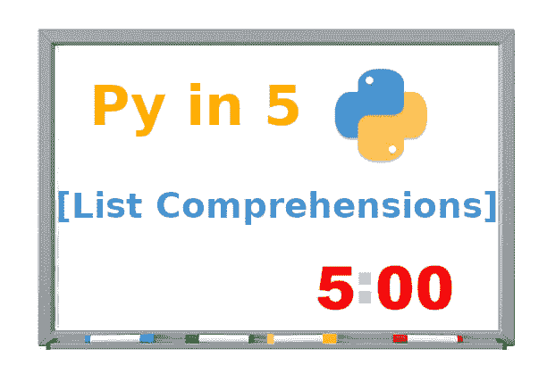

# Py in 5:列出理解

> 原文：<https://dev.to/kaelscion/py-in-5-list-comprehensions-4f93>

[T2】](https://res.cloudinary.com/practicaldev/image/fetch/s--uK58bXLv--/c_limit%2Cf_auto%2Cfl_progressive%2Cq_auto%2Cw_880/https://thepracticaldev.s3.amazonaws.com/i/tj40fi2k71bsne1s5i4i.jpg)

> ***原载于编码鸭博客:【www.ccstechme.com/coding-duck-blog】T2*T5】**

今天的话题？列出理解！用 python 方式处理列表的 python 方式。

好的，杰克，是的，蟒蛇之类的。我们明白了

但是*做*你呢？我是说你真的这么想吗？例如，你知道不仅有列表理解，还有字典*和*集合理解吗？

你猜怎么着是啊，你可能有。根据上面对“pythonic”的厚颜无耻的过度使用，大多数熟悉该语言的人都知道它非常重视一行程序。我觉得，列表/字典/集合理解是这些一行程序中最常见的。但是他们真正在做什么呢？虽然这篇文章将专门讨论列表理解，但是这些相同的概念也可以应用于其他类型的理解，只是有些不同。如果你也想对其他类型的理解发表评论，请留下你的评论。但是鉴于我只有 5 分钟的时间，请允许我回答你关于清单的问题。

```
 umm....was I supposed to type something here... 
```

Enter fullscreen mode Exit fullscreen mode

不开玩笑，代码样本并不完全是解释理解所必需的。真的是因为对他们来说没有那么多神秘感。基本上，理解是分配给变量的流控制和条件的包装。

现在为了子孙后代，我将提供一个代码示例，向您并排展示这些不同的方法:

```
 this_string = 'thisstring'

#traditional list building 
a_list = []

for i in this_string:
    a_list.append(i)

#list_comprehension 
b_list = [i for i in this_string] 
```

Enter fullscreen mode Exit fullscreen mode

看出区别了吗？这两种情况下完成的事情完全相同:我们遍历一个字符串并将每个字母追加到一个列表中。不同之处在于我们用更少的代码行来完成。

看它的工作方式，本质上，是把循环的逻辑放在括号“[]”之间，这告诉解释器“嘿，我想把这里的东西列成一个列表”。但是语法有点奇怪，对吗？如果你把它分解就不会了。

本质上，for 循环的语法是这样的:“对于这个其他项目块(this_string)中的每个项目(I)，执行这个操作(a_list.append(i))。

一个理解是这么说的，但更像是这样:“我要你对这组其他项(this_string)中的每一项(I)执行这个动作(I)，并把它存储在一个列表中。”

大多数人感到困惑的地方，或者根本不去想引擎盖下到底发生了什么，就是“[我为我.....]'位。有时候，我甚至只是出于反射，打一些类似的东西。但是通过说“[我为我.....]'你实际上是在说“每次你看到它时保持 T2 和 T3 的原样”

我来给你澄清一下:

```
 this_list = ['t\n', 'h\n','i\n', 's\n', 's\n','t\n','r\n','i\n','n\n','g\n']

b_list = [i.strip() for i in this_list] 
```

Enter fullscreen mode Exit fullscreen mode

在本例中， *b_list* 输出的内容与第一个例子中的完全一样，但是我们在第一个 *i* 上添加了 strip()函数。如果我们键入[i for i in this_list]，这些换行符(' \n ')将会保留在新列表中。为什么？因为[我为我.....]表示“保持 I 原样”，而[i.strip()表示 I.....]的意思是“在进行过程中，从‘I’中删除换行符，好吗？”如果我们为 I 指定了[i.upper().....]，我们会告诉 python“I 要大写，好吗？”等。基本上，当你第一次抛出迭代器(I)时，你是在告诉 Python 在构建链表时该怎么做。你甚至可以将(i) *放入一个函数*中:

```
 def silly_function(item_to_do_silly_things_to):
    s = f"For that which I say to you sir: {item_to_do_silly_things_to}!!!"
    return s

this_list = ['t\n', 'h\n','i\n', 's\n', 's\n','t\n','r\n','i\n','n\n','g\n']

b_list = [silly_function(i) for i in this_list] 
```

Enter fullscreen mode Exit fullscreen mode

这个列表现在将包含句子*“为了我对你说的话，先生:t\n！！!"*一直到*“为了我对你说的话，先生:g\n！！！!"*，将(this_list)中的每个字符插入句尾。

好的，我们可以在一行中迭代一些东西，然后列出一个列表。列表理解还能做什么？实际上，你可以在一个标准循环中做很多事情。我们可以添加像“if”语句这样的条件句，使用多个函数，甚至在列表中的每个项目上执行计算。我将会更深入地探讨列表理解及其能力和局限性，当你开始听到警钟*也许*列表理解并不是给定情况下的正确选择时。

在那之前，我希望这已经澄清了什么是列表理解，并且给了你列表有用的浅显版本。给他们一个机会。尝试一下，看看你能否在你的个人项目中替换一些 for 循环。一如既往，继续编码，继续建设，尽量不要再建一个社交媒体网站。我是认真的。我知道他们可以有 4 名员工，但没有任何收入，而且 ***仍然被脸书以超过 10 亿美元的价格收购*** 。但是，我连自己的自拍都不喜欢，更别说看到**除了**我不喜欢或者 15 年没说过话的人的自拍什么都没有了。我不是不在乎你最小的狗的三岁生日，只是...不，事实上是这样。从我们 6 岁起我就没和你说过话，我也没见过你的狗。我真的不在乎这是他的第三个生日。

所以，如果你被冠以“年轻人”、“新人”、“实习生”、“咖啡爱好者”、“菜鸟”(我们都有过这样的首相，他仍然喜欢 NCIS，称人们为“菜鸟”)。我也不明白所以你不是一个人)，或者任何其他让你觉得自己渺小、愚蠢或不足的名字；丢掉这个头衔，像你能学到任何东西一样去追求你所追求的职业。我爸一直这么跟自己和兄弟们说，我也传给你们: ***对自己知道的要谦虚，对自己能学到的要自大。*** 。没有什么是超越你的，所以继续建设，继续学习，一如既往，世界需要你。