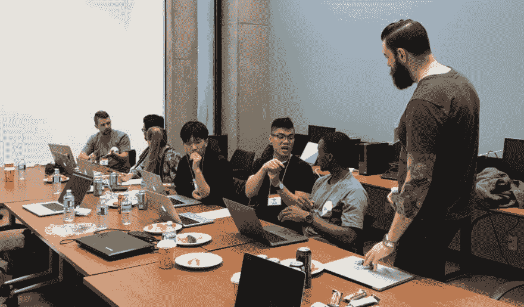

# QlikHacks 2018 —渥太华黑客马拉松

> 原文：<https://dev.to/qlikbranch/qlikhacks-2018an-ottawa-hackathon-3gbl>

### QlikHacks 2018 —渥太华黑客马拉松

<figure> 

<figcaption>我在渥太华的解码黑客马拉松</figcaption>

</figure>

> “嘿，我看了你在[渥太华 JS](https://www.meetup.com/Ottawa-JavaScript/events/dwlbtlywpblb/) 做的一个演讲。你在那家排队公司工作，对吗？”

这在渥太华对我来说是很平常的事，而且我肯定不是唯一一个。Qlik 有很多优秀的员工在 Kanata 工作，但在渥太华很少有人知道 Qlik 是谁，Qlik 是做什么的，甚至不知道它的发音是“click”

> 我们想做一些事情来解决这个问题，同时连接渥太华的开发者和设计师社区，让世界变得更美好。
> 
> 我们的解决方案？
> 
> Qlik 渥太华办事处的黑客马拉松！！！从 10 月 19 日(星期五)到 10 月 21 日(星期日),我们将邀请渥太华的开发人员和设计人员参加一个非常有趣的黑客马拉松。🎉请放心，当我们说开发人员和设计人员时，我们的意思是邀请所有的开发人员和设计人员。

不管你的技能是什么，不管你是学生还是专业人士，我们都希望你能参与进来。不需要知道 Qlik 或者 [Qlik 分支](https://developer.qlik.com)，不需要知道 JavaScript，什么技能都可以进来，玩得很开心。

我现在不会说太多细节，但在 Qlik，我们非常认真地对待我们的企业社会责任。正因为如此，我们正与联合国合作，以充分利用这次黑客马拉松🌍一个更好的地方。

### 你在吗？我们希望如此。这是活动时间表…

#### 十月十九日星期五

我们将在晚上以一个有趣的见面会开始黑客马拉松。我们会吃东西，就我们是谁以及在黑客马拉松期间会发生什么做一些演讲，然后是音乐和社交，这样你就可以见到你的黑客马拉松参与者同伴和潜在的队友。

#### 十月二十日星期六

上午 9 点，我们将从详述一些必需品的研讨会开始，然后艰苦的工作开始。早餐、午餐、晚餐、小吃、茶点和一些娱乐都将由我们提供。我们将为您提供一整天的时间，并安排导师随时帮助您应对可能遇到的任何挑战。我们将在晚上 11 点左右关闭商店，以便您有时间回家休息一天。

#### 10 月 21 日星期日

从上午 9 点开始，你将有机会在展示你的结果之前完成你的工作，并让评委决定哪支队伍将把奖品带回家。是的，没错，我们甚至有奖品。🏆

> 我们对此感到非常兴奋，希望你也能加入。要报名参加这一盛事，请访问[http://bit.ly/QlikHack18](http://bit.ly/QlikHack18)。如果你有任何问题，你可以打电话到 rie@qlik.com[联系我。那里见！](//mailto:rie@qlik.com)

* * *