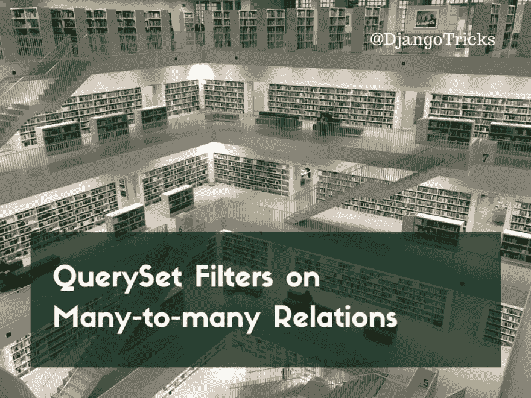

# 查询在多对多关系上设置过滤器

> 原文：<https://dev.to/djangotricks/queryset-filters-on-many-to-many-relations-1igm>

[T2】](https://res.cloudinary.com/practicaldev/image/fetch/s--1u4tkTx7--/c_limit%2Cf_auto%2Cfl_progressive%2Cq_auto%2Cw_880/https://3.bp.blogspot.com/-B3GL7u_3E8s/WwslYhpiIRI/AAAAAAAAB2g/xABz2VjIWj0C-xkreg1QuVLtvmizA-Z3wCLcBGAs/s1600/queryset-filters-on-many-to-many-relations.png)

Django ORM(对象关系映射)使得查询数据库变得如此直观，以至于有时您可能会忘记 SQL 正在后台使用。

今年在 DjangoCon Europe [上，Katie McLaughlin 做了一个演讲](https://www.youtube.com/watch?v=AIke7IZdVJI&list=PLY_che_OEsX3aZo5RttI6Fj2XZ7nTjhBu&index=15)，提到了一件影响 Django ORM 生成的 SQL 查询的事情，这取决于您如何调用 QuerySet 或 manager 方法。当您动态创建查询集时，这种特殊性尤其重要。在这里。当您有一个多对多的关系，并且您试图通过相关模型的字段来过滤对象时，QuerySet 的每个新的`filter()`方法都会创建一个新的`INNER JOIN`子句。我不会讨论这是 Django 的一个 bug 还是一个特性，但是这些是我对它的观察。

## 书籍和作者举例

让我们创建一个包含书籍和作者的应用程序，其中每本书都可以由多个作者编写。

```
# -*- coding: UTF-8 -*-
from __future__ import unicode_literals

from django.db import models
from django.utils.translation import ugettext_lazy as _
from django.utils.encoding import python_2_unicode_compatible

@python_2_unicode_compatible
class Author(models.Model):
    first_name = models.CharField(_("First name"), max_length=200)
    last_name = models.CharField(_("Last name"), max_length=200)
    author_name = models.CharField(_("Author name"), max_length=200)

    class Meta:
        verbose_name = _("Author")
        verbose_name_plural = _("Authors")
        ordering = ("author_name",)

    def __str__(self):
        return self.author_name

@python_2_unicode_compatible
class Book(models.Model):
    title = models.CharField(_("Title"), max_length=200)
    authors = models.ManyToManyField(Author, verbose_name=_("Authors"))
    publishing_date = models.DateField(_("Publishing date"), blank=True, null=True)

    class Meta:
        verbose_name = _("Book")
        verbose_name_plural = _("Books")
        ordering = ("title",)

    def __str__(self):
        return self.title 
```

Enter fullscreen mode Exit fullscreen mode

带有示例数据的类似应用程序可以在[这个存储库](https://github.com/archatas/experiment-with-django-and-elasticsearch)中找到。

## 低效过滤

使用上面的模型，您可以定义下面的 QuerySet 来选择作者是我 Aidas bendoratis 的[本书。](https://www.packtpub.com/books/info/authors/aidas-bendoraitis) 

```
queryset = Book.objects.filter(
    authors__first_name='Aidas',
).filter(
    authors__last_name='Bendoraitis',
) 
```

Enter fullscreen mode Exit fullscreen mode

我们可以用`str(queryset.query)`(或`queryset.query. __str__ ()`)检查它会生成什么 SQL 查询。

输出应该是这样的:

```
SELECT `libraryapp_book`.`id`, `libraryapp_book`.`title`, `libraryapp_book`.`publishing_date`
FROM `libraryapp_book`
INNER JOIN `libraryapp_book_authors` ON ( `libraryapp_book`.`id` = `libraryapp_book_authors`.`book_id` )
INNER JOIN `libraryapp_author` ON ( `libraryapp_book_authors`.`author_id` = `libraryapp_author`.`id` )
INNER JOIN `libraryapp_book_authors` T4 ON ( `libraryapp_book`.`id` = T4.`book_id` )
INNER JOIN `libraryapp_author` T5 ON ( T4.`author_id` = T5.`id` )
WHERE (`libraryapp_author`.`first_name` = 'Aidas' AND T5.`last_name` = 'Bendoraitis')
ORDER BY `libraryapp_book`.`title` ASC; 
```

Enter fullscreen mode Exit fullscreen mode

你注意到了吗，数据库表`libraryapp_author`通过`libraryapp_book_authors`表连接到`libraryapp_book`表两次，而一次就足够了。

## 高效过滤器

另一方面，如果您在同一个`filter()`方法中定义查询表达式，如下所示:

```
queryset = Book.objects.filter(
    authors__first_name='Aidas',
    authors__last_name='Bendoraitis',
) 
```

Enter fullscreen mode Exit fullscreen mode

生成的 SQL 查询将会更短，并且(理论上)会执行得更快:

```
SELECT `libraryapp_book`.`id`, `libraryapp_book`.`title`, `libraryapp_book`.`publishing_date`
FROM `libraryapp_book`
INNER JOIN `libraryapp_book_authors` ON ( `libraryapp_book`.`id` = `libraryapp_book_authors`.`book_id` )
INNER JOIN `libraryapp_author` ON ( `libraryapp_book_authors`.`author_id` = `libraryapp_author`.`id` )
WHERE (`libraryapp_author`.`first_name` = 'Aidas' AND `libraryapp_author`.`last_name` = 'Bendoraitis')
ORDER BY `libraryapp_book`.`title` ASC; 
```

Enter fullscreen mode Exit fullscreen mode

使用`Q()`对象:
可以实现相同的 SQL 查询

```
queryset = Book.objects.filter(
    models.Q(authors__first_name='Aidas') &
    models.Q(authors__last_name='Bendoraitis')
) 
```

Enter fullscreen mode Exit fullscreen mode

对象为过滤器增加了很大的灵活性，允许对查询表达式进行 OR、AND 和 negate 运算。

## 动态过滤

因此，为了获得更快的性能，在动态创建查询集时，不要多次使用`filter()`:

```
queryset = Book.objects.all()
if first_name:
    queryset = queryset.filter(
        authors__first_name=first_name,
    )
if last_name:
    queryset = queryset.filter(
        authors__last_name=last_name,
    ) 
```

Enter fullscreen mode Exit fullscreen mode

改为这样做:

```
filters = models.Q()
if first_name:
    filters &= models.Q(
        authors__first_name=first_name,
    )
if last_name:
    filters &= models.Q(
        authors__last_name=last_name,
    )
queryset = Book.objects.filter(filters) 
```

Enter fullscreen mode Exit fullscreen mode

这里，空的`Q()`对生成的 SQL 查询没有任何影响，所以您不需要创建一个过滤器列表，然后用按位 and 运算符将它们连接起来，就像这样:

```
import operator
from django.utils.six.moves import reduce

filters = []
if first_name:
    filters.append(models.Q(
        authors__first_name=first_name,
    ))
if last_name:
    filters.append(models.Q(
        authors__last_name=last_name,
    ))
queryset = Book.objects.filter(reduce(operator.iand, filters)) 
```

Enter fullscreen mode Exit fullscreen mode

## 剖析

在调试模式下，您可以通过检查`django.db.connection.queries` :
来检查之前执行的 SQL 查询花费了多长时间

```
>>> from django.db import connection
>>> connection.queries
[{'sql': 'SELECT …', 'time': '0.001'}, {'sql': 'SELECT …', 'time': '0.004'}] 
```

Enter fullscreen mode Exit fullscreen mode

## 外卖

*   当查询多对多关系时，避免使用多个`filter()`方法，而是使用`Q()`对象。
*   可以用`str(queryset.query)`检查 QuerySet 的 SQL 查询。
*   用`django.db.connection.queries`检查最近执行的 SQL 查询的性能。
*   对于小型数据集，性能差异并不明显。对于您的具体情况，您应该自己进行基准测试。

* * *

Tobias Fischer 拍摄的封面照片。

[T2】](https://res.cloudinary.com/practicaldev/image/fetch/s--s-Vf_RIH--/c_limit%2Cf_auto%2Cfl_progressive%2Cq_auto%2Cw_880/http://feeds.feedburner.com/%257Er/djangotricks/%257E4/Znynd4jNAVk)

*本帖最初发表于[djangotricks.blogspot.com](https://djangotricks.blogspot.com/2018/05/queryset-filters-on-many-to-many-relations.html)T3】*