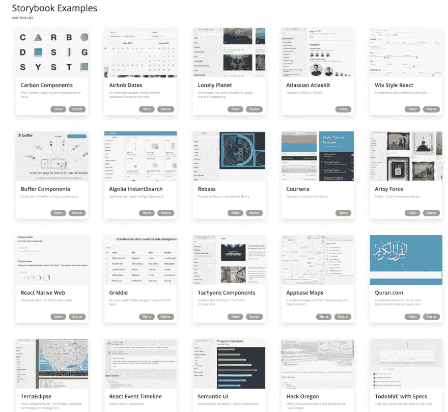
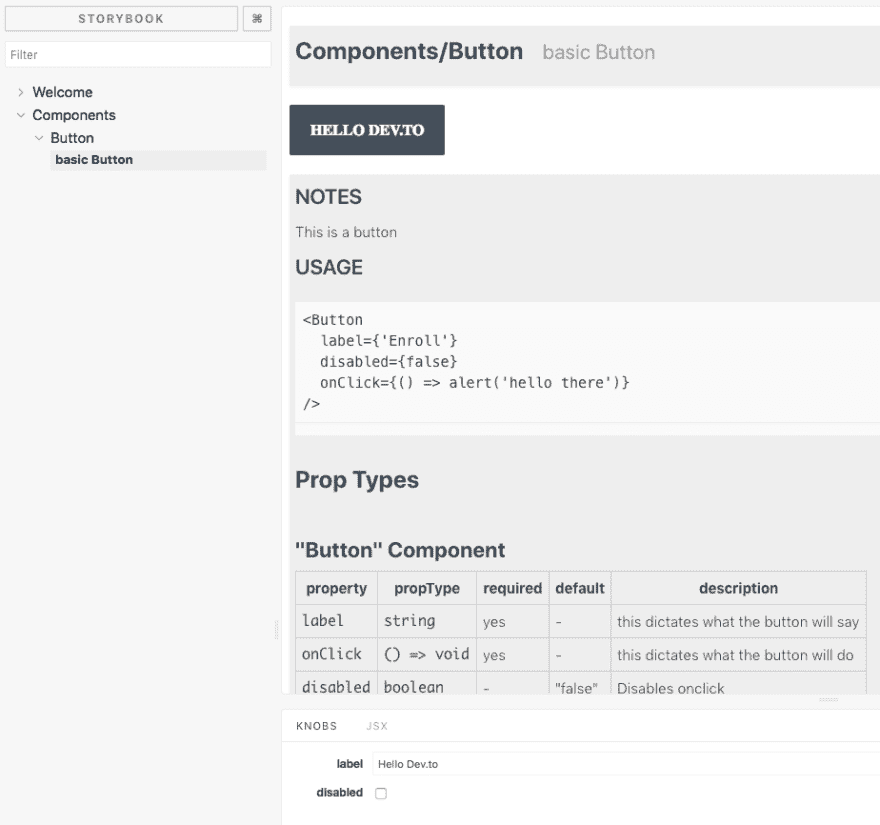
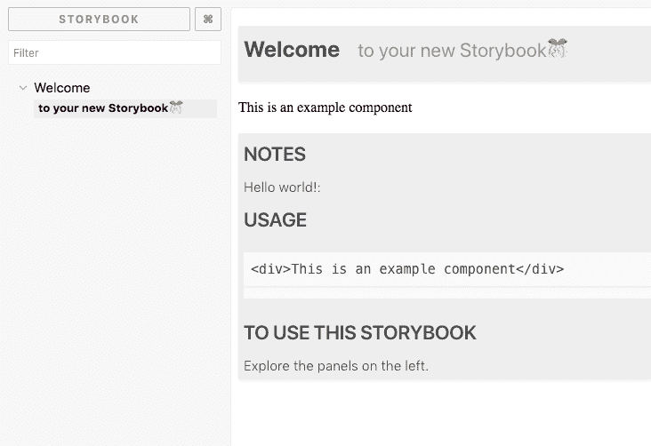

# 设置 React + Typescript 故事书设计系统的快速指南

> 原文：<https://dev.to/swyx/quick-guide-to-setup-your-react--typescript-storybook-design-system-1c51>

如今设计系统风靡一时——以下是如何制作你自己的系统。

因为 React 是建立在即插即用组件理念上的，所以每个公司都争先恐后地构建和开源他们的组件库，这些组件库既可以显示在热门的可重载故事书上，也可以作为 npm 库导入。看看所有这些公司！！！

[T2】](https://res.cloudinary.com/practicaldev/image/fetch/s--dVvzPkHo--/c_limit%2Cf_auto%2Cfl_progressive%2Cq_auto%2Cw_880/https://user-images.githubusercontent.com/35976578/38384106-4ec86d9a-38dc-11e8-952b-ee542cf14ef5.png)

因为公司也关心可维护性，他们也喜欢用 Typescript 创建设计系统。Typescript 强制执行的正确类型化帮助我们为我们的设计系统自动生成文档，所以这是一个双赢的局面！

今天我们将介绍如何构建和发布一个 React + Typescript 故事书设计系统，该系统带有方便的文档插件。最终结果如下所示:

[T2】](https://res.cloudinary.com/practicaldev/image/fetch/s--_kxHUpTw--/c_limit%2Cf_auto%2Cfl_progressive%2Cq_auto%2Cw_880/https://user-images.githubusercontent.com/35976578/38381904-51eb3c6a-38d6-11e8-8ebd-800c29d12258.png)

# 短版

```
git clone https://github.com/sw-yx/react-typescript-storybook-starter
yarn
npm run storybook 
```

Enter fullscreen mode Exit fullscreen mode

点击[阅读更多信息，点击](https://github.com/sw-yx/react-typescript-storybook-starter)阅读回购。

# DIY 版

准备好了吗？我们走吧！

假设你在一个空文件夹:

```
yarn init -y
yarn add -D @storybook/react @storybook/addon-info @storybook/addon-knobs storybook-addon-jsx @types/react babel-core typescript awesome-typescript-loader react-docgen-typescript-webpack-plugin jest "@types/jest" ts-jest 
yarn add react react-dom
mkdir .storybook src
touch .storybook/config.js .storybook/addons.js .storybook/welcomeStory.js utils.js 
```

Enter fullscreen mode Exit fullscreen mode

我选择了一种“共置故事”的设置，在这种设置中，组件的故事与组件相邻。还有另一种设置，故事放在一个完全独立的 stories 文件夹中。我发现在处理一个组件及其相关故事时，这是额外的麻烦。因此，我们将设置这个应用程序的其余部分与协同定位的故事。

要有一本可运行的故事书，将这个 npm 脚本添加到您的`package.json` :

```
{  "scripts":  {  "storybook":  "start-storybook -p 6006 -c .storybook"  }  } 
```

Enter fullscreen mode Exit fullscreen mode

我们没有强烈的理由要在 6006 端口上运行 storybook，这只是看起来很平常的事情。

在`.storybook/config.js` :

```
import { configure } from '@storybook/react';
import { setAddon, addDecorator } from '@storybook/react';
import JSXAddon from 'storybook-addon-jsx';
import { withKnobs, select } from '@storybook/addon-knobs/react';
addDecorator(withKnobs);
setAddon(JSXAddon);

// automatically import all files ending in *.stories.js
const req = require.context('../src', true, /.stories.js$/);
function loadStories() {
  require('./welcomeStory');
  req.keys().forEach(filename => req(filename));
}

configure(loadStories, module); 
```

Enter fullscreen mode Exit fullscreen mode

在`.storybook/addons.js` :

```
import '@storybook/addon-knobs/register';
import 'storybook-addon-jsx/register'; 
```

Enter fullscreen mode Exit fullscreen mode

在`utils.js` :

```
import { withInfo } from '@storybook/addon-info';
const wInfoStyle = {
  header: {
    h1: {
      marginRight: '20px',
      fontSize: '25px',
      display: 'inline'
    },
    body: {
      paddingTop: 0,
      paddingBottom: 0
    },
    h2: {
      display: 'inline',
      color: '#999'
    }
  },
  infoBody: {
    backgroundColor: '#eee',
    padding: '0px 5px',
    lineHeight: '2'
  }
};
export const wInfo = text =>
  withInfo({ inline: true, source: false, styles: wInfoStyle, text: text }); 
```

Enter fullscreen mode Exit fullscreen mode

在`.storybook/welcomeStory.js` :

```
import React from 'react';

import { storiesOf } from '@storybook/react';
import { wInfo } from '../utils';

storiesOf('Welcome', module).addWithJSX(
  'to your new Storybook🎊',
  wInfo(`

    ### Notes

    Hello world!:

    ### Usage
    ~~~js
    <div>This is an example component</div>
    ~~~

    ### To use this Storybook

    Explore the panels on the left.
  `)(() => <div>This is an example component</div>) ); 
```

Enter fullscreen mode Exit fullscreen mode

让我们看看它的工作！`npm run storybook`:

[T2】](https://res.cloudinary.com/practicaldev/image/fetch/s--1GCTAo8x--/c_limit%2Cf_auto%2Cfl_progressive%2Cq_auto%2Cw_880/https://user-images.githubusercontent.com/35976578/38380223-18b5a282-38d1-11e8-8c44-8395015435a1.png)

# 你的第一个打字稿组件

是时候制作 Typescript 组件了。

```
mkdir src/Button
touch src/Button/Button.tsx src/Button/Button.css src/Button/Button.stories.js 
```

Enter fullscreen mode Exit fullscreen mode

在`src/Button/Button.tsx` :

```
import * as React from 'react';
import './Button.css';
export interface Props {
  /** this dictates what the button will say  */
  label: string;
  /** this dictates what the button will do  */
  onClick: () => void;
  /**
   * Disables onclick
   *
   * @default false
   **/
  disabled?: boolean;
}
const noop = () => {}; // tslint:disable-line
export const Button = (props: Props) => {
  const { label, onClick, disabled = false } = props;
  const disabledclass = disabled ? 'Button_disabled' : '';
  return (
    <div
      className={`Button ${disabledclass}`}
      onClick={!disabled ? onClick : noop}
    >
      <span>{label}</span>
    </div>
  );
}; 
```

Enter fullscreen mode Exit fullscreen mode

在`src/Button/Button.css` :

```
.Button span {
  margin: auto;
  font-size: 16px;
  font-weight: bold;
  text-align: center;
  color: #fff;
  text-transform: uppercase;
}
.Button {
  padding: 0px 20px;
  height: 49px;
  border-radius: 2px;
  border: 2px solid var(--ui-bkgd, #3d5567);
  display: inline-flex;
  background-color: var(--ui-bkgd, #3d5567);
}

.Button:hover:not(.Button_disabled) {
  cursor: pointer;
}

.Button_disabled {
  --ui-bkgd: rgba(61, 85, 103, 0.3);
} 
```

Enter fullscreen mode Exit fullscreen mode

在`src/Button/Button.stories.js` :

```
import React from 'react';

import { storiesOf } from '@storybook/react';
import { Button } from './Button';
import { wInfo } from '../../utils';
import { text, boolean } from '@storybook/addon-knobs/react';

storiesOf('Components/Button', module).addWithJSX(
  'basic Button',
  wInfo(`

  ### Notes

  This is a button

  ### Usage
  ~~~js
  <Button
    label={'Enroll'}
    disabled={false}
    onClick={() => alert('hello there')}
  />
  ~~~`
)(() => (
    <Button
      label={text('label', 'Enroll')}
      disabled={boolean('disabled', false)}
      onClick={() => alert('hello there')}
    />
  ))
); 
```

Enter fullscreen mode Exit fullscreen mode

我们还得让故事书说话打字稿:

```
touch .storybook/webpack.config.js tsconfig.json 
```

Enter fullscreen mode Exit fullscreen mode

在`webpack.config.js` :

```
const path = require('path');
const TSDocgenPlugin = require('react-docgen-typescript-webpack-plugin');
module.exports = (baseConfig, env, defaultConfig) => {
  defaultConfig.module.rules.push({
    test: /\.(ts|tsx)$/,
    loader: require.resolve('awesome-typescript-loader')
  });
  defaultConfig.plugins.push(new TSDocgenPlugin());
  defaultConfig.resolve.extensions.push('.ts', '.tsx');
  return defaultConfig;
}; 
```

Enter fullscreen mode Exit fullscreen mode

注意——你可能看过`const genDefaultConfig = require('@storybook/react/dist/server/config/defaults/webpack.config.js');`的旧指令，但现在已经废弃了。[我们改用完全控制模式+默认。](https://storybook.js.org/configurations/custom-webpack-config/#full-control-mode--default)

在`tsconfig.json` :

```
{  "compilerOptions":  {  "outDir":  "build/lib",  "module":  "commonjs",  "target":  "es5",  "lib":  ["es5",  "es6",  "es7",  "es2017",  "dom"],  "sourceMap":  true,  "allowJs":  false,  "jsx":  "react",  "moduleResolution":  "node",  "rootDir":  "src",  "baseUrl":  "src",  "forceConsistentCasingInFileNames":  true,  "noImplicitReturns":  true,  "noImplicitThis":  true,  "noImplicitAny":  true,  "strictNullChecks":  true,  "suppressImplicitAnyIndexErrors":  true,  "noUnusedLocals":  true,  "declaration":  true,  "allowSyntheticDefaultImports":  true,  "experimentalDecorators":  true  },  "include":  ["src/**/*"],  "exclude":  ["node_modules",  "build",  "scripts"]  } 
```

Enter fullscreen mode Exit fullscreen mode

好的，应该是这样。`npm run storybook`又来了！

嘣！

[T2】](https://res.cloudinary.com/practicaldev/image/fetch/s--_kxHUpTw--/c_limit%2Cf_auto%2Cfl_progressive%2Cq_auto%2Cw_880/https://user-images.githubusercontent.com/35976578/38381904-51eb3c6a-38d6-11e8-8ebd-800c29d12258.png)

# 构建和交付您的(一键式)设计系统的时间

Typescript 只负责你的 Typescript-to-JS 编译的代码，但是你也将想要运送 CSS 和其他资产。所以当你建立你的故事书时，你必须做一个额外的复制过程:

```
yarn add -D cpx
touch src/index.tsx
echo "node_modules" >> .gitignore
git init # version control is good for you 
```

Enter fullscreen mode Exit fullscreen mode

在您的`package.json`中，添加:

```
{  "main":  "build/lib/index.js",  "types":  "build/lib/index.d.ts",  "files":  [  "build/lib"  ],  "scripts":  {  "storybook":  "start-storybook -p 6006 -c .storybook",  "build":  "npm run build-lib && build-storybook",  "build-lib":  "tsc && npm run copy-css-to-lib",  "build-storybook":  "build-storybook",  "copy-css-to-lib":  "cpx \"./src/**/*.css\" ./build/lib"  },  } 
```

Enter fullscreen mode Exit fullscreen mode

请注意，您的 init 中已经有了一个`main`，所以要覆盖它。

在`src/index.tsx` :

```
export {Button} from './Button/Button' 
```

Enter fullscreen mode Exit fullscreen mode

在这里，您可以将所有组件重新导出到一个文件中，这样就可以将它们一起导入。[这就是所谓的桶形图案](https://basarat.gitbooks.io/typescript/docs/tips/barrel.html)

现在，当你运行`npm run build`时，它在`build`中构建你的设计系统，没有任何故事书的东西，当你运行`npm run build-storybook`时，它构建一个静态页面故事书，你可以在任何地方托管它！

我漏了什么吗？让我知道！