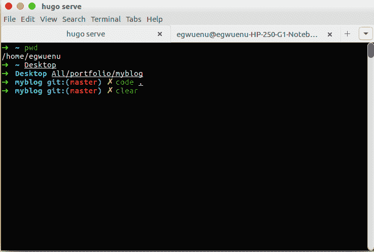
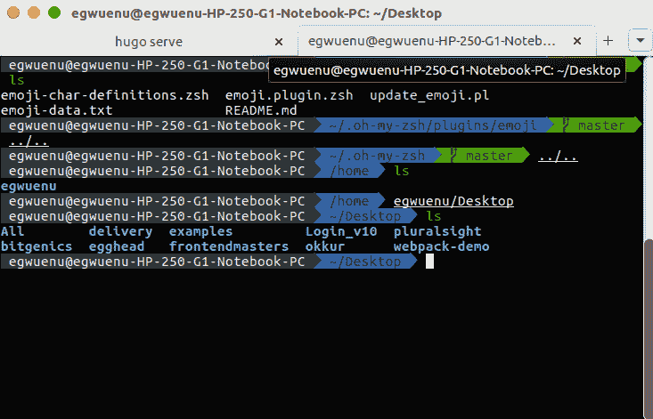

# 哦，我的 ZSH 快速设置！Ubuntu 上的终端

> 原文：<https://dev.to/lauragift21/quick-setup-of-oh-my-zsh-terminal-on-ubuntu-2c4e>

厌倦了好看又无聊的终端？你想尝试一些不同的和时髦的东西吗？那么你一定要试试哦，我的天啊！作为开发者，我们不能否认命令行终端是我们存在的一部分。

[T2】](https://res.cloudinary.com/practicaldev/image/fetch/s--0ZVbgHEZ--/c_limit%2Cf_auto%2Cfl_progressive%2Cq_auto%2Cw_880/http://res.cloudinary.com/lauragift/image/upload/v1524834046/Screenshot_from_2018-04-27_13-58-51_ffofu9.png)

Oh-My-Zsh 是一个开源的、社区驱动的框架，用于管理您的 Zsh 配置。它捆绑了大量有用的功能、助手、插件、主题和一些会让你大叫的东西。

## **T3】先决条件 T5】**

免责声明:哦，我的 Zsh 在 macOS 和 Linux 上运行得最好。

*   类似 Unix 的操作系统(macOS 或 Linux)

*   应该安装 zsh(4 . 3 . 9 或更高版本)。`sudo apt-get install zsh`如果没有预装(zsh -版本待确认)，应安装 curl 或 wget

*   应该安装 git

## **T3】安装 T5】**

*Via wget*T2】

```
 $ sh -c "$(wget https://raw.github.com/robbyrussell/oh-my-zsh/master/tools/install.sh -O -)" 
```

Enter fullscreen mode Exit fullscreen mode

*Via curl*T2】

```
 $ sh -c "$(curl -fsSL https://raw.github.com/robbyrussell/oh-my-zsh/master/tools/install.sh)" 
```

Enter fullscreen mode Exit fullscreen mode

现在我们已经安装了 zsh 和 oh-my-zsh，下一步是继续配置。

**主题**

Oh-My-Zsh 附带了几个位于`~/.zshrc/themes`中的[主题](https://github.com/robbyrussell/oh-my-zsh/wiki/Themes)，可以通过在~/中添加主题名称来启用。zshrc 文件。

```
# nano ~/.zshrc
# This can be changed to whatever theme is preferred
ZSH_THEME="agnoster" 
```

Enter fullscreen mode Exit fullscreen mode

[T2】](https://res.cloudinary.com/practicaldev/image/fetch/s--XKuKiUPx--/c_limit%2Cf_auto%2Cfl_progressive%2Cq_auto%2Cw_880/http://res.cloudinary.com/lauragift/image/upload/v1524845811/Screenshot_from_2018-04-27_17-12-52_nlj66n.png)

**插件**

Oh-my-zsh 还包括一些可用的[插件](https://github.com/robbyrussell/oh-my-zsh/wiki/Plugins)来帮助开发变得更快更容易。我最大的优点之一是自动补全功能开箱即用。你不需要键入一个完整的命令，只需点击 tab 键，就可以根据你的需要建议可能的命令。

另一个很棒的尝试是[zsh-语法高亮](https://github.com/zsh-users/zsh-syntax-highlighting)这个包为 shell zsh 提供了语法高亮。当命令在 zsh 提示符下输入到交互式终端时，它可以突出显示命令。这有助于在运行命令之前检查它们，尤其是在捕捉语法错误方面。

**提示💡**

*您可以通过运行这个命令*
轻松地在 bash 和 zsh 之间切换

```
# switching from zsh to bash
exec bash 
```

Enter fullscreen mode Exit fullscreen mode

```
# switching from bash to zsh
exec zsh 
```

Enter fullscreen mode Exit fullscreen mode

给你，我希望在读完这篇文章后，你能从你正在使用的任何 shell 切换到 zsh，并尝试一下哦，我的天啊，zsh，它们都很棒。🚀

请随意分享您的评论和想法。

最初发布于[giftegwuenu.com](https://www.giftegwuenu.com/2018/04/27/quick-setup-of-oh-my-zsh-terminal-on-ubuntu/)