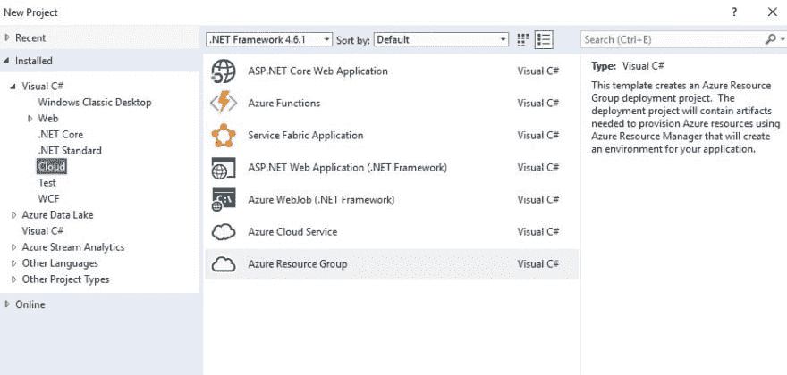
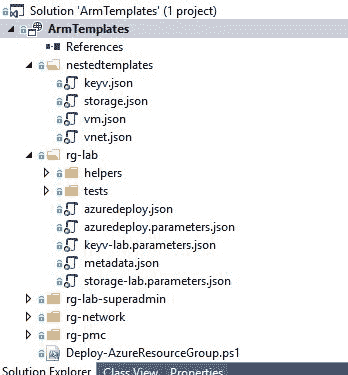
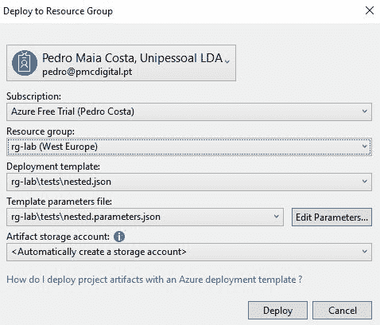

# 使用 Visual Studio 2017 部署高级 Azure 资源管理器模板的快速提示

> 原文：<https://dev.to/pnmcosta/quick-tips-for-azure-resource-manager-templates-authoring-in-visual-studio-2017--1dbm>

有了 Visual Studio(安装 Azure SDK ),你现在可以创建一个`Azure Resource Group`项目来管理你在多个 Azure 订阅中的资源。

[T2】](https://i.stack.imgur.com/010n6.jpg)

网上有一些关于 Visual Studio 如何使用 Json 模板的优秀指南，我从埃利奥特·曼斯菲尔德的这个[视频](https://www.youtube.com/watch?v=Rl8PJ4lH1So)和 GitHub 上的源代码[开始，因为我想确保我从自己的资源和客户可能需要的任何资源的模块化方法开始。](https://github.com/eliot-trustm/FirstARMproject)

我正在构建我的项目:

[T2】](https://i.stack.imgur.com/PanZH.jpg)

但是我已经可以部署`key-vaults`、`storage accounts`、`virtual networks`、`vnet gateways`、`virtual machines`等，所有这些都在我的资源组中进行组织、参数化和维护，只需点击几下鼠标:

[T2】](https://i.stack.imgur.com/eovJT.jpg)

如果有人想从事这样的项目，这里有一些提示，可能会节省你一些时间:

*   确保模板是模块化的，适当地命名资源是必须的，我已经采用了 Eliot 的方法，并为所有内容添加了资源类型前缀，记住在重新部署模板时不会删除资源，在大多数情况下，您可以通过修改模板并重新运行来保持您的基础架构最新(我认为，还没有测试所有场景，但希望如此！)
*   尽可能使用[链接模板](https://docs.microsoft.com/en-us/azure/azure-resource-manager/resource-group-linked-templates)，但是记住这些需要发布到在线位置。如果您没有公开存储模板，请使用 Azure 的存储帐户。
*   如果您在模板中使用`_artifactsLocation`和`_artifactsLocationSasToken`参数，当通过 Visual Studio 部署时，它将要求一个`Artifact storage account`，其中`Deploy-AzureResourceGroup.ps1`将上传您的所有模板和任何在项目的文件属性中设置为内容的文件(当在解决方案资源管理器中选择文件时为 F4)并替换参数值。但是千万不要在参数文件中手动包含这些参数值，因为当尝试用生成的值替换这些值时，部署脚本将会失败。
*   我还没有测试过链接到另一个模板的链接模板，不得不将生成的工件存储键传递给链接模板对我来说是不整洁的，所以我一直在避免这样做。
*   在变量中构建模板链接，下面是我的一个模板示例，它使用部署脚本生成的存储帐户位置和 SasToken 参数来访问容器，[单击此处](https://docs.microsoft.com/en-us/azure/storage/common/storage-dotnet-shared-access-signature-part-1#how-a-shared-access-signature-works)了解有关 SasToken 的更多信息。

    ```
    {
        "variables": {
            "templates": {
              "vm": {
                "folder": "nestedtemplates",
                "fileName": "vm.json"
              },
              "deploy": {
                "folder": "rg-lab-superadmin",
                "fileName": "deploy.sh"
              }
            },
            "templateLinks": {
              "vm": "[concat(parameters('_artifactsLocation'), '/', variables('templates').vm.folder, '/', variables('templates').vm.fileName, parameters('_artifactsLocationSasToken'))]",
              "deploy": "[concat(parameters('_artifactsLocation'),  '/', variables('templates').deploy.folder, '/', variables('templates').deploy.fileName, parameters('_artifactsLocationSasToken'))]"
            }
        }
    } 
    ```

*   对于想要在带有[自定义脚本扩展](https://docs.microsoft.com/en-us/azure/virtual-machines/linux/extensions-customscript)的目标虚拟机上执行的脚本，您可以使用上述工件位置的相同主体。

*   虚拟机上的自定义脚本应该可以反复地重新部署到同一个虚拟机上，因为您可能需要重新部署包括该虚拟机在内的整个资源组，这些脚本需要考虑这一点。

*   vnet 资源必须在相同的位置，但不一定在相同的资源组中，您可以在模板中对此进行规划，例如，每当我需要一个 VNet 资源时，我也会请求它所在的资源组，这样您就可以在您的模板上创建适当的 [resourceId()](https://docs.microsoft.com/en-us/azure/azure-resource-manager/resource-group-template-functions-resource#resourceid) 。一个常见的情况是，当您创建一个虚拟机时，我的模板也创建了网卡，这需要正确地引用到可能位于另一个资源组上的虚拟网络。

*   现在还不能直接使用 ARM 模板在存储帐户中创建容器，但是一个解决办法是在您的模板中包含一个虚拟机，并在其上运行一个[自定义脚本](https://docs.microsoft.com/en-us/azure/virtual-machines/linux/extensions-customscript)，该脚本将使用 CLI、Powershell 或其他 Azure 管理选项在存储帐户上创建容器。

*   多亏了 SO 上的 [@4c74356b41](https://stackoverflow.com/users/6067741/4c74356b41) ，我学会了如果你需要的话，可以在嵌套的`[]`中通过名字`"[reference(x)[parameter(y)]]"`动态调用对象属性。

随着我不断为我的需求开发基础设施，我会努力保持这篇文章的更新。