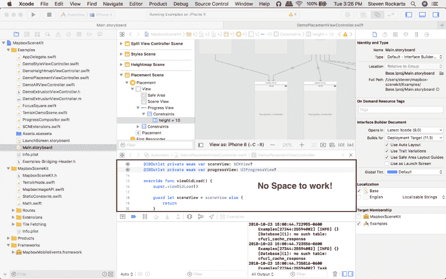
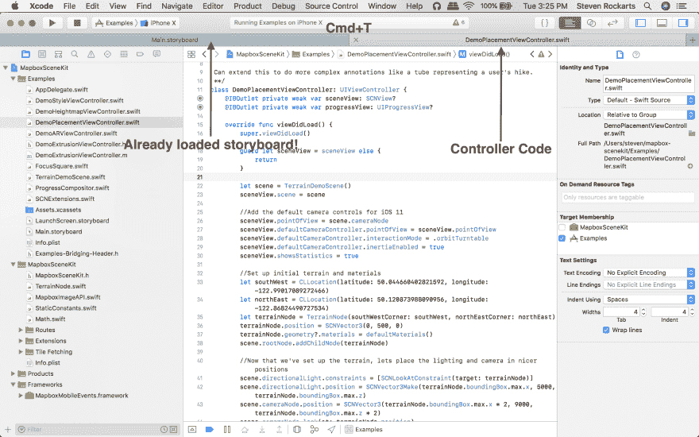
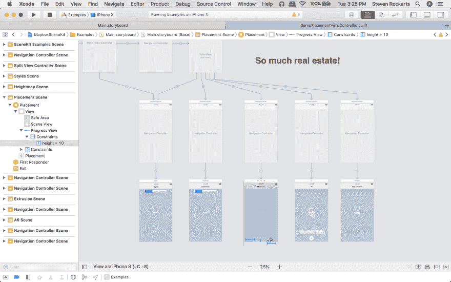

# 快速 XCode 编辑提示

> 原文：<https://dev.to/rockarts/quick-xcode-editing-tip-5fb9>

人们使用 XCode 的最大问题之一是故事板可能需要很长时间才能加载(有很多方法可以解决这个问题，但那是另外一天的事了)。当你在故事板和控制器之间来回切换时，加载时间会变得很痛苦。

有些人打开助理编辑器，在下面的小窗口中编辑相应的文件。试图不断调整它的大小可能会很烦人。

当调试窗口打开时，情况变得更糟。

[T2】](https://res.cloudinary.com/practicaldev/image/fetch/s--15HEXgin--/c_limit%2Cf_auto%2Cfl_progressive%2Cq_auto%2Cw_880/https://thepracticaldev.s3.amazonaws.com/i/5tscddcxnpq03n8ln0na.png)

这是我前几天偶然发现的一个提示。我试图用快捷键+T 在 Chrome 中打开一个新标签页，却没有意识到我仍然在 XCode 中。我不知道 XCode 支持选项卡式窗口！

[T2】](https://res.cloudinary.com/practicaldev/image/fetch/s--iEhShNHr--/c_limit%2Cf_auto%2Cfl_progressive%2Cq_auto%2Cw_880/https://thepracticaldev.s3.amazonaws.com/i/6zrgasoy3rcby6c2zy79.png)

你可以打开你的故事板一次，然后关闭所有的窗口以获得更多的空间，这样你就不必担心再次打开它和永远等待了！看看你得到的空间！

[T2】](https://res.cloudinary.com/practicaldev/image/fetch/s--z_QP17cr--/c_limit%2Cf_auto%2Cfl_progressive%2Cq_auto%2Cw_880/https://thepracticaldev.s3.amazonaws.com/i/9ygf1qw41uqj2vx8znub.png)