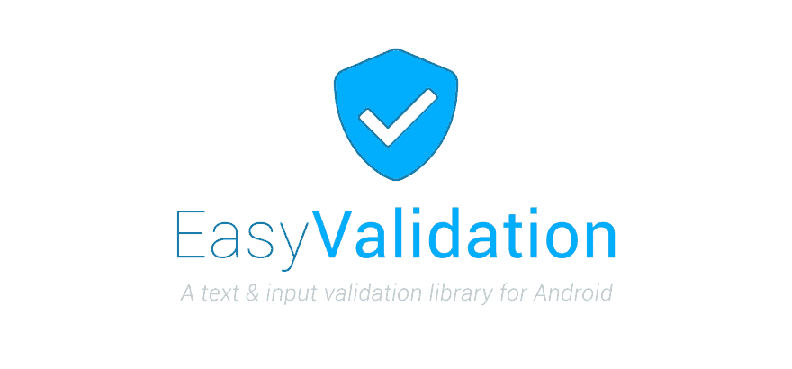
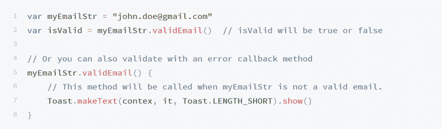
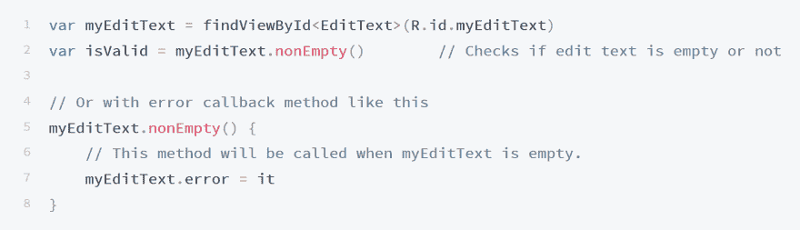
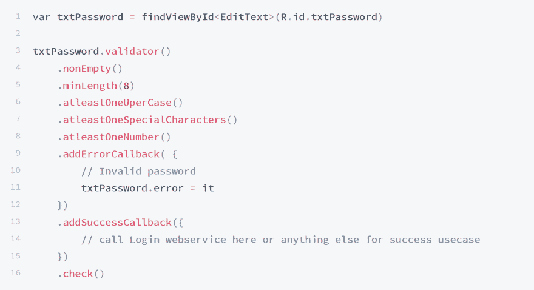
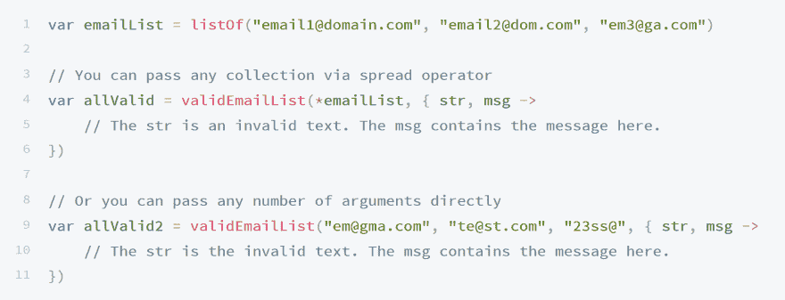
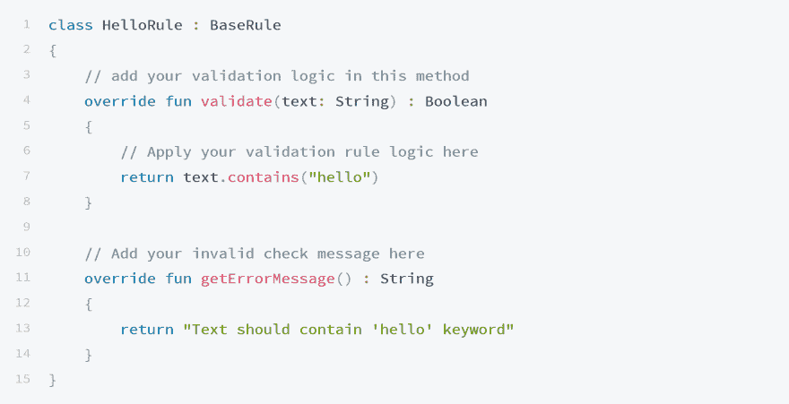
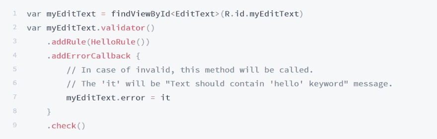

# 通过简单的验证快速轻松地验证您的文本

> 原文：<https://dev.to/wajahatkarim/quickly--easily-validating-your-text-with-easy-validation-18ah>

> 最初发布在我的[媒体简介](https://medium.com/@wajahatkarim3)

[T2】](https://res.cloudinary.com/practicaldev/image/fetch/s--SaTPhROn--/c_limit%2Cf_auto%2Cfl_progressive%2Cq_auto%2Cw_880/https://cdn-images-1.medium.com/max/8334/1%2AkPR2nkCyTMj3p-kQvr5i2w.jpeg)

在这个数据驱动的技术时代，几乎所有的网站和应用都有一个共同点。这是对他们的数据输入表单和页面的文本验证。在调用 web 服务和 API 之前验证输入和文本的任务已经成为开发人员的日常工作。

在 Android 中，在多个 EditText 和 TextInputLayout 视图上执行验证和检查有时会变得过于复杂和乏味。特别是，当要执行多重检查以确保你的用户密码是不可破解的和复杂的。对于 android 开发人员来说，这类任务通常会变得很无聊，如果管理不当，可能会导致重大的安全漏洞。

我在这种情况下也很沮丧，在通过互联网和 GitHub 搜索并使用各种第三方库后，我想出了这个简单的验证库，令人惊讶地叫做 [**简单验证**](https://github.com/wajahatkarim3/EasyValidation)

**EasyValidation** 是一个在 Kotlin 中开发的 android 库，它提供了一种简单易用的方法，可以使用 Kotlin 扩展方法和高阶函数对通过任何`String`、`EditText`、`TextView`、`AutoCompleteTextView`、`TextInputLayout`和`Spinner`输入的文本执行验证检查。将来，此列表中会添加更多视图。

## 它是如何工作的？

现在让我们看看 [**EasyValidation**](https://github.com/wajahatkarim3/EasyValidation) 能为我们做些什么。首先，你必须像这样使用 Gradle 将它包含在你的 android 项目中:

[T2】](https://res.cloudinary.com/practicaldev/image/fetch/s---i24qHjC--/c_limit%2Cf_auto%2Cfl_progressive%2Cq_auto%2Cw_880/https://cdn-images-1.medium.com/max/3754/1%2AaRMyI9XnYKaBfXgZpA3wDA.png)

例如，您可以像这样验证任何电子邮件字符串:

[T2】](https://res.cloudinary.com/practicaldev/image/fetch/s--gUfeUJhK--/c_limit%2Cf_auto%2Cfl_progressive%2Cq_auto%2Cw_880/https://cdn-images-1.medium.com/max/3604/1%2AiDkLn0wRged3czeJXoXLlw.png)

不仅仅是`String`或`Text`，您还可以对`EditText`、`TextView`、`AutoCompleteTextView`、`TextInputLayout`和`Spinner`进行这些检查，如下所示:

[T2】](https://res.cloudinary.com/practicaldev/image/fetch/s--uO-UQmET--/c_limit%2Cf_auto%2Cfl_progressive%2Cq_auto%2Cw_880/https://cdn-images-1.medium.com/max/3610/1%2ARuOgaINO2akjJPYCGaMfQA.png)

在**核心模块库**中有大约 30 多个内置规则，如电子邮件、空、数字、信用卡号等。这些你都可以在[规则页面](https://wajahatkarim.gitbook.io/easyvalidation/usage/built-in-rules)查看。

您还可以应用多重检查来非常容易地进行复杂的输入。例如，您希望用户密码的长度至少为 8 个字符，包括一个特殊字符、一个大写字母和一个数字。然后，您可以像这样进行这些类型的检查:

[T2】](https://res.cloudinary.com/practicaldev/image/fetch/s--A44KcB6n--/c_limit%2Cf_auto%2Cfl_progressive%2Cq_auto%2Cw_880/https://cdn-images-1.medium.com/max/3604/1%2AKSPtH4BXLkkaz1C1DxoI1w.png)

您可以看到执行多重验证检查是多么容易。这里需要注意的一点是 check()方法。当您执行多个验证时，您必须手动调用 check()方法来启动验证。在单一验证中，会自动调用此方法。

通过使用[集合扩展](https://wajahatkarim.gitbook.io/easyvalidation/usage/collection-extensions#list-of-collection-extensions)，您不仅可以[对相同的文本执行多个验证](https://wajahatkarim.gitbook.io/easyvalidation/usage/multiple-validation-checks)，还可以同时对多个文本流执行相同的验证。例如，您正在获取一份电子邮件地址的来宾邀请列表，您必须确保所有文本都是有效的电子邮件地址。那么你可以这样做:

[T2】](https://res.cloudinary.com/practicaldev/image/fetch/s--kT42KxmR--/c_limit%2Cf_auto%2Cfl_progressive%2Cq_auto%2Cw_880/https://cdn-images-1.medium.com/max/3604/1%2A1VqErK1zahknemrvE2BqvA.png)

随着 [30+内置规则](https://wajahatkarim.gitbook.io/easyvalidation/usage/built-in-rules)，你可以很容易地创建自己的自定义规则。

第一步是你必须通过扩展`BaseRule`或任何其他类似的现有规则来创建你的`Rule`类。

[T2】](https://res.cloudinary.com/practicaldev/image/fetch/s--uCMxzFOt--/c_limit%2Cf_auto%2Cfl_progressive%2Cq_auto%2Cw_880/https://cdn-images-1.medium.com/max/3594/1%2Az9q-PZ4i-Do4uZLS6R8ApQ.png)

您可以像这样使用`Validator#addRule()`方法来使用此规则:

[T2】](https://res.cloudinary.com/practicaldev/image/fetch/s--lqawEbyP--/c_limit%2Cf_auto%2Cfl_progressive%2Cq_auto%2Cw_880/https://cdn-images-1.medium.com/max/3604/1%2ARDPjkn9NtFdXO8bu8ecaqQ.png)

## EasyValidation 库和文档

你可以通过下面的链接在 GitHub 查看这个库和它的代码。
[**易验证**](https://github.com/wajahatkarim3/EasyValidation)

## [wajahatkarim 3](https://github.com/wajahatkarim3)/[easy validation](https://github.com/wajahatkarim3/EasyValidation)

### ✔️为 Android 开发了一个文本和输入验证库

<article class="markdown-body entry-content p-5" itemprop="text">

关于这个图书馆是如何创建的文章现已发表。你可以[点击这里的链接阅读。→](https://android.jlelse.eu/quickly-easily-validating-your-text-with-easy-validation-498d7eb54b0b)

[T2】](https://raw.githubusercontent.com/wajahatkarim3/EasyValidation/master/Art/easyvalidlogo.jpg)

# [](https://twitter.com/intent/tweet?text=Quickly%20and%20easily%20validate%20your%20text%20and%20input%20in%20Android%20apps%20with%20this%20amazing%20library%20EasyValidation%20written%20in%20entirely%20in%20kotlin.:&url=https%3A%2F%2Fgithub.com%2Fwajahatkarim3%2FEasyValidation)

[ ](https://appcenter.ms) [  ](https://bintray.com/wajahatkarim3/EasyValidation/com.wajahatkarim3.EasyValidation.core/_latestVersion) [  ](https://android-arsenal.com/details/1/7109) [  ](https://android-arsenal.com/api?level=14) [  ](https://raw.githubusercontent.com/wajahatkarim3/EasyValidation/master/) [  ](https://saythanks.io/to/wajahatkarim3) [](https://www.paypal.me/WajahatKarim/5) 
<sub>Built with ❤︎ by [Wajahat Karim](https://twitter.com/WajahatKarim) and [contributors](https://github.com/wajahatkarim3/EasyValidation/graphs/contributors)</sub>

## ✔️ 变更日志

在[发布](https://github.com/wajahatkarim3/MediumClap-Android/releases)选项卡中存在变更。

## <g-emoji class="g-emoji" alias="computer" fallback-src="https://github.githubassets.cimg/icons/emoji/unicode/1f4bb.png">💻</g-emoji>安装

将此添加到应用程序的`build.gradle`文件中:

```
   implementation "com.wajahatkarim3.easyvalidation:easyvalidation-core:1.0.1"
```

## <g-emoji class="g-emoji" alias="page_facing_up" fallback-src="https://github.githubassets.cimg/icons/emoji/unicode/1f4c4.png">📄</g-emoji>文档

完整文档可从 [Gitbook](https://wajahatkarim.gitbook.io/easyvalidation/) 获得。

## <g-emoji class="g-emoji" alias="star" fallback-src="https://github.githubassets.cimg/icons/emoji/unicode/2b50.png">⭐️</g-emoji> 特色

*   Validator 方式验证支持。- [详情](https://wajahatkarim.gitbook.io/easyvalidation/usage/untitled)
*   30 多种内置验证规则，如清空、电子邮件、信用卡等。- [规则列表](https://wajahatkarim.gitbook.io/easyvalidation/usage/built-in-rules)
*   `String`、`EditText`、`TextView`、`AutoCompleteTextView`、`TextInputLayout`、`Spinner`的延长方式。- [详情](https://wajahatkarim.gitbook.io/easyvalidation/usage/validation-using-extension-methods)
*   多重验证和检查- [详细信息](https://wajahatkarim.gitbook.io/easyvalidation/usage/multiple-validation-checks)
*   对多个文本和视图进行验证的集合扩展方法- [详细信息](https://wajahatkarim.gitbook.io/easyvalidation/usage/collection-extensions)
*   创建您自己的自定义规则- [详细信息](https://wajahatkarim.gitbook.io/easyvalidation/usage/create-custom-rules)

## <g-emoji class="g-emoji" alias="question" fallback-src="https://github.githubassets.cimg/icons/emoji/unicode/2753.png">❓</g-emoji> 快速用法

例如，您可以像这样验证任何电子邮件`String`:

```
   var myEmailStr = "john.doe@gmail.com"
   var isValid = myEmailStr.validEmail()  // isValid will be
```

…</article>

[View on GitHub](https://github.com/wajahatkarim3/EasyValidation)

关于如何使用它的用法和文档，你可以在下面链接的 GitBook 上查看。
[**文献**](https://wajahatkarim.gitbook.io/easyvalidation/)

...

**Wajahat Karim** 毕业于 NUST，是一名经验丰富的移动开发者，一名活跃的开源贡献者，也是两本书[学习 Android 意图](https://www.amazon.com/Learning-Android-Intents-Muhammad-Usama/dp/1783289635)和[用 Unity 掌握 Android 游戏开发](https://www.amazon.com/Mastering-Android-Game-Development-Unity/dp/1783550775/)的合著者。在业余时间，他喜欢花时间和家人在一起，做编码实验，喜欢写很多东西(主要是在博客和媒体上)，并且是开源的热情贡献者。2018 年 6 月，他的一个库在 [Github 趋势](https://github.com/trending)上成为第一名。他的库在 Github 上有大约 2000 颗星星，并被全球各地的开发者用于各种应用。在 [Twitter](https://twitter.com/WajahatKarim) 和 [Medium](https://medium.com/@wajahatkarim3) 上关注他，以获得更多关于他的写作、Android 和开源工作的更新。