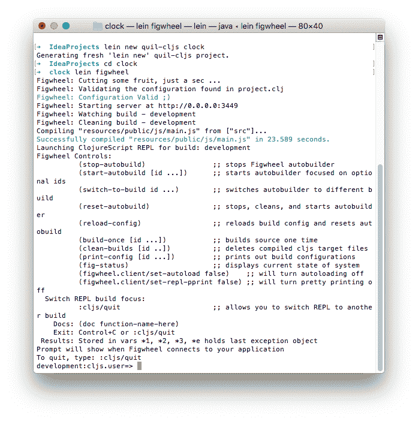
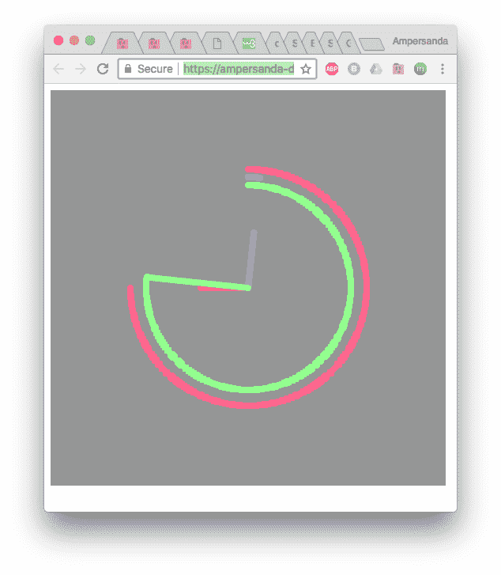

# quil——用 Clojurescript 制作时钟

> 原文：<https://dev.to/ampersanda/quil-making-a-clock-with-clojurescript-of>

[T2】](https://res.cloudinary.com/practicaldev/image/fetch/s--cyfNpybS--/c_limit%2Cf_auto%2Cfl_progressive%2Cq_auto%2Cw_880/https://cdn-images-1.medium.com/max/1024/1%2AS7xuoiPXmss8XWU2dxNaIQ.jpeg)

大家好，最后，我们创造了一个东西，耶！也许下面的代码不是获得最佳性能的最佳代码，但我尽力了，:D，

抱歉…

我不擅长解释事情。我接受建议和批评:)。

*请阅读 ***注释*** 代码内的提示。

### 要求

1.  [JDK v8](http://www.oracle.com/technetwork/java/javase/downloads/jdk8-downloads-2133151.html) (因为新版本遇到 Clojure 的麻烦)
2.  [Leiningen](https://leiningen.org)

哦耶，是时候创造新的东西了！！(我是说项目)。

```
lein new quil-cljs clock 
```

或者你也可以在 http://quil.info/sketches/create 网上完成

### 注意！！！

> 为了确保万无一失，在这个项目中，我们只需关注 ***一个名为 ***core.cljs*** *的**** 文件，打开它

### 运行空项目(其实不是空的)

要运行当前项目，只需在项目文件夹中执行下面的命令，一旦转盘完成，等待一段时间，直到你看到**成功编译" resources/public/js/main . js "**，打开 [http://localhost:3449](http://localhost:3449,) ，最小化终端而不是关闭它。

[](https://res.cloudinary.com/practicaldev/image/fetch/s--0sXZc_zc--/c_limit%2Cf_auto%2Cfl_progressive%2Cq_auto%2Cw_880/https://cdn-images-1.medium.com/max/697/1%2Ae8A9ur9fBqSCbFs5jyUBDg.png)T3】

```
lein figwheel 
```

### **时钟**

所以，我们要做的钟是这样的

[T2】](https://res.cloudinary.com/practicaldev/image/fetch/s--x-WZrjOl--/c_limit%2Cf_auto%2Cfl_progressive%2Cq_auto%2Cw_880/https://cdn-images-1.medium.com/max/634/1%2AsiHbR99NhErHH9Cp51ZgRQ.png)

我知道这不是很漂亮，但是我们将学习一些基本的东西，比如改变背景，创建弧线，线条等等。

正如上面的截图所示，周围的圆圈有点参差不齐，一点也不光滑，[有一个问题，你可以按照[链接]。](https://github.com/quil/quil/issues/229)

### 设置

将 ***设置*** 功能和 ***defsketch*** 更改为以下格式(请看评论，下面只是一个 **core.cljs** 文件)。

并且还要删除 ***更新*** 功能，因为我们只是一遍又一遍地重新绘制元素。