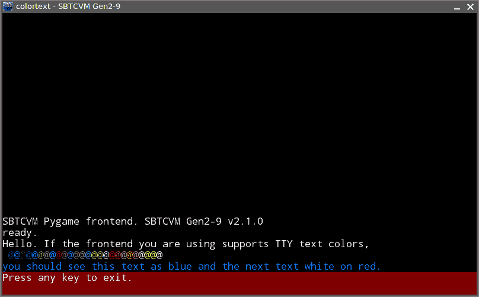
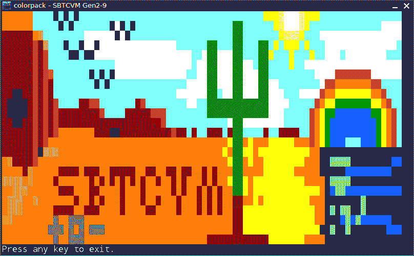

# 彩虹效应:三色空间和 SBTCVM

> 原文：<https://dev.to/thomasthespacefox/rainbow-effect-ternary-color-spaces-and-sbtcvm-2bp4>

## SBTCVM 的 pygame 前端及其多种颜色。

pygame 前端。这是除了一个贫瘠的终端之外，SBTCVM 拥有的最古老的接口，甚至看不到任何诅咒。现在，在对 SBTCVM gen2-9 的通用组件做了大量工作之后，pygame 回归了 SBTCVM，有了一个新的前端。一些新特性也通过 pygame 前端加入了 SBTCVM。

传统上，SBTCVM 只有简单的黑白文本颜色。然而，它有这样或那样的图形已经有一段时间了，所以颜色并不是它的新内容。

随着 SBTCVM 最新版本的许多变化，出现了彩色文本功能。虽然这个特性本身是新的，但它在某种程度上使用了一些在 SBTCVM 之前就已经开始的研究。

**彩色文本**演示。显示 27 色前景色和背景色。
T3T5】

几年前，在 SBTCVM 出现之前，我正在处理平衡的三色调色板，以及可能的图形分辨率等等。即:

*   1-trit 灰度(3 种色调)
*   2-trit 灰度(9 种色调)
*   3-trit 灰度(27 种色调)
*   3-trit RGB (27 colors)
*   6-trit RGB (729 色)[稍后]
*   9-trit RGB (19683 色)[稍后]

这三个平衡的三元色彩空间非常有趣，这也是 SBTCVM 的前身 TDA-马克 1 拥有色彩支持的原因，以一种粗糙的 729 色，27x27 像素`vector plotter`和一种较小的单色，9x9 `vector plotter`的形式。

虽然这些绘图仪在 SBTCVM Gen 2-9 中已不复存在，但新的 243x243，19683 色(9-trit RGB)矢量绘图仪以 SBTGA mode 30 的形式出现。

**colorpack** 演示。展示了一个 3-trit RGB 颜色块编码方案。
T3T5】

新的 pygame 前端的 TTY 具有 3 色索引和 27 色 RGB 色块编码方案。(主要是为了节省内存，方便编码。)

# 对三元色的一些观察

虽然 SBTCVM 可能已经有颜色一段时间了，但就我所见，它是唯一真正解决这个问题的平衡的三进制计算机，不管是不是虚拟的。奇怪的是，在线性 RGB 和单色调色板中，0 从来不是黑色。最低的负值是。而最高正值总是白色。

与二进制调色板相比，平衡三进制调色板的尺寸迅速增大:

| 单位数量 | 三元色 | 二元颜色 |
| --- | --- | --- |
| one | three | Two |
| Two | nine | four |
| three | Twenty-seven | eight |
| four | Eighty-one | Sixteen |
| six | Seven hundred and twenty-nine | Sixty-four |
| eight | Six thousand five hundred and sixty-one | Two hundred and fifty-six |
| nine | Nineteen thousand six hundred and eighty-three | Five hundred and twelve |

单位，分别指二进制和平衡三进制的等效比特/三进制度量。

总的来说，自从开始 SBTCVM 以来，我已经了解了相当多关于平衡三进制的东西，甚至在那之前也了解了一些。同样，所有这些新的彩色文本和图形至少会让 SBTCVM 更有趣一些。

要使用新的 pygame 前端，只需运行:

`./pyg_sbtcvm.py`