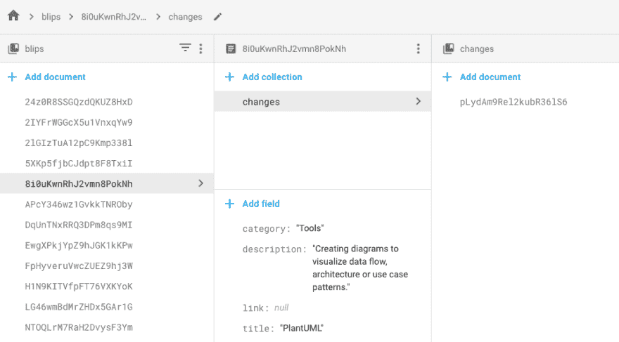
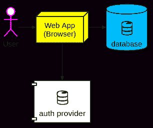
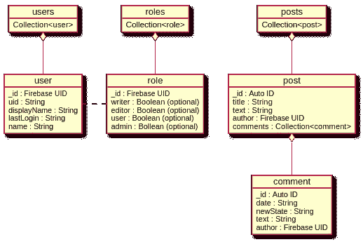

# rbac 与 google firestorm

> 原文：<https://dev.to/anoff/rbac-with-google-firestore-jnc>

[T2】](https://res.cloudinary.com/practicaldev/image/fetch/s--tepJeTWr--/c_limit%2Cf_auto%2Cfl_progressive%2Cq_auto%2Cw_880/https://anoff.io/blog/img/assets/rbac-firestore/logo.png)

这篇文章将解释如何使用 Google Firestore 无服务器数据库实现基于角色的访问控制( [RBAC](https://en.wikipedia.org/wiki/Role-based_access_control) )。特别是 Firebase 和 Firestore，利用本文中提出的概念，在这一点上提供了无服务器基础设施与移动客户端的最无缝集成。它已经成为我开发的所有网络应用程序的后台。

## Firestore 基础知识

Firestore 是一个数据库，它是谷歌用于移动应用开发的 Firebase 套件的一部分。它目前处于测试阶段，由于其卓越的 API 和特性，有可能取代当前的 Firebase 实时数据库。

> Cloud Firestore 是一个灵活、可扩展的数据库，用于 Firebase 和 Google 云平台的移动、web 和服务器开发

对于那些从未使用过 Firebase 数据库的人；这是一个面向 NoSQL 文档的数据库。Firestore 允许您通过在一个文档中创建多个集合来嵌套文档。

[T2】](https://res.cloudinary.com/practicaldev/image/fetch/s--GCLGBenI--/c_limit%2Cf_auto%2Cfl_progressive%2Cq_auto%2Cw_880/https://anoff.io/blog/img/assets/rbac-firestore/firestore-documents.png)

Firebase 套件是为移动开发而构建的，并为所有主要语言提供 SDK。JavaScript/Node.js，Swift，Objective C，Android，Java，Python，Ruby，Go。SDK 允许添加、查询或删除数据，以及作为客户端与数据库交互时所需的其他操作。我非常喜欢的一个功能是可以注册你的客户端来自动接收[更新](https://firebase.google.com/docs/firestore/query-data/listen)。这允许您在实时应用程序中轻松构建**三向数据绑定**。这是我在我的第一个[项目中使用的一个功能。](https://github.com/anoff/microllaborators)

与 Firebase [身份验证提供者](https://firebase.google.com/docs/auth/)结合使用，您可以将数据库的访问权限限制在已登录的人员。auth provider 还提供了一个 SDK，只需要几行代码就可以在 web 应用程序中实现。

[T2】](https://res.cloudinary.com/practicaldev/image/fetch/s--EvKMmWzm--/c_limit%2Cf_auto%2Cfl_progressive%2Cq_auto%2Cw_880/https://anoff.io/blog/img/assets/rbac-firestore/dist/arch.svg)

## Firestore 安全规则

创建详细规则集的能力使 Firestore 能够在没有任何后端代码的情况下使用无服务器数据库，并仍然保持数据安全。它也是构建基于角色的访问控制的基础。

> 所有角色和授权规则将由 Firestore 服务器强制执行

安全规则是用类似 JavaScript 的语法编写的，但是有自己的方法。首先，嵌套`match`操作符来指定您希望受此规则影响的文档级别。使用稍后可以在规则定义中引用的`{wildcards}`。授权/拒绝访问是通过一个`allow <method> if`语句来完成的，如果它返回`true`或者阻塞事务，则授权访问。

```
service cloud.firestore {
  match /databases/{database}/documents {
    allow read, write: if <some_condition>;
    allow delete: if false;
  }
} 
```

Enter fullscreen mode Exit fullscreen mode

有五种方法可以指定:

1.  `get`:检索单个文档
2.  `list`:读取整个收藏或执行查询
3.  `create`:写入不存在的文档
4.  `update`:写入现有文档
5.  `delete`:删除文件

修改操作 3-5 可以使用`write`方法来处理，而不是单独指定它们，`read`同时应用*获取*和*列表*。如果一个请求有多个规则匹配，那么只有一个规则需要解析为`true`，请求才会成功。

```
// allow anyone to read but only signed in users to create/update; only a specific user can delete
service cloud.firestore {
  match /databases/{database}/documents {
    match /posts/{document=**} {
      allow read: if true;
      allow create, update: if request.auth != null;
      allow delete: if request.auth.uid == 'an0xff';
    }
  }
} 
```

Enter fullscreen mode Exit fullscreen mode

## RBAC 举例场景

我们将设置 RBAC 为一个简单的内容网站与*职位*，可以与下列角色评论:

*   **管理员**:可以分配角色
*   **写手**:可以新建帖子，可以修改自己的帖子
*   **编辑**:可以编辑任何帖子，删除评论
*   **用户**:可以创建和修改自己的评论，可以修改自己的用户设置

在 Firestore 的根级别，我们添加了三个不同的集合。一个保存内容，一个保存用户详细信息，一个实现每个用户的角色。将角色分配从用户文档中分离出来的原因是为了方便用户修改他们自己的详细信息，而不给他们授予自己新角色的可能性。

[T2】](https://res.cloudinary.com/practicaldev/image/fetch/s--33EySEIU--/c_limit%2Cf_auto%2Cfl_progressive%2Cq_auto%2Cw_880/https://anoff.io/blog/img/assets/rbac-firestore/dist/document-classes.svg)

## RBAC 所需的安全规则

给定集合设置和上述角色定义，我们可以定义需要为每个集合实现的规则。

|  | 用户 | 角色 | 邮件 | 评论 |
| --- | --- | --- | --- | --- |
| `get` | 任何人 | 用户(所有者)，管理员 | 任何人 | 任何人 |
| `list` | 没有人 | 管理 | 任何人 | 任何人 |
| `create` | 没有人 | 没有人 | 作者 | 用户 |
| `update` | 用户(自己的个人资料) | 管理 | 作者(所有者)，编辑 | 用户(所有者) |
| `delete` | 用户(自己的个人资料) | 没有人 | 作者(自己) | 用户(所有者)，编辑 |

## 为 RBAC 实施安全规则

我们从默认的*拒绝我们项目中集合的所有*策略设置开始。

```
service cloud.firestore {
  match /databases/{database}/documents {
    // this addresses any entry in the user collection
    match /users/{user} {
        allow read, write: if false;
    }
    // rules for the roles setup
    match /roles/{user} {
      allow read, write: if false;
    }

    match /posts/{post} {
      allow read, write: if false;
    }

    match /posts/{post}/comments/{comment} {
      allow read, write: if false;
    }
  }
} 
```

Enter fullscreen mode Exit fullscreen mode

### RBAC 助手功能

我们首先实现一些自定义函数，帮助我们定义基于角色的规则。

```
service cloud.firestore {
  match /databases/{database}/documents {
    ...
    // the request object contains info about the authentication status of the requesting user
    // if the .auth property is not set, the user is not signed in
    function isSignedIn() {
      return request.auth != null;
    }
    // return the current users entry in the roles collection
    function getRoles() {
      return get(/databases/$(database)/documents/roles/$(request.auth.uid)).data
    }
    // check if the current user has a specific role
    function hasRole(role) {
      return isSignedIn() && getRoles()[role] == true;
    }
    // check if the user has any of the given roles (list)
    function hasAnyRole(roles) {
      return isSignedIn() && getRoles().keys().hasAny(roles);
    }
  }
} 
```

Enter fullscreen mode Exit fullscreen mode

有了安全规则中的这些功能，您现在可以基于用户角色轻松实现安全角色。

### 用户集合

首先，我们确保只有用户自己可以修改它的数据:

```
match /users/{user} {
  // anyone can see a specific users profile data (name, email etc), in a real scenario you might want to make this more granular
  allow get: if true;
  // noone can query for users
  allow list, create: if false;
  // users can modify their own data
  allow update, delete: if request.auth.uid == user;
} 
```

Enter fullscreen mode Exit fullscreen mode

### 角色集合

接下来，我们实施角色集合的规则

```
match /roles/{user} {
  allow get: if request.auth.uid == user || hasRole('admin');
  allow list: if hasRole('admin');
  allow update: if hasRole('admin');
  allow create, delete: if false;
} 
```

Enter fullscreen mode Exit fullscreen mode

### 帖子收藏

这一个有点棘手，因为如果我们想要执行*更新*规则，我们首先需要弄清楚谁实际上创建了这个帖子。

```
match /posts/{post} {
  allow get, list: if true;
  allow create: if hasRole('writer');
  // check if the post author is identical to requesting user
  allow update: if (hasRole('writer') && resource.data.author == request.auth.uid) || hasRole('editor');
  allow delete: if hasRole('writer');
} 
```

Enter fullscreen mode Exit fullscreen mode

### 评论(子)收藏

确保用户可以修改或删除他们的评论，编辑可以审核任何人的评论。

```
match /posts/{post}/comments/{comment} {
  allow get, list: if true;
  allow create: if hasRole('user');
  // check if the comment author is identical to requesting user
  allow update: if resource.data.author == request.auth.uid);
  allow delete: if hasRole('editor') || (hasRole('user') && resource.data.author == request.auth.uid);
} 
```

Enter fullscreen mode Exit fullscreen mode

## 总结

您创建了一个 Firestore 规则集，该规则集通过根据角色设计限制对资源的访问来实施**数据隐私和完整性**。
要将 RBAC 应用到您的应用程序中，您需要考虑几件事情:

1.  将安全规则部署到您的 Firebase 项目中，强烈建议使用 CLI 或 Travis
2.  实现一个 Firebase 函数，该函数使用[认证触发器](https://firebase.google.com/docs/functions/auth-events)为每个新用户在`users`和`roles`集合中创建一个条目
3.  登录你的应用程序，然后通过 Firebase 控制台手动授予自己*管理员*权限

要查看实现的类似设计，您可以查看我的 [techradar](https://github.com/anoff/techradar) 项目，该项目也展示了如何在前端实现 RBAC，并设置 Travis CI 来部署 Firebase 规则。还有其他功能可用于保护 Firestore 数据，例如检查资源的哪些部分在更新过程中被更改，以允许用户仅更新特定的属性。

如果你对这篇文章有任何反馈，请在 [Twitter](https://twitter.com/an0xff) 上给我留言。也可以看看我之前关于创建 [PlantUML 图](https://anoff.io/blog/2018-07-31-diagrams-with-plantuml/)的帖子。