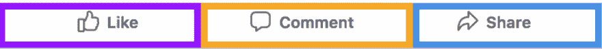
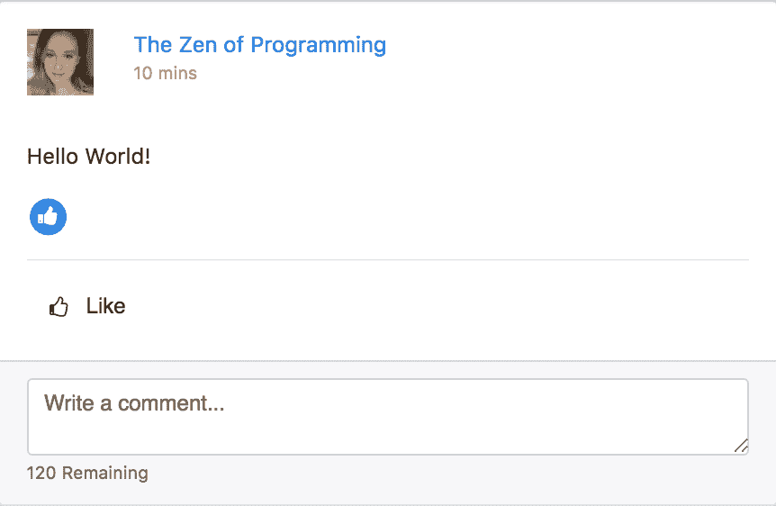
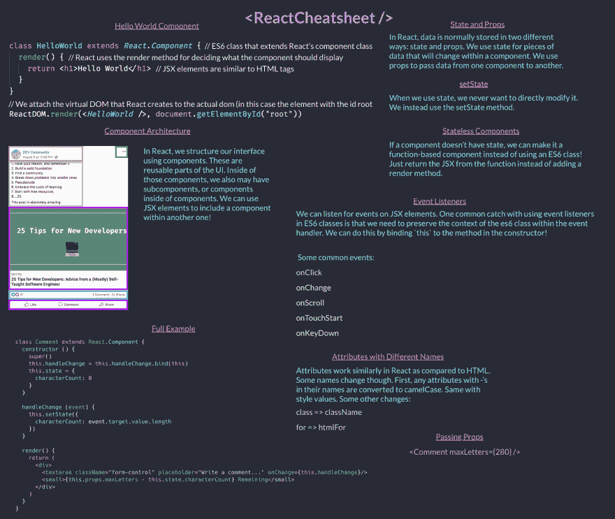

# React 初学者完整指南[翻译文章]

> 原文：<https://dev.to/nabbisen/react---26p2>

本文为以下文章的翻译:
[a complete beginner ' s guide to react](https://zen-of-programming.com/beginners-guide-react/)by [Ali Spittel](https://zen-of-programming.com/) on [the Zen of programmer ' s](https://zen-of-programming.com/)

* * *

我再次想试着写下用更多的代码工作的东西。
而且 React 是我最喜欢的技术之一。
于是我想做 React 的入门篇！
我的强烈观点是，本文以具备 HTML 和 JavaScript 知识为前提——这些应该在引入 React 这样的库之前掌握。

## 反应过来的とは

React 是 JavaScript 的库。
是 2013 年由 Facebook 的开发团队制作的。 其目的是使用户界面更模块化(或可复用)，以便于维护。
根据 React 的网站，它用于“构建管理自己的状态( state )的封装组件，并以此为基础构成复杂的 UI”。

我在本文中会使用很多以 Facebook 为例的样本。
为什么这么说，是因为他们首先写了 React。

还记得在 Facebook 上，从只是点一点稻的规格变成可以有多个反应的时候吗？
与之前只是对投稿被点了赞的情况不同，现在不管是哪个投稿都可以点心里话或者 smilly 之类的东西了。
如果这些反应是以 HTML 为主体制作的话，为了将所有的水稻都变更为反应，并确认它们的动作，需要相当大的劳力吧。

这就是 React 出现的契机——而不是首先实现“兴趣分离”，然后将其强加给开发者的做法。 React 中有不同的体系结构，而不是分离不同的编程语言。 然后以基于组件结构的形式提高模块性。

> 这次，CSS 是另一回事。 但是，如果您愿意的话，也可以使 CSS 成为组件特定的！

### React 与普通 JavaScript

当谈到“Vanilla (香草的)”JavaScript 时，通常会谈到编写没有添加任何库(如 jQuery / React / Angular / Vue )的 JavaScript 代码。
如果想更详细地了解它们是什么样的，或者框架是什么样的，还写了[关于整个网络框架的文章](https://zen-of-programming.com/web-framework-intro/)！

## 开始前的几个注意事项

*   为了使本教程尽可能简洁，可能会在代码示例前后添加`...`。 这意味着省略了一部分代码。
*   有些地方表示使用 Git diff 更改了代码中的哪一行。 复制和粘贴该部分时，请删除行开头的`+`。
*   每一节都用 CodePen 公开了整个代码的完整版本——实际上也可以移动！
*   如果有一些更高级的概念不是本教程所必需的，我已经通过引用的形式展示了这一点。 虽然很多都是纯粹的事实，但我觉得是很有趣的内容。

## Ready

在创建 react APP 应用程序产品时，您可能会想要使用构建工具。
例如网络包。
React 在浏览器上使用了几个默认不动的模式。
构建工具可以总结这些内容。
[Create React App](https://github.com/facebook/create-react-app) 对于这种目的非常有用！
几乎所有的设定都已经完成了！

那么现在开始，我想麻利地进行下去，实际上写下 React 的代码。
那么，就利用一下只用于开发的 React 的 CDN 吧！
也利用 Babel 的 CDN 吧。 还将提供一些非标准 JavaScript 功能。 (关于那件事，我稍后会进一步提及！ )

```
<script crossorigin src="https://unpkg.com/react@16/umd/react.development.js"></script>
<script crossorigin src="https://unpkg.com/react-dom@16/umd/react-dom.development.js"></script>
<script src="https://cdnjs.cloudflare.com/ajax/libs/babel-core/6.1.19/browser.js"></script> 
```

[也制作了 Codepen 的模板](https://codepen.io/aspittel/pen/gdrexE)并使之可以使用！

在真正的 React 项目中，我将组件分割为多个文件。
但是，再说一遍，这次是以学习为目的的。
于是将 JavaScript 整理成一个文件。

## 组件

在本教程中，您将创建 Facebook 近况报告小部件。
为什么这么说呢？因为 Facebook 是最早写 React 的！

Facebook 上有多少个`like`(好的)小部件出现呢——有时会对近况报告说好的，或者与之相关的投稿、视频投稿、或者照片等 或者，也有可能是针对页面本身！
Facebook 不希望出现这样的情况:在调节水稻功能相关的东西时，必须经常对所有这些地方进行变更。
正因为如此，才会出现组件！
网页上的所有可复用部件都被抽象化成为组件。
然后，就可以一次又一次地重复使用了。
我们要更新那个，只需要更改一个地方的代码就足够了。

下面我们来看看 Facebook 近况报告的图片，看看其中组成了什么组件。

[T2】](https://res.cloudinary.com/practicaldev/image/fetch/s--eUFtEFy0--/c_limit%2Cf_auto%2Cfl_progressive%2Cq_auto%2Cw_880/https://zen-of-programming.com/react-intro/facebook-status.png)

近况报告本身将会是一个组件――Facebook 的时间线上有很多近况报告。
因此，您一定会想要重用近况报告组件。

在那个组件中，子组件和组件应该存在于父组件中吧。
它们同样可以再利用吧——正因为如此，水稻按钮组件才能成为`PhotoStatus`组件和`LinkStatus`组件的子组件。

子组件组可能看起来是这样的:

[T2】](https://res.cloudinary.com/practicaldev/image/fetch/s--35EZBJTW--/c_limit%2Cf_auto%2Cfl_progressive%2Cq_auto%2Cw_880/https://zen-of-programming.com/react-intro/components.png)

子组件中甚至可以有子组件！
因此，水稻( Like ) /评论( Comment ) /共享( Share )的集合体本身就成为`ActionBar`成分，在其中进行水稻/评论/共享的处理

[T2】](https://res.cloudinary.com/practicaldev/image/fetch/s--02O2IAbH--/c_limit%2Cf_auto%2Cfl_progressive%2Cq_auto%2Cw_880/https://zen-of-programming.com/react-intro/subcomponents.png)

有很多方法可以帮助您组织这些组件和子组件，同时考虑到在 APP 中的何处重用它们的功能。

## 开始吧

在开始本教程之前，请先进行 React 的“hello world”——毕竟，这是传统的做法！
然后进入稍微复杂的近况报告的样本吧。

在 HTML 文件中，只添加一个要素吧——带 id 的`div`。
看起来 div 以非常自然的形式拥有 id。
这是我们的 react APP 应用的起点！

```
<div id="root"></div> 
```

如果使用 CodePen 模板编写代码的话，可以直接将这个 JavaScript 记述在`js`部分。
如果不是，而是在自己的计算机上编写此代码的话，需要在`text/jsx`指定的位置添加脚本标签。 是这样的:

```
<script type="text/jsx"></script> 
```

来吧，我们来接触一下 React 的代码！

```
class HelloWorld extends React.Component {
  render() {
    // React に対して、どのような HTML コードをレンダリングするのかを伝える
    return <h1>Hello World</h1>
  }
}

// React に対して、HelloWorld コンポーネントを HTML の 'root' div にアタッチするように伝える
ReactDOM.render(<HelloWorld />, document.getElementById("root")) 
```

会发生什么呢？
只是页面上“Hello World”显示为 H1！

让我来谈谈从这里如何进行下去。

首先，使用 ES6 的类，继承`React.Component`类。
这是在大部分 React 组件中使用的模式。

接下来，在类中创建一个方法——一种称为`render`的特殊方法。
React 寻找`render`方法。 这个方法决定在页面上呈现什么！
这个名字很容易理解呢。
`render`方法返回的东西，不管它是什么，都是通过那个组件渲染的。

这次，返回的是带有“Hello World”文本的 H1——这在 HTML 文件中确实是极其正确的内容。

最后，这样写吧:

```
ReactDOM.render(<HelloWorld />, document.getElementById("root")) 
```

使用 ReactDOM 的功能将 react 组件附加到 DOM。

> React 使用被称为虚拟 DOM 的东西。 这是通常由 Vanilla JavaScript 或 jQuery 操作的 DOM 的虚拟表示。 通过`reactDOM.render`从虚拟 DOM 渲染到实际 DOM。 React 在后台做了大量的工作，以便在界面上发生任何需要更改时，有效地编辑和重新渲染 DOM。

我们的组件`<HelloWorld />`看起来像 HTML 标签呢！
该语法是 JavaScript 的扩展*JSX* 的一部分。 不能在浏览器上以本地方式使用。
还记得通过 Babel 处理 JavaScript 吗？
Babel 通过将 JSX 转换(或转换)为普通的 JavaScript，使浏览器能够理解。

> JSX 实际上是使用 React 的选择之一。 但是在大多数情况下都会看到吧！

之后使用 JavaScript 内建的`document.getElementById`获取 root 元素，生成 HTML。

粗略地说，在此`ReactDOM.render`语句中，`HelloWorld`组件将附加到 HTML 文件中定义的`div`。

## 开始码

那么，——“hello world”到此结束。
进入 Facebook 组件吧。

首先，摸一下这个演示。
在本教程的其馀部分，我们将致力于这里的内容。
请随便看看代码。
即使不能理解也不用担心！ 本教程的其馀部分将介绍！

[https://codepen.io/aspittel/embed/rZLaeJ?height=600&default-tab=result&embed-version=2](https://codepen.io/aspittel/embed/rZLaeJ?height=600&default-tab=result&embed-version=2)

从将小部件“硬编码”到 HTML 开始吧:

```
<div class="content">
  <div class="col-6 offset-3">
    <div class="card">
      <div class="card-block">
        <div class="row">
          <div class="col-2">
            
          </div>
          <div class="col-10 profile-row">
            <div class="row">
              <a href="#">The Zen of Programming</a>
            </div>
            <div class="row">
              <small class="post-time">10 分前（10 mins）</small>
            </div>
          </div>
        </div>
        <p>Hello World!</p>
        <div>
          <span class="fa-stack fa-sm">
            <i class="fa fa-circle fa-stack-2x blue-icon"></i>
            <i class="fa fa-thumbs-up fa-stack-1x fa-inverse"></i>
          </span>
        </div>
        <div>
          <hr class="remove-margin">
          <div>
            <button type="button" class="btn no-outline btn-secondary">
              <i class="fa fa-thumbs-o-up fa-4 align-middle" aria-hidden="true"></i>
              &nbsp;
              <span class="align-middle">イイね（Like）</span>
            </button>
          </div>
        </div>
      </div>
      <div class="card-footer text-muted">
        <textarea class="form-control" placeholder="コメントはこちらへどうぞ...（Write a comment...）"></textarea>
        <small>残り 120 字（120 Remaining）</small>
      </div>
    </div>
  </div>
</div> 
```

添加一些 CSS 后，看起来会像这样:

[T2】](https://res.cloudinary.com/practicaldev/image/fetch/s--HQbbgK94--/c_limit%2Cf_auto%2Cfl_progressive%2Cq_auto%2Cw_880/https://zen-of-programming.com/react-intro/status-component.png)

[这边有给 CodePen 制作的开始代码。](https://codepen.io/aspittel/pen/KxzGdx)

为了本教程的目的，让我们生成四个组件:
首先，`Like`具有父`Status`组件/输入功能逻辑`Like`具有用于输入组件/注释的逻辑
而且，让`Like`组件有`LikeIcon`这个孩子。 在切换水稻按钮时显示或隐藏。

## 组件的体系结构

让我们更进一步。
分割写入组件的 HTML 代码进行。

从组件的框架开始吧。
应该是同样被渲染，好好动作的！

```
class Status extends React.Component {
  render() {
    return (
      <div className="col-6 offset-3">
        <div className="card">
          <div className="card-block">
            <div className="row">
              <div className="col-10 profile-row">
                <div className="row">
                  <a href="#">The Zen of Programming</a>
                </div>
                <div class="row">
                  <small className="post-time">10 分前</small>
                </div>
              </div>
            </div>
          </div>
          <p>Hello world!</p>
          <div className="card-footer text-muted" />
        </div>
      </div>
    )
  }
}

ReactDOM.render(<Status />, document.getElementById("root")) 
```

> 关于上述，有有趣的注释。 我们必须将“class”属性更改为“className”。 类在 JavaScript 中是标准的有意义的东西——就是 es6 的类功能！ 在 JSX 的表现上，有些属性的名称与 HTML 不同。

HTML 中的内容可以删除。 保留 ID 为 root 的元素就足够了——父母的“content”div 只是为了风格而定义的！

```
<body>
  <div class="content">
    <div id="root"></div>
  </div>
</body> 
```

这就是要转换为 Status 组件的 HTML。
请注意，基础 HTML 的一部分还没有出现——是成为子组件的部分！

做第二个组成部分吧。
然后把它编入`Status`组件吧。

```
class Comment extends React.Component {
  render() {
    return (
      <div>
        <textarea className="form-control" placeholder="コメントはこちらへどうぞ..." />
        <small>残り 140 字</small>
      </div>
    )
  }
} 
```

这是用于评论的组件。
只存在可以输入的`textarea`和表示剩下的可以输入字数的文本。
请注意，它们都是用一个`div`包装的——这是 React 的规格。 必须用一个 HTML 标签包装所有组件——如果未定义父级的`div`，则无法获得`textarea`和`small`标签。

那么，就把这个组件组装到`Status`组件中去吧。 使之成为子组件。
可以使用用于渲染 Status 组件的相同的 JSX 语法来实现！

```
class Status extends React.Component {
  render() {
    return (
      <div className="col-6 offset-3">
        <div className="card">
          <div className="card-block">
            <div className="row">
              <div className="col-10 profile-row">
                <div className="row">
                  <a href="#">The Zen of Programming</a>
                </div>
                <div className="row">
                  <small className="post-time">10 分前</small>
                </div>
              </div>
            </div>
          </div>
          <div className="card-footer text-muted">
+           <Comment />
          </div>
        </div>
      </div>
    )
  }
} 
```

可以吗？
来吧，对水稻也有必要做完全相同的事情！

```
class LikeIcon extends React.Component {
  render() {
    return (
      <div>
        <span className="fa-stack fa-sm">
          <i className="fa fa-circle fa-stack-2x blue-icon" />
          <i className="fa fa-thumbs-up fa-stack-1x fa-inverse" />
        </span>
      </div>
    )
  }
}

class Like extends React.Component {
  render() {
    return (
      <div>
        {/* Like コンポーネントの中に LikeIcon サブコンポーネントを含める */}
        <LikeIcon />
        <hr />
        <div>
          <button type="button">
            <i
              className="fa fa-thumbs-o-up fa-4 align-middle"
              aria-hidden="true"
            />
            &nbsp;
            <span className="align-middle">イイね</span>
          </button>
        </div>
      </div>
    )
  }
} 
```

接下来，轮到你把它组装到原来的`Status`组件中了！

```
class Status extends React.Component {
  render() {
    return (
      <div className="col-6 offset-3">
        <div className="card">
          <div className="card-block">
            <div className="row">
              <div className="col-10 profile-row">
                <div className="row">
                  <a href="#">The Zen of Programming</a>
                </div>
                <div className="row">
                  <small className="post-time">10 分前</small>
                </div>
              </div>
            </div> +           <Like />
          </div>
          <div className="card-footer text-muted">
            <Comment />
          </div>
        </div>
      </div>
    )
  }
} 
```

真好啊。
来吧，可以将原来的 html react 化了。
但是什么都没动啊！
应对吧！

概括起来，在本节中出现的代码就像[这个 CodePen](https://codepen.io/aspittel/pen/yxOQMe?editors=0010) 一样！

## State (状态)和 Props (属性)

我们想实现的是与用户的两种交互。

*   仅在按下水稻按钮时显示水稻图标
*   根据输入，减少剩馀字符数

让我们致力于这些事情吧！

### 道具(属性)

想象一下。
试着在多个地方设置注记格，分别设定文字数限制怎么样？
例如，在近况投稿中，让用户最多可以写 200 个字符的回复。
但是，在照片投稿中只能写 100 个字符的回复。

React 可以从`PictureStatus`组件接收 props (属性的缩写)。
然后`Status`可以在组件侧指定回复限制为几个字。
没有必要制作两种评论成分。

props 的语法如下:

```
<Comment maxLetters={20} /> <Comment text='hello world' />
<Comment show={false} /> 
var test = 'hello world'
<Comment text={test} /> 
```

这个 props 看起来像 HTML 的属性呢！
通过 props 传递字符串时，不需要括号。
但是传递其他数据类型和变量时，需要写在括号中！

现在，您可以在组件中使用 props :

```
console.log(this.props.maxLetters) 
```

数据被汇总在实例的`props`属性中。
因此可以通过`this.props.myPropName`进行访问。

那么，为了从组件外部容易变更，让我们把硬编码的 140 字修改一下吧！

首先，更改 Status 组件中生成 Comment 组件实例的位置(但省略了一些代码！ ) :

```
class Status extends React.Component {
        ...
          <div className="card-footer text-muted">
+            <Comment maxLetters={280} />
          </div>
        </div>
      </div>
    )
  }
} 
```

然后更改硬编码在 Comment 组件中的 140 个字符的限制。

```
class Comment extends React.Component {
  ...
        <div>
        <textarea className="form-control" placeholder="コメントはこちらへどうぞ..." />
+       <small>残り {this.props.maxLetters} 字</small>
      </div>
  ...
} 
```

### 状态(状態)

从组件传递到组件的 props 在*绝对不会在*子组件中变更——只能在父组件中变更。 在孩子身上是不可能的。
但是——在处理某个组件的过程中，会出现很多想要更改的属性吧。
例如，保持用户在 textarea 中输入的字符数的合计，保持近况报告是否“得到”等。
想要变更的这些属性存储在组件中的*state* 中。

> 你会注意到 React 中存在很多不变性——因为受到了函数型范式的强烈影响。 基于同样的理由，也应该避免副作用。

希望此 state 在生成组件的新实例时随时可用。
因此，让我们使用 ES6 的类构造函数来生成。
想要快速复习 ES6 的班级的话，[MDN](https://developer.mozilla.org/ja/docs/Web/JavaScript/Reference/Classes) 会成为很棒的教材！

state 是由所有 key-value 对组成的对象。
这次需要的是保存用户输入的字符数的 characterCount。
暂时先设置 0 吧！

```
class Comment extends React.Component {
  constructor () {
    super()
    this.state = {
      characterCount: 0
    }
  }
  ... 
```

来吧`maxLetters`进行属性的减法处理吧。
由此可以始终掌握剩馀字数！

```
<small>残り {this.props.maxLetters - this.state.characterCount} 字</small> 
```

`characterCount`增加的话，剩馀字数的显示会减少吧！

哎呀——输入也不会发生什么啊！
完全不能变更`characterCount`的值。
需要对`textarea`添加事件处理程序。
这样，用户进行输入时，可以使`characterCount`变化。

### 事件处理程序

如果您以前编写过 JavaScript，则可能已经编写过事件处理程序来处理用户输入。
用 React 做同样的事情去吧。
句法略有不同。

`onChange`将处理程序添加到`textarea`。
其中，进行与进行事件处理的方法的关联。
用户在`textarea`中输入后，该方法总是会被执行。

```
 <textarea className="form-control" placeholder="コメントはこちらへどうぞ..." onChange={this.handleChange}/> 
```

接下来轮到创建`handleChange`方法了！

```
class Comment extends React.Component {
  constructor () {
    super()
    this.state = {
      characterCount: 0
    }
  }

  handleChange (event) {
    console.log(event.target.value)
  }
... 
```

这里只是将`event.target.value`设为`console.log`——这和没有 React 时用 JavaScript 进行的工作一样吧。 (不过，如果稍微深入调查一下，就会发现事件对象略有不同。 )
查看控制台，文本框中输入的内容被输出了呢！

那么，有必要更新 state 中的`characterCount`属性。
在 React 中，*绝对不会直接改写 state*。
因此，不能做这样的事:
`this.state.characterCount = event.target.value.length`。
改为使用`this.setState`方法。

```
 handleChange (event) {
    this.setState({
      characterCount: event.target.value.length
    })
  } 
```

哎呀！ 发生错误——“uncaught typeerror:this.setState is not a function (未捕获的类型错误: this.setstate 不是函数)”。
此错误告诉您，在事件处理程序中必须保护 ES6 类的上下文。 通过将
`this`绑定到构造函数的方法，可以避免该错误！
如果关于这件事还需要读物的话[这边有好的报道](https://medium.freecodecamp.org/this-is-why-we-need-to-bind-event-handlers-in-class-components-in-react-f7ea1a6f93eb)！

```
class Comment extends React.Component {
  constructor () {
    super()    
    this.handleChange = this.handleChange.bind(this)
... 
```

做了啊！ 终点就在那里！
接下来需要的只是追加切换`like`显示的功能。

`Like`在组件中添加构造函数吧。
在其构造函数中，生成组件的 state 实例。
在组件的生命周期中，其近况报告是否被扭曲了，这一点会发生变化。

```
class Like extends React.Component {
  constructor() {
    super()

    this.state = {
      liked: false
    }
  }
  ... 
```

然后，添加事件处理程序，对于其近况报告，必须要做的是戴上或取下稻子！

```
class Like extends React.Component {
  constructor() {
    super()

    this.state = {
      liked: false
    }

    this.toggleLike = this.toggleLike.bind(this)
  }

  toggleLike () {
    this.setState(previousState => ({
      liked: !previousState.liked
    }))
  }
... 
```

有和以前不一样的地方。 `this.setState`具有的回调函数正在接收参数——`previousState`。
也许可以根据参数的名字推测出来，这是调用`this.setState`前的 state 的值。
`setState`为异步处理。 因此，`this.state.liked`是不可靠的。

需要的东西齐了呢:

a )用户单击"ィ"按钮时，总是调用事件处理程序
b )`liked`为 true 时，显示 like icon

```
 render() {
    return (
      <div>
        {/* boolean で制御して、liked が true である場合にのみ LikeIcon をレンダリングする */}
+       {this.state.liked && <LikeIcon />}
        <hr />
        <div>
+          <button type="button" className="btn no-outline btn-secondary" onClick={this.toggleLike}>
            <i
              className="fa fa-thumbs-o-up fa-4 align-middle"
              aria-hidden="true"
            />
            &nbsp;
            <span className="align-middle">イイね</span>
          </button>
        </div>
      </div>
    )
  } 
```

太棒了！
我们的功能完成了！

## 再加上:函数型组件

如果你已经吃饱了，那就跳过这个部分。
但是，对于我来说，我想在这次的项目上快点加入一个重构。
如果制作了不存在相关 state 的组件(被称为无状态组件)，则可以将组件视为函数而不是 ES6 的类。

在那样的情况下，`LikeIcon`会变成这样吧:

```
const LikeIcon = () => {
  return (
    <div>
      <span className="fa-stack fa-sm">
        <i className="fa fa-circle fa-stack-2x blue-icon" />
        <i className="fa fa-thumbs-up fa-stack-1x fa-inverse" />
      </span>
    </div>
  )
} 
```

`render`不使用方法，只是返回组件的 UI！

[这里有](https://codepen.io/aspittel/pen/NLrPWN)安装了上述重构的 CodePen 的代码。

## 图表

我喜欢图表。
于是，根据这次的投稿内容，做了一个！

[T2】](https://res.cloudinary.com/practicaldev/image/fetch/s--N1ozSgPC--/c_limit%2Cf_auto%2Cfl_progressive%2Cq_auto%2Cw_880/https://zen-of-programming.com/react-intro/cheatsheet.png)

[也可以从这里作为](https://zen-of-programming.com/react-intro/cheatsheet.pdf)PDF 下载！

## 下一个步骤

让我们回顾一下。
我们谈了以下内容。
关于组件的体系结构/基本的 React 语法以及 JSX / state (状态)和 props (属性) /事件处理程序/函数组件。

基于本教程的所有代码 pen 的代码都有[，这里有](https://codepen.io/collection/XpPbVv/)！

如果您想扩展本教程的代码，可以尝试将水稻功能更改为反应功能，或者尝试创建照片组件，然后重用已经创建的一些组件！

学习 React 还有其他精彩内容:

*   [React 文档](https://facebook.github.io/react/tutorial/tutorial.html)
*   [DevCoffee](https://www.youtube.com/watch?v=ZnRFerIP8aA)
*   [韦斯·博斯冗余](https://www.youtube.com/watch?v=hmwBow1PUuo&list=PLu8EoSxDXHP5uyzEWxdlr9WQTJJIzr6jy)

## 请继续多多关照

如果你对本文感到不太好，想多读一些的话，我有话想告诉你。
我正在发行[周刊的简讯](https://tinyletter.com/ali_writes_code)，发送那一周内感觉不错的链接和关于我写的最新报道的信息。
另外，如果您作为教程希望我写的内容，或者为了更容易理解这些事情有建设性的反馈，请给我发[推文](https://twitter.com/aspittel)！
如果有什么疑问的话，请联系我的[AMA repo](https://github.com/aspittel/ama) ！

* * *

谢谢您的阅读。

本記事は、以下の記事の翻訳です:
[一个完整的初学者反应指南](https://zen-of-programming.com/beginners-guide-react/)由[阿里·斯皮特尔](https://zen-of-programming.com/)讲解[编程的禅](https://zen-of-programming.com/)

致阿里:非常感谢你允许我翻译你的帖子。