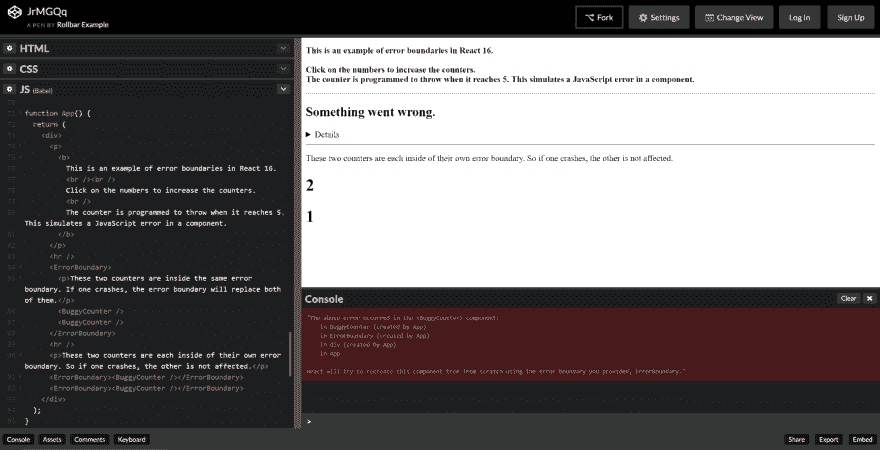
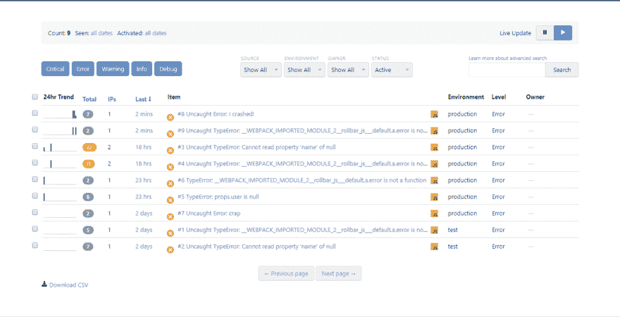
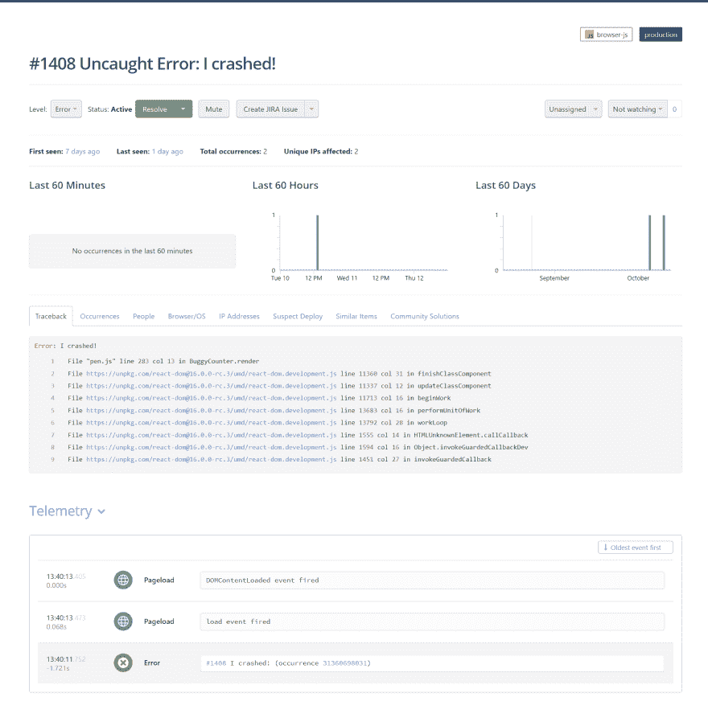

# React 16 错误边界让您优雅地恢复

> 原文：<https://dev.to/mostlyjason/react-16-error-boundaries-let-you-recover-gracefully-152d>

React 最近宣布发布版本 16，其中包含长期存在的功能请求，包括错误边界、片段、改进的服务器端渲染等。错误边界特别有用，这样 UI 中的一个小部分的错误不会破坏整个应用程序。相反，最好将这些错误包含在受影响的组件中，然后优雅地恢复。

你可以在我们的 **[代码笔示例](https://codepen.io/rollbar_example/pen/JrMGQq?editors=1011)** 中自己尝试使用错误边界。我们从脸书的初始版本中分出来展示如何添加滚动条的 **[JavaScript 错误日志](https://rollbar.com/error-tracking/javascript/)** 。当您打开此页面时，您可以通过在计数器上单击至少五次来激活错误边界。然后，您会看到错误消息“出错了”让我们更深入地研究这个例子，了解错误边界是如何工作的。

[T2】](https://res.cloudinary.com/practicaldev/image/fetch/s--gz0J1v47--/c_limit%2Cf_auto%2Cfl_progressive%2Cq_auto%2Cw_880/https://rollbar.com/assets/blimg/2017-10-11-react-error-boundaries/image3.png)

## 什么是误差边界？

错误边界是 React 组件，它捕捉子组件树中任何位置的 JavaScript 错误。它们可以记录错误并显示一个后备 UI 来替换崩溃的组件树。它们类似于代码中的 try-catch 语句，但它们包含页面元素。

错误边界是一个带有`componentDidCatch(err, info)`方法的 React 组件。组件树中出现的任何错误都会报告给最近的错误边界的`componentDidCatch`函数。请注意，错误边界仅捕获树中位于其下方的组件中的错误。对于简单的应用程序，您可以声明一次错误边界组件，并将其用于整个应用程序。对于具有多个组件的更复杂的应用程序，您可以拥有独立的错误边界来优雅地恢复每个部分。

您还可以将这些错误报告给 Rollbar 之类的错误监控服务。这将使您能够跟踪有多少用户受到错误的影响，找到导致错误的原因，并最终改善您的用户体验。最后，我们将向您展示一个如何做到这一点的工作示例。

## 如何实现 React 错误边界

下面是一些描述如何在代码中实现它们的简单步骤:

1.  创建一个扩展 React 组件并传递属性的组件类。
2.  添加一个`componentDidCatch`和`render`方法，如下例所示。`componentDidCatch`方法允许你捕捉错误，并改变组件的呈现方式。例如，您可以显示一条类似“出错了！”

```
 class ErrorBoundary extends React.Component {
     constructor(props) {
       super(props);
       this.state = { error: null, errorInfo: null };
     }

     componentDidCatch(error, errorInfo) {
       // Catch errors in any components below and re-render with error message
       this.setState({
         error: error,
         errorInfo: errorInfo      
       })
     }

     render() {
       if (this.state.errorInfo) {
         return (
           <div>Something went wrong!</div>
         );
       }
       return this.props.children;
     }
   } 
```

Enter fullscreen mode Exit fullscreen mode

1.  在 HTML 中添加您的新组件，围绕您希望包含在错误边界中的部分。在这个例子中，我们在一个有问题的计数器组件周围添加了一个错误边界。

```
 <ErrorBoundary>
     <BuggyCounter/>
   </ErrorBoundary> 
```

Enter fullscreen mode Exit fullscreen mode

## 添加滚动条来反应错误边界

对于真实的生产应用程序，监控错误非常重要，这样您就可以了解用户的体验。如果你的应用崩溃了，你不想失去客户或者让他们在应用评论或社交媒体上抱怨。更好的办法是监控这些生产错误，这样你就能第一个知道，并在更多客户受到影响之前解决问题。

幸运的是，将滚动条跟踪添加到 React 错误边界非常容易。我们将向您展示如何:

1.  打开我们之前配置了错误边界的 **[代码笔示例](https://codepen.io/rollbar_example/pen/JrMGQq?editors=1011)** 。
2.  注意我们的 JavaScript 代码的第一部分，它配置并加载滚动条。你可以在我们的 **[JavaScript 文档](https://rollbar.com/docs/notifier/rollbar.js)** 中找到关于它如何工作的全部细节。

```
 var _rollbarConfig = {
      accessToken: "3cda8fbafbfe4a6599d1954b1f1a246e",
      captureUncaught: true,
      captureUnhandledRejections: true,
      payload: {
        environment: "production"
      }
   };

   !function(r){function o(n){if(e[n])return e[n].exports... 
```

Enter fullscreen mode Exit fullscreen mode

1.  将滚动条错误跟踪添加到错误边界的`componentDidCatch`方法中。

```
 componentDidCatch(error, errorInfo) {    
     Rollbar.error(error); // Send it to Rollbar!
   } 
```

Enter fullscreen mode Exit fullscreen mode

1.  加载页面，点击 5 次触发错误。然后，在我们的公共模拟账户的 **[物品页](https://rollbar.com/demo/demo/items/)** 里看看这些错误是什么样子的。你不需要注册，因为这个账户对所有人开放。

[T2】](https://res.cloudinary.com/practicaldev/image/fetch/s--gBzi-Bov--/c_limit%2Cf_auto%2Cfl_progressive%2Cq_auto%2Cw_880/https://rollbar.com/assets/blimg/2017-10-11-react-error-boundaries/image1.png)

1.  通过点击列表顶部附近的项目“未捕获的错误:我崩溃了！”获得更多详细信息你现在可以看到回溯和 **[遥测](https://rollbar.com/blog/introducing-javascript-telemetry/)** 记录错误发生前发生的事情。这提供了更多的上下文来帮助您找到错误的根本原因。

[T2】](https://res.cloudinary.com/practicaldev/image/fetch/s--5gsBTnVG--/c_limit%2Cf_auto%2Cfl_progressive%2Cq_auto%2Cw_880/https://rollbar.com/assets/blimg/2017-10-11-react-error-boundaries/image2.png)

我们强烈建议您在 React 应用程序中添加错误边界。它们非常易于使用，不仅可以帮助您提供良好的恢复，还可以向 Rollbar 报告这些错误，以便您可以在错误影响更多用户之前快速修复错误。

*这篇文章最初发表在 [Rollbar 的博客](https://rollbar.com/blog/react-error-boundaries/)上。*