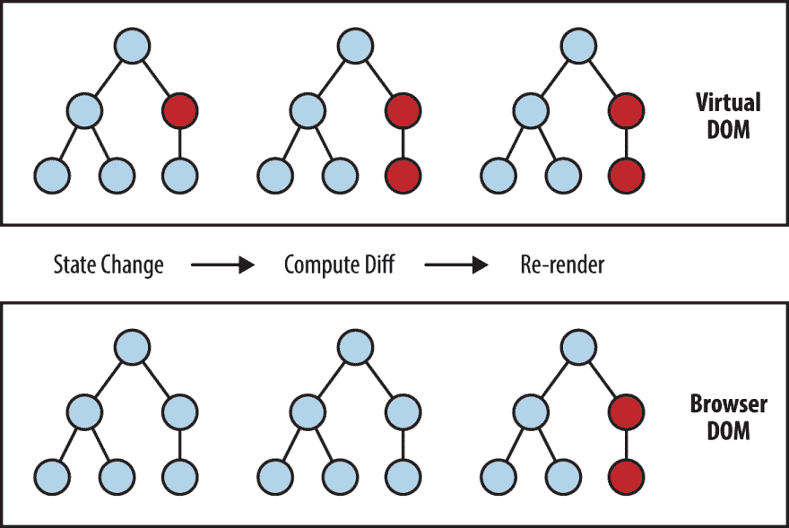

# 反应和还原

> 原文：<https://dev.to/gettingappsdone/react-and-redux-4h7j>

React 发布后的很长一段时间里，我很难真正理解它应该如何使用。从 Java、C#/WPF 和 Angular 多年的 MVC/MVVM 经验来看，React 似乎有些奇怪。基础教程和例子展示了你“如何”做某事，但从来没有说明为什么，而且视图和控制器逻辑之间几乎没有分离。

最终，我坐下来，按照“最佳实践”，用 React 和 Redux 写了一些东西，这样我就可以理解框架中的决策以及如何使用它们。

## 组件

那么我学到了什么？

首先，React 是一种不同的应用程序思维方式，但它几乎完全与视图和视图状态有关。MVC 通常将视图状态从视图中分离出来，并将其与其他应用程序状态信息一起保存在控制器中，而在 MVVM 中,“VM”视图模型的全部目的是跟踪视图状态。但是在 React 中，这两者被组合成一个抽象，称为“组件”。

组件相对简单。它们包含在给定视图状态的情况下将视图呈现给页面的逻辑，以及更改该状态的可选方法。

一个简单的“无状态”组件就是渲染逻辑。这些可以用一个接受“道具”对象的函数来表示。

```
function Welcome(props) {
  return <h1>Hello, {props.name}</h1>; } 
```

> 注意:我在这些例子中使用了 JSX。它是 javascript 之上的一层，允许您编写类似 HTML 的代码元素，并编译成常规 javascript。我推荐阅读[JSX 简介](https://reactjs.org/docs/introducing-jsx.html)了解更多信息。(它也对我当前的代码荧光笔造成了严重破坏。)

组件可以包含其他组件，从而创建一个组件“树”。这样，就像 HTML 一样，一个 HTML 元素可以包含其他元素。

```
function Welcome(props) {
  return <h1>Hello, {props.name}</h1>; }

function TimeDisplay(props) {
  return <h2>It is {props.time}.</h2>; }

function Greeter() {
  return (
    <div>
      <Welcome name="World">
      <TimeDisplay time={new Date().toLocaleTimeString()}/>
    </div>
  );
} 
```

具有可以改变的状态的有状态组件通常更复杂，并且是从“组件”基类派生的。状态更新由外部事件(通常是 UI)通过使用 setState()函数触发。

这个例子将在创建时钟的每个时间间隔“滴答”更新。

> **注意:**这个例子几乎完全取自 React 文档中关于[状态和生命周期](https://reactjs.org/docs/state-and-lifecycle.html#adding-lifecycle-methods-to-a-class)的内容。

[https://codepen.io/decoyahoy/embed/wXJbzz?height=600&default-tab=result&embed-version=2](https://codepen.io/decoyahoy/embed/wXJbzz?height=600&default-tab=result&embed-version=2)

### 更新、渲染和虚拟 Dom

当组件更新其状态时，会导致重新渲染。当前组件及其子组件将会更新。

组件不是直接更新 DOM，而是更新“虚拟 DOM”，虚拟 DOM 是内存中的一棵 DOM 树。它不会直接呈现给浏览器。然后，将这个虚拟 DOM 与“真实”DOM 进行比较，真实 DOM 只更新两者之间的变化。

<figure>

[T2】](https://res.cloudinary.com/practicaldev/image/fetch/s--Uvth1Tfg--/c_limit%2Cf_auto%2Cfl_progressive%2Cq_auto%2Cw_880/https://kellen.piffner.com/img/react-redux/virtual_dom_diff.png)

<figcaption><cite>[Image Source](https://github.com/DonaldWhyte/isomorphic-react-workshop)</cite></figcaption>

</figure>

结合“反应式”组件更新(组件仅在对 setState()的反应中更新)，这使得 React 在仅更新必要的内容和最小化可见页面更新(通常是更改中计算开销最大的部分)方面非常出色。)

这种性能的代价是更高的内存使用率:应用程序的组件树在内存中有两次。因为这些都是从应用程序开发人员那里抽象出来的，所以它允许框架优化性能，并且通常不是您需要考虑的事情。

## 剩下的 app 呢？

React 的简单模式非常灵活，允许状态、视图和事件，但它也非常有限。组件树模式要求您的依赖项通过整个树来到达子组件。

如果您引入一个新的 UI 组件，它需要引用一个在 UI 的那个区域中没有使用的应用程序状态逻辑，这可能会变得特别尴尬。你必须将它添加到所有的父组件中，或者使用某种 js“global”。两者都不是好的解决方案。您的*应用程序*状态很少反映 UI。

### 为应用状态的还原

这个问题的解决方案是将应用程序状态移动到一个单独的存储中。最受欢迎的是 [Redux](https://redux.js.org/) ，尽管还有很多其他选择。

Redux 提供了三个主要的东西:

1.  应用程序级状态存储。
2.  一种从用户界面的任何地方更新商店的方法。
3.  一种在存储更新时更新组件视图状态的方法。

Redux 是单向的，意味着事件总是以一种方式通过它。

`React component (events) => Dispatch (actions) => Store update (reducer) => Component update (connect)`

让我们按顺序来看一下这个流程。

事件可以从任何地方生成，但通常是像鼠标单击这样的 UI 事件。

> **注意:**在 React 中处理事件有很多注意事项。一如既往，查看[文档了解更多信息](https://reactjs.org/docs/handling-events.html)。

```
class SpaceShip extends React.Component {
  moreSpeedClick = (e) => {
    e.preventDefault();
    console.log('zoom');
  };

  lessSpeedClick = (e) => {
    e.preventDefault();
    console.log('mooz');
  };

  render() {
    return (
      <div>
        <div>{this.props.currentSpeed}</div>
        <button onClick={this.moreSpeedClick}>More Speed</button>
        <button onClick={this.lessSpeedClick}>Less Speed</button>
      </div>
    );
  }
} 
```

该事件创建一个 Redux 操作。动作是描述存储中需要发生什么更新的简单对象。

```
// make it go faster by an increment of 1
{ type: "faster", increment: 1} 
```

Redux 推荐创建“动作创建者”，动作创建者只是创建这些对象的函数。现在我们的操作非常简单，但是在一个更大的应用程序中，它们可能有很多属性甚至逻辑，所以函数有助于保持整洁。

```
function faster(increment) {
  return { type: 'faster', increment: increment };
}
function slower(decrement) {
  return { type: 'slower', decrement: decrement };
} 
```

这些动作是通过调度程序“调度”的。dispatcher 在其属性中传递给组件，并将 action 对象传递给 redux。

```
class SpaceShip extends React.Component {
  moreSpeedClick = (e) => {
    e.preventDefault();
    this.props.dispatch(faster(1));
  };

  lessSpeedClick = (e) => {
    e.preventDefault();
    this.props.dispatch(slower(1));
  };

  render() {
    return (
      <div>
        <div>{this.props.currentSpeed}</div>
        <button onClick={this.moreSpeedClick}>More Speed</button>
        <button onClick={this.lessSpeedClick}>Less Speed</button>
      </div>
    );
  }
} 
```

“商店”本身是一个普通的 javascript 对象。与 Angular 不同，Redux 不直接操作或观察 store 对象，可以用对应用程序有意义的任何方式排列。

当一个动作被分派到存储时，它们通过称为“reducerss”的函数传递，reducer 接受前一个状态和一个动作，然后返回一个更新的状态对象。常见的模式是在动作对象的“类型”上使用 switch 语句。因为这只是一个函数和普通的 javascript 对象，但是，你可以做任何你想做的事情。

```
function spaceshipReducer(state, action) {
  switch (action.type) {
    case 'FASTER':
      return { speed: state.speed + action.increment };
    case 'SLOWER':
      return { speed: state.speed - action.decrement };
    default:
      return state;
  }
}

const initState = { speed: 0 };
const store = createStore(spaceshipReducer, initState); 
```

Redux 应用程序的一个要求是你的存储是“不可变的”。这意味着您不是更新现有对象，而是完全替换它们。这使您可以进行简单的引用比较，从而极大地影响大型应用程序的性能。不利的一面是，它会让你的 reducers 变得更加难以阅读。

```
// this does the same thing as the 'faster' case above
// You would use this pattern for more complex state trees
return Object.assign({}, state, {
  speed: state.speed + action.increment,
}); 
```

> **注意:**在 [redux 基础教程](https://redux.js.org/basics/reducers#handling-actions)中阅读更多关于不可变变化的内容。如果使用较新的 javascript 特性，还有一些其他选项。

存储收到任何操作后，都会触发一个更新事件。React 组件包装在一个容器组件中，当存储更新时，该组件触发更新。使用 redux“connect”函数包装组件，该函数将应用程序存储映射到组件属性。如果您使用最佳实践(不可变的)，这个图足够清楚地表明状态的那个部分是否不同。除此之外，包装器组件没有多少魔力。它只是订阅 store 'update '事件，并在发生变化时使用 setState()来触发正常的 react 更新。

将分派动作映射到属性而不是传递整个分派函数也很常见。

```
import { connect } from 'react-redux';

function mapStateToProps(state) {
  return {
    currentSpeed: state.speed,
  };
}

function mapDispatchToProps(dispatch) {
  return {
    faster: (increment) => dispatch(faster(increment)),
    slower: (decrement) => dispatch(slower(decrement)),
  };
}

const SpaceShipContainer = connect(
  mapStateToProps,
  mapDispatchToProps
)(SpaceShip); 
```

这是所有的一切。

[https://codepen.io/decoyahoy/embed/xzpEqe?height=600&default-tab=result&embed-version=2](https://codepen.io/decoyahoy/embed/xzpEqe?height=600&default-tab=result&embed-version=2)

> **注意:**您将在完整的示例中看到一个“提供者”组件。提供者只是让 redux 存储对任何连接的“容器”组件可用，而开发人员无需做任何事情。它通过利用一些您通常不需要担心的低级 React 特性来做到这一点。

### Redux 中间件和异步动作

这涵盖了对 UI 事件作出反应的基本情况，但对处理 web 服务和 AJAX 回调没有帮助。在 Angular 世界中，这些功能通常被放入注入控制器的服务中。一般来说，Redux 没有提供解决方案，但是它提供了一种集中传递消息的方式。

使用 Redux，注入到组件中的只有状态和调度程序。状态只是一个普通的对象，但是 Redux 提供了一种通过使用“中间件”来扩展调度程序功能的方法。

中间件是一个在动作传递给 reducer 之前被调用的函数。最简单和最常用的中间件之一是 [redux-thunk](https://github.com/reduxjs/redux-thunk) ，它允许您调度异步操作。您不是传递一个操作对象，而是向调度程序传递一个函数。Redux-thunk 看到函数并调用它，传入调度程序和状态。

当我说简单的时候，我是认真的。下面是 redux-thunk 的重要部分:

```
if (typeof action === 'function') {
  return action(dispatch, getState, extraArgument);
}

return next(action); 
```

如果动作是一个函数，它调用它，传入调度程序、getState 访问器和一个可选参数。如果动作不是一个函数，它只是传递给默认行为。

> **注意:** getState()返回调用时的当前状态。这有两个目的:您可以在调用“dispatch”之前和之后获得状态(允许您在您的动作创建器中执行复杂的逻辑)，并且您可以在异步动作完成之后获得状态(这很重要，因为自动作开始以来状态可能已经改变了)。)

这里有一个“thunk”的例子。将这个动作创建器与上面的“更快”和“更慢”的例子进行比较。

```
function warpSpeed(warp) {
  return function(dispatch) {
    // we're using setTimeout for our async action
    // but this could be an http call, or whatever
    setTimeout(() => {
      // dispatch the state update action
      // this could also be another thunk!
      dispatch(faster(warp));
    }, 1000);
  };
}

// warpSpeed returns a function that is called by the middleware,
// but the function signature is the same as before.
dispatch(warpSpeed(10)); 
```

这个简单的模式很像函数级的依赖注入，或者命令/中介模式。如果您需要额外的“服务”或配置，您可以通过“额外参数”选项注入它们。

```
function warpSpeed(warp) {
  return function(dispatch, getState, extraArgument) {
    setTimeout(() => {
      dispatch(faster(warp));
    }, extraArgument.warmupTime);
  };
} 
```

我对这种模式有一些复杂的感觉，因为它混合了您的商店更新和中介命令消息，但是通过 dispatcher 传递一切确实使事情变得简单，所以我不认为这有什么大不了的。

## 杂念

Redux 值得一整篇文章。它既固执己见，又灵活多变。我建议通读他们的整个文档，以便真正掌握如何使用它。此外，通过学习 Redux，您将强化许多基本的 React 概念。

也有很多选择。Checkout [MobX](https://mobx.js.org/) 更类似于 Angular(更有魔力)的东西，甚至自己滚(没有魔力)！

> 自从我写了这篇文章，我创造了自己的替代 redux 的方法，叫做[鸣](https://github.com/honkjs/honk)。它是为考虑到 typescript 的简单项目而创建的。看看吧！

还应该提到的是， [Angular](https://angular.io/) 和 [Vue](https://vuejs.org/) 现在都是分量重的，已经从 React 得到了很多提示。学习其中一个可能会帮助你学习其他的。

最后，我想提一下，使用最佳实践的 react + redux 是*冗长的*。几乎没有什么“魔法”对开发人员隐藏代码，结合 redux 的“最佳实践”,您最终会得到大量额外的基础设施代码。好的方面是更好的可理解性——你会经常听到人们说 react 和 redux 更容易“推理”——以及更好的代码分离，特别是对于较大的项目和团队。

祝你好运，并快乐编码！