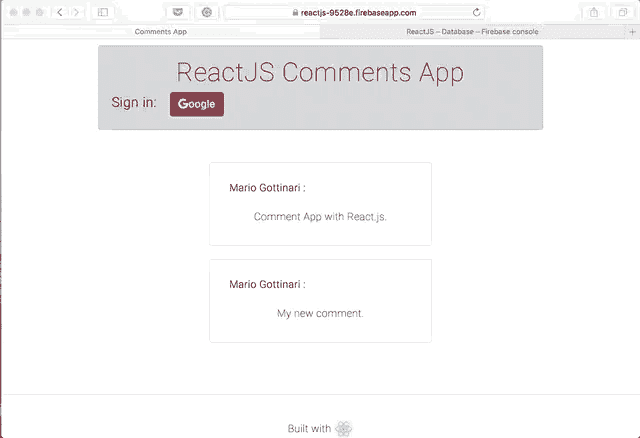

# React 评论应用

> 原文：<https://dev.to/mariorodeghiero/react-comments-app-3ai1>

# React 评论 App

一个简单的评论系统，用 ReactJS 构建，与 Firebase 集成，使用认证和实时数据库，基于 DevReactJS [Devpleno](https://www.devpleno.com) 课程。

**地点:** [反应过来-评论-app](https://reactjs-9528e.firebaseapp.com)
[](https://res.cloudinary.com/practicaldev/image/fetch/s--FTfvTTQ4--/c_limit%2Cf_auto%2Cfl_progressive%2Cq_66%2Cw_880/https://thepracticaldev.s3.amazonaws.com/i/iikl7rpc6olre4o8rf7b.gif)

### 先决条件

安装软件需要哪些东西以及如何安装

*   节点. js
*   NPM 包装经理
*   在 [Firebase](https://firebase.google.com) 中创建令牌

**注意:**创建令牌后，需要将令牌放在 Base.js 文件中。

### 安装

克隆此存储库

```
git clone https://github.com/mariorodeghiero/reactjs-comments-app.git 
```

从 NPM 软件包管理器安装依赖项

```
npm install 
```

要启动开发环境，运行以下命令:

```
npm run start 
```

或者

```
yarn start 
```

## 部署

运行下面的命令进行部署，最小化所有文件。

```
npm run build 
```

或者

```
yarn build 
```

运行后，浏览器在[自动打开窗口 http://localhost:3000/](http://localhost:3000/)

## 建有

*   React.js
*   重火力点

#### ⚖️麻省理工学院执照

我创建了这个应用程序来测试和分享在 ReactJS 研究中获得的知识。
如果你喜欢这个项目，贡献改进，发送你的公关或给我一个 GitHub 上的明星⭐️。

我希望你喜欢✌️
谢谢，这是我的[推特](https://twitter.com/rodeghiero_)